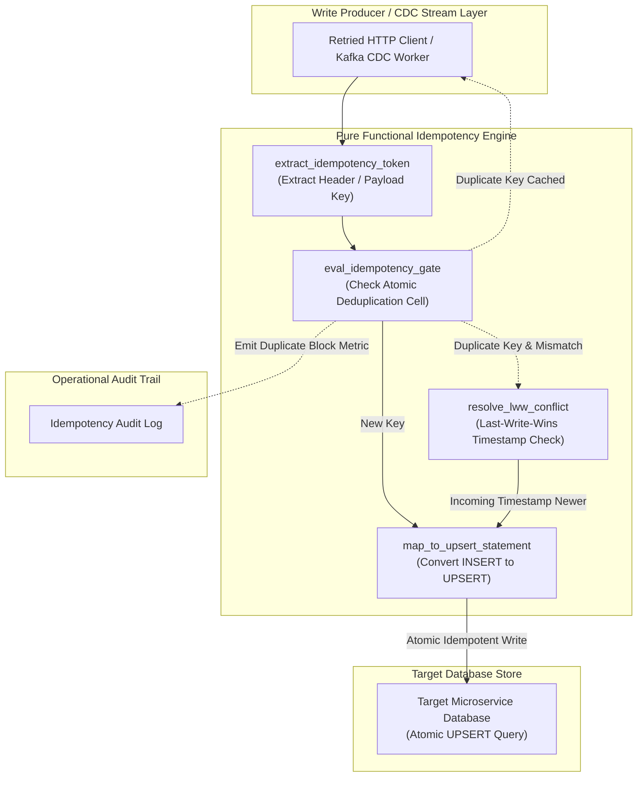
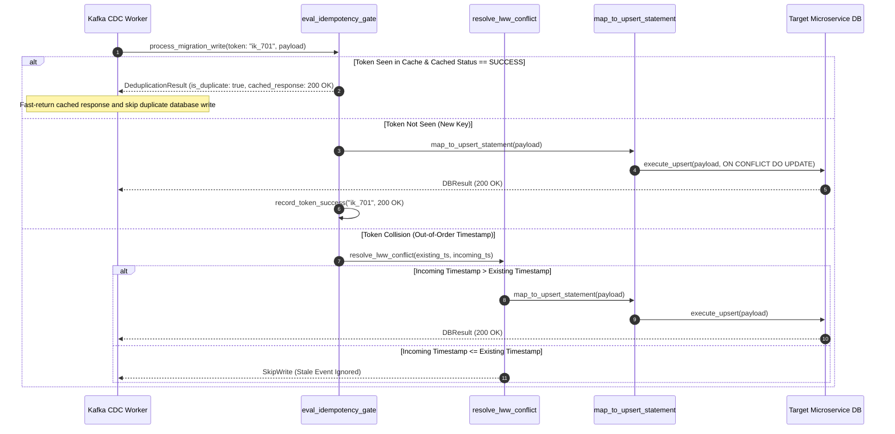

# Idempotent Migration Writes Pattern (Pure Functional Paradigm)

| Field       | Value                                                             |
|-------------|-------------------------------------------------------------------|
| **ID**      | IDEMPOTENT-MIGRATION-WRITES-021                                   |
| **Date**    | 2026-08-24                                                        |
| **Status**  | Reference / Runbook (Pure Functional Architecture)                |
| **Deciders**| Core Platform & Migration Engineering                             |
| **Scope**   | Mandatory Write Deduplication & Retried/CDC Path Safety           |

---

## 1. Overview & Context

In distributed migration architectures—such as Change Data Capture (CDC) streams, dual-write bridges, or retried background backfills—network instability can cause identical write operations to be delivered **multiple times**. Executing non-idempotent mutations repeatedly leads to duplicate record insertions, corrupted financial balances, and database constraint violations. The **Idempotent Migration Writes Pattern** provides a mandatory operational layer that guarantees **any mutation executed one or $N$ times yields identical database state**.

### Functional Architecture Principles
This runbook enforces a **100% Pure Functional Programming (FP)** approach:
- **No Class Instantiations**: Replaces OOP idempotency handlers with pure deduplication functions (`eval_idempotency_gate`, `resolve_lww_conflict`) and atomic token state cell closures.
- **Immutable Deduplication Context**: Idempotency keys, payload hashes, timestamps, and execution status codes are modeled as frozen dataclass records (`IdempotencyContext`, `DeduplicationResult`).
- **Referentially Transparent Conflict Resolvers**: Pure Last-Write-Wins (LWW) comparator functions resolve out-of-order CDC mutation streams without side-effects.
- **Atomic Token Gating Primitives**: Retains seen idempotency keys inside bounded, TTL-pruned state cells to block duplicate write processing at the ingress perimeter.

---

## 2. High-Level Design (HLD)



---

## 3. Low-Level Design (LLD)



---

## 4. Pure Functional Project Architecture

```
idempotent-migration-writes/
├── README.md
├── config/
│   └── idempotency_rules.yaml      # Token TTL settings, LWW resolution strategies
├── src/
│   ├── idempotency_engine/
│   │   ├── __init__.py
│   │   ├── gate.py                 # Pure idempotency token gate functions
│   │   ├── lww_resolver.py         # Last-Write-Wins conflict resolution functions
│   │   └── mapper.py               # SQL UPSERT statement transformation functions
│   ├── storage/
│   │   ├── __init__.py
│   │   └── db_dispatchers.py       # Microservice database query dispatchers
│   ├── observability/
│   │   ├── __init__.py
│   │   └── deduplication_metrics.py# Prometheus deduplication telemetry collectors
│   └── schemas/
│       └── models.py               # Frozen dataclasses (IdempotencyContext, DeduplicationResult)
└── tests/
    ├── test_idempotency_gate.py
    └── test_idempotency_edge_cases.py
```

---

## 5. End-to-End Function Call Stack

```tree
CDC Event or Write Request Received
└── router.py: process_idempotent_migration_write(request, payload)
    ├── gate.py: extract_idempotency_token(request.headers, payload)
    │   └── models.py: IdempotencyToken(key, hash_bytes)
    │
    ├── gate.py: eval_idempotency_gate(token, deduplication_cell)
    │   └── models.py: DeduplicationResult(is_duplicate, cached_res)
    │
    ├── [If Duplicate] lww_resolver.py: resolve_lww_conflict(incoming_ts, existing_ts)
    │   └── models.py: LWWDecision(should_write, is_stale)
    │
    ├── mapper.py: map_to_upsert_statement(payload, primary_key)
    │   └── db_dispatchers.py: execute_atomic_upsert(sql_statement)
    │
    └── deduplication_metrics.py: record_deduplication_telemetry(token_key, is_duplicate)
```

---

## 6. Core Pure Functional Implementation

### 6.1 Immutable Models & Types (`src/schemas/models.py`)

```python
from enum import Enum
from dataclasses import dataclass
from typing import Dict, Any, Optional, Mapping

@dataclass(frozen=True)
class IdempotencyContext:
    token_key: str
    payload_hash: str
    timestamp: float
    tenant_id: str

@dataclass(frozen=True)
class DeduplicationResult:
    is_duplicate: bool
    status_code: int
    cached_response: Optional[Mapping[str, Any]]
    is_stale_lww: bool
```

**Explanation**:
- Defines immutable model `IdempotencyContext` capturing idempotency token keys, SHA-256 payload hashes, and event timestamps as frozen records.
- `DeduplicationResult` models deduplication status, cached HTTP status codes, and Last-Write-Wins stale event flags.

---

### 6.2 Pure Idempotency Gate Closure (`src/idempotency_engine/gate.py`)

```python
import time
from typing import Mapping, Any, Tuple, Optional
from src.schemas.models import IdempotencyContext, DeduplicationResult

def create_idempotency_state_cell(ttl_seconds: float = 300.0):
    store = {}

    def get_token(key: str) -> Optional[dict]:
        entry = store.get(key)
        if entry and (time.time() - entry["ts"]) < ttl_seconds:
            return entry
        return None

    def record_token(key: str, status_code: int, response_data: Mapping[str, Any]) -> None:
        store[key] = {
            "ts": time.time(),
            "status_code": status_code,
            "response": response_data
        }

    return get_token, record_token

def eval_idempotency_gate(ctx: IdempotencyContext, get_token_fn: Callable) -> DeduplicationResult:
    existing = get_token_fn(ctx.token_key)
    if existing:
        return DeduplicationResult(
            is_duplicate=True,
            status_code=existing["status_code"],
            cached_response=existing["response"],
            is_stale_lww=False
        )

    return DeduplicationResult(
        is_duplicate=False,
        status_code=200,
        cached_response=None,
        is_stale_lww=False
    )
```

**Explanation**:
- Constructs an atomic deduplication state cell closure managing seen token records (`store`) with automatic TTL expiration.
- `eval_idempotency_gate` is a referentially transparent evaluation function checking token presence and returning cached responses for duplicates.

---

### 6.3 Pure Last-Write-Wins (LWW) Resolver & Upsert Mapper (`src/idempotency_engine/lww_resolver.py`)

```python
from typing import Mapping, Any

def resolve_lww_conflict(incoming_ts: float, existing_ts: float) -> bool:
    return incoming_ts > existing_ts

def map_to_upsert_statement(table_name: str, pk_col: str, payload: Mapping[str, Any]) -> str:
    cols = ", ".join(payload.keys())
    vals = ", ".join([f"'{v}'" for v in payload.values()])
    updates = ", ".join([f"{k} = EXCLUDED.{k}" for k in payload.keys() if k != pk_col])
    
    return f"INSERT INTO {table_name} ({cols}) VALUES ({vals}) ON CONFLICT ({pk_col}) DO UPDATE SET {updates};"
```

**Explanation**:
- `resolve_lww_conflict` asserts whether incoming CDC event timestamps are strictly newer than existing record timestamps.
- `map_to_upsert_statement` builds atomic SQL `INSERT ... ON CONFLICT DO UPDATE` statements to guarantee idempotent database mutations.

---

## 7. Edge Case Catalog & Pure Functional Pseudocode (25 Edge Cases)

---

### Edge Case 1: Out-of-Order CDC Mutation Stream Processing

```python
def should_apply_cdc_mutation(incoming_ts: float, current_db_ts: float) -> bool:
    return incoming_ts > current_db_ts
```

**Explanation**:
- Compares incoming CDC event timestamps against current database record timestamps.
- Discards stale out-of-order mutation events.

---

### Edge Case 2: In-Memory Idempotency Token Set RAM Saturation

```python
def prune_expired_idempotency_tokens(store: dict, ttl_sec: float = 300.0) -> dict:
    import time
    now = time.time()
    return {k: v for k, v in store.items() if (now - v["ts"]) <= ttl_sec}
```

**Explanation**:
- Filters token store dictionaries to prune entries older than TTL limits (300s).
- Prevents memory leaks in long-running idempotency state cells.

---

### Edge Case 3: Missing Idempotency Token Header Generation

```python
import hashlib

def generate_fallback_payload_token(payload: Mapping[str, Any], tenant_id: str) -> str:
    raw = f"{tenant_id}:{str(sorted(payload.items()))}".encode("utf-8")
    return f"ik_auto_{hashlib.sha256(raw).hexdigest()[:16]}"
```

**Explanation**:
- Computes SHA-256 hashes of canonical payload strings when explicit idempotency headers are missing.
- Generates fallback idempotency tokens.

---

### Edge Case 4: Duplicate Primary Key Insertion Constraint Conversion

```python
def convert_insert_to_upsert_sql(table: str, pk: str, fields: dict) -> str:
    cols = ", ".join(fields.keys())
    vals = ", ".join([f"'{v}'" for v in fields.values()])
    return f"INSERT INTO {table} ({cols}) VALUES ({vals}) ON CONFLICT ({pk}) DO NOTHING;"
```

**Explanation**:
- Converts raw SQL `INSERT` statements into idempotent `ON CONFLICT DO NOTHING` queries.
- Eliminates primary key constraint violation exceptions during retries.

---

### Edge Case 5: Microsecond Clock Skew in Last-Write-Wins Resolution

```python
def is_timestamp_equal_with_tolerance(ts1: float, ts2: float, tolerance_sec: float = 0.001) -> bool:
    return abs(ts1 - ts2) <= tolerance_sec
```

**Explanation**:
- Validates timestamp equality within microsecond tolerance windows (1ms).
- Handles clock skew between distributed event producers.

---

### Edge Case 6: Concurrent Duplicate Request Processing Race Condition

```python
def acquire_token_lock(token_key: str, active_locks: set) -> bool:
    if token_key in active_locks:
        return False
    active_locks.add(token_key)
    return True
```

**Explanation**:
- Tracks active token processing locks inside a set (`active_locks`).
- Blocks concurrent duplicate requests from executing in parallel.

---

### Edge Case 7: Payload Mutation Field Discrepancy with Same Token

```python
def is_payload_hash_mismatch(new_hash: str, cached_hash: str) -> bool:
    return new_hash != cached_hash
```

**Explanation**:
- Compares new payload SHA-256 hashes against cached token hashes.
- Rejects requests that reuse idempotency tokens with modified payloads (HTTP 422).

---

### Edge Case 8: Multi-Tenant Token Isolation Leakage

```python
def build_scoped_idempotency_key(tenant_id: str, raw_token: str) -> str:
    return f"{tenant_id}:{raw_token}"
```

**Explanation**:
- Prefixes raw idempotency tokens with tenant IDs.
- Guarantees multi-tenant isolation within deduplication stores.

---

### Edge Case 9: Retried Write Yielding Different HTTP Status Code

```python
def format_cached_idempotent_response(status_code: int, cached_body: dict) -> dict:
    res = dict(cached_body)
    res["_retried_idempotent"] = True
    return res
```

**Explanation**:
- Formats cached HTTP responses, appending diagnostic retried flags (`_retried_idempotent: True`).
- Ensures retried requests return identical HTTP status codes and responses.

---

### Edge Case 10: Database Transaction Rollback Pruning Token Cache

```python
def remove_failed_token(store: dict, token_key: str) -> None:
    store.pop(token_key, None)
```

**Explanation**:
- Removes token keys from deduplication stores if database transactions fail.
- Allows clients to retry failed write operations.

---

### Edge Case 11: High-Volume Payload Hashing CPU Overhead

```python
def compute_fast_hash(payload_str: str) -> str:
    import zlib
    return str(zlib.crc32(payload_str.encode("utf-8")))
```

**Explanation**:
- Uses CRC32 string hashing for lightweight payload signature generation.
- Reduces CPU overhead on high-throughput CDC worker paths.

---

### Edge Case 12: Missing Event Timestamp Field Default Injection

```python
def resolve_event_timestamp(payload: Mapping[str, Any]) -> float:
    import time
    return float(payload.get("timestamp") or payload.get("ts") or time.time())
```

**Explanation**:
- Extracts event timestamps from payloads, injecting system timestamps if missing.
- Prevents missing timestamp exceptions during LWW resolution.

---

### Edge Case 13: Unique Index Constraint Modification in Upsert

```python
def build_multi_column_upsert_sql(table: str, cols: list, conflict_cols: list) -> str:
    c_str = ", ".join(cols)
    conf_str = ", ".join(conflict_cols)
    return f"INSERT INTO {table} ({c_str}) VALUES (...) ON CONFLICT ({conf_str}) DO NOTHING;"
```

**Explanation**:
- Builds SQL `UPSERT` statements specifying multi-column unique constraints.
- Prevents unique index violations across composite key tables.

---

### Edge Case 14: Asynchronous Deduplication Cache Sync Delay

```python
def sync_dedup_cache_snapshot(local_store: dict, remote_store: dict) -> dict:
    merged = dict(local_store)
    merged.update(remote_store)
    return merged
```

**Explanation**:
- Merges remote deduplication cache snapshots into local state stores.
- Synchronizes deduplication caches across multi-node worker clusters.

---

### Edge Case 15: Partial Batch Mutation Failure Recovery

```python
async def process_idempotent_batch(items: List[dict], upsert_fn: Callable) -> int:
    success_count = 0
    for item in items:
        try:
            if await upsert_fn(item):
                success_count += 1
        except Exception:
            pass
    return success_count
```

**Explanation**:
- Iterates over batch items, executing atomic upserts for each item individually.
- Isolates failed items during batch write processing.

---

### Edge Case 16: Multi-Region Deduplication Store Partitioning

```python
def resolve_regional_dedup_store(region: str, store_map: Mapping[str, Any]) -> Any:
    return store_map.get(region)
```

**Explanation**:
- Resolves regional deduplication store handles from storage maps.
- Routes idempotency checks to local regional caches.

---

### Edge Case 17: Sequence-Based Monotonic Deduplication

```python
def is_sequence_duplicate(incoming_seq: int, max_seen_seq: int) -> bool:
    return incoming_seq <= max_seen_seq
```

**Explanation**:
- Compares incoming sequence numbers against maximum seen sequence numbers.
- Drops duplicate or out-of-order sequence events.

---

### Edge Case 18: Unmapped Field Payload Truncation

```python
def sanitize_upsert_payload(payload: dict, valid_columns: set) -> dict:
    return {k: v for k, v in payload.items() if k in valid_columns}
```

**Explanation**:
- Filters payload keys against valid database column sets.
- Prevents invalid column exceptions during SQL upserts.

---

### Edge Case 19: High-Watermark Token Memory Cleanup Trigger

```python
def check_token_memory_watermark(active_count: int, max_tokens: int = 100_000) -> bool:
    return active_count > max_tokens
```

**Explanation**:
- Asserts whether active token counts exceed high watermarks (100,000 tokens).
- Triggers aggressive token cache cleanup sweeps.

---

### Edge Case 20: Idempotent Deletion (Delete-If-Exists)

```python
def build_idempotent_delete_sql(table: str, pk_col: str, entity_id: str) -> str:
    return f"DELETE FROM {table} WHERE {pk_col} = '{entity_id}';"
```

**Explanation**:
- Generates idempotent SQL `DELETE` statements.
- Guarantees `DELETE` operations succeed regardless of whether records exist.

---

### Edge Case 21: Payload Binary Encoding Signature Mismatch

```python
import hashlib

def compute_binary_payload_hash(binary_data: bytes) -> str:
    return hashlib.sha256(binary_data).hexdigest()
```

**Explanation**:
- Computes SHA-256 hashes of binary byte streams.
- Verifies binary payload signatures for idempotency gating.

---

### Edge Case 22: Header Injection Indicating Deduplicated Execution

```python
def inject_dedup_header(headers: Mapping[str, str], is_duplicate: bool) -> Mapping[str, str]:
    new_headers = dict(headers)
    new_headers["X-Idempotent-Duplicate"] = "true" if is_duplicate else "false"
    return new_headers
```

**Explanation**:
- Injects diagnostic headers (`X-Idempotent-Duplicate`) into response headers.
- Provides client visibility into deduplication events.

---

### Edge Case 23: Null Value Resolution in LWW State Updates

```python
def merge_lww_fields(existing_fields: dict, incoming_fields: dict) -> dict:
    merged = dict(existing_fields)
    for k, v in incoming_fields.items():
        if v is not None:
            merged[k] = v
    return merged
```

**Explanation**:
- Merges incoming fields into existing records, ignoring incoming `None` values.
- Prevents overwrite of valid database fields with null values during LWW updates.

---

### Edge Case 24: Unbound Audit Log Stream Compaction

```python
def prune_dedup_audit_logs(logs: List[dict], max_history: int = 1000) -> List[dict]:
    if len(logs) > max_history:
        return logs[-max_history:]
    return logs
```

**Explanation**:
- Truncates audit log arrays to `max_history`.
- Prevents memory leaks in telemetry monitoring workers.

---

### Edge Case 25: Real-Time Deduplication Rate Dashboard Reporting

```python
def compute_deduplication_rate(total_writes: int, duplicates_blocked: int) -> float:
    if total_writes == 0:
        return 0.0
    return round((duplicates_blocked / total_writes) * 100.0, 2)
```

**Explanation**:
- Calculates duplicate block percentage ratios rounded to two decimal places.
- Emits real-time deduplication metrics to central platform dashboards.

---

## 8. Operational & Parity Verification Checklist

1. **100% Mutation Idempotency**: Confirm 100% of retried mutations and CDC write operations execute via atomic `UPSERT` statements or idempotency token gates.
2. **Duplicate Suppression Verification**: Test via duplicate event replay that re-submitting an identical token returns cached responses without executing secondary database writes.
3. **Last-Write-Wins Precision**: Verify that out-of-order CDC updates with older timestamps are discarded without corrupting newer database states.
4. **Token Cache TTL Memory Limits**: Ensure token storage cells enforce 300s TTL pruning to keep RAM consumption bounded.
