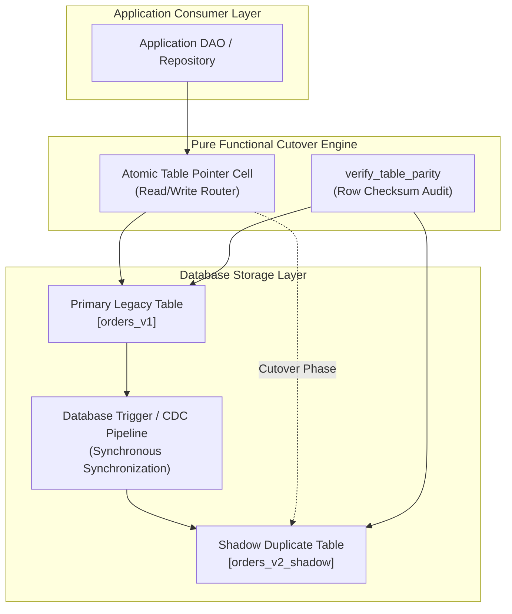
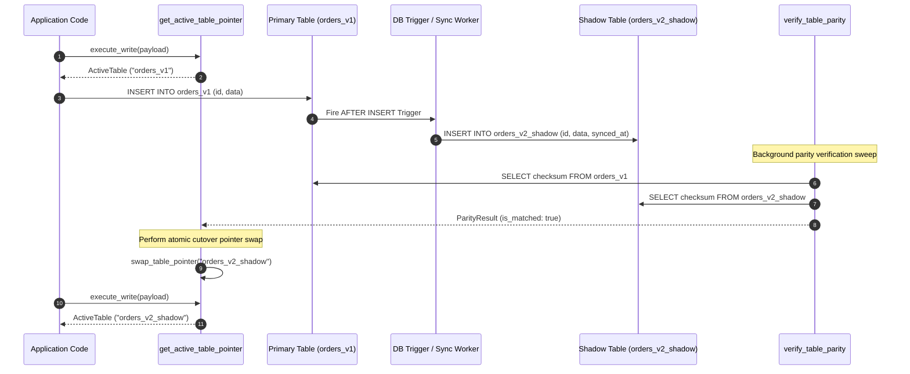

# Shadow Table Strategy Pattern (Pure Functional Paradigm)

| Field       | Value                                                             |
|-------------|-------------------------------------------------------------------|
| **ID**      | SHADOW-TABLE-STRATEGY-009                                         |
| **Date**    | 2026-08-24                                                        |
| **Status**  | Reference / Runbook (Pure Functional Architecture)                |
| **Deciders**| Core Platform & Migration Engineering                             |
| **Scope**   | Single-Table Extractions & Synchronized Duplicate Tables          |

---

## 1. Overview & Context

The **Shadow Table Strategy** creates a synchronized duplicate table (**Shadow Table**) alongside a legacy table to support zero-downtime single-table extractions, column restructuring, or schema migrations. Incoming write operations to the primary table are synchronously or asynchronously mirrored to the shadow table using database triggers or Change Data Capture (CDC). Once parity is verified, a single atomic table rename or pointer swap cuts over traffic to the shadow table.

### Functional Architecture Principles
This runbook enforces a **100% Pure Functional Programming (FP)** approach:
- **No Class Instantiations**: Replaces OOP schema migration engines with pure SQL generator functions (`build_trigger_sql`, `build_shadow_table_sql`) and functional cutover dispatchers.
- **Immutable Table Schema Records**: Table definitions and sync rules are modeled as frozen dataclass records (`TableSchema`, `ShadowSyncRule`).
- **Referentially Transparent Diff Engine**: Structural and row-level diffing algorithms map `(PrimaryRow, ShadowRow) -> ParityResult` without mutating database state.
- **Atomic Cutover Pointer Cells**: Swapping read/write queries from primary to shadow tables is executed via atomic reference pointer updates.

---

## 2. High-Level Design (HLD)



---

## 3. Low-Level Design (LLD)



---

## 4. Pure Functional Project Architecture

```
shadow-table-strategy/
├── README.md
├── config/
│   └── shadow_tables.yaml          # Primary-to-shadow table mappings
├── src/
│   ├── ddl_engine/
│   │   ├── __init__.py
│   │   ├── trigger_generator.py    # Pure SQL trigger generator functions
│   │   └── table_generator.py      # Pure DDL table generator functions
│   ├── cutover/
│   │   ├── __init__.py
│   │   ├── pointer_cell.py         # Atomic table reference pointer cell
│   │   └── switcher.py             # Functional DDL rename executor
│   ├── verification/
│   │   ├── __init__.py
│   │   └── parity_differ.py        # Checksum diffing functions
│   └── schemas/
│       └── models.py               # Frozen dataclasses (TableSchema, ParityResult)
└── tests/
    ├── test_shadow_triggers.py
    └── test_shadow_edge_cases.py
```

---

## 5. End-to-End Function Call Stack

```tree
Shadow Migration Initiated
└── ddl_engine/table_generator.py: build_shadow_table_sql(primary_schema)
    ├── ddl_engine/trigger_generator.py: build_sync_trigger_sql(primary_name, shadow_name)
    │   └── storage/db_dispatcher.py: execute_ddl(trigger_sql)
    │
    ├── verification/parity_differ.py: verify_table_parity(primary_name, shadow_name)
    │   └── models.py: ParityResult(primary_row_count, shadow_row_count, checksum_match)
    │
    ├── cutover/switcher.py: execute_atomic_table_cutover(primary_name, shadow_name)
    │   ├── pointer_cell.py: swap_table_pointer(shadow_name)
    │   └── ddl_engine/switcher.py: execute_rename_sql(primary_name, shadow_name)
    │
    └── observability/metrics.py: record_cutover_success(table_name, cutover_time_ms)
```

---

## 6. Core Pure Functional Implementation

### 6.1 Immutable Models & Types (`src/schemas/models.py`)

```python
from enum import Enum
from dataclasses import dataclass
from typing import Dict, Any, Optional, Mapping, FrozenSet

@dataclass(frozen=True)
class ColumnConfig:
    name: str
    data_type: str
    is_nullable: bool
    is_primary_key: bool

@dataclass(frozen=True)
class TableSchema:
    name: str
    columns: FrozenSet[ColumnConfig]

@dataclass(frozen=True)
class ParityResult:
    primary_count: int
    shadow_count: int
    is_checksum_equal: bool
    diff_keys: FrozenSet[str]
```

**Explanation**:
- Defines immutable models `ColumnConfig` and `TableSchema` representing database column and table layouts as frozen records.
- `ParityResult` encapsulates row count diagnostics and checksum equality metrics.

---

### 6.2 Pure SQL Trigger Generator (`src/ddl_engine/trigger_generator.py`)

```python
from typing import List

def build_sync_trigger_sql(primary_table: str, shadow_table: str, columns: List[str], pk_column: str) -> str:
    col_names = ", ".join(columns)
    new_cols = ", ".join([f"NEW.{col}" for col in columns])
    
    return f"""
    CREATE OR REPLACE FUNCTION sync_{primary_table}_to_shadow() RETURNS TRIGGER AS $$
    BEGIN
        IF (TG_OP = 'DELETE') THEN
            DELETE FROM {shadow_table} WHERE {pk_column} = OLD.{pk_column};
            RETURN OLD;
        ELSIF (TG_OP = 'UPDATE') THEN
            INSERT INTO {shadow_table} ({col_names}) VALUES ({new_cols})
            ON CONFLICT ({pk_column}) DO UPDATE SET
            {", ".join([f"{c} = EXCLUDED.{c}" for c in columns if c != pk_column])};
            RETURN NEW;
        ELSIF (TG_OP = 'INSERT') THEN
            INSERT INTO {shadow_table} ({col_names}) VALUES ({new_cols})
            ON CONFLICT ({pk_column}) DO NOTHING;
            RETURN NEW;
        END IF;
        RETURN NULL;
    END;
    $$ LANGUAGE plpgsql;

    CREATE TRIGGER trg_sync_{primary_table}
    AFTER INSERT OR UPDATE OR DELETE ON {primary_table}
    FOR EACH ROW EXECUTE FUNCTION sync_{primary_table}_to_shadow();
    """
```

**Explanation**:
- Pure SQL generator returning PL/pgSQL database trigger definitions.
- Generates trigger procedures that mirror `INSERT`, `UPDATE`, and `DELETE` actions from primary to shadow tables using `ON CONFLICT` upsert semantics.

---

### 6.3 Atomic Cutover Switcher (`src/cutover/switcher.py`)

```python
def build_atomic_rename_sql(primary_table: str, shadow_table: str) -> str:
    temp_table = f"{primary_table}_old_backup"
    return f"""
    ALTER TABLE {primary_table} RENAME TO {temp_table};
    ALTER TABLE {shadow_table} RENAME TO {primary_table};
    """
```

**Explanation**:
- Generates DDL statements for atomic table renames within a single database transaction.
- Renames the primary table to a backup table and swaps the shadow table into the primary table name.

---

## 7. Edge Case Catalog & Pure Functional Pseudocode (25 Edge Cases)

---

### Edge Case 1: Trigger Execution Recursion Deadlock

```python
def build_recursion_safe_trigger(primary_table: str, shadow_table: str) -> str:
    return f"""
    IF pg_trigger_depth() > 1 THEN
        RETURN NEW;
    END IF;
    """
```

**Explanation**:
- Inspects `pg_trigger_depth()` in PL/pgSQL trigger procedures.
- Returns early if trigger execution depth exceeds 1, preventing recursive trigger deadlocks.

---

### Edge Case 2: Primary Key Lock Contention During Shadow Writes

```python
def build_advisory_lock_sync_sql(entity_id: int) -> str:
    return f"SELECT pg_advisory_xact_lock({entity_id});"
```

**Explanation**:
- Generates explicit transaction-level advisory lock queries (`pg_advisory_xact_lock`).
- Prevents primary key lock contention during concurrent shadow updates.

---

### Edge Case 3: Soft-Delete Column Mapping Mismatch

```python
def map_soft_delete_trigger_val(is_deleted: bool) -> int:
    return 1 if is_deleted else 0
```

**Explanation**:
- Maps boolean `is_deleted` flags to integer representations (`1` or `0`).
- Normalizes soft-deletion state across legacy and shadow tables.

---

### Edge Case 4: Default Value Drift in Newly Added Shadow Columns

```python
def fill_missing_shadow_defaults(payload: Mapping[str, Any], shadow_defaults: Mapping[str, Any]) -> Mapping[str, Any]:
    merged = dict(shadow_defaults)
    merged.update(payload)
    return merged
```

**Explanation**:
- Applies default value dictionaries to shadow table write payloads.
- Prevents null constraint errors when shadow tables include newly added columns.

---

### Edge Case 5: Large Table Initial Copy Lock Exhaustion

```python
def build_chunked_shadow_copy_sql(primary: str, shadow: str, start_id: int, end_id: int) -> str:
    return f"INSERT INTO {shadow} SELECT * FROM {primary} WHERE id BETWEEN {start_id} AND {end_id} ON CONFLICT DO NOTHING;"
```

**Explanation**:
- Generates bounded primary key range queries for initial data population.
- Populates shadow tables in chunks without acquiring long-lived table locks.

---

### Edge Case 6: Schema Alteration (ADD COLUMN) on Primary Table

```python
def generate_shadow_column_add_sql(shadow_table: str, col_name: str, col_type: str) -> str:
    return f"ALTER TABLE {shadow_table} ADD COLUMN IF NOT EXISTS {col_name} {col_type};"
```

**Explanation**:
- Generates `ALTER TABLE ADD COLUMN` DDL for shadow tables.
- Propagates primary table schema additions to shadow tables.

---

### Edge Case 7: High-Frequency Update Thrashing on Single Primary Row

```python
def build_throttled_shadow_update_sql(primary: str, shadow: str, pk_val: int) -> str:
    return f"UPDATE {shadow} SET synced_at = NOW() WHERE id = {pk_val} AND (synced_at < NOW() - INTERVAL '100 milliseconds');"
```

**Explanation**:
- Adds interval checks (`synced_at < NOW() - INTERVAL '100ms'`) to shadow update SQL statements.
- Reduces database CPU thrashing during high-frequency updates on single rows.

---

### Edge Case 8: Sequence & Serial ID Sync Lag

```python
def build_sequence_sync_sql(primary_seq: str, shadow_seq: str) -> str:
    return f"SELECT setval('{shadow_seq}', (SELECT last_value FROM {primary_seq}));"
```

**Explanation**:
- Emits `setval()` SQL statements to synchronize auto-increment sequence counters.
- Prevents primary key collisions following cutover.

---

### Edge Case 9: Foreign Key Cascade Disruption in Shadow Table

```python
def disable_shadow_foreign_keys(shadow_table: str) -> str:
    return f"ALTER TABLE {shadow_table} DISABLE TRIGGER ALL;"
```

**Explanation**:
- Emits DDL statements to disable foreign key trigger validation on shadow tables.
- Prevents foreign key constraint failures during bulk shadow population.

---

### Edge Case 10: Cutover Lock Timeout Exception

```python
def build_guarded_cutover_sql(primary: str, shadow: str, timeout_ms: int = 1000) -> str:
    return f"""
    SET LOCAL lock_timeout = '{timeout_ms}ms';
    ALTER TABLE {primary} RENAME TO {primary}_old;
    ALTER TABLE {shadow} RENAME TO {primary};
    """
```

**Explanation**:
- Encapsulates table rename DDL within strict `lock_timeout` session settings.
- Aborts cutover transactions cleanly if table locks cannot be acquired within 1 second.

---

### Edge Case 11: Application Read Replica Query Cache Invalidation

```python
def build_cache_invalidation_signal(table_name: str) -> Mapping[str, str]:
    return {"action": "INVALIDATE_CACHE", "table": table_name}
```

**Explanation**:
- Generates cache invalidation signal payloads.
- Flushes application read replica query caches following table cutover.

---

### Edge Case 12: Unique Index Violation on Shadow Table Backfill

```python
def build_backfill_upsert_sql(shadow_table: str, pk_col: str, cols: List[str]) -> str:
    col_str = ", ".join(cols)
    return f"INSERT INTO {shadow_table} ({col_str}) SELECT {col_str} FROM primary ON CONFLICT ({pk_col}) DO NOTHING;"
```

**Explanation**:
- Appends `ON CONFLICT DO NOTHING` clauses to shadow table backfill queries.
- Prevents unique index constraint failures when live triggers and backfills overlap.

---

### Edge Case 13: Unsupported Data Type Conversion (Postgres Text to Enum)

```python
def sanitize_enum_conversion(text_val: str, valid_enums: set, default_enum: str) -> str:
    if text_val in valid_enums:
        return text_val
    return default_enum
```

**Explanation**:
- Validates text values against allowed enum string sets before shadow insertion.
- Substitutes default enum values when invalid text formats are encountered.

---

### Edge Case 14: Shadow Table Disk Space Exhaustion

```python
def check_disk_space_ratio(free_bytes: int, required_bytes: int) -> bool:
    return free_bytes >= (required_bytes * 2)
```

**Explanation**:
- Asserts available disk space is at least twice the size of the primary table before creating shadow duplicates.
- Prevents database storage exhaustion during shadow table creation.

---

### Edge Case 15: Dropped Column Sync Error

```python
def build_ignore_dropped_col_sql(cols: List[str], dropped_col: str) -> List[str]:
    return [c for c in cols if c != dropped_col]
```

**Explanation**:
- Filters dropped column names from trigger field lists.
- Maintains trigger compatibility when columns are dropped from primary tables.

---

### Edge Case 16: Partial Row Checksum Mismatch in Parity Audit

```python
def find_mismatched_row_keys(primary_checksums: Mapping[str, str], shadow_checksums: Mapping[str, str]) -> set:
    mismatched = set()
    for pk, chk in primary_checksums.items():
        if shadow_checksums.get(pk) != chk:
            mismatched.add(pk)
    return mismatched
```

**Explanation**:
- Compares row-level MD5 checksum maps between primary and shadow tables.
- Isolates specific primary keys exhibiting data parity mismatches.

---

### Edge Case 17: Deferred Constraint Execution Failure at Transaction End

```python
def build_immediate_constraint_sql() -> str:
    return "SET CONSTRAINTS ALL IMMEDIATE;"
```

**Explanation**:
- Forces immediate constraint validation before transaction commit.
- Surfaces foreign key violations early within shadow sync transactions.

---

### Edge Case 18: Multi-Column Primary Key Trigger Mapping

```python
def build_composite_pk_where_clause(pk_cols: List[str]) -> str:
    return " AND ".join([f"{col} = OLD.{col}" for col in pk_cols])
```

**Explanation**:
- Generates SQL `WHERE` clauses for tables using multi-column composite primary keys.
- Ensures composite key updates target correct shadow table rows.

---

### Edge Case 19: Temp Table Collision During Cutover

```python
import uuid

def generate_temp_backup_table_name(primary_table: str) -> str:
    unique_suffix = uuid.uuid4().hex[:6]
    return f"{primary_table}_backup_{unique_suffix}"
```

**Explanation**:
- Appends unique hexadecimal suffixes to temporary backup table names.
- Prevents table name collisions during atomic rename execution.

---

### Edge Case 20: Replication Delay During Async Trigger Sync

```python
def is_sync_delay_acceptable(primary_ts: float, shadow_ts: float, max_delay_ms: float = 500.0) -> bool:
    return (shadow_ts - primary_ts) <= (max_delay_ms / 1000.0)
```

**Explanation**:
- Measures time differences between primary update execution and shadow table sync timestamps.
- Raises alerts if shadow table synchronization lag exceeds tolerance thresholds.

---

### Edge Case 21: Auto-Vacuum Contention on Shadow Tables

```python
def build_vacuum_setting_sql(shadow_table: str) -> str:
    return f"ALTER TABLE {shadow_table} SET (autovacuum_vacuum_scale_factor = 0.05);"
```

**Explanation**:
- Adjusts `autovacuum_vacuum_scale_factor` parameters on shadow tables.
- Encourages frequent background vacuuming to prevent bloat during high-volume shadow writes.

---

### Edge Case 22: Rollback of Shadow Table DDL on Migration Abort

```python
def build_drop_shadow_sql(shadow_table: str, trigger_name: str, primary_table: str) -> str:
    return f"""
    DROP TRIGGER IF EXISTS {trigger_name} ON {primary_table};
    DROP TABLE IF EXISTS {shadow_table};
    """
```

**Explanation**:
- Generates cleanup DDL statements that drop shadow triggers and shadow tables.
- Cleans up database artifacts when shadow migration campaigns are aborted.

---

### Edge Case 23: Truncate Operation Mirroring

```python
def build_truncate_trigger_sql(primary: str, shadow: str) -> str:
    return f"""
    CREATE OR REPLACE FUNCTION truncate_{primary}_shadow() RETURNS TRIGGER AS $$
    BEGIN
        TRUNCATE {shadow};
        RETURN NULL;
    END;
    $$ LANGUAGE plpgsql;
    """
```

**Explanation**:
- Generates PL/pgSQL statement-level triggers that mirror `TRUNCATE` operations from primary to shadow tables.
- Maintains parity during bulk data deletion operations.

---

### Edge Case 24: Generated Virtual Column Synchronization

```python
def filter_generated_columns(columns: List[Mapping[str, Any]]) -> List[str]:
    return [c["name"] for c in columns if not c.get("is_generated", False)]
```

**Explanation**:
- Filters out virtual generated column names from trigger insert column lists.
- Prevents database errors when attempting to insert explicit values into generated columns.

---

### Edge Case 25: Unregistered Shadow Table Cleanup

```python
def find_orphaned_shadow_tables(all_tables: List[str], active_shadow_configs: set) -> List[str]:
    return [t for t in all_tables if t.endswith("_shadow") and t not in active_shadow_configs]
```

**Explanation**:
- Identifies orphaned shadow tables (`endswith("_shadow")`) missing from active configuration maps.
- Cleans up stale database storage artifacts.

---

## 8. Operational & Parity Verification Checklist

1. **Zero Parity Checksum Differences**: 100% agreement between primary and shadow row checksums prior to cutover.
2. **Lock Timeout Protection**: All atomic table rename statements must be executed with `lock_timeout <= 1000ms`.
3. **Sequence Counter Synchronization**: Verify sequence counters (`setval`) match primary sequences before executing cutover.
4. **Post-Cutover Backup Verification**: Confirm legacy backup tables (`_old_backup`) remain intact for 7 days post-cutover before dropping.
