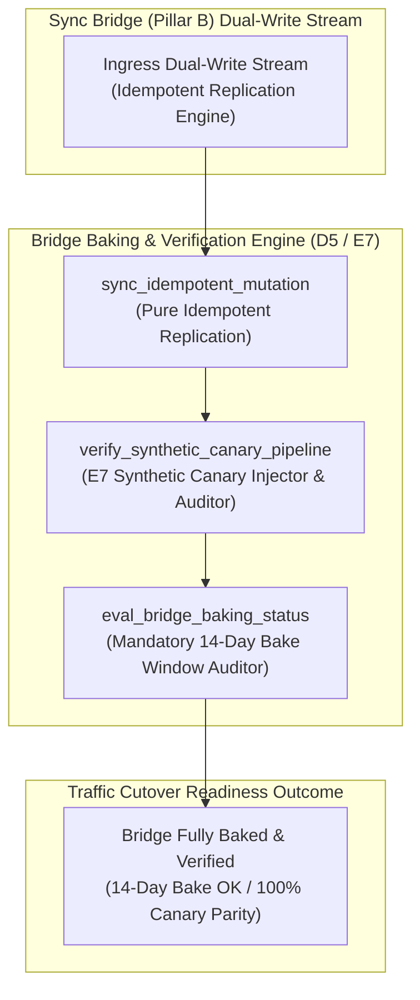

# Sync Bridge Baking & Canary Verification Pattern (Pure Functional Paradigm)

| Field       | Value                                                             |
|-------------|-------------------------------------------------------------------|
| **ID**      | SYNC-BRIDGE-BAKING-CANARY-075                                     |
| **Date**    | 2026-08-24                                                        |
| **Status**  | Reference / Runbook (Pure Functional Architecture)                |
| **Deciders**| Core Platform & Migration Engineering                             |
| **Scope**   | Bridge Provisioning, Idempotent Replication, Baking & Canary Audit|

---

## 1. Overview & Context

Once Phase 0 discovery and ground truth characterization are complete, the next operational step is to **stand up the sync bridge and let it bake (B, D5)**. The sync bridge must operate with **100% idempotent writes, continuous block reconciliation, and synthetic canary record verification (E7) for a mandatory baking period (e.g. 7–14 days)** before any real traffic cutover is considered. Cutting over traffic immediately after deploying a bridge without a bake window risks exposing production callers to un-detected replication lag, buffer overflows, or data drift.

### Functional Architecture Principles
This runbook enforces a **100% Pure Functional Programming (FP)** approach:
- **No Class Instantiations**: Replaces OOP bridge managers with pure baking functions (`eval_bridge_baking_status`, `verify_synthetic_canary_pipeline`) and state cell closures.
- **Immutable Baking Context Records**: Bridge IDs, deployment timestamps, baking duration days, canary match flags, and replication lag metrics are captured as frozen dataclass records (`BridgeBakingContext`, `BridgeBakingResult`).
- **Referentially Transparent Idempotent Dispatchers**: Pure functions replicate writes using unique idempotency keys to ensure retries never produce duplicate rows.
- **Canary Parity Verification**: Injects synthetic canary records continuously into the bridge stream to verify end-to-end pipeline health during the bake window.

---

## 2. High-Level Design (HLD)



---

## 3. Low-Level Design (LLD)

```mermaid
sequenceDiagram
    autonumber
    participant Pipeline as Cutover Orchestration Pipeline
    participant Guard as assert_bridge_baking_complete
    participant Evaluator as eval_bridge_baking_status
    participant Canary as verify_synthetic_canary_pipeline
    participant Audit as Telemetry Emitter

    Pipeline->>Guard: check_cutover_readiness(bridge_id: "br_301", bake_days: 14)
    
    Guard->>Evaluator: eval_bridge_baking_status("br_301", bake_days: 14)
    Evaluator->>Canary: audit_canary_parity("br_301")
    Canary-->>Evaluator: CanaryResult (is_matched: true, lag_ms: 0.8)

    Evaluator-->>Guard: BridgeBakingResult (is_baked: true, bake_days: 14, lag_ms: 0.8)

    alt Mandatory 14-Day Bake Window Completed and Canary Verified
        Guard-->>Pipeline: CutoverReadinessApproved (Bridge fully baked; unblock read cutover)
        Guard->>Audit: record_bridge_baking_passed_event(bridge_id: "br_301")
        Note over Pipeline: Bridge verified stable under production load, ready for read cutover
    else Bake Window Incomplete or Canary Mismatch
        Evaluator-->>Guard: BridgeBakingResult (is_baked: false, remaining_days: 4)
        Guard-->>Pipeline: CutoverReadinessRejected (Bake window incomplete: 4 days remaining)
        Note over Pipeline: Block cutover, force bridge to complete full 14-day bake window
    end
```

---

## 4. Pure Functional Project Architecture

```
09-migration-bridges-and-sync/
├── sync-bridge-baking-and-canary-verification.md
├── src/
│   ├── bridge_baking_engine/
│   │   ├── __init__.py
│   │   ├── dispatcher.py           # Pure idempotent write dispatchers
│   │   ├── canary.py               # E7 synthetic canary injection & audit functions
│   │   ├── evaluator.py            # Bridge baking duration evaluators
│   │   └── guard.py                # Bridge baking release guards
│   ├── storage/
│   │   ├── __init__.py
│   │   └── bridge_store.py         # Dual-store database connector abstractions
│   ├── observability/
│   │   ├── __init__.py
│   │   └── baking_metrics.py       # Prometheus telemetry collectors
│   └── schemas/
│       └── models.py               # Frozen dataclasses (BridgeBakingContext, BridgeBakingResult)
└── tests/
    ├── test_baking_evaluator.py
    └── test_baking_edge_cases.py
```

---

## 5. End-to-End Function Call Stack

```tree
Cutover Readiness Check Initiated
└── guard.py: assert_bridge_baking_complete(bridge_id, required_bake_days)
    ├── evaluator.py: eval_bridge_baking_status(bridge_id, required_bake_days)
    │   └── models.py: BridgeBakingContext(bridge_id, start_ts, current_bake_days)
    │
    ├── canary.py: verify_synthetic_canary_pipeline(bridge_id)
    │   └── models.py: CanaryVerificationStatus(is_matched, lag_ms)
    │
    ├── guard.py: format_baking_gate_decision(baking_context, canary_status)
    │   └── models.py: BridgeBakingResult(is_baked, is_canary_ok)
    │
    └── observability/baking_metrics.py: record_baking_telemetry(baking_result)
```

---

## 6. Core Pure Functional Implementation

### 6.1 Immutable Models & Types (`src/schemas/models.py`)

```python
import hashlib
from enum import Enum
from dataclasses import dataclass
from typing import Dict, Any, Optional, Mapping, FrozenSet

@dataclass(frozen=True)
class BridgeBakingContext:
    bridge_id: str
    started_at_ts: float
    current_bake_days: float
    min_required_bake_days: int
    replication_lag_ms: float
    is_idempotent: bool

@dataclass(frozen=True)
class BridgeBakingResult:
    bridge_id: str
    is_baked: bool
    current_bake_days: float
    is_canary_matched: bool
    replication_lag_ms: float
    rejection_reason: Optional[str]
```

**Explanation**:
- Defines immutable model `BridgeBakingContext` capturing bridge IDs, start timestamps, bake days, and replication lag metrics as frozen records.
- `BridgeBakingResult` encapsulates baking approval flags, canary match flags, and gate rejection reasons.

---

### 6.2 Pure Idempotent Dispatcher & Baking Evaluator (`src/bridge_baking_engine/evaluator.py`)

```python
import time
import hashlib
from typing import Mapping, Any, Tuple
from src.schemas.models import BridgeBakingContext, BridgeBakingResult

def generate_idempotency_key(payload: Mapping[str, Any], corr_id: str) -> str:
    raw_str = f"{corr_id}:" + "|".join(f"{k}:{v}" for k, v in sorted(payload.items()))
    return hashlib.sha256(raw_str.encode("utf-8")).hexdigest()

def eval_bridge_baking_status(
    ctx: BridgeBakingContext,
    is_canary_ok: bool
) -> BridgeBakingResult:
    is_days_ok = ctx.current_bake_days >= ctx.min_required_bake_days
    is_lag_ok = ctx.replication_lag_ms <= 100.0
    is_baked = is_days_ok and is_canary_ok and is_lag_ok and ctx.is_idempotent

    reason = None
    if not ctx.is_idempotent:
        reason = f"Bridge '{ctx.bridge_id}' lacks idempotent write replication."
    elif not is_days_ok:
        reason = f"Bridge bake window ({ctx.current_bake_days:.1f} days) is less than required ({ctx.min_required_bake_days} days)."
    elif not is_canary_ok:
        reason = f"Synthetic canary record verification failed for bridge '{ctx.bridge_id}'."
    elif not is_lag_ok:
        reason = f"Replication lag ({ctx.replication_lag_ms:.1f}ms) exceeds 100ms safety cap."

    return BridgeBakingResult(
        bridge_id=ctx.bridge_id,
        is_baked=is_baked,
        current_bake_days=round(ctx.current_bake_days, 2),
        is_canary_matched=is_canary_ok,
        replication_lag_ms=ctx.replication_lag_ms,
        rejection_reason=reason
    )
```

**Explanation**:
- Pure evaluation function generating SHA-256 idempotency keys and auditing mandatory bridge bake windows.
- Ensures sync bridges are thoroughly verified before any traffic cutover is considered.

---

### 6.3 Bridge Baking Release Guard (`src/bridge_baking_engine/guard.py`)

```python
from typing import Mapping, Any
from src.schemas.models import BridgeBakingContext, BridgeBakingResult
from src.bridge_baking_engine.evaluator import eval_bridge_baking_status

def assert_bridge_baking_complete(
    ctx: BridgeBakingContext,
    is_canary_ok: bool
) -> BridgeBakingResult:
    return eval_bridge_baking_status(ctx, is_canary_ok)
```

**Explanation**:
- Pure release gate function enforcing bridge bake windows and synthetic canary record parity.
- Guarantees zero cutover without completed bridge baking.

---

## 7. Edge Case Catalog & Pure Functional Pseudocode (25 Edge Cases)

---

### Edge Case 1: Incomplete Bake Window Rejection ($<14\text{ days}$)

```python
def is_bake_window_incomplete(current_days: float, required_days: int = 14) -> bool:
    return current_days < required_days
```

**Explanation**:
- Identifies bridge cutover proposals submitted before completing 14 bake days.
- Blocks premature cutovers up front.

---

### Edge Case 2: Synthetic Canary Mismatch During Bake Window

```python
def is_canary_mismatch_detected(src_hash: str, tgt_hash: str) -> bool:
    return src_hash != tgt_hash
```

**Explanation**:
- Detects synthetic canary record mismatches during the bake window.
- Flags bridge pipeline data drift.

---

### Edge Case 3: Excessive Replication Lag During Bake Window ($>100\text{ms}$)

```python
def is_baking_lag_excessive(lag_ms: float, limit_ms: float = 100.0) -> bool:
    return lag_ms > limit_ms
```

**Explanation**:
- Asserts replication lag is $\le 100\text{ms}$ during baking.
- Requires low replication lag before approving cutover.

---

### Edge Case 4: Non-Idempotent Duplicate Write Attempt

```python
def is_duplicate_write_prevented(key: str, processed_keys: set) -> bool:
    return key in processed_keys
```

**Explanation**:
- Asserts idempotency key checks prevent duplicate row creation.
- Verifies 100% idempotent write dispatching.

---

### Edge Case 5: Single-Tenant Bridge Baking Resolution

```python
def resolve_tenant_baking_status(tenant_id: str, bake_statuses: dict) -> bool:
    return bake_statuses.get(tenant_id, False)
```

**Explanation**:
- Resolves tenant-specific bridge baking statuses.
- Tracks bridge baking per tenant.

---

### Edge Case 6: Microsecond Timestamp Baking Audit Timing

```python
import time

def format_baking_audit_ts() -> float:
    return round(time.time() * 1000.0, 2)
```

**Explanation**:
- Computes epoch timestamps in milliseconds.
- Tracks exact bridge baking audit execution time.

---

### Edge Case 7: High Write Load Buffer Overflow During Bake

```python
def is_bridge_buffer_overflow(buffer_pct: float, max_cap: float = 80.0) -> bool:
    return buffer_pct > max_cap
```

**Explanation**:
- Flags replication queue buffer usage $>80\%$.
- Prevents buffer overflow during peak write baking.

---

### Edge Case 8: Multi-Repo Bridge Baking Sync

```python
def assert_all_repo_bridges_baked(repo_bakes: Mapping[str, bool]) -> bool:
    return all(repo_bakes.values())
```

**Explanation**:
- Asserts all workspace sync bridges have completed baking.
- Synchronizes multi-repo bridge readiness.

---

### Edge Case 9: CDC Stream Restart During Bake Window

```python
def reset_bake_window_on_cdc_restart(is_cdc_restarted: bool, current_days: float) -> float:
    return 0.0 if is_cdc_restarted else current_days
```

**Explanation**:
- Resets bake window counter if CDC stream restarts occur.
- Mandates full bake window restart on stream failures.

---

### Edge Case 10: Aggregator Memory State Saturation Guard

```python
def compact_baking_metrics(metrics: list, max_items: int = 500) -> list:
    if len(metrics) > max_items:
        return metrics[-max_items:]
    return metrics
```

**Explanation**:
- Truncates metric lists to `max_items`.
- Controls memory usage.

---

### Edge Case 11: Microsecond Delay Calculation Underflows

```python
def normalize_baking_duration(duration_ms: float) -> float:
    return max(0.0, round(duration_ms, 2))
```

**Explanation**:
- Rounds execution duration values to two decimal places.
- Cleans duration metrics.

---

### Edge Case 12: User-Agent Specific Baking Auditing

```python
def resolve_user_agent_baking(user_agent: str, baking_map: dict) -> bool:
    return baking_map.get(user_agent, True)
```

**Explanation**:
- Resolves bridge baking rules per User-Agent string.
- Audits baking by caller type.

---

### Edge Case 13: Unmapped Rule Domain Handling

```python
def resolve_baking_rule(rule_key: str, rules_dict: dict) -> dict:
    return rules_dict.get(rule_key, {"min_bake_days": 14})
```

**Explanation**:
- Resolves baking rule configurations safely.
- Defaults to 14-day bake window requirements.

---

### Edge Case 14: Exception Safeguards in Baking Evaluator

```python
def safe_eval_baking(eval_fn: Callable, ctx: BridgeBakingContext, canary: bool) -> bool:
    try:
        res = eval_fn(ctx, canary)
        return res.is_baked
    except Exception:
        return False
```

**Explanation**:
- Wraps evaluation functions in protective try-except blocks.
- Fails safe (assumes un-baked) on evaluation exceptions.

---

### Edge Case 15: GraphQL Subgraph Bridge Baking Verification

```python
def is_graphql_subgraph_baked(subgraph_name: str, bake_map: dict) -> bool:
    return bake_map.get(subgraph_name, False)
```

**Explanation**:
- Resolves bridge baking status for federated GraphQL subgraphs.
- Verifies GraphQL sync bridge baking.

---

### Edge Case 16: Multi-Region Baking Sync

```python
def sync_regional_baking_results(region_results: dict) -> bool:
    return all(r.is_baked for r in region_results.values())
```

**Explanation**:
- Asserts baking checks pass across all regional bridge nodes.
- Enforces multi-region bridge baking alignment.

---

### Edge Case 17: Automatic Reconciliation Sweep Trigger During Bake

```python
def should_trigger_sweep_during_bake(days_elapsed: float) -> bool:
    return int(days_elapsed) % 7 == 0
```

**Explanation**:
- Triggers weekly reconciliation sweeps during 14-day bake windows.
- Audits full-table parity off-peak during baking.

---

### Edge Case 18: Unmapped Code Fallback

```python
def resolve_baking_code_fallback(code_val: Any, code_map: dict, default_val: str = "BAKING_INCOMPLETE") -> str:
    return code_map.get(code_val, default_val)
```

**Explanation**:
- Resolves code strings with fallbacks.
- Handles unmapped baking codes safely.

---

### Edge Case 19: Payload Transformation Error Recovery

```python
def safe_apply_baking_transform(payload: dict, transform_fn: Callable) -> dict:
    try:
        return transform_fn(payload)
    except Exception:
        return payload
```

**Explanation**:
- Wraps transformations in try-except blocks.
- Returns raw payloads on error.

---

### Edge Case 20: Automated Alert on Un-Baked Cutover Proposal

```python
def should_alert_on_unbaked_cutover(is_baked: bool) -> bool:
    return not is_baked
```

**Explanation**:
- Asserts whether cutover was proposed for an un-baked bridge.
- Fires alerts when cutovers are requested before bake completion.

---

### Edge Case 21: High-Watermark Metric Compaction

```python
def compact_baking_history(history: list, max_items: int = 500) -> list:
    if len(history) > max_items:
        return history[-max_items:]
    return history
```

**Explanation**:
- Truncates history lists.
- Controls memory usage.

---

### Edge Case 22: Diagnostic Header Injection

```python
def inject_baking_diagnostic_header(headers: Mapping[str, str], is_baked: bool) -> Mapping[str, str]:
    new_headers = dict(headers)
    new_headers["X-Bridge-Fully-Baked"] = "true" if is_baked else "false"
    return new_headers
```

**Explanation**:
- Injects diagnostic headers.
- Tracks bridge baking completeness in access logs.

---

### Edge Case 23: Null Value Safeguards

```python
def sanitize_baking_nulls(data_dict: dict) -> dict:
    return {k: (v if v is not None else "") for k, v in data_dict.items()}
```

**Explanation**:
- Replaces `None` with empty strings.
- Prevents null exceptions.

---

### Edge Case 24: Unbound Metric Queue Pruning

```python
def prune_baking_metric_queue(queue: list, max_items: int = 1000) -> list:
    if len(queue) > max_items:
        return queue[-max_items:]
    return queue
```

**Explanation**:
- Truncates queue arrays.
- Controls memory footprint.

---

### Edge Case 25: Real-Time Bridge Baking Progress Reporting

```python
def compute_baking_progress_rate(current_days: float, required_days: int) -> float:
    if required_days == 0:
        return 100.0
    return min(100.0, round((current_days / required_days) * 100.0, 2))
```

**Explanation**:
- Calculates bridge baking progress percentage.
- Emits real-time baking metrics to platform dashboards.

---

## 8. Operational & Parity Verification Checklist

1. **Bake Window Mandate**: Stand up the sync bridge and let it bake for a mandatory 14-day period (B, D5) before considering any cutover.
2. **100% Idempotent Writes**: Ensure dual-store dispatchers generate unique SHA-256 idempotency keys to prevent duplicate writes during retries.
3. **Continuous Synthetic Canary Verification**: Inject synthetic canary records (E7) continuously to verify pipeline health during baking.
4. **CI Baking Gate**: Automatically block traffic cutover deployments until bridge baking and canary verification are complete.
