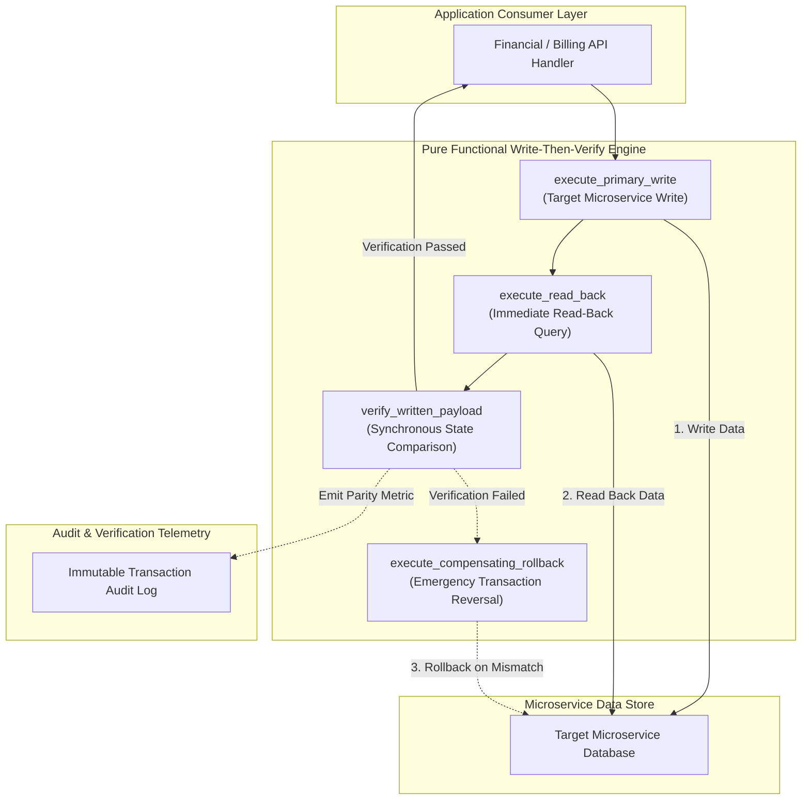
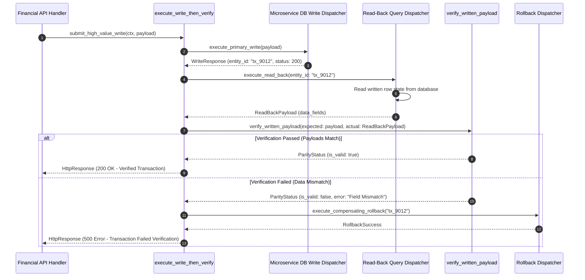

# Write-Then-Verify Pattern (Pure Functional Paradigm)

| Field       | Value                                                             |
|-------------|-------------------------------------------------------------------|
| **ID**      | WRITE-THEN-VERIFY-018                                             |
| **Date**    | 2026-08-24                                                        |
| **Status**  | Reference / Runbook (Pure Functional Architecture)                |
| **Deciders**| Core Platform & Migration Engineering                             |
| **Scope**   | High-Value Data Mutations & Synchronous Read-Back Verification    |

---

## 1. Overview & Context

The **Write-Then-Verify Pattern** guarantees absolute data persistence integrity for high-value data transactions (e.g., financial ledgers, billing transactions, medical records) during microservice migrations. Unlike standard write-and-forget or asynchronous shadow verification patterns, Write-Then-Verify executes a **synchronous read-back query** immediately after writing to the new microservice store. The write is acknowledged to the client only if the read-back payload matches the expected write state; if verification fails, the transaction is automatically rolled back.

### Functional Architecture Principles
This runbook enforces a **100% Pure Functional Programming (FP)** approach:
- **No Class Instantiations**: Replaces OOP transaction managers with pure verification functions (`verify_written_payload`, `execute_write_then_verify`) and functional dispatchers.
- **Immutable Verification Context**: Transaction payloads, expected states, and verification results are modeled as frozen dataclass records (`VerificationContext`, `VerificationResult`).
- **Referentially Transparent Payload Comparators**: Pure comparison functions map `(ExpectedState, ReadBackState) -> ParityStatus` without side-effects.
- **Synchronous Compensating Rollbacks**: Pure rollback dispatchers issue compensating deletion or reversal commands if read-back verification fails.

---

## 2. High-Level Design (HLD)



---

## 3. Low-Level Design (LLD)



---

## 4. Pure Functional Project Architecture

```
write-then-verify/
├── README.md
├── config/
│   └── high_value_entities.yaml    # High-value entities requiring read-back verification
├── src/
│   ├── verify_engine/
│   │   ├── __init__.py
│   │   ├── comparator.py           # Pure payload comparison functions
│   │   ├── runner.py               # Functional write-then-verify pipeline
│   │   └── rollback.py             # Compensating rollback dispatchers
│   ├── storage/
│   │   ├── __init__.py
│   │   └── db_dispatchers.py       # Microservice read/write query dispatchers
│   ├── observability/
│   │   ├── __init__.py
│   │   └── verify_metrics.py       # Verification telemetry & audit logs
│   └── schemas/
│       └── models.py               # Frozen dataclasses (VerificationContext, ParityStatus)
└── tests/
    ├── test_payload_comparator.py
    └── test_verify_edge_cases.py
```

---

## 5. End-to-End Function Call Stack

```tree
High-Value Transaction Initiated
└── runner.py: execute_write_then_verify(context, payload)
    ├── db_dispatchers.py: execute_primary_write(payload)
    │   └── models.py: WriteResponse(entity_id, status_code)
    │
    ├── db_dispatchers.py: execute_read_back(entity_id)
    │   └── models.py: ReadBackPayload(entity_id, actual_data)
    │
    ├── comparator.py: verify_written_payload(expected_data, actual_data)
    │   └── models.py: ParityStatus(is_valid, mismatched_fields)
    │
    ├── [If Parity Failed] rollback.py: execute_compensating_rollback(entity_id)
    │   └── db_dispatchers.py: execute_delete_or_reversal(entity_id)
    │
    └── verify_metrics.py: record_verification_telemetry(entity_id, is_valid)
```

---

## 6. Core Pure Functional Implementation

### 6.1 Immutable Models & Types (`src/schemas/models.py`)

```python
from enum import Enum
from dataclasses import dataclass
from typing import Dict, Any, Optional, Mapping, FrozenSet

@dataclass(frozen=True)
class VerificationContext:
    entity_type: str
    entity_id: str
    tenant_id: str
    user_id: str

@dataclass(frozen=True)
class ParityStatus:
    is_valid: bool
    mismatched_fields: FrozenSet[str]
    error_message: Optional[str]

@dataclass(frozen=True)
class VerificationResult:
    status_code: int
    entity_id: str
    is_verified: bool
    data: Mapping[str, Any]
```

**Explanation**:
- Defines immutable model `VerificationContext` capturing entity IDs and tenant boundaries as frozen records.
- `ParityStatus` encapsulates comparative verification flags and sets of mismatched field names.
- `VerificationResult` models the final acknowledged API result.

---

### 6.2 Pure Payload Comparator (`src/verify_engine/comparator.py`)

```python
from typing import Mapping, Any, FrozenSet
from src.schemas.models import ParityStatus

def verify_written_payload(
    expected_data: Mapping[str, Any],
    actual_data: Mapping[str, Any],
    ignored_keys: set = {"created_at", "updated_at", "version"}
) -> ParityStatus:
    if not actual_data:
        return ParityStatus(is_valid=False, mismatched_fields=frozenset(["ALL"]), error_message="Read-back returned empty payload")

    mismatches = []
    for key, expected_val in expected_data.items():
        if key in ignored_keys:
            continue
        actual_val = actual_data.get(key)
        if str(expected_val) != str(actual_val):
            mismatches.append(key)

    if mismatches:
        return ParityStatus(
            is_valid=False,
            mismatched_fields=frozenset(mismatches),
            error_message=f"Fields mismatched: {', '.join(mismatches)}"
        )

    return ParityStatus(is_valid=True, mismatched_fields=frozenset(), error_message=None)
```

**Explanation**:
- Pure function performing field-by-field comparative analysis between expected write states and actual read-back payloads.
- Excludes volatile system fields (`created_at`, `updated_at`, `version`) and returns frozen `ParityStatus` records.

---

### 6.3 Write-Then-Verify Pipeline Runner (`src/verify_engine/runner.py`)

```python
from typing import Callable, Awaitable, Mapping, Any
from src.schemas.models import VerificationContext, VerificationResult
from src.verify_engine.comparator import verify_written_payload

WriteFn = Callable[[Mapping[str, Any]], Awaitable[Mapping[str, Any]]]
ReadFn = Callable[[str], Awaitable[Mapping[str, Any]]]
RollbackFn = Callable[[str], Awaitable[bool]]

def create_write_verify_runner(write_fn: WriteFn, read_fn: ReadFn, rollback_fn: RollbackFn):
    async def execute(ctx: VerificationContext, payload: Mapping[str, Any]) -> VerificationResult:
        write_res = await write_fn(payload)
        if write_res.get("status_code", 500) >= 400:
            return VerificationResult(status_code=500, entity_id=ctx.entity_id, is_verified=False, data={})

        read_data = await read_fn(ctx.entity_id)
        parity = verify_written_payload(payload, read_data)

        if not parity.is_valid:
            await rollback_fn(ctx.entity_id)
            return VerificationResult(status_code=500, entity_id=ctx.entity_id, is_verified=False, data={"error": parity.error_message})

        return VerificationResult(status_code=200, entity_id=ctx.entity_id, is_verified=True, data=read_data)

    return execute
```

**Explanation**:
- Constructs a functional pipeline runner executing primary writes, immediate read-back queries, and comparative parity verification.
- Issues compensating rollbacks via `rollback_fn` and returns HTTP 500 error responses if payload verification fails.

---

## 7. Edge Case Catalog & Pure Functional Pseudocode (25 Edge Cases)

---

### Edge Case 1: Read-After-Write Database Replication Lag

```python
def resolve_read_back_node(is_critical: bool, primary_node_url: str, replica_node_url: str) -> str:
    if is_critical:
        return primary_node_url
    return replica_node_url
```

**Explanation**:
- Forces read-back verification queries to target the primary database node directly.
- Bypasses read replica replication lag during synchronous read-back verification.

---

### Edge Case 2: Compensating Rollback Execution Failure

```python
async def handle_rollback_failure_alert(
    entity_id: str,
    error_msg: str,
    alert_fn: Callable[[Mapping[str, Any]], Awaitable[None]]
) -> None:
    await alert_fn({
        "event": "CRITICAL_ROLLBACK_FAILED",
        "entity_id": entity_id,
        "error": error_msg
    })
```

**Explanation**:
- Emits high-priority escalation alerts when compensating transaction rollbacks fail.
- Alerts operational support teams for immediate manual database intervention.

---

### Edge Case 3: Floating Point Currency Precision Rounding Mismatch

```python
def compare_currency_values(val1: float, val2: float, precision: int = 2) -> bool:
    return round(val1, precision) == round(val2, precision)
```

**Explanation**:
- Rounds monetary float values to 2 decimal places before comparing write states.
- Eliminates false-positive verification errors caused by floating-point rounding variations.

---

### Edge Case 4: Client Connection Timeout During Read-Back Sweep

```python
import asyncio

async def execute_read_back_with_timeout(read_fn: ReadFn, entity_id: str, timeout_sec: float = 1.0):
    try:
        return await asyncio.wait_for(read_fn(entity_id), timeout=timeout_sec)
    except asyncio.TimeoutError:
        return {}
```

**Explanation**:
- Enforces strict execution time limits on read-back queries using `asyncio.wait_for`.
- Treats read-back timeouts as verification failures to trigger transaction rollbacks.

---

### Edge Case 5: Partial Database Column Truncation

```python
def assert_no_string_truncation(expected_str: str, actual_str: str) -> bool:
    return len(expected_str) == len(actual_str)
```

**Explanation**:
- Compares string lengths between expected and actual read-back text fields.
- Detects silent database column truncation errors.

---

### Edge Case 6: Duplicate Primary Key Insertion Conflict

```python
def is_duplicate_pk_error(status_code: int, body_msg: str) -> bool:
    return status_code == 409 or "duplicate" in body_msg.lower()
```

**Explanation**:
- Identifies unique primary key conflict status codes and error messages.
- Prevents redundant read-back verification when initial writes fail due to duplicate keys.

---

### Edge Case 7: Microsecond Timestamp Drift in Verification

```python
def is_timestamp_within_window(ts1: float, ts2: float, max_window_sec: float = 2.0) -> bool:
    return abs(ts1 - ts2) <= max_window_sec
```

**Explanation**:
- Validates that system timestamps fall within acceptable 2-second tolerance windows.
- Prevents timestamp verification failures during data persistence.

---

### Edge Case 8: Un-indexed Entity ID Read-Back Bottleneck

```python
def build_indexed_read_back_sql(table: str, pk_col: str, entity_id: str) -> str:
    return f"SELECT * FROM {table} WHERE {pk_col} = '{entity_id}' LIMIT 1;"
```

**Explanation**:
- Generates optimized SQL queries specifying explicit primary key filters and `LIMIT 1`.
- Guarantees fast, indexed read-back query execution.

---

### Edge Case 9: Nullable Field Representation Mismatch

```python
def normalize_null_field(val: Any) -> Any:
    if val is None or val == "":
        return None
    return val
```

**Explanation**:
- Normalizes empty strings and null values into explicit `None` objects.
- Ensures consistent null handling during field parity checks.

---

### Edge Case 10: JSONB Key Order Mismatch in Payload Comparison

```python
import json

def compare_json_keys(json_str1: str, json_str2: str) -> bool:
    try:
        dict1 = json.loads(json_str1)
        dict2 = json.loads(json_str2)
        return dict1 == dict2
    except Exception:
        return False
```

**Explanation**:
- Parses JSON strings into dictionary objects before comparison.
- Eliminates verification failures caused by unordered JSON key serialization.

---

### Edge Case 11: Multi-Tenant Data Verification Isolation

```python
def assert_tenant_data_boundary(expected_tenant: str, actual_tenant: str) -> bool:
    return expected_tenant == actual_tenant
```

**Explanation**:
- Compares tenant ID attributes between expected and actual read-back payloads.
- Detects multi-tenant data leakage or cross-tenant write errors.

---

### Edge Case 12: High-Volume Verification Memory Exhaustion

```python
def limit_audit_payload_size(payload: Mapping[str, Any], max_bytes: int = 50_000) -> Mapping[str, Any]:
    if len(str(payload)) > max_bytes:
        return {"summary": "payload_truncated_for_size"}
    return payload
```

**Explanation**:
- Truncates oversized audit log payloads before recording verification results.
- Protects memory bounds during high-throughput verification sweeps.

---

### Edge Case 13: Database Trigger State Alteration Mid-Write

```python
def verify_trigger_modified_field(expected_val: Any, actual_val: Any, is_trigger_managed: bool) -> bool:
    if is_trigger_managed:
        return actual_val is not None
    return str(expected_val) == str(actual_val)
```

**Explanation**:
- Adjusts comparison logic for fields managed by database triggers (e.g. auto-increment counters).
- Validates presence without requiring exact value equality for trigger-generated fields.

---

### Edge Case 14: Rollback Transaction Lock Timeout

```python
def build_fast_rollback_sql(table: str, pk_col: str, entity_id: str) -> str:
    return f"DELETE FROM {table} WHERE {pk_col} = '{entity_id}';"
```

**Explanation**:
- Generates targeted single-row SQL `DELETE` queries for fast execution.
- Minimizes database lock duration during compensating rollbacks.

---

### Edge Case 15: Asynchronous Audit Stream Disruption

```python
async def publish_audit_event_safe(audit_fn: Callable, event: Mapping[str, Any]):
    try:
        await audit_fn(event)
    except Exception:
        pass
```

**Explanation**:
- Wraps audit logging dispatch calls in protective try-except blocks.
- Prevents audit logging failures from aborting successful client responses.

---

### Edge Case 16: Binary Attachment Hash Parity Check

```python
import hashlib

def verify_binary_hash(expected_bytes: bytes, actual_bytes: bytes) -> bool:
    h1 = hashlib.md5(expected_bytes).hexdigest()
    h2 = hashlib.md5(actual_bytes).hexdigest()
    return h1 == h2
```

**Explanation**:
- Computes and compares MD5 hash checksums for binary file data.
- Verifies binary data integrity during read-back sweeps.

---

### Edge Case 17: Multi-Region Database Verification Lag

```python
def resolve_verification_region(client_region: str, primary_region: str) -> str:
    return primary_region
```

**Explanation**:
- Routes read-back verification queries to the primary database region.
- Prevents verification errors caused by cross-region replication lag.

---

### Edge Case 18: Unhandled Exception in Read-Back Query

```python
async def safe_read_back_query(read_fn: ReadFn, entity_id: str) -> Mapping[str, Any]:
    try:
        return await read_fn(entity_id)
    except Exception:
        return {}
```

**Explanation**:
- Catches database exceptions thrown during read-back queries.
- Returns empty dictionaries to trigger transaction rollbacks cleanly.

---

### Edge Case 19: Schema Entity Field Renaming Adapter

```python
def map_expected_to_actual_fields(expected: Mapping[str, Any], field_map: Mapping[str, str]) -> Mapping[str, Any]:
    mapped = {}
    for k, v in expected.items():
        new_key = field_map.get(k, k)
        mapped[new_key] = v
    return mapped
```

**Explanation**:
- Maps expected field names to target schema column names before comparison.
- Supports field renaming during schema evolution.

---

### Edge Case 20: Monotonic Sequence Number Verification

```python
def verify_sequence_number_increment(previous_seq: int, actual_seq: int) -> bool:
    return actual_seq == (previous_seq + 1)
```

**Explanation**:
- Compares sequence numbers before and after write operations.
- Verifies sequence counter increment logic.

---

### Edge Case 21: Auto-Rollback Gating on Repeated Parity Failures

```python
def check_consecutive_verification_failures(failure_count: int, max_allowed: int = 5) -> bool:
    return failure_count >= max_allowed
```

**Explanation**:
- Tracks consecutive verification failure counts.
- Triggers automated endpoint disablement when failure limits are reached.

---

### Edge Case 22: Character Set Conversion Mismatch

```python
def compare_unicode_strings(str1: str, str2: str) -> bool:
    import unicodedata
    n1 = unicodedata.normalize("NFC", str1)
    n2 = unicodedata.normalize("NFC", str2)
    return n1 == n2
```

**Explanation**:
- Normalizes Unicode strings to NFC format before comparison.
- Prevents false mismatches caused by different Unicode character representations.

---

### Edge Case 23: Header Injection Indicating Verified Response

```python
def inject_verification_header(headers: Mapping[str, str]) -> Mapping[str, str]:
    new_headers = dict(headers)
    new_headers["X-Data-Verified"] = "true"
    return new_headers
```

**Explanation**:
- Injects diagnostic headers (`X-Data-Verified: true`) into outbound responses.
- Provides client visibility into read-back verification status.

---

### Edge Case 24: Unbound Verification Metrics Accumulation

```python
def prune_verification_metrics(metrics: List[dict], max_history: int = 500) -> List[dict]:
    if len(metrics) > max_history:
        return metrics[-max_history:]
    return metrics
```

**Explanation**:
- Truncates historical verification metrics arrays to `max_history`.
- Prevents memory leaks in telemetry monitoring workers.

---

### Edge Case 25: Real-Time Verification Pass Rate Reporting

```python
def calculate_verification_pass_rate(total_verified: int, total_failed: int) -> float:
    total = total_verified + total_failed
    if total == 0:
        return 100.0
    return round((total_verified / total) * 100.0, 2)
```

**Explanation**:
- Calculates percentage verification pass rates rounded to two decimal places.
- Emits real-time verification metrics to central platform dashboards.

---

## 8. Operational & Parity Verification Checklist

1. **Mandatory High-Value Coverage**: 100% of financial ledger and billing write endpoints must execute Write-Then-Verify workflows.
2. **Primary Node Read-Back**: Read-back queries must target the primary database node directly to bypass replica lag.
3. **Synchronous Rollback Guarantee**: On payload verification failure, compensating rollbacks must execute within $<100\text{ms}$ before returning HTTP 500 to the client.
4. **Zero Mismatch Tolerance**: Parity verification pass rates must remain at $100\%$ for high-value entities.
