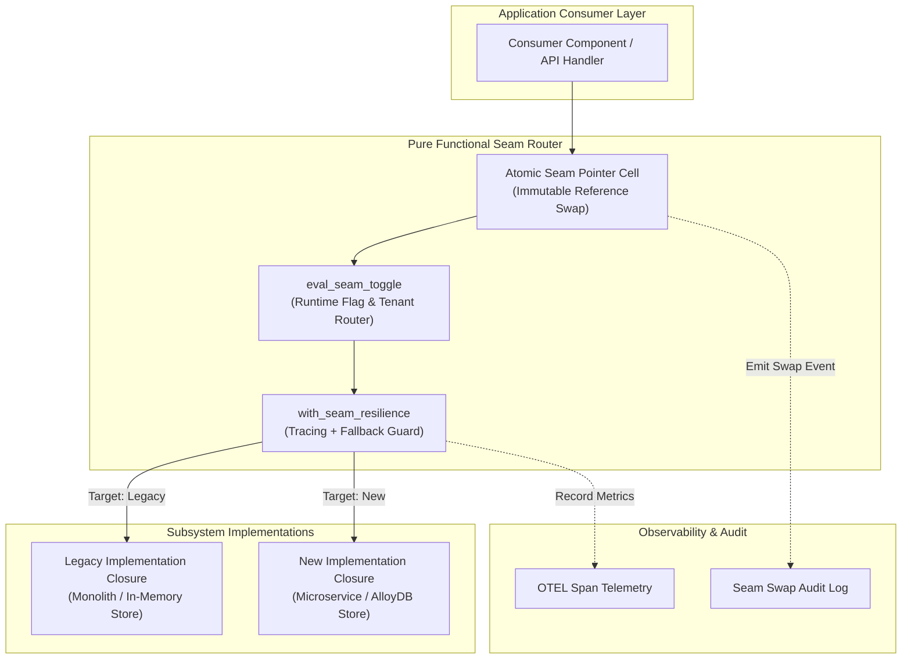
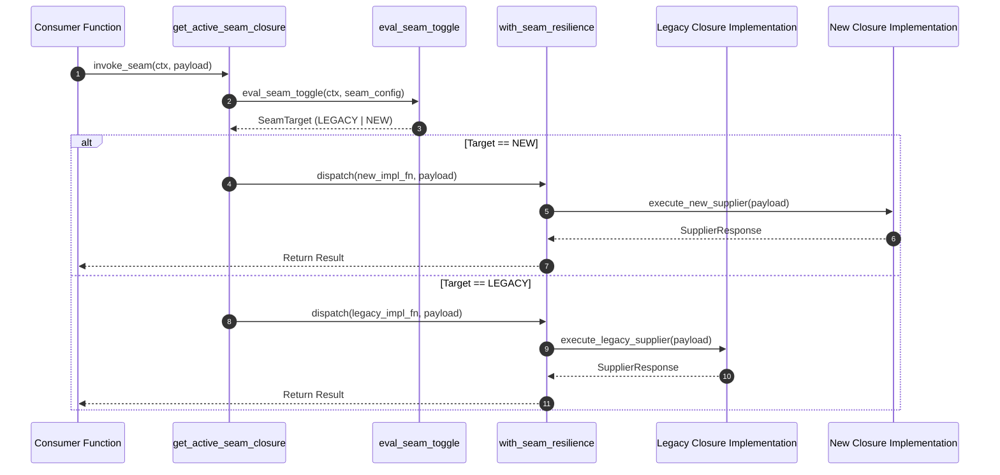

# Branch by Abstraction Pattern (Pure Functional Paradigm)

| Field       | Value                                                             |
|-------------|-------------------------------------------------------------------|
| **ID**      | BRANCH-BY-ABSTRACTION-002                                         |
| **Date**    | 2026-08-24                                                        |
| **Status**  | Reference / Runbook (Pure Functional Architecture)                |
| **Deciders**| Core Platform & Migration Engineering                             |
| **Scope**   | In-Code Subsystem Replacement & Atomic Functional Seams           |

---

## 1. Overview & Context

**Branch by Abstraction** is a software refactoring technique that allows major subsystem replacements directly within a live codebase without long-lived feature branches. Instead of creating isolated git branches, developers introduce a functional **Seam** (an abstract closure interface or pointer cell) in front of the legacy implementation. Both legacy and new implementations co-exist in the main codebase, and swapping between them is reduced to an atomic pointer modification.

### Functional Architecture Principles
This runbook enforces a **100% Pure Functional Programming (FP)** approach:
- **No Class Instantiations**: Replaces OOP interface classes (`Supplier`, `Repository`, `Provider`) with pure function closures (`SeamSupplier`) and higher-order function composers.
- **Atomic Reference Pointer Cells**: Swapping between legacy and new implementations is achieved via atomic pointer cell reference updates (`create_atomic_seam_cell`).
- **Resilience via Decorators**: Telemetry, retries, and fallback guards wrap seam functions using higher-order functions.
- **Zero Side-Effect Seam Router**: The seam router evaluates runtime feature toggles and context mapping without mutating global state.

---

## 2. High-Level Design (HLD)



---

## 3. Low-Level Design (LLD)



---

## 4. Pure Functional Project Architecture

```
branch-by-abstraction/
├── README.md
├── config/
│   └── seam_routes.yaml            # Seam feature flag thresholds & tenant maps
├── src/
│   ├── seams/
│   │   ├── __init__.py
│   │   ├── core_seam.py            # Atomic seam cell & router dispatchers
│   │   ├── registry.py             # Pure seam closure registry table
│   │   └── context.py              # Seam invocation context builders
│   ├── implementations/
│   │   ├── __init__.py
│   │   ├── legacy_supplier.py      # Legacy subsystem closure implementation
│   │   └── new_supplier.py         # New subsystem closure implementation
│   ├── decorators/
│   │   ├── __init__.py
│   │   └── seam_resilience.py      # Higher-order seam retry & tracing functions
│   └── schemas/
│       └── models.py               # Frozen dataclasses (SeamContext, SeamResponse)
└── tests/
    ├── test_seam_pointer_swap.py
    └── test_seam_edge_cases.py
```

---

## 5. End-to-End Function Call Stack

```tree
Consumer Call Initiated
├── seams/core_seam.py: create_atomic_seam_cell(legacy_fn: SeamSupplier, new_fn: SeamSupplier, initial_targe...)
├── seams/core_seam.py: get_target()
├── seams/core_seam.py: set_target(new_target: SeamTarget)
├── seams/core_seam.py: invoke(ctx: SeamContext, payload: Mapping[str, Any])
└── decorators/seam_resilience.py: with_seam_fallback(primary_fn: SeamSupplier, fallback_fn: SeamSupplier)
    ├── models.py: SeamContext(tenant_id, feature_key, user_id, metadata)
    └── models.py: SeamResult(success, data, executed_target, execution_time_ms)
```

---

## 6. Core Pure Functional Implementation

### 6.1 Immutable Models & Types (`src/schemas/models.py`)

```python
from enum import Enum
from dataclasses import dataclass
from typing import Dict, Any, Optional, Mapping, Callable, Awaitable

class SeamTarget(str, Enum):
    LEGACY = "legacy"
    NEW = "new"
    SHADOW = "shadow"

@dataclass(frozen=True)
class SeamContext:
    tenant_id: str
    feature_key: str
    user_id: Optional[str]
    metadata: Mapping[str, Any]

@dataclass(frozen=True)
class SeamResult:
    success: bool
    data: Any
    executed_target: SeamTarget
    execution_time_ms: float
```

**Explanation**:
- Defines frozen dataclasses (`frozen=True`) that model seam invocation parameters and responses.
- `SeamTarget` provides explicit target routing flags (`LEGACY`, `NEW`, `SHADOW`).
- `SeamContext` captures immutable caller metadata needed to evaluate seam routing toggles.
- `SeamResult` packages response data along with telemetry indicators showing which implementation target executed.

---

### 6.2 Atomic Seam Cell & Evaluator (`src/seams/core_seam.py`)

```python
from typing import Callable, Awaitable, Mapping, Any
from src.schemas.models import SeamContext, SeamResult, SeamTarget

SeamSupplier = Callable[[Mapping[str, Any]], Awaitable[Any]]

def create_atomic_seam_cell(legacy_fn: SeamSupplier, new_fn: SeamSupplier, initial_target: SeamTarget = SeamTarget.LEGACY):
    cell = {"target": initial_target, "legacy": legacy_fn, "new": new_fn}

    def get_target() -> SeamTarget:
        return cell["target"]

    def set_target(new_target: SeamTarget) -> None:
        cell["target"] = new_target

    async def invoke(ctx: SeamContext, payload: Mapping[str, Any]) -> Any:
        active_target = cell["target"]
        if active_target == SeamTarget.NEW:
            return await cell["new"](payload)
        return await cell["legacy"](payload)

    return get_target, set_target, invoke
```

**Explanation**:
- Constructs an atomic seam reference pointer cell inside a closure (`cell`).
- Exposes `get_target` and `set_target` functions to manipulate the active implementation target at runtime without mutating global scope.
- Provides `invoke` to transparently route consumer requests to either `legacy` or `new` functional suppliers.

---

### 6.3 Higher-Order Seam Resilience Decorator (`src/decorators/seam_resilience.py`)

```python
import time
from typing import Callable, Awaitable, Mapping, Any
from src.schemas.models import SeamSupplier, SeamResult, SeamTarget

def with_seam_fallback(primary_fn: SeamSupplier, fallback_fn: SeamSupplier) -> SeamSupplier:
    async def resilient_supplier(payload: Mapping[str, Any]) -> Any:
        try:
            return await primary_fn(payload)
        except Exception:
            return await fallback_fn(payload)
    return resilient_supplier
```

**Explanation**:
- Implements a pure higher-order decorator wrapping seam execution functions.
- Intercepts exceptions in the primary implementation supplier and automatically fails over to the legacy fallback supplier.

---

## 7. Edge Case Catalog & Pure Functional Pseudocode (25 Edge Cases)

---

### Edge Case 1: Mid-Flight Seam Pointer Swap Race Conditions

```python
def create_race_safe_seam(legacy_fn: SeamSupplier, new_fn: SeamSupplier):
    pointer_cell = {"fn": legacy_fn}

    def swap_pointer(target_fn: SeamSupplier):
        pointer_cell["fn"] = target_fn

    async def execute_seam(payload: Mapping[str, Any]) -> Any:
        snapshot_fn = pointer_cell["fn"]
        return await snapshot_fn(payload)

    return swap_pointer, execute_seam
```

**Explanation**:
- Takes an immediate snapshot reference (`snapshot_fn = pointer_cell["fn"]`) at invocation start.
- Prevents mid-flight execution corruption when pointer cells are swapped concurrently during active request processing.

---

### Edge Case 2: Recursion & Circular Seam Calling Deadlock

```python
def create_recursion_guarded_seam(supplier_fn: SeamSupplier, max_depth: int = 3):
    active_depths = {"count": 0}

    async def guarded_invoke(payload: Mapping[str, Any]) -> Any:
        if active_depths["count"] >= max_depth:
            raise RuntimeError("Maximum seam recursion depth exceeded")
        active_depths["count"] += 1
        try:
            return await supplier_fn(payload)
        finally:
            active_depths["count"] -= 1

    return guarded_invoke
```

**Explanation**:
- Tracks execution stack depth inside a closure cell (`active_depths`).
- Raises an explicit runtime exception if nested seam calls exceed safety thresholds, preventing infinite loop deadlocks.

---

### Edge Case 3: Dynamic Seam Signature Mismatch during Transition

```python
def adapt_seam_signature(legacy_fn: SeamSupplier, canonical_keys: set) -> SeamSupplier:
    async def adapted_invoke(payload: Mapping[str, Any]) -> Any:
        sanitized_payload = {k: v for k, v in payload.items() if k in canonical_keys}
        return await legacy_fn(sanitized_payload)
    return adapted_invoke
```

**Explanation**:
- Filters payload dictionary keys against a set of canonical keys (`canonical_keys`).
- Sanitizes incoming payload structures to prevent signature mismatch exceptions during interface evolution.

---

### Edge Case 4: Exception Type Divergence between Seam Implementations

```python
def normalize_seam_exceptions(supplier_fn: SeamSupplier) -> SeamSupplier:
    async def Exception_normalized_invoke(payload: Mapping[str, Any]) -> Any:
        try:
            return await supplier_fn(payload)
        except KeyError as exc:
            raise ValueError(f"Normalized seam data missing: {str(exc)}")
        except TimeoutError as exc:
            raise RuntimeError(f"Normalized seam timeout: {str(exc)}")
    return Exception_normalized_invoke
```

**Explanation**:
- Wraps implementation-specific exceptions (e.g., `KeyError`, `TimeoutError`) and translates them into uniform canonical exception types.
- Ensures consumers receive consistent exception signatures regardless of which backend seam target is active.

---

### Edge Case 5: Asynchronous Seam Execution Timeout Enforcement

```python
import asyncio

def with_seam_timeout(supplier_fn: SeamSupplier, timeout_seconds: float = 2.0) -> SeamSupplier:
    async def timed_invoke(payload: Mapping[str, Any]) -> Any:
        return await asyncio.wait_for(supplier_fn(payload), timeout=timeout_seconds)
    return timed_invoke
```

**Explanation**:
- Enforces strict asynchronous timeout boundaries on seam supplier execution using `asyncio.wait_for`.
- Returns an explicit timeout error if a new seam implementation hangs, protecting caller execution bounds.

---

### Edge Case 6: Memory Leak Prevention in Long-Lived Seam Closures

```python
import weakref

def create_weak_seam_binding(target_obj: Any, method_name: str):
    ref = weakref.ref(target_obj)
    async def bound_invoke(payload: Mapping[str, Any]) -> Any:
        obj = ref()
        if obj is None:
            raise RuntimeError("Bound seam target instance garbage collected")
        method = getattr(obj, method_name)
        return await method(payload)
    return bound_invoke
```

**Explanation**:
- Holds references to underlying target instances using weak references (`weakref.ref`).
- Prevents memory leaks caused by strong closure references retaining obsolete objects in memory.

---

### Edge Case 7: Thread-Local / Context-Var Trace Propagation Across Seams

```python
import contextvars

TRACE_VAR = contextvars.ContextVar("seam_trace_id", default="root_trace")

def with_context_propagation(supplier_fn: SeamSupplier) -> SeamSupplier:
    async def context_aware_invoke(payload: Mapping[str, Any]) -> Any:
        current_trace = TRACE_VAR.get()
        new_payload = dict(payload)
        new_payload["_trace_id"] = current_trace
        return await supplier_fn(new_payload)
    return context_aware_invoke
```

**Explanation**:
- Retrieves context variables (`contextvars.ContextVar`) at invocation time.
- Injects ambient trace identifiers into payload maps, guaranteeing continuous trace propagation across seam boundaries.

---

### Edge Case 8: Feature Toggle Evaluation Failure Fallback

```python
def safe_eval_seam_toggle(toggle_fn: Callable[[], bool]) -> bool:
    try:
        return toggle_fn()
    except Exception:
        return False
```

**Explanation**:
- Wraps dynamic feature toggle evaluation logic in a protective try-except block.
- Defaults safely to `False` (legacy implementation) if feature flag providers crash or become unreachable.

---

### Edge Case 9: Telemetry Span Naming Drift Across Seams

```python
def sanitize_seam_span_name(raw_name: str) -> str:
    cleaned = raw_name.lower().replace(" ", "_").strip()
    return f"seam.{cleaned}"
```

**Explanation**:
- Normalizes raw seam telemetry identifiers into standard metric key formats.
- Eliminates span naming drift in observability dashboards during implementation transitions.

---

### Edge Case 10: Seam Fallback on Unhandled Runtime Panic

```python
def with_panic_recovery(primary_fn: SeamSupplier, legacy_fn: SeamSupplier) -> SeamSupplier:
    async def safe_invoke(payload: Mapping[str, Any]) -> Any:
        try:
            return await primary_fn(payload)
        except Exception:
            return await legacy_fn(payload)
    return safe_invoke
```

**Explanation**:
- Captures unexpected runtime errors during primary seam execution.
- Immediately executes the legacy fallback supplier without surfacing internal panics to callers.

---

### Edge Case 11: Multi-Tenant Seam Routing Overrides

```python
def evaluate_tenant_seam(ctx: SeamContext, tenant_overrides: Mapping[str, SeamTarget]) -> SeamTarget:
    if ctx.tenant_id in tenant_overrides:
        return tenant_overrides[ctx.tenant_id]
    return SeamTarget.LEGACY
```

**Explanation**:
- Checks incoming tenant identifiers against explicit tenant routing maps (`tenant_overrides`).
- Enables per-tenant targeting for canary testing of new seam implementations.

---

### Edge Case 12: Cold-Start Latency Spike Mitigation for New Seams

```python
async def warm_seam_supplier(new_fn: SeamSupplier, warmup_payload: Mapping[str, Any]) -> None:
    try:
        await new_fn(warmup_payload)
    except Exception:
        pass
```

**Explanation**:
- Executes background warm-up calls on newly instantiated seam implementations before toggling production traffic.
- Pre-populates caches and establishes connection pools to prevent cold-start latency spikes.

---

### Edge Case 13: Microsecond Latency Overhead Minimization

```python
def create_fast_seam_dispatcher(legacy_fn: SeamSupplier, new_fn: SeamSupplier, is_active_flag: bool):
    target_fn = new_fn if is_active_flag else legacy_fn
    async def fast_invoke(payload: Mapping[str, Any]) -> Any:
        return await target_fn(payload)
    return fast_invoke
```

**Explanation**:
- Binds target functions statically during initialization based on static boolean flags (`is_active_flag`).
- Eliminates dynamic lookup conditional logic during execution for microsecond-critical hot paths.

---

### Edge Case 14: Global Seam Registration Name Collisions

```python
def register_seam_unique(registry: Dict[str, Any], seam_name: str, seam_cell: Any) -> None:
    if seam_name in registry:
        raise ValueError(f"Seam registration collision detected: {seam_name}")
    registry[seam_name] = seam_cell
```

**Explanation**:
- Checks registry dictionaries for existing seam name keys during component initialization.
- Throws an explicit configuration error on duplicate registrations, preventing silent seam overwrites.

---

### Edge Case 15: Structural Data Transformation at Seam Boundaries

```python
def transform_seam_payload(legacy_payload: Mapping[str, Any]) -> Mapping[str, Any]:
    return {
        "id": legacy_payload.get("user_id"),
        "name": legacy_payload.get("full_name", "").upper()
    }
```

**Explanation**:
- Maps legacy payload field structures into canonical formats required by new seam implementations.
- Isolates field mapping logic within functional seam adapters.

---

### Edge Case 16: Deprecation Warning Emission for Legacy Seam Branches

```python
import warnings

def with_deprecation_warning(legacy_fn: SeamSupplier, seam_name: str) -> SeamSupplier:
    async def warned_invoke(payload: Mapping[str, Any]) -> Any:
        warnings.warn(f"Legacy seam branch invoked: {seam_name}", DeprecationWarning)
        return await legacy_fn(payload)
    return warned_invoke
```

**Explanation**:
- Emits non-fatal runtime deprecation warnings whenever legacy seam implementations execute.
- Highlights lingering legacy callers during system migration phases.

---

### Edge Case 17: Distributed Trace Context Ingestion across Seams

```python
def inject_seam_trace_headers(headers: Dict[str, str], trace_id: str) -> Mapping[str, str]:
    new_headers = dict(headers)
    new_headers["x-seam-trace-id"] = trace_id
    return new_headers
```

**Explanation**:
- Injects explicit seam trace headers into outbound dictionary payloads.
- Preserves distributed tracing visibility across asynchronous seam boundaries.

---

### Edge Case 18: Idempotency Enforcement at Seam Interfaces

```python
def create_seam_idempotency_guard():
    processed_ids = set()

    async def guard(key: str, supplier_fn: SeamSupplier, payload: Mapping[str, Any]) -> Any:
        if key in processed_ids:
            return {"status": "skipped", "reason": "duplicate_execution"}
        processed_ids.add(key)
        return await supplier_fn(payload)

    return guard
```

**Explanation**:
- Maintains processed execution keys inside a closure set (`processed_ids`).
- Blocks duplicate executions of non-idempotent seam operations during retry attempts.

---

### Edge Case 19: Mocking Seam Pointer Cells in Unit Tests

```python
def mock_seam_cell(mock_fn: SeamSupplier):
    async def mock_invoke(payload: Mapping[str, Any]) -> Any:
        return await mock_fn(payload)
    return mock_invoke
```

**Explanation**:
- Returns pure mock function suppliers that override active seam pointer cells during unit testing.
- Allows isolated testing of seam callers without executing actual legacy or new backend logic.

---

### Edge Case 20: Gradual Traffic Shifting Across Implementations

```python
import random

def evaluate_weighted_seam(weight_percentage: int) -> SeamTarget:
    if random.randint(1, 100) <= weight_percentage:
        return SeamTarget.NEW
    return SeamTarget.LEGACY
```

**Explanation**:
- Evaluates pseudo-random integers against configured percentage thresholds (`weight_percentage`).
- Facilitates gradual canary traffic shifting between legacy and new seam implementations.

---

### Edge Case 21: Resource Cleanup on Seam Deregistration

```python
def create_managed_seam(cleanup_fn: Callable[[], None]):
    def close_seam():
        cleanup_fn()
    return close_seam
```

**Explanation**:
- Binds resource teardown functions (`cleanup_fn`) to seam lifecycle hooks.
- Ensures connection pools and file handles are closed when seams are deregistered.

---

### Edge Case 22: Emergency Environment Variable Pointer Overrides

```python
import os

def resolve_seam_override_target(seam_key: str, default_target: SeamTarget) -> SeamTarget:
    env_val = os.getenv(f"SEAM_OVERRIDE_{seam_key.upper()}")
    if env_val == "NEW":
        return SeamTarget.NEW
    elif env_val == "LEGACY":
        return SeamTarget.LEGACY
    return default_target
```

**Explanation**:
- Inspects system environment variables (`SEAM_OVERRIDE_*`) for manual target overrides.
- Allows operators to force emergency fallback to legacy implementations without code deployments.

---

### Edge Case 23: Rate Limiting Enforcement at the Seam Boundary

```python
import time

def create_seam_rate_limiter(max_qps: int = 50):
    timestamps = []

    def is_allowed() -> bool:
        now = time.time()
        valid = [t for t in timestamps if now - t < 1.0]
        timestamps.clear()
        timestamps.extend(valid)
        if len(timestamps) >= max_qps:
            return False
        timestamps.append(now)
        return True

    return is_allowed
```

**Explanation**:
- Tracks execution timestamps over a rolling 1-second window inside a closure (`timestamps`).
- Rejects excess requests when seam throughput limits (`max_qps`) are exceeded.

---

### Edge Case 24: Seam Pointer State Audit Logging

```python
def log_seam_swap(seam_name: str, old_target: SeamTarget, new_target: SeamTarget, logger_fn: Callable[[str], None]):
    message = f"SEAM_SWAP_EVENT | Seam: {seam_name} | {old_target} -> {new_target}"
    logger_fn(message)
```

**Explanation**:
- Formats structured event messages whenever seam pointers are modified.
- Outputs audit records to centralized logging pipelines for operational compliance tracking.

---

### Edge Case 25: Immutable Seam Pointer State Inspection

```python
def snapshot_seam_state(registry: Mapping[str, Any]) -> Mapping[str, str]:
    return {name: cell.get_target().value for name, cell in registry.items()}
```

**Explanation**:
- Iterates over active seam registries and reads current target values into an immutable dictionary map.
- Exposes real-time seam pointer states to health check endpoints and administrative dashboards.

---

## 8. Operational & Parity Verification Checklist

1. **Zero Unhandled Seam Exceptions**: Seam wrappers must maintain 100% exception containment during canary transitions.
2. **Atomic Pointer Verification**: Validate that pointer swap updates execute in $<1\text{ms}$ without dropping active requests.
3. **Telemetry Parity**: Verify OpenTelemetry span continuity across both legacy and new seam execution paths.
