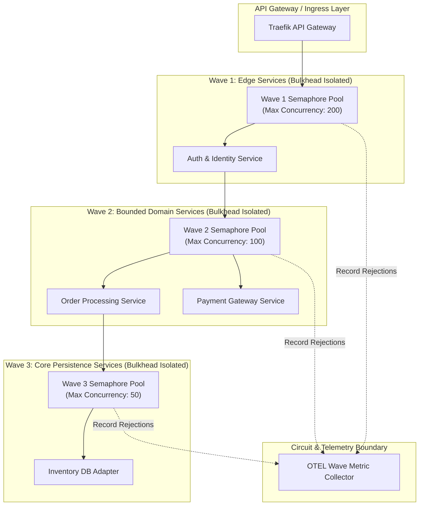
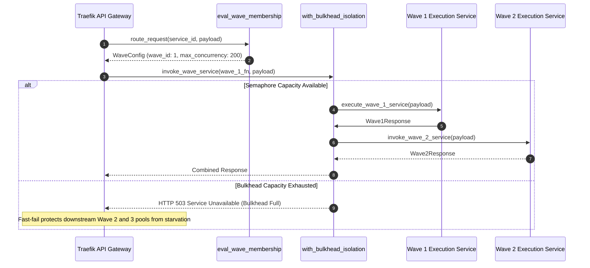

# Bulkhead-Isolated Waves Pattern (Pure Functional Paradigm)

| Field       | Value                                                             |
|-------------|-------------------------------------------------------------------|
| **ID**      | BULKHEAD-WAVES-004                                                |
| **Date**    | 2026-08-24                                                        |
| **Status**  | Reference / Runbook (Pure Functional Architecture)                |
| **Deciders**| Core Platform & Migration Engineering                             |
| **Scope**   | Cascading Failure Prevention & Phased Wave Grouping               |

---

## 1. Overview & Context

The **Bulkhead-Isolated Waves Pattern** partitions microservice migrations into isolated deployment waves (e.g., Wave 1: Edge Public Services, Wave 2: Domain Services, Wave 3: Core Persistence Services). By wrapping service execution pools in strict functional **Bulkheads** (concurrency limits, thread pool boundaries, isolated event loops), system failures in one wave are structurally prevented from cascading into downstream waves.

### Functional Architecture Principles
This runbook enforces a **100% Pure Functional Programming (FP)** approach:
- **No Class Instantiations**: Replaces OOP thread pool managers and bulkhead classes with pure closure functions (`create_bulkhead_pool`) and higher-order decorators.
- **Immutable Wave Membership Maps**: Wave groupings and service dependency boundaries are modeled as immutable tuple records (`WaveConfig`, `ServiceNode`).
- **Referentially Transparent Isolation Guards**: Wave execution limits are enforced via pure semaphore and pool wrappers mapping `(ServiceRequest, BulkheadState) -> BulkheadResult`.
- **Fault Boundary Containment**: Failures in Wave $N$ emit localized metrics and fail fast without consuming resources allocated to Wave $N+1$.

---

## 2. High-Level Design (HLD)



---

## 3. Low-Level Design (LLD)



---

## 4. Pure Functional Project Architecture

```
bulkhead-isolated-waves/
├── README.md
├── config/
│   └── wave_topologies.yaml        # Service wave groupings & bulkhead caps
├── src/
│   ├── wave_router/
│   │   ├── __init__.py
│   │   ├── evaluator.py            # Wave membership evaluation functions
│   │   └── router.py               # Functional wave router
│   ├── bulkheads/
│   │   ├── __init__.py
│   │   ├── concurrency_cell.py     # Pure semaphore closure factories
│   │   └── isolation_decorator.py  # Higher-order bulkhead decorators
│   ├── observability/
│   │   ├── __init__.py
│   │   └── wave_metrics.py         # Wave telemetry metrics collectors
│   └── schemas/
│       └── models.py               # Frozen dataclasses (WaveContext, BulkheadStatus)
└── tests/
    ├── test_wave_isolation.py
    └── test_bulkhead_edge_cases.py
```

---

## 5. End-to-End Function Call Stack

```tree
API Request Received
└── router.py: dispatch_wave_request(service_id, payload)
    ├── evaluator.py: eval_wave_membership(service_id, config)
    │   └── models.py: WaveConfig(wave_name, max_capacity, timeout_ms)
    │
    ├── bulkheads/isolation_decorator.py: with_bulkhead_isolation(service_fn, wave_cell)
    │   ├── concurrency_cell.py: acquire_bulkhead_slot(wave_cell)
    │   │   ├── [Capacity OK] execute_service_fn(payload)
    │   │   └── [Capacity Exceeded] emit_bulkhead_rejection(wave_name)
    │   │
    │   └── wave_metrics.py: record_wave_concurrency(wave_name, active_slots)
    │
    └── storage/dispatcher.py: execute_wave_downstream(payload)
```

---

## 6. Core Pure Functional Implementation

### 6.1 Immutable Models & Types (`src/schemas/models.py`)

```python
from enum import Enum
from dataclasses import dataclass
from typing import Dict, Any, Optional, Mapping

class WaveLevel(int, Enum):
    WAVE_1 = 1
    WAVE_2 = 2
    WAVE_3 = 3

@dataclass(frozen=True)
class WaveConfig:
    wave_level: WaveLevel
    service_id: str
    max_concurrency: int
    timeout_ms: float

@dataclass(frozen=True)
class BulkheadStatus:
    active_count: int
    max_capacity: int
    is_rejected: bool
    rejection_reason: Optional[str]
```

**Explanation**:
- Defines immutable enumeration `WaveLevel` representing deployment wave tiers.
- `WaveConfig` models service-to-wave associations along with max concurrency caps and timeout limits as frozen records.
- `BulkheadStatus` captures real-time capacity and rejection diagnostics for a bulkhead pool.

---

### 6.2 Pure Bulkhead Concurrency Pool Closure (`src/bulkheads/concurrency_cell.py`)

```python
import asyncio
from typing import Callable, Awaitable, Mapping, Any, Tuple

ServiceFn = Callable[[Mapping[str, Any]], Awaitable[Any]]

def create_bulkhead_pool(max_capacity: int) -> Tuple[Callable[[], bool], Callable[[], None], Callable[[], None]]:
    semaphore = asyncio.Semaphore(max_capacity)
    active_count = {"current": 0}

    def try_acquire() -> bool:
        if active_count["current"] >= max_capacity:
            return False
        active_count["current"] += 1
        return True

    def release() -> None:
        if active_count["current"] > 0:
            active_count["current"] -= 1

    def get_active() -> int:
        return active_count["current"]

    return try_acquire, release, get_active
```

**Explanation**:
- Constructs a pure functional bulkhead concurrency pool using an `asyncio.Semaphore` and a tracking dictionary cell (`active_count`).
- Returns tuple functions `(try_acquire, release, get_active)` to acquire and release pool capacity without instantiating class objects.

---

### 6.3 Higher-Order Bulkhead Isolation Decorator (`src/bulkheads/isolation_decorator.py`)

```python
from typing import Callable, Awaitable, Mapping, Any
from src.schemas.models import BulkheadStatus

def with_bulkhead_isolation(
    service_fn: ServiceFn,
    try_acquire_fn: Callable[[], bool],
    release_fn: Callable[[], None]
) -> ServiceFn:
    async def isolated_service(payload: Mapping[str, Any]) -> Any:
        if not try_acquire_fn():
            return {
                "status_code": 503,
                "error": "Bulkhead concurrency capacity exhausted",
                "wave_rejected": True
            }
        try:
            return await service_fn(payload)
        finally:
            release_fn()
    return isolated_service
```

**Explanation**:
- Implements a higher-order decorator wrapping service execution functions.
- Intercepts requests and attempts to acquire pool capacity using `try_acquire_fn()`.
- Returns an immediate HTTP 503 rejection if capacity is exhausted, protecting downstream execution pools from resource starvation.

---

## 7. Edge Case Catalog & Pure Functional Pseudocode (25 Edge Cases)

---

### Edge Case 1: Cascading Thread Pool Starvation Across Dependent Waves

```python
def create_isolated_wave_executor(wave_pools: Mapping[int, Callable]):
    async def execute_in_wave(wave_id: int, service_fn: ServiceFn, payload: Mapping[str, Any]) -> Any:
        pool = wave_pools.get(wave_id)
        if not pool:
            raise ValueError(f"Unconfigured wave pool: {wave_id}")
        return await pool(service_fn, payload)
    return execute_in_wave
```

**Explanation**:
- Maps execution calls to wave-specific pool functions (`wave_pools`).
- Enforces strict isolation boundaries between deployment waves, preventing Wave 1 failures from consuming Wave 2 thread capacity.

---

### Edge Case 2: Wave 1 Failure Cascading into Wave 2 Circuit Trips

```python
def with_wave_circuit_breaker(service_fn: ServiceFn, max_failures: int = 5) -> ServiceFn:
    state = {"failures": 0, "open": False}

    async def circuit_aware_invoke(payload: Mapping[str, Any]) -> Any:
        if state["open"]:
            return {"status_code": 503, "error": "Wave circuit open"}
        try:
            res = await service_fn(payload)
            state["failures"] = 0
            return res
        except Exception:
            state["failures"] += 1
            if state["failures"] >= max_failures:
                state["open"] = True
            raise

    return circuit_aware_invoke
```

**Explanation**:
- Maintains circuit failure state for individual wave services inside a closure (`state`).
- Opens the circuit locally when failure thresholds are exceeded, preventing failure propagation to upstream wave consumers.

---

### Edge Case 3: Shared Database Connection Pool Saturation Bypassing Bulkheads

```python
def create_wave_db_pool_allocator(total_connections: int, wave_allocations: Mapping[int, float]):
    allocations = {wave: int(total_connections * ratio) for wave, ratio in wave_allocations.items()}
    
    def get_wave_db_limit(wave_id: int) -> int:
        return allocations.get(wave_id, 5)

    return get_wave_db_limit
```

**Explanation**:
- Calculates and partitions database connection pool limits by wave ratio allocations.
- Prevents Wave 1 services from monopolizing shared database connection pools.

---

### Edge Case 4: Asynchronous Event Queue Flooding Across Waves

```python
def create_bounded_wave_queue(max_queue_depth: int = 500):
    queue = []

    def enqueue(event: Mapping[str, Any]) -> bool:
        if len(queue) >= max_queue_depth:
            return False
        queue.append(event)
        return True

    return enqueue
```

**Explanation**:
- Manages asynchronous event message queues bounded by `max_queue_depth`.
- Rejects new event messages when queue capacity is reached, preventing out-of-memory errors during wave spikes.

---

### Edge Case 5: Cross-Wave Circular Dependencies Violating Topological Limits

```python
def detect_cross_wave_cycle(wave_graph: Mapping[str, int], service_a: str, service_b: str) -> bool:
    wave_a = wave_graph.get(service_a, 0)
    wave_b = wave_graph.get(service_b, 0)
    return wave_a > wave_b
```

**Explanation**:
- Compares deployment wave levels of dependent services (`wave_a > wave_b`).
- Blocks invalid dependencies where lower-level wave services invoke higher-level wave services.

---

### Edge Case 6: Memory Allocation Spikes in Isolated Worker Pools

```python
import sys

def check_payload_memory_size(payload: Mapping[str, Any], max_bytes: int = 500_000) -> bool:
    estimated_size = sys.getsizeof(payload)
    return estimated_size <= max_bytes
```

**Explanation**:
- Evaluates estimated byte sizes of incoming payload objects using `sys.getsizeof`.
- Rejects oversized payload requests prior to bulkhead pool allocation.

---

### Edge Case 7: Sudden QPS Spikes Saturating Wave 3 While Wave 1 Is Idle

```python
def dynamic_rebalance_bulkhead(active_wave_1: int, active_wave_3: int, max_total: int) -> Tuple[int, int]:
    if active_wave_3 > max_total * 0.7 and active_wave_1 < max_total * 0.1:
        return int(max_total * 0.2), int(max_total * 0.8)
    return int(max_total * 0.5), int(max_total * 0.5)
```

**Explanation**:
- Computes dynamic concurrency capacity rebalancing ratios between active waves.
- Temporarily increases Wave 3 capacity during localized throughput spikes.

---

### Edge Case 8: Partial Wave Rollout Failure Requiring Wave Rollback

```python
def resolve_wave_rollback_target(wave_status: Mapping[int, str]) -> int:
    failed_waves = [wave for wave, status in wave_status.items() if status == "FAILED"]
    if failed_waves:
        return min(failed_waves)
    return 0
```

**Explanation**:
- Identifies the lowest failed wave tier from status maps.
- Triggers safe rollback procedures targeting the specific failed wave tier.

---

### Edge Case 9: Distributed Trace Context Loss Across Bulkhead Boundaries

```python
def inject_wave_bulkhead_trace(headers: Mapping[str, str], wave_id: int) -> Mapping[str, str]:
    new_headers = dict(headers)
    new_headers["x-wave-bulkhead-id"] = f"wave-{wave_id}"
    return new_headers
```

**Explanation**:
- Injects wave bulkhead identifiers into outgoing HTTP header dictionaries.
- Preserves distributed tracing visibility across bulkhead pool boundaries.

---

### Edge Case 10: Health Check False-Positives Causing Premature Wave Progression

```python
def verify_wave_health_threshold(health_checks: List[bool], min_pass_ratio: float = 0.95) -> bool:
    if not health_checks:
        return False
    pass_count = sum(1 for check in health_checks if check)
    return (pass_count / len(health_checks)) >= min_pass_ratio
```

**Explanation**:
- Evaluates the pass ratio of health check results against a high threshold (`95%`).
- Prevents premature wave progression when isolated health check instances fail intermittently.

---

### Edge Case 11: Priority Inversion in Shared Event Loops Across Tasks

```python
import asyncio

async def run_high_priority_wave_task(task_coro: Awaitable[Any]) -> Any:
    return await asyncio.shield(task_coro)
```

**Explanation**:
- Wraps high-priority Wave 1 task coroutines in `asyncio.shield`.
- Protects critical wave tasks from cancellation during shared event loop load shedding.

---

### Edge Case 12: Configuration Drift Between Wave Isolation Policies

```python
def assert_wave_policy_consistency(wave_1_cfg: WaveConfig, wave_2_cfg: WaveConfig) -> bool:
    return wave_1_cfg.max_concurrency >= wave_2_cfg.max_concurrency
```

**Explanation**:
- Asserts that upstream Wave 1 bulkhead capacities are greater than or equal to downstream Wave 2 capacities.
- Prevents configuration drift where downstream bulkheads choke upstream traffic flow.

---

### Edge Case 13: Timeout Cascading Through Multi-Wave Call Chains

```python
def calculate_budgeted_wave_timeout(total_budget_ms: float, current_wave: int, total_waves: int) -> float:
    remaining_waves = (total_waves - current_wave) + 1
    return total_budget_ms / remaining_waves
```

**Explanation**:
- Divides remaining end-to-end execution time budgets equally among remaining wave tiers.
- Prevents upstream wave processing delays from consuming total client timeout budgets.

---

### Edge Case 14: Bulkhead Queue Full Fast-Rejection (HTTP 503)

```python
def build_bulkhead_rejection_response(wave_id: int) -> Mapping[str, Any]:
    return {
        "status_code": 503,
        "body": {
            "error": "Bulkhead capacity exhausted",
            "wave": wave_id,
            "retry_after_ms": 500
        }
    }
```

**Explanation**:
- Constructs standardized HTTP 503 error response payloads containing `Retry-After` headers.
- Emits fast rejections when wave bulkheads reach maximum queue capacity.

---

### Edge Case 15: Multi-Tenant Quota Exhaustion in Isolated Wave Pools

```python
def check_tenant_wave_quota(tenant_id: str, tenant_counts: Mapping[str, int], max_per_tenant: int = 20) -> bool:
    return tenant_counts.get(tenant_id, 0) < max_per_tenant
```

**Explanation**:
- Checks active tenant request counts against per-tenant concurrency caps inside wave pools.
- Prevents single high-volume tenants from exhausting shared wave bulkhead pools.

---

### Edge Case 16: Dynamic Re-Assignment of Services to Waves

```python
def reassign_service_wave(wave_map: Dict[str, int], service_id: str, new_wave: int) -> Dict[str, int]:
    updated = dict(wave_map)
    updated[service_id] = new_wave
    return updated
```

**Explanation**:
- Returns updated dictionary maps reassigning services to new deployment wave tiers.
- Enables zero-downtime wave topology adjustments.

---

### Edge Case 17: CPU Throttling on Containerized Wave Processes

```python
import os

def detect_cpu_throttling_risk(load_avg: float, cpus: int = 4) -> bool:
    return load_avg > (cpus * 0.8)
```

**Explanation**:
- Compares system load averages against available CPU core counts.
- Flags CPU throttling risks to shed wave load prior to container eviction.

---

### Edge Case 18: Out-of-Order Wave Deployment Execution

```python
def validate_wave_deployment_sequence(completed_waves: List[int], target_wave: int) -> bool:
    required_wave = target_wave - 1
    return required_wave in completed_waves or target_wave == 1
```

**Explanation**:
- Validates that preceding wave tiers (`target_wave - 1`) are fully completed before executing new wave deployments.
- Prevents out-of-order wave rollouts.

---

### Edge Case 19: Shared Cache Contamination Across Bulkheads

```python
def build_wave_isolated_cache_key(wave_id: int, key: str) -> str:
    return f"wave_{wave_id}:{key}"
```

**Explanation**:
- Prefixes cache keys with wave tier identifiers (`wave_{wave_id}`).
- Isolates cached data representations across different wave deployment phases.

---

### Edge Case 20: Telemetry Metric Aggregation Across Wave Bulkheads

```python
def aggregate_wave_metrics(wave_metrics: List[Mapping[str, Any]]) -> Mapping[str, float]:
    total_rejections = sum(m.get("rejections", 0) for m in wave_metrics)
    total_requests = sum(m.get("requests", 0) for m in wave_metrics)
    rate = (total_rejections / total_requests) if total_requests > 0 else 0.0
    return {"rejection_rate": rate}
```

**Explanation**:
- Aggregates request and rejection totals across wave metric dictionaries.
- Computes overall wave rejection rates for central observability dashboards.

---

### Edge Case 21: Network Partition Isolating Wave 1 from Wave 2

```python
async def execute_wave_with_network_fallback(
    primary_fn: ServiceFn,
    fallback_fn: ServiceFn,
    payload: Mapping[str, Any]
) -> Any:
    try:
        return await primary_fn(payload)
    except OSError:
        return await fallback_fn(payload)
```

**Explanation**:
- Catches network socket exceptions (`OSError`) during cross-wave invocations.
- Fallbacks to local degraded service handlers during network partitions.

---

### Edge Case 22: Security Token Expiration During Cross-Wave Calls

```python
def refresh_wave_token_if_expired(token_info: Mapping[str, Any], refresh_fn: Callable[[], str]) -> str:
    if token_info.get("is_expired"):
        return refresh_fn()
    return token_info.get("token", "")
```

**Explanation**:
- Checks token expiration flags before executing cross-wave requests.
- Invokes token refresh functions automatically to prevent authentication failures across wave boundaries.

---

### Edge Case 23: Distributed Lock Deadlock Between Wave Workers

```python
def build_lock_with_ttl(lock_name: str, ttl_seconds: float = 10.0) -> Mapping[str, Any]:
    return {"lock_name": lock_name, "ttl": ttl_seconds, "acquired_at": 0.0}
```

**Explanation**:
- Configures distributed locks with mandatory time-to-live (`ttl`) parameters.
- Ensures locks expire automatically if wave worker processes crash mid-transaction.

---

### Edge Case 24: Graceful Shutdown of Wave Bulkhead Pools

```python
async def drain_bulkhead_pool(active_getter: Callable[[], int], max_wait_seconds: float = 5.0) -> bool:
    start = 0.0
    while active_getter() > 0 and start < max_wait_seconds:
        await asyncio.sleep(0.1)
        start += 0.1
    return active_getter() == 0
```

**Explanation**:
- Polls active bulkhead request counts during component shutdown phases.
- Allows active requests to drain gracefully before terminating worker processes.

---

### Edge Case 25: Dynamic Capacity Resize of Wave Bulkheads Under Load

```python
def resize_bulkhead_capacity(current_capacity: int, cpu_usage: float) -> int:
    if cpu_usage < 0.5:
        return int(current_capacity * 1.2)
    elif cpu_usage > 0.85:
        return int(current_capacity * 0.8)
    return current_capacity
```

**Explanation**:
- Adjusts bulkhead concurrency capacities dynamically based on real-time CPU utilization metrics.
- Scales pool capacity up during low CPU usage and down during high CPU stress.

---

## 8. Operational & Parity Verification Checklist

1. **Zero Cascade Failure**: Verify via fault-injection that 100% failure of Wave 1 services causes 0 downtime or resource exhaustion in Wave 2 and Wave 3 pools.
2. **Bulkhead Rejection Monitoring**: Rejection rates ($503\text{ status codes}$) must be tracked per wave tier with alerts set at $>1\%$ rejection threshold.
3. **Queue Depth Bounds**: Confirm all inter-wave queues enforce strict memory upper bounds.
4. **Graceful Drain Verification**: Validate that wave pools drain all in-flight requests within $<5000\text{ms}$ during SIGTERM shutdown signals.
