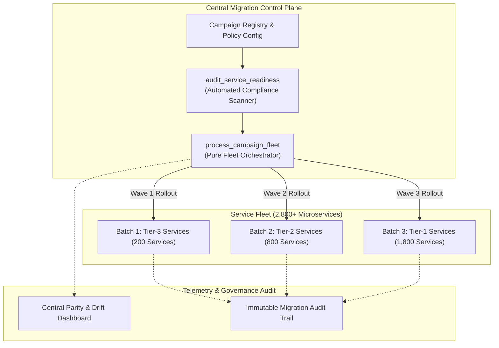
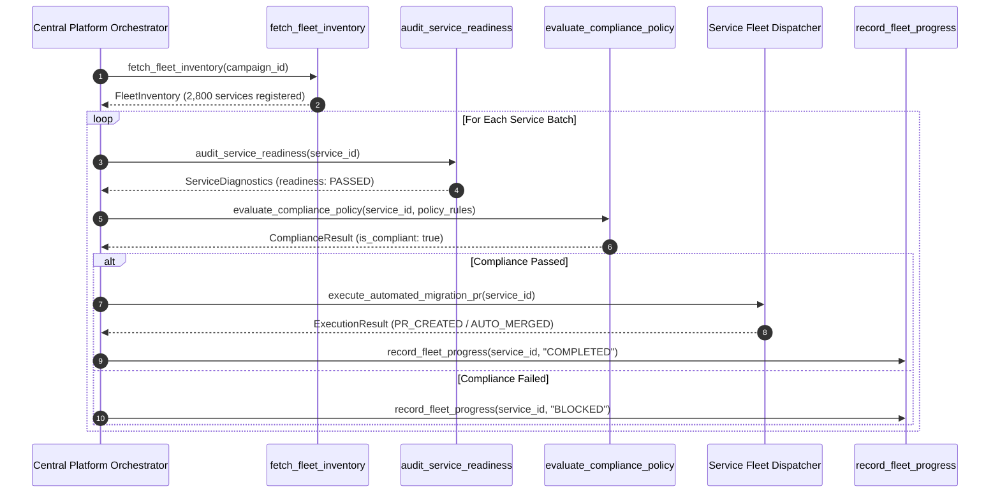

# Central Migration Team Model Pattern (Pure Functional Paradigm)

| Field       | Value                                                             |
|-------------|-------------------------------------------------------------------|
| **ID**      | CENTRAL-MIGRATION-TEAM-006                                        |
| **Date**    | 2026-08-24                                                        |
| **Status**  | Reference / Runbook (Pure Functional Architecture)                |
| **Deciders**| Core Platform & Migration Engineering                             |
| **Scope**   | Fleet-Wide Governance, Automation & 2,800-Service Orchestration   |

---

## 1. Overview & Context

The **Central Migration Team Model** provides operational governance, platform engineering tooling, automated gating, and campaign execution management for large-scale microservice transformations (validated at **2,800+ service scale**). Instead of forcing individual feature engineering teams to hand-craft migration scripts, a dedicated central platform team builds reusable functional automation primitives, enforces compliance policies, and drives fleet-wide migration campaigns.

### Functional Architecture Principles
This runbook enforces a **100% Pure Functional Programming (FP)** approach:
- **No Class Instantiations**: Replaces OOP campaign orchestrators and governance scanners with pure audit functions (`audit_service_readiness`, `evaluate_compliance_policy`) operating on immutable records.
- **Immutable Fleet State & Campaign Specs**: Fleet inventory data and campaign rules are modeled as frozen dataclass records (`FleetInventory`, `CampaignRule`).
- **Referentially Transparent Rule Engine**: Compliance evaluations map `(ServiceState, PolicyConfig) -> ComplianceResult` without mutating service state.
- **Fleet-Wide Kill-Switch Primitives**: Emergency halts are triggered via atomic state cell pointer updates.

---

## 2. High-Level Design (HLD)



---

## 3. Low-Level Design (LLD)



---

## 4. Pure Functional Project Architecture

```
central-migration-team-model/
├── README.md
├── config/
│   └── fleet_policies.yaml         # Central migration governance rules & thresholds
├── src/
│   ├── control_plane/
│   │   ├── __init__.py
│   │   ├── orchestrator.py         # Pure campaign execution functions
│   │   └── inventory.py            # Fleet inventory query dispatchers
│   ├── governance/
│   │   ├── __init__.py
│   │   ├── scanner.py              # Service readiness audit functions
│   │   └── policy_engine.py        # Referentially transparent rule evaluator
│   ├── automation/
│   │   ├── __init__.py
│   │   └── pr_generator.py         # Functional pull request automation
│   └── schemas/
│       └── models.py               # Frozen dataclasses (FleetService, CampaignStatus)
└── tests/
    ├── test_fleet_orchestration.py
    └── test_central_edge_cases.py
```

---

## 5. End-to-End Function Call Stack

```tree
Central Campaign Initiated
└── orchestrator.py: run_migration_campaign(campaign_id, config)
    ├── inventory.py: fetch_fleet_inventory(campaign_id)
    │   └── models.py: FleetInventory(services_count: 2800, batches: 14)
    │
    ├── scanner.py: audit_service_readiness(service_id)
    │   └── models.py: ReadinessReport(has_otel_spans, has_circuit_breaker, is_ready)
    │
    ├── policy_engine.py: evaluate_compliance_policy(service_id, rules)
    │   └── models.py: PolicyEvaluation(is_compliant, failing_rules)
    │
    ├── pr_generator.py: trigger_automated_refactor(service_id)
    │   └── git_dispatcher.py: create_migration_pull_request(repo_url, patch_data)
    │
    └── dashboard/progress.py: record_fleet_progress(campaign_id, progress_snapshot)
```

---

## 6. Core Pure Functional Implementation

### 6.1 Immutable Fleet & Campaign Models (`src/schemas/models.py`)

```python
from enum import Enum
from dataclasses import dataclass
from typing import Dict, Any, Optional, Mapping, FrozenSet

class ServiceTier(str, Enum):
    TIER_1_CRITICAL = "tier_1"
    TIER_2_STANDARD = "tier_2"
    TIER_3_NON_CRITICAL = "tier_3"

@dataclass(frozen=True)
class FleetService:
    service_id: str
    owner_team: str
    tier: ServiceTier
    repo_url: str
    current_version: str

@dataclass(frozen=True)
class ReadinessReport:
    service_id: str
    has_tracing: bool
    has_circuit_breaker: bool
    has_health_check: bool
    is_eligible: bool

@dataclass(frozen=True)
class CampaignProgress:
    campaign_id: str
    total_services: int
    completed_count: int
    blocked_count: int
```

**Explanation**:
- Defines immutable enumeration `ServiceTier` categorizing fleet criticality tiers.
- `FleetService` captures microservice metadata as a frozen dataclass record.
- `ReadinessReport` packages automated diagnostic scanner results.
- `CampaignProgress` records progress counts across 2,800+ fleet services.

---

### 6.2 Pure Governance Policy Engine (`src/governance/policy_engine.py`)

```python
from typing import Mapping, Any, List
from src.schemas.models import ReadinessReport, PolicyEvaluation

def evaluate_compliance_policy(report: ReadinessReport, policy_rules: Mapping[str, Any]) -> Mapping[str, Any]:
    failing_rules = []
    
    if policy_rules.get("require_tracing") and not report.has_tracing:
        failing_rules.append("MISSING_OPENTELEMETRY_TRACING")

    if policy_rules.get("require_circuit_breaker") and not report.has_circuit_breaker:
        failing_rules.append("MISSING_CIRCUIT_BREAKER")

    if policy_rules.get("require_health_check") and not report.has_health_check:
        failing_rules.append("MISSING_HEALTH_CHECK")

    return {
        "service_id": report.service_id,
        "is_compliant": len(failing_rules) == 0,
        "failing_rules": failing_rules
    }
```

**Explanation**:
- Referentially transparent rule function checking readiness reports against organizational governance policies (`policy_rules`).
- Returns structured compliance reports listing specific failing rules without mutating global state.

---

### 6.3 Pure Fleet Orchestrator & Batch Processor (`src/control_plane/orchestrator.py`)

```python
from typing import List, Callable, Awaitable, Mapping, Any
from src.schemas.models import FleetService

async def process_fleet_batch(
    services: List[FleetService],
    audit_fn: Callable[[str], Awaitable[Any]],
    migrate_fn: Callable[[FleetService], Awaitable[bool]]
) -> Mapping[str, List[str]]:
    completed = []
    blocked = []

    for service in services:
        diagnostics = await audit_fn(service.service_id)
        if diagnostics.get("is_compliant"):
            success = await migrate_fn(service)
            if success:
                completed.append(service.service_id)
            else:
                blocked.append(service.service_id)
        else:
            blocked.append(service.service_id)

    return {"completed": completed, "blocked": blocked}
```

**Explanation**:
- Iterates over batches of fleet microservices, executing audit and migration closures (`audit_fn`, `migrate_fn`).
- Categorizes services into `completed` and `blocked` result buckets.

---

## 7. Edge Case Catalog & Pure Functional Pseudocode (25 Edge Cases)

---

### Edge Case 1: Unresponsive Service Owners & Abandoned Metadata

```python
def resolve_abandoned_service_owner(service_id: str, team_directory: Mapping[str, Any]) -> str:
    owner = team_directory.get(service_id, {}).get("owner_email")
    if not owner:
        return "unowned_services_escalation@platform.internal"
    return owner
```

**Explanation**:
- Checks organizational directories for active team contact emails.
- Routes unowned service notifications to a fallback platform escalation list.

---

### Edge Case 2: Unregistered Shadow Microservices Missing from Fleet Inventory

```python
def discover_shadow_services(traffic_logs: List[Mapping[str, str]], registered_ids: set) -> set:
    observed_services = {log.get("target_service") for log in traffic_logs if log.get("target_service")}
    return observed_services - registered_ids
```

**Explanation**:
- Analyzes API gateway traffic logs to discover unregistered microservices (`observed_services - registered_ids`).
- Flag shadow microservices for inventory registration prior to campaign execution.

---

### Edge Case 3: False-Positive Compliance Scanner Failures Blocking Waves

```python
def apply_temporary_compliance_override(
    service_id: str,
    override_list: Mapping[str, str]
) -> bool:
    return service_id in override_list
```

**Explanation**:
- Checks compliance override maps (`override_list`) to bypass false-positive scanner blocks.
- Unblocks campaign progression for audited edge-case services.

---

### Edge Case 4: Concurrent Campaign Conflicts on Shared Dependencies

```python
def assert_no_campaign_conflict(
    service_id: str,
    active_campaigns: Mapping[str, str]
) -> bool:
    return service_id not in active_campaigns
```

**Explanation**:
- Verifies that target services are not participating in active migration campaigns.
- Prevents conflicting automated pull requests from multiple central campaigns.

---

### Edge Case 5: Automated Canary Rollback Failure Override

```python
def create_kill_switch_cell():
    cell = {"active": False}
    def trigger():
        cell["active"] = True
    def is_triggered() -> bool:
        return cell["active"]
    return trigger, is_triggered
```

**Explanation**:
- Provides an atomic closure cell pointer (`cell`) acting as a fleet-wide emergency stop.
- Halts all automated migration tasks immediately when triggered.

---

### Edge Case 6: Rate Limiting Third-Party CI/CD Triggers During Fleet Scans

```python
import asyncio

async def throttle_fleet_scans(services: List[str], scan_fn: Callable, delay_seconds: float = 0.1):
    results = []
    for service in services:
        res = await scan_fn(service)
        results.append(res)
        await asyncio.sleep(delay_seconds)
    return results
```

**Explanation**:
- Paces automated scan requests with explicit delay intervals (`asyncio.sleep`).
- Prevents rate-limiting failures on internal VCS platforms (GitHub/GitLab API limits).

---

### Edge Case 7: Governance Policy Drift Across Regional Control Planes

```python
def sync_regional_policy(global_policy: Mapping[str, Any], regional_policy: Mapping[str, Any]) -> Mapping[str, Any]:
    merged = dict(global_policy)
    merged.update(regional_policy)
    return merged
```

**Explanation**:
- Merges regional policy maps over global baseline governance policies.
- Ensures consistent baseline governance while accommodating regional compliance requirements.

---

### Edge Case 8: Telemetry Ingestion Pipeline Saturation During Fleet Checks

```python
def sample_fleet_telemetry_checks(services: List[str], sample_rate: float = 0.1) -> List[str]:
    sample_size = int(len(services) * sample_rate)
    return services[:sample_size]
```

**Explanation**:
- Subsamples target service lists during initial health checks.
- Prevents telemetry ingestion pipeline saturation during fleet-wide audits.

---

### Edge Case 9: Authentication Token Expiration in Long-Running Bots

```python
def refresh_bot_token_if_needed(current_token: str, is_expired: bool, refresh_fn: Callable[[], str]) -> str:
    if is_expired:
        return refresh_fn()
    return current_token
```

**Explanation**:
- Checks token expiration flags prior to executing automated git refactor tasks.
- Invokes token refresh functions automatically during long-running migration campaigns.

---

### Edge Case 10: Custom Service Refactoring Scripts Violating Standards

```python
def validate_refactor_patch_safety(patch_diff: str, forbidden_keywords: List[str]) -> bool:
    for kw in forbidden_keywords:
        if kw in patch_diff:
            return False
    return True
```

**Explanation**:
- Inspects automated patch diff text for forbidden or unsafe code patterns.
- Blocks execution of non-compliant migration scripts.

---

### Edge Case 11: Flaky Canary Metrics Triggering False Rollbacks

```python
def verify_canary_rollback_consensus(metric_samples: List[float], threshold: float = 0.05) -> bool:
    if not metric_samples:
        return False
    error_count = sum(1 for sample in metric_samples if sample > threshold)
    return (error_count / len(metric_samples)) > 0.5
```

**Explanation**:
- Requires majority consensus across multiple metric samples before triggering automated canary rollbacks.
- Mitigates false rollbacks caused by single-sample metric anomalies.

---

### Edge Case 12: Fleet-Wide Configuration Synchronization Latency

```python
def assert_config_propagation(target_hash: str, deployed_hashes: List[str]) -> bool:
    return all(h == target_hash for h in deployed_hashes)
```

**Explanation**:
- Compares deployed configuration hash strings across regional instances.
- Verifies full fleet configuration synchronization before advancing campaign phases.

---

### Edge Case 13: Partial Migration State Stuck in Approval Deadlock

```python
import time

def detect_approval_deadlock(submitted_at: float, max_wait_days: float = 7.0) -> bool:
    elapsed_days = (time.time() - submitted_at) / 86400.0
    return elapsed_days > max_wait_days
```

**Explanation**:
- Measures elapsed days for pending pull request approvals.
- Flags deadlocked pull requests for central team intervention when wait limits are exceeded.

---

### Edge Case 14: Multi-Team Ownership Conflict on Legacy Monoliths

```python
def resolve_multi_team_ownership(domain_path: str, ownership_map: Mapping[str, str]) -> str:
    for prefix, team in ownership_map.items():
        if domain_path.startswith(prefix):
            return team
    return "central_monolith_team"
```

**Explanation**:
- Maps domain code paths to specific owner teams using prefix matching (`ownership_map`).
- Assigns clear migration responsibility for shared monolith components.

---

### Edge Case 15: Compliance Policy Violations During Global Migrations

```python
def assert_data_residency_compliance(service_region: str, allowed_regions: List[str]) -> bool:
    return service_region in allowed_regions
```

**Explanation**:
- Asserts that target deployment regions match permitted data residency lists.
- Blocks unauthorized cross-border data migrations.

---

### Edge Case 16: Audit Log Storage Overflow During Fleet Scans

```python
def compact_audit_log_entry(service_id: str, status: str) -> Mapping[str, str]:
    return {"id": service_id, "st": status[0]}
```

**Explanation**:
- Compresses audit log record field keys and status codes.
- Reduces log storage footprint during 2,800-service fleet scans.

---

### Edge Case 17: Service Deprecation Mid-Campaign

```python
def filter_active_fleet_services(services: List[FleetService], deprecated_ids: set) -> List[FleetService]:
    return [s for s in services if s.service_id not in deprecated_ids]
```

**Explanation**:
- Filters out deprecated microservice IDs from active campaign target lists.
- Avoids executing migration tasks on decommissioned services.

---

### Edge Case 18: Control Plane Database Corruption During State Updates

```python
def create_state_backup_snapshot(state_data: Mapping[str, Any]) -> Mapping[str, Any]:
    return dict(state_data)
```

**Explanation**:
- Creates immutable snapshot copies of control plane state before executing batch updates.
- Enables state recovery in the event of database write failures.

---

### Edge Case 19: High-Centrality Microservice Dependency Blockers

```python
def identify_high_centrality_blockers(fleet_deps: Mapping[str, List[str]], threshold: int = 50) -> List[str]:
    counts = {}
    for service, deps in fleet_deps.items():
        for dep in deps:
            counts[dep] = counts.get(dep, 0) + 1
    return [dep for dep, count in counts.items() if count >= threshold]
```

**Explanation**:
- Counts downstream dependent microservices across the entire fleet.
- Highlights high-centrality services requiring prioritized central team support.

---

### Edge Case 20: Automated Fleet Kill-Switch Invocation

```python
def check_global_kill_switch(kill_switch_state: bool) -> None:
    if kill_switch_state:
        raise RuntimeError("GLOBAL MIGRATION KILL-SWITCH ACTIVATED")
```

**Explanation**:
- Evaluates the global kill-switch flag before executing any fleet modification step.
- Immediately halts campaign execution when the kill-switch is active.

---

### Edge Case 21: Authorization Token Scope Failures in Migration Bots

```python
def assert_bot_token_scopes(token_scopes: List[str], required_scope: str = "repo:write") -> bool:
    return required_scope in token_scopes
```

**Explanation**:
- Validates OAuth token scopes prior to initiating automated pull request creation.
- Prevents authorization failures mid-campaign.

---

### Edge Case 22: Telemetry Metric Definition Drift Between Teams

```python
def normalize_telemetry_metric_name(raw_metric: str) -> str:
    return raw_metric.lower().replace("-", "_").strip()
```

**Explanation**:
- Normalizes metric key strings across disparate service teams.
- Ensures uniform metric aggregation across the central control plane dashboard.

---

### Edge Case 23: Multi-Cloud Deployment Target Variance

```python
def resolve_cloud_deployment_adapter(cloud_provider: str, adapters: Mapping[str, Callable]) -> Callable:
    adapter = adapters.get(cloud_provider.lower())
    if not adapter:
        raise ValueError(f"Unsupported cloud provider: {cloud_provider}")
    return adapter
```

**Explanation**:
- Selects cloud-specific deployment dispatchers based on provider strings (`AWS`, `GCP`, `Azure`).
- Supports multi-cloud target environments within central campaign pipelines.

---

### Edge Case 24: Automated PR Generation Rate-Limit Handling

```python
async def safe_pr_creation(pr_fn: Callable[[], Awaitable[bool]], max_retries: int = 3) -> bool:
    for attempt in range(max_retries):
        try:
            return await pr_fn()
        except Exception:
            await asyncio.sleep(2.0 ** attempt)
    return False
```

**Explanation**:
- Wraps pull request creation calls with exponential backoff retries.
- Handles transient VCS rate-limit rejections gracefully.

---

### Edge Case 25: Real-Time Fleet Progress Dashboard Synchronization

```python
def calculate_fleet_progress_percentage(completed: int, total: int) -> float:
    if total == 0:
        return 100.0
    return round((completed / total) * 100.0, 2)
```

**Explanation**:
- Calculates completed percentage ratios rounded to two decimal places.
- Computes real-time progress metrics for central platform dashboards.

---

## 8. Operational & Parity Verification Checklist

1. **Fleet Inventory Completeness**: Audit gateway traffic logs to confirm $>99.9\%$ of active microservices are registered in the central inventory.
2. **Automated Scanner Precision**: Validate compliance scanner rules against manual audit samples to ensure zero false-positive blocks.
3. **Emergency Kill-Switch Verification**: Validate that triggering the global kill-switch halts all active migration bots within $<1000\text{ms}$.
4. **Pull Request Rate-Limit Protection**: Confirm automated PR generators operate within VCS API rate-limiting quotas.
