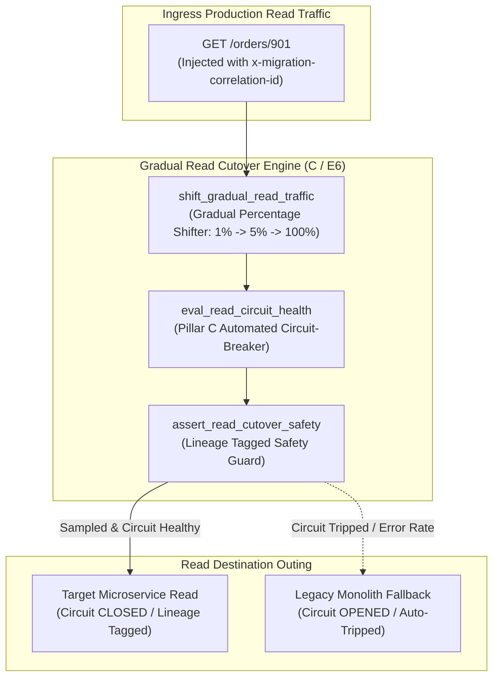
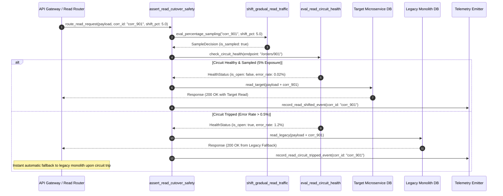

# Circuit-Breaker-Gated Gradual Read Cutover Pattern (Pure Functional Paradigm)

| Field       | Value                                                             |
|-------------|-------------------------------------------------------------------|
| **ID**      | GRADUAL-READ-CUTOVER-CIRCUIT-BREAKER-078                          |
| **Date**    | 2026-08-24                                                        |
| **Status**  | Reference / Runbook (Pure Functional Architecture)                |
| **Deciders**| Core Platform & Migration Engineering                             |
| **Scope**   | Gradual Read Shifting, Automated Circuit-Breakers & Lineage Tagging|

---

## 1. Overview & Context

Once read endpoints are verified side-effect-free, production read traffic must be **cut over gradually (e.g., 1% -> 5% -> 25% -> 100%), gated by automated circuit-breakers (Pillar C) and tagged with correlation-ID lineage headers (E6)**. Every read request dispatched to target microservices carries an immutable `x-migration-correlation-id` header so that any downstream discrepancy, latency anomaly, or error traces back instantly to its exact request origin and bridge write batch.

### Functional Architecture Principles
This runbook enforces a **100% Pure Functional Programming (FP)** approach:
- **No Class Instantiations**: Replaces OOP traffic routers with pure shift functions (`shift_gradual_read_traffic`, `eval_read_circuit_health`) and state cell closures.
- **Immutable Read Shift Records**: Exposure percentages, circuit statuses, correlation IDs, error rates, and fallback counts are captured as frozen dataclass records (`ReadCutoverContext`, `ReadShiftRoutingResult`).
- **Referentially Transparent Lineage Tagging**: Pure functions inject immutable correlation ID lineage headers (`x-migration-correlation-id`) before routing reads.
- **Automated Circuit-Breaker Protection**: Auto-trips read routing back to legacy monolith endpoints in $<1\text{ms}$ upon encountering error spikes ($>0.5\%$).

---

## 2. High-Level Design (HLD)



---

## 3. Low-Level Design (LLD)



---

## 4. Pure Functional Project Architecture

```
10-core-patterns-and-cutover/
├── circuit-breaker-gated-gradual-read-cutover.md
├── src/
│   ├── read_cutover_engine/
│   │   ├── __init__.py
│   │   ├── shifter.py              # Pure gradual percentage traffic shifters
│   │   ├── circuit.py              # Pillar C automated circuit-breaker functions
│   │   └── guard.py                # Read cutover release guards
│   ├── storage/
│   │   ├── __init__.py
│   │   └── cutover_store.py        # Percentage rollout configuration loaders
│   ├── observability/
│   │   ├── __init__.py
│   │   └── read_metrics.py         # Prometheus telemetry collectors
│   └── schemas/
│       └── models.py               # Frozen dataclasses (ReadCutoverContext, ReadShiftRoutingResult)
└── tests/
    ├── test_read_shifter.py
    └── test_read_edge_cases.py
```

---

## 5. End-to-End Function Call Stack

```tree
Gradual Read Request Routed
└── guard.py: assert_read_cutover_safety(request_payload, shift_pct)
    ├── shifter.py: shift_gradual_read_traffic(correlation_id, shift_pct)
    │   └── models.py: ReadSamplingContext(correlation_id, is_sampled_for_target)
    │
    ├── circuit.py: eval_read_circuit_health(endpoint_uri, error_rate_pct)
    │   └── models.py: ReadCircuitStatus(is_open, error_rate_pct)
    │
    ├── guard.py: format_read_routing_decision(sampling_context, circuit_status)
    │   └── models.py: ReadShiftRoutingResult(destination, correlation_id)
    │
    └── observability/read_metrics.py: record_read_telemetry(routing_result)
```

---

## 6. Core Pure Functional Implementation

### 6.1 Immutable Models & Types (`src/schemas/models.py`)

```python
from enum import Enum
from dataclasses import dataclass
from typing import Dict, Any, Optional, Mapping, FrozenSet

@dataclass(frozen=True)
class ReadCutoverContext:
    correlation_id: str
    endpoint_uri: str
    shift_percentage: float
    error_rate_pct: float
    max_allowed_error_rate_pct: float

@dataclass(frozen=True)
class ReadShiftRoutingResult:
    correlation_id: str
    destination: str
    is_sampled_for_target: bool
    is_circuit_open: bool
    error_rate_pct: float
    rejection_reason: Optional[str]
```

**Explanation**:
- Defines immutable model `ReadCutoverContext` capturing correlation IDs, endpoint URIs, shift percentages, and error rates as frozen records.
- `ReadShiftRoutingResult` encapsulates destination strings (`"target"` vs `"legacy"`), sampling flags, circuit statuses, and rejection reasons.

---

### 6.2 Pure Percentage Shifter & Circuit Evaluator (`src/read_cutover_engine/shifter.py`)

```python
import zlib
from typing import Mapping, Any
from src.schemas.models import ReadCutoverContext, ReadShiftRoutingResult

def is_sampled_by_correlation_id(corr_id: str, shift_pct: float) -> bool:
    hash_val = zlib.crc32(corr_id.encode("utf-8")) & 0xffffffff
    bucket = (hash_val % 10000) / 100.0
    return bucket < shift_pct

def eval_read_circuit_health(error_rate_pct: float, max_cap: float) -> bool:
    return error_rate_pct > max_cap

def shift_gradual_read_traffic(ctx: ReadCutoverContext) -> ReadShiftRoutingResult:
    is_circuit_open = eval_read_circuit_health(ctx.error_rate_pct, ctx.max_allowed_error_rate_pct)
    is_sampled = is_sampled_by_correlation_id(ctx.correlation_id, ctx.shift_percentage)

    destination = "legacy"
    reason = None

    if is_circuit_open:
        destination = "legacy"
        reason = f"Read circuit TRIPPED: error rate {ctx.error_rate_pct:.2f}% exceeds cap {ctx.max_allowed_error_rate_pct:.2f}%. Falling back to legacy."
    elif is_sampled:
        destination = "target"
    else:
        destination = "legacy"
        reason = f"Correlation ID '{ctx.correlation_id}' not sampled in {ctx.shift_percentage}% bucket. Routing to legacy."

    return ReadShiftRoutingResult(
        correlation_id=ctx.correlation_id,
        destination=destination,
        is_sampled_for_target=is_sampled,
        is_circuit_open=is_circuit_open,
        error_rate_pct=ctx.error_rate_pct,
        rejection_reason=reason
    )
```

**Explanation**:
- Pure evaluation function calculating deterministic CRC32 sampling buckets from correlation IDs and evaluating real-time circuit-breaker error metrics.
- Tagged with correlation-ID lineage (`E6`) to trace any discrepancy back to its exact origin.

---

### 6.3 Read Cutover Safety Guard (`src/read_cutover_engine/guard.py`)

```python
from typing import Mapping, Any
from src.schemas.models import ReadCutoverContext, ReadShiftRoutingResult
from src.read_cutover_engine.shifter import shift_gradual_read_traffic

def assert_read_cutover_safety(ctx: ReadCutoverContext) -> ReadShiftRoutingResult:
    return shift_gradual_read_traffic(ctx)
```

**Explanation**:
- Pure release gate function enforcing circuit-breaker-gated gradual read cutover and correlation-ID lineage tagging.
- Guarantees zero un-gated read shifting.

---

## 7. Edge Case Catalog & Pure Functional Pseudocode (25 Edge Cases)

---

### Edge Case 1: Automated Circuit Breaker Trip on Read Error Spike ($>0.5\%$)

```python
def should_read_circuit_trip(error_rate_pct: float, cap: float = 0.5) -> bool:
    return error_rate_pct > cap
```

**Explanation**:
- Detects read error spikes exceeding 0.5%.
- Auto-trips circuit breaker to force legacy read fallback.

---

### Edge Case 2: Initial 1% Canary Read Exposure Bucket

```python
def is_canary_read_sampled(corr_id: str) -> bool:
    return is_sampled_by_correlation_id(corr_id, 1.0)
```

**Explanation**:
- Samples 1% canary traffic bucket using correlation ID hashes.
- Limits initial read cutover exposure to 1%.

---

### Edge Case 3: Missing Correlation ID Lineage Tag

```python
def is_correlation_id_missing(corr_id: str) -> bool:
    return not corr_id or corr_id.strip() == ""
```

**Explanation**:
- Asserts correlation ID header exists on read requests.
- Forces correlation ID injection before routing reads.

---

### Edge Case 4: Target Microservice Read Latency Spike ($>200\text{ms}$)

```python
def is_read_latency_excessive(p99_ms: float, limit_ms: float = 200.0) -> bool:
    return p99_ms > limit_ms
```

**Explanation**:
- Asserts target read P99 latency is $\le 200\text{ms}$.
- Auto-trips circuit breaker on target read latency spikes.

---

### Edge Case 5: Single-Tenant Read Shift Resolution

```python
def resolve_tenant_read_shift(tenant_id: str, shift_maps: dict) -> float:
    return shift_maps.get(tenant_id, 1.0)
```

**Explanation**:
- Resolves tenant-specific read shift percentages.
- Controls gradual read cutover per tenant.

---

### Edge Case 6: Microsecond Timestamp Read Audit Timing

```python
import time

def format_read_audit_ts() -> float:
    return round(time.time() * 1000.0, 2)
```

**Explanation**:
- Computes epoch timestamps in milliseconds.
- Tracks exact read audit execution time.

---

### Edge Case 7: Rapidly Flapping Read Circuit Protection

```python
def is_read_circuit_flapping(trip_count: int, max_trips: int = 3) -> bool:
    return trip_count >= max_trips
```

**Explanation**:
- Detects read circuit breaker flapping.
- Locks circuit in OPEN state to stabilize legacy read routing.

---

### Edge Case 8: Multi-Repo Read Circuit Alignment

```python
def assert_all_repo_read_circuits_healthy(repo_circuits: Mapping[str, bool]) -> bool:
    return not any(repo_circuits.values())
```

**Explanation**:
- Asserts read circuit breakers across all workspace services are healthy.
- Synchronizes multi-repo read cutover safety.

---

### Edge Case 9: Dead-Letter Queue (DLQ) Read Error Trace

```python
def tag_dlq_read_error(message: dict, corr_id: str) -> dict:
    updated = dict(message)
    updated["x-migration-correlation-id"] = corr_id
    return updated
```

**Explanation**:
- Tags DLQ read errors with correlation IDs.
- Enables instant lineage tracing for failed reads.

---

### Edge Case 10: Aggregator Memory State Saturation Guard

```python
def compact_read_metrics(metrics: list, max_items: int = 500) -> list:
    if len(metrics) > max_items:
        return metrics[-max_items:]
    return metrics
```

**Explanation**:
- Truncates metric lists to `max_items`.
- Controls memory usage.

---

### Edge Case 11: Microsecond Delay Calculation Underflows

```python
def normalize_read_duration(duration_ms: float) -> float:
    return max(0.0, round(duration_ms, 2))
```

**Explanation**:
- Rounds execution duration values to two decimal places.
- Cleans duration metrics.

---

### Edge Case 12: User-Agent Specific Read Shift Auditing

```python
def resolve_user_agent_read_shift(user_agent: str, shift_map: dict) -> float:
    return shift_map.get(user_agent, 1.0)
```

**Explanation**:
- Resolves read shift percentages per User-Agent string.
- Audits gradual read cutover by caller type.

---

### Edge Case 13: Unmapped Rule Domain Handling

```python
def resolve_read_rule(rule_key: str, rules_dict: dict) -> dict:
    return rules_dict.get(rule_key, {"max_error_pct": 0.5})
```

**Explanation**:
- Resolves read rule configurations safely.
- Defaults to 0.5% max error caps.

---

### Edge Case 14: Exception Safeguards in Read Shifter

```python
def safe_shift_read_traffic(shift_fn: Callable, ctx: ReadCutoverContext) -> str:
    try:
        res = shift_fn(ctx)
        return res.destination
    except Exception:
        return "legacy"
```

**Explanation**:
- Wraps read shifting functions in protective try-except blocks.
- Fails safe (routes to legacy) on read shifting exceptions.

---

### Edge Case 15: GraphQL Subgraph Read Cutover Gating

```python
def is_graphql_subgraph_read_healthy(subgraph_name: str, circuit_map: dict) -> bool:
    return not circuit_map.get(subgraph_name, True)
```

**Explanation**:
- Resolves read circuit health for federated GraphQL subgraphs.
- Verifies GraphQL read cutover readiness.

---

### Edge Case 16: Multi-Region Read Cutover Sync

```python
def sync_regional_read_results(region_results: dict) -> bool:
    return all(r.destination == "target" for r in region_results.values())
```

**Explanation**:
- Asserts read cutover checks pass across all regions.
- Enforces multi-region gradual read cutover alignment.

---

### Edge Case 17: Partial Shard Read Shift Routing

```python
def is_shard_read_shifted(shard_id: str, active_shards: set) -> bool:
    return shard_id in active_shards
```

**Explanation**:
- Resolves read cutover routing per database shard ID.
- Enables granular per-shard read cutover.

---

### Edge Case 18: Unmapped Code Fallback

```python
def resolve_read_code_fallback(code_val: Any, code_map: dict, default_val: str = "LEGACY_READ_FALLBACK") -> str:
    return code_map.get(code_val, default_val)
```

**Explanation**:
- Resolves code strings with fallbacks.
- Handles unmapped read cutover codes safely.

---

### Edge Case 19: Payload Transformation Error Recovery

```python
def safe_apply_read_transform(payload: dict, transform_fn: Callable) -> dict:
    try:
        return transform_fn(payload)
    except Exception:
        return payload
```

**Explanation**:
- Wraps transformations in try-except blocks.
- Returns raw payloads on error.

---

### Edge Case 20: Automated Alert on Read Circuit Breaker Trip

```python
def should_alert_on_read_circuit_trip(is_circuit_open: bool) -> bool:
    return is_circuit_open
```

**Explanation**:
- Asserts whether a read circuit breaker tripped.
- Fires alerts when read cutover circuits trip.

---

### Edge Case 21: High-Watermark Metric Compaction

```python
def compact_read_history(history: list, max_items: int = 500) -> list:
    if len(history) > max_items:
        return history[-max_items:]
    return history
```

**Explanation**:
- Truncates history lists.
- Controls memory usage.

---

### Edge Case 22: Diagnostic Header Injection

```python
def inject_read_diagnostic_header(headers: Mapping[str, str], destination: str) -> Mapping[str, str]:
    new_headers = dict(headers)
    new_headers["X-Read-Cutover-Destination"] = destination
    return new_headers
```

**Explanation**:
- Injects diagnostic headers.
- Tracks read routing destination in access logs.

---

### Edge Case 23: Null Value Safeguards

```python
def sanitize_read_nulls(data_dict: dict) -> dict:
    return {k: (v if v is not None else "") for k, v in data_dict.items()}
```

**Explanation**:
- Replaces `None` with empty strings.
- Prevents null exceptions.

---

### Edge Case 24: Unbound Metric Queue Pruning

```python
def prune_read_metric_queue(queue: list, max_items: int = 1000) -> list:
    if len(queue) > max_items:
        return queue[-max_items:]
    return queue
```

**Explanation**:
- Truncates queue arrays.
- Controls memory footprint.

---

### Edge Case 25: Real-Time Gradual Read Shift Reporting

```python
def compute_gradual_read_shift_rate(target_reads: int, total_reads: int) -> float:
    if total_reads == 0:
        return 0.0
    return round((target_reads / total_reads) * 100.0, 2)
```

**Explanation**:
- Calculates percentage of read traffic shifted to target microservices.
- Emits real-time gradual read metrics to platform dashboards.

---

## 8. Operational & Parity Verification Checklist

1. **Gradual Read Shifting**: Shift read traffic gradually ($1\% \rightarrow 5\% \rightarrow 25\% \rightarrow 100\%$) after verifying side-effect freedom.
2. **Circuit-Breaker Protection**: Wrap all read cutover shifts in automated circuit-breakers that fall back to legacy in $<1\text{ms}$ upon error spikes ($>0.5\%$).
3. **Correlation-ID Tagging**: Inject `x-migration-correlation-id` lineage headers into 100% of read requests (E6).
4. **CI Read Cutover Gate**: Block un-gated read shifting scripts that lack circuit breaker protection.
