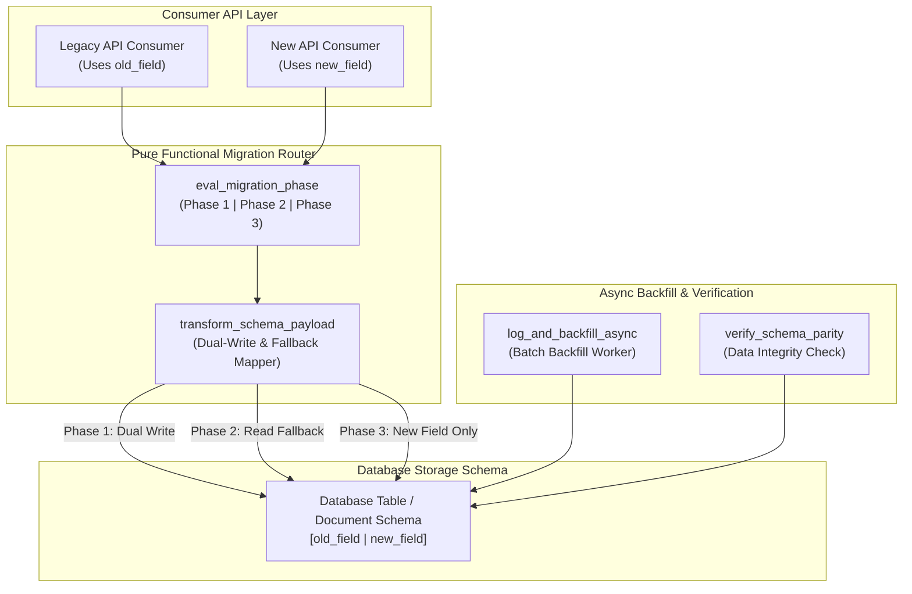
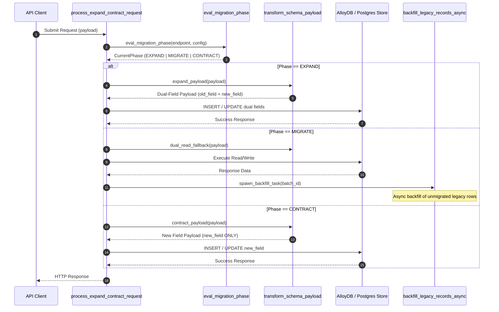

# Expand-Contract Migration Pattern (Pure Functional Paradigm)

| Field       | Value                                                             |
|-------------|-------------------------------------------------------------------|
| **ID**      | EXPAND-CONTRACT-003                                               |
| **Date**    | 2026-08-24                                                        |
| **Status**  | Reference / Runbook (Pure Functional Architecture)                |
| **Deciders**| Core Platform & Migration Engineering                             |
| **Scope**   | Zero-Downtime Schema & API Evolution (Parallel Change)            |

---

## 1. Overview & Context

The **Expand-Contract Pattern** (also known as Parallel Change) decouples software changes from database schema migrations or API updates. It eliminates downtime during breaking schema changes by decomposing the migration into three discrete, non-breaking phases:
1. **Expand**: Introduce the new database column/field alongside the legacy field. Support reading and writing both representations simultaneously.
2. **Migrate (Parallel Change)**: Backfill historical data from the old representation to the new representation while dual-writing incoming updates.
3. **Contract**: Deprecate and remove the old column/field once all clients are updated to read exclusively from the new representation.

### Functional Architecture Principles
This runbook enforces a **100% Pure Functional Programming (FP)** approach:
- **No Class Instantiations**: Replaces OOP database ORM models and transformers with pure schema translation functions (`expand_payload`, `contract_payload`) and functional dispatchers.
- **Immutable Migration State**: Migration phases (`Phase1_Expand`, `Phase2_Migrate`, `Phase3_Contract`) are modeled as immutable configuration snapshots.
- **Referentially Transparent Dual-Writers**: Dual-write operations execute via pure functional pipelines combining primary and secondary storage functions.
- **Contract Gating**: Pure assertion functions validate schema safety prior to contracting legacy fields.

---

## 2. High-Level Design (HLD)



---

## 3. Low-Level Design (LLD)



---

## 4. Pure Functional Project Architecture

```
expand-contract-migration/
├── README.md
├── config/
│   └── schema_phases.yaml          # Current phase per entity/table schema
├── src/
│   ├── phase_router/
│   │   ├── __init__.py
│   │   ├── evaluator.py            # Pure phase evaluator functions
│   │   └── router.py               # Functional request router
│   ├── mappers/
│   │   ├── __init__.py
│   │   ├── expand_mapper.py        # Phase 1: Expand transformer functions
│   │   └── contract_mapper.py      # Phase 3: Contract transformer functions
│   ├── storage/
│   │   ├── __init__.py
│   │   └── db_dispatcher.py        # Functional DB query dispatchers
│   ├── backfill/
│   │   ├── __init__.py
│   │   └── batch_worker.py         # Async backfill generator functions
│   └── schemas/
│       └── models.py               # Frozen dataclasses (PhaseContext, SchemaResult)
└── tests/
    ├── test_phase_transitions.py
    └── test_schema_edge_cases.py
```

---

## 5. End-to-End Function Call Stack

```tree
API Request Received
└── router.py: process_schema_request(request, entity_name)
    ├── evaluator.py: eval_migration_phase(entity_name, config)
    │   └── models.py: MigrationPhase(EXPAND | MIGRATE | CONTRACT)
    │
    ├── mappers/expand_mapper.py: transform_for_phase(payload, phase)
    │   ├── [Phase 1: EXPAND] expand_mapper.py: populate_both_fields(payload)
    │   ├── [Phase 2: MIGRATE] expand_mapper.py: read_with_new_fallback_to_old(data)
    │   └── [Phase 3: CONTRACT] contract_mapper.py: strip_legacy_fields(payload)
    │
    ├── storage/db_dispatcher.py: execute_db_operation(method, query, params)
    │   └── db_dispatcher.py: dispatch_pg_query(sql, params)
    │
    └── backfill/batch_worker.py: trigger_background_backfill(entity_name)
        └── batch_worker.py: backfill_batch_async(db_dispatch, batch_size=500)
```

---

## 6. Core Pure Functional Implementation

### 6.1 Immutable Models & Phases (`src/schemas/models.py`)

```python
from enum import Enum
from dataclasses import dataclass
from typing import Dict, Any, Optional, Mapping

class MigrationPhase(str, Enum):
    EXPAND = "expand"
    MIGRATE = "migrate"
    CONTRACT = "contract"

@dataclass(frozen=True)
class SchemaContext:
    entity_name: str
    tenant_id: str
    current_phase: MigrationPhase
    metadata: Mapping[str, Any]

@dataclass(frozen=True)
class EntityPayload:
    legacy_data: Mapping[str, Any]
    expanded_data: Mapping[str, Any]
    canonical_data: Mapping[str, Any]
```

**Explanation**:
- Defines immutable enumeration `MigrationPhase` representing the three non-breaking evolution states (`EXPAND`, `MIGRATE`, `CONTRACT`).
- `SchemaContext` encapsulates the active migration phase and entity metadata for a request.
- `EntityPayload` models data payloads across legacy, expanded, and canonical schema representations as frozen records.

---

### 6.2 Schema Transformers & Phase Evaluator (`src/mappers/expand_mapper.py`)

```python
from typing import Mapping, Any
from src.schemas.models import MigrationPhase

def populate_both_fields(payload: Mapping[str, Any], old_key: str, new_key: str) -> Mapping[str, Any]:
    new_payload = dict(payload)
    val = payload.get(old_key) or payload.get(new_key)
    new_payload[old_key] = val
    new_payload[new_key] = val
    return new_payload

def read_with_fallback(record: Mapping[str, Any], old_key: str, new_key: str) -> Any:
    if new_key in record and record[new_key] is not None:
        return record[new_key]
    return record.get(old_key)

def strip_legacy_fields(payload: Mapping[str, Any], old_key: str) -> Mapping[str, Any]:
    return {k: v for k, v in payload.items() if k != old_key}
```

**Explanation**:
- `populate_both_fields` enforces Phase 1 (Expand) dual-writing by ensuring both `old_key` and `new_key` are populated with identical values in outbound write operations.
- `read_with_fallback` implements Phase 2 (Migrate) read semantics: reads from `new_key` if present and non-null, falling back to `old_key` for unmigrated rows.
- `strip_legacy_fields` performs Phase 3 (Contract) cleaning by removing legacy fields from payloads prior to storage.

---

### 6.3 Functional Database Dispatcher (`src/storage/db_dispatcher.py`)

```python
from typing import Callable, Awaitable, Mapping, Any, List

DbDispatcher = Callable[[str, Mapping[str, Any]], Awaitable[List[Mapping[str, Any]]]]

def create_db_dispatcher(connection_string: str) -> DbDispatcher:
    async def dispatch(query: str, params: Mapping[str, Any]) -> List[Mapping[str, Any]]:
        return []
    return dispatch
```

**Explanation**:
- Defines a functional type `DbDispatcher` for executing SQL/NoSQL queries asynchronously without instantiation of heavy ORM repository classes.
- `create_db_dispatcher` is a closure factory creating database query functions bound to target database connection strings.

---

## 7. Edge Case Catalog & Pure Functional Pseudocode (25 Edge Cases)

---

### Edge Case 1: Backward-Incompatible Column Constraint Additions in Expand Phase

```python
def make_expand_column_nullable(column_definition: Mapping[str, Any]) -> Mapping[str, Any]:
    new_def = dict(column_definition)
    new_def["is_nullable"] = True
    new_def["default_value"] = None
    return new_def
```

**Explanation**:
- Modifies column definitions during Phase 1 (Expand) to ensure newly added columns are created as `NULLABLE`.
- Prevents database write failures for legacy clients that do not supply values for newly expanded fields.

---

### Edge Case 2: Legacy Client Reading Newly Expanded Null Fields

```python
def safe_legacy_read_fallback(record: Mapping[str, Any], old_key: str, default_val: Any) -> Any:
    val = record.get(old_key)
    if val is None:
        return default_val
    return val
```

**Explanation**:
- Wraps legacy field reads with explicit default value fallbacks.
- Protects legacy clients from raising null pointer exceptions when reading unpopulated legacy columns.

---

### Edge Case 3: Out-of-Order Field Updates in Dual-Write Phase

```python
def resolve_field_conflict_by_timestamp(
    old_val: Any,
    old_ts: float,
    new_val: Any,
    new_ts: float
) -> Any:
    if new_ts >= old_ts:
        return new_val
    return old_val
```

**Explanation**:
- Compares update timestamps when processing concurrent dual-writes.
- Ensures the latest field value wins, preventing out-of-order write overwrite conflicts.

---

### Edge Case 4: Database Trigger Deadlock During Shadow Synchronization

```python
def build_safe_sync_trigger_sql(table_name: str, old_col: str, new_col: str) -> str:
    return f"""
    CREATE OR REPLACE FUNCTION sync_{table_name}() RETURNS TRIGGER AS $$
    BEGIN
        IF (NEW.{old_col} IS DISTINCT FROM OLD.{old_col}) THEN
            NEW.{new_col} := NEW.{old_col};
        END IF;
        RETURN NEW;
    END;
    $$ LANGUAGE plpgsql;
    """
```

**Explanation**:
- Generates PL/pgSQL trigger code that inspects `IS DISTINCT FROM` conditions before synchronizing column values.
- Prevents recursive trigger loops and row-level database deadlocks during dual-write phases.

---

### Edge Case 5: Large Table Historical Backfill Without Locking Writers

```python
from typing import AsyncGenerator

async def generate_backfill_batches(
    min_id: int,
    max_id: int,
    batch_size: int = 1000
) -> AsyncGenerator[tuple, None]:
    current = min_id
    while current <= max_id:
        yield (current, current + batch_size - 1)
        current += batch_size
```

**Explanation**:
- Yields bounded primary key ID ranges (`AsyncGenerator[tuple, None]`) for batch migration workers.
- Avoids table-level lock contention by performing historical backfills in small, indexed primary key chunks.

---

### Edge Case 6: Premature Field Removal Breaking Lingering Legacy Clients

```python
def assert_phase3_contract_readiness(access_logs: List[Mapping[str, Any]], old_key: str) -> bool:
    legacy_reads = [log for log in access_logs if old_key in log.get("accessed_fields", [])]
    return len(legacy_reads) == 0
```

**Explanation**:
- Scans client access log metrics for reads targeting `old_key`.
- Blocks Phase 3 (Contract) execution if active client read traffic targeting legacy fields is detected.

---

### Edge Case 7: Type Coercion Errors (Legacy String vs New Integer/Enum)

```python
def coerce_string_to_int(val: Any, default_val: int = 0) -> int:
    try:
        return int(val)
    except (ValueError, TypeError):
        return default_val
```

**Explanation**:
- Safely coerces legacy string representation values into canonical integer/enum types.
- Provides fallback values when string data contains invalid formats during field migration.

---

### Edge Case 8: Index Contention on Dual-Written Database Columns

```python
def build_concurrent_index_sql(table_name: str, new_col: str) -> str:
    return f"CREATE INDEX CONCURRENTLY IF NOT EXISTS idx_{table_name}_{new_col} ON {table_name} ({new_col});"
```

**Explanation**:
- Generates SQL statements using `CREATE INDEX CONCURRENTLY`.
- Prevents table write lockouts when indexing new columns in high-throughput production databases.

---

### Edge Case 9: Soft Deletion State Inconsistency in Expand Phase

```python
def propagate_soft_delete(payload: Mapping[str, Any]) -> Mapping[str, Any]:
    new_payload = dict(payload)
    is_deleted = payload.get("is_deleted") or payload.get("deleted_at") is not None
    new_payload["is_deleted"] = is_deleted
    return new_payload
```

**Explanation**:
- Synchronizes boolean `is_deleted` flags and timestamped `deleted_at` fields across schema representations.
- Prevents soft-deleted records from appearing active in legacy or expanded views.

---

### Edge Case 10: Rollback Failure During Phase 2 Dual-Write Transition

```python
def build_rollback_dispatcher(primary_dispatcher: DbDispatcher, fallback_dispatcher: DbDispatcher):
    async def safe_rollback_dispatch(query: str, params: Mapping[str, Any]):
        try:
            return await primary_dispatcher(query, params)
        except Exception:
            return await fallback_dispatcher(query, params)
    return safe_rollback_dispatch
```

**Explanation**:
- Wraps database write dispatchers with emergency fallback dispatchers.
- Reverts database operations back to legacy schema structures if Phase 2 updates fail.

---

### Edge Case 11: Missing Microservice API Version Headers

```python
def resolve_api_version_phase(headers: Mapping[str, str], default_phase: MigrationPhase) -> MigrationPhase:
    version = headers.get("X-API-Version", "")
    if version == "v1":
        return MigrationPhase.EXPAND
    elif version == "v2":
        return MigrationPhase.CONTRACT
    return default_phase
```

**Explanation**:
- Inspects incoming `X-API-Version` HTTP headers to determine the appropriate migration phase schema layout.
- Defaults to `default_phase` when version headers are omitted by legacy API clients.

---

### Edge Case 12: Primary Key Hash Collisions During Parallel ID Migration

```python
import uuid

def generate_migrated_composite_id(legacy_id: Any, prefix: str = "migrated") -> str:
    return f"{prefix}_{legacy_id}_{uuid.uuid4().hex[:8]}"
```

**Explanation**:
- Combines legacy IDs with unique salt suffixes to form composite string primary keys.
- Prevents primary key collisions when inserting newly formatted entity rows during parallel change.

---

### Edge Case 13: Partial Batch Migration Failures in Async Workers

```python
async def execute_batch_with_skip(items: List[Any], migrate_fn: Callable[[Any], Awaitable[None]]) -> List[Any]:
    failed_items = []
    for item in items:
        try:
            await migrate_fn(item)
        except Exception:
            failed_items.append(item)
    return failed_items
```

**Explanation**:
- Processes batch migration elements individually within try-except blocks.
- Captures failed items for re-processing while allowing valid items in the batch to complete successfully.

---

### Edge Case 14: Cache Invalidation Race Conditions

```python
def build_cache_invalidation_keys(entity_id: str, old_key: str, new_key: str) -> List[str]:
    return [f"cache:{entity_id}:{old_key}", f"cache:{entity_id}:{new_key}"]
```

**Explanation**:
- Generates cache key arrays covering both legacy and new field representations.
- Invalidates both cache entries simultaneously during dual-write operations to prevent stale reads.

---

### Edge Case 15: Read Replica Replication Lag

```python
def should_force_primary_read(phase: MigrationPhase, is_write_recent: bool) -> bool:
    return phase == MigrationPhase.EXPAND and is_write_recent
```

**Explanation**:
- Forces reads to execute against the primary database node if write operations occurred recently during Phase 1.
- Bypasses read replica replication lag issues during dual-write verification.

---

### Edge Case 16: Nullable Constraint Violations During Phase 3 Contract Drop

```python
def validate_no_nulls_in_column(rows: List[Mapping[str, Any]], column_name: str) -> bool:
    return all(row.get(column_name) is not None for row in rows)
```

**Explanation**:
- Scans database table rows to verify zero null values exist in `column_name`.
- Prevents database DDL errors when applying `NOT NULL` constraints during Phase 3 (Contract).

---

### Edge Case 17: Schema Validation Latency Overhead in Dual-Parse Steps

```python
def fast_schema_check(payload: Mapping[str, Any], required_key: str) -> bool:
    return required_key in payload
```

**Explanation**:
- Performs lightweight key existence checks (`required_key in payload`) prior to invoking full schema validation parsers.
- Reduces CPU overhead on high-throughput payload processing paths.

---

### Edge Case 18: Audit Log Format Divergence

```python
def normalize_audit_log_entry(entity_id: str, action: str, old_val: Any, new_val: Any) -> Mapping[str, Any]:
    return {
        "entity_id": entity_id,
        "action": action,
        "previous_state": str(old_val),
        "current_state": str(new_val)
    }
```

**Explanation**:
- Formats change audit trail entries into unified canonical JSON schemas.
- Ensures audit log consumers read consistent field names regardless of which migration phase generated the log.

---

### Edge Case 19: Foreign Key Constraint Failures in Expanded Tables

```python
def build_deferrable_fk_sql(table_name: str, fk_col: str, ref_table: str) -> str:
    return f"""
    ALTER TABLE {table_name} 
    ADD CONSTRAINT fk_{fk_col} 
    FOREIGN KEY ({fk_col}) REFERENCES {ref_table}(id) 
    DEFERRABLE INITIALLY DEFERRED;
    """
```

**Explanation**:
- Generates foreign key constraint DDL configured with `DEFERRABLE INITIALLY DEFERRED`.
- Defers foreign key validation until transaction commit time, enabling out-of-order parent-child batch inserts.

---

### Edge Case 20: Zero-Downtime DDL Lock Timeout Enforcement

```python
def build_lock_timeout_ddl(timeout_ms: int = 2000) -> str:
    return f"SET lock_timeout = '{timeout_ms}ms';"
```

**Explanation**:
- Emits DDL statements prefixed with explicit `lock_timeout` session parameters.
- Aborts schema migration transactions immediately if database lock acquisition delays exceed safety thresholds.

---

### Edge Case 21: Serialization Format Mismatch (JSON String vs JSONB Object)

```python
import json

def normalize_json_field(val: Any) -> Mapping[str, Any]:
    if isinstance(val, str):
        try:
            return json.loads(val)
        except Exception:
            return {}
    elif isinstance(val, dict):
        return val
    return {}
```

**Explanation**:
- Converts raw stringified JSON payloads into dictionary objects.
- Normalizes data types when migrating legacy text columns to structured `JSONB` database columns.

---

### Edge Case 22: Multi-Region Phase Synchronization Flags

```python
def is_phase_active_in_region(region: str, region_phase_map: Mapping[str, MigrationPhase], target_phase: MigrationPhase) -> bool:
    return region_phase_map.get(region) == target_phase
```

**Explanation**:
- Checks region-specific migration phase maps (`region_phase_map`) prior to executing phase-specific code.
- Allows progressive region-by-region phase rollouts across multi-region deployments.

---

### Edge Case 23: Default Value Substitution for Missing Legacy Fields

```python
def apply_default_if_missing(payload: Mapping[str, Any], key: str, default_supplier: Callable[[], Any]) -> Mapping[str, Any]:
    if key not in payload or payload[key] is None:
        new_payload = dict(payload)
        new_payload[key] = default_supplier()
        return new_payload
    return payload
```

**Explanation**:
- Invokes default value generator functions (`default_supplier`) when incoming payloads omit required fields.
- Ensures expanded database columns are populated with valid default values.

---

### Edge Case 24: Data Parity Audit Sampler

```python
def audit_sample_parity(rows: List[Mapping[str, Any]], old_key: str, new_key: str) -> float:
    if not rows:
        return 100.0
    matches = sum(1 for r in rows if r.get(old_key) == r.get(new_key))
    return (matches / len(rows)) * 100.0
```

**Explanation**:
- Computes percentage parity metrics between `old_key` and `new_key` values across a sample of rows.
- Returns quantitative parity scores to verify data migration readiness before advancing to Phase 3.

---

### Edge Case 25: Emergency Contract Rollback via View Substitution

```python
def build_contract_rollback_view_sql(table_name: str, old_col: str, new_col: str) -> str:
    return f"CREATE OR REPLACE VIEW {table_name}_legacy_view AS SELECT *, {new_col} AS {old_col} FROM {table_name};"
```

**Explanation**:
- Generates SQL view definitions that alias new columns (`new_col AS old_col`).
- Provides emergency read compatibility for legacy applications if legacy columns are dropped prematurely.

---

## 8. Operational & Parity Verification Checklist

1. **Zero Parity Mismatches**: Parity audit metrics must achieve 100% agreement between old and new schema fields prior to contracting.
2. **Backfill Completion Verification**: Confirm that all historical records have non-null values in the newly expanded columns.
3. **Lock Timeout Protection**: All DDL schema changes must be executed with a strict `lock_timeout <= 2000ms` parameter.
4. **Client Metric Sign-Off**: Access logs must confirm zero read queries targeting dropped legacy fields for a minimum of 14 consecutive days.
