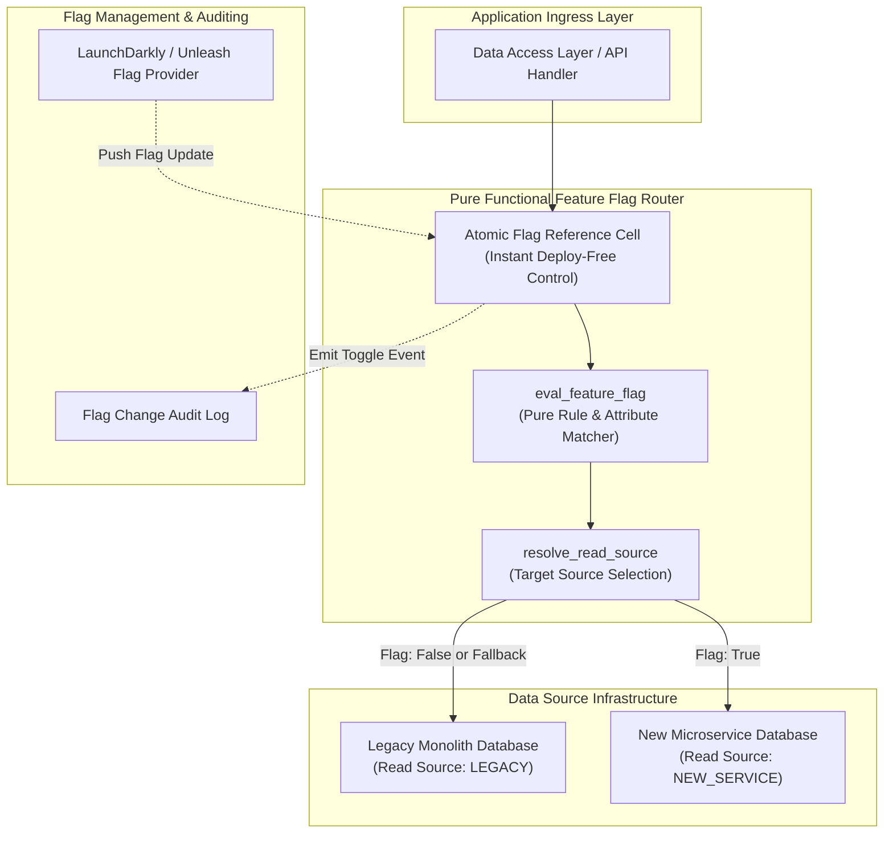
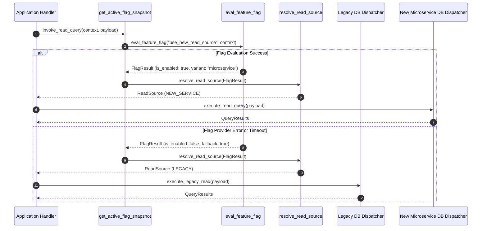

# Feature-Flag-Gated Read Source Selection Pattern (Pure Functional Paradigm)

| Field       | Value                                                             |
|-------------|-------------------------------------------------------------------|
| **ID**      | FEATURE-FLAG-READ-SELECTION-015                                   |
| **Date**    | 2026-08-24                                                        |
| **Status**  | Reference / Runbook (Pure Functional Architecture)                |
| **Deciders**| Core Platform & Migration Engineering                             |
| **Scope**   | Instant Deploy-Free Control & Dynamic Read/Write Source Selection |

---

## 1. Overview & Context

**Feature-Flag-Gated Read Source Selection** decouples software deployment from feature release by wrapping data access paths in dynamic feature flag checks. This pattern enables **instant, deploy-free control** over whether application read/write queries target the legacy monolith or the new microservice. If an issue is detected during migration, operators can immediately revert traffic back to the legacy system via a feature flag toggle without initiating a code deployment or pipeline rollback.

### Functional Architecture Principles
This runbook enforces a **100% Pure Functional Programming (FP)** approach:
- **No Class Instantiations**: Replaces OOP feature flag clients with pure evaluation functions (`eval_feature_flag`, `resolve_read_source`) and atomic snapshot reference cells.
- **Immutable Flag Context**: User attributes, tenant identifiers, and flag rules are modeled as frozen dataclass records (`FlagContext`, `ReadSourceDecision`).
- **Referentially Transparent Rule Evaluation**: Pure functions map `(FlagContext, FlagRules) -> ReadSource` with zero side-effects.
- **Instant Kill-Switch Primitives**: Flag evaluation fallbacks revert immediately to `LEGACY` data sources if flag providers become unreachable.

---

## 2. High-Level Design (HLD)



---

## 3. Low-Level Design (LLD)



---

## 4. Pure Functional Project Architecture

```
feature-flag-read-selection/
├── README.md
├── config/
│   └── feature_flags.yaml          # Declarative feature flag definitions & rules
├── src/
│   ├── flag_engine/
│   │   ├── __init__.py
│   │   ├── cell.py                 # Atomic flag reference cell closures
│   │   ├── evaluator.py            # Pure rule & attribute evaluation functions
│   │   └── resolver.py             # Read source selection functions
│   ├── storage/
│   │   ├── __init__.py
│   │   └── data_dispatcher.py      # Functional data source query dispatchers
│   ├── observability/
│   │   ├── __init__.py
│   │   └── flag_telemetry.py       # Prometheus flag telemetry collectors
│   └── schemas/
│       └── models.py               # Frozen dataclasses (FlagContext, ReadSourceDecision)
└── tests/
    ├── test_flag_evaluator.py
    └── test_flag_edge_cases.py
```

---

## 5. End-to-End Function Call Stack

```tree
Data Read Request Initiated
├── flag_engine/evaluator.py: create_flag_store_cell(initial_rules: Mapping[str, Any])
├── flag_engine/evaluator.py: get_snapshot()
├── flag_engine/evaluator.py: update_rules(new_rules: Mapping[str, Any])
├── flag_engine/evaluator.py: eval_feature_flag(flag_key: str, ctx: FlagContext, rules: Mapping[str, Any])
│   └── models.py: ReadSourceDecision(target, flag_key, variant, is_fallback)
└── storage/data_dispatcher.py: create_read_source_dispatcher(legacy_db_fn: QueryDispatcher, new_db_fn: QueryDispatcher)
    ├── models.py: FlagContext(tenant_id, user_id, environment, attributes)
```

---

## 6. Core Pure Functional Implementation

### 6.1 Immutable Models & Types (`src/schemas/models.py`)

```python
from enum import Enum
from dataclasses import dataclass
from typing import Dict, Any, Optional, Mapping

class ReadSource(str, Enum):
    LEGACY = "legacy"
    NEW_SERVICE = "new_service"

@dataclass(frozen=True)
class FlagContext:
    tenant_id: str
    user_id: Optional[str]
    environment: str
    attributes: Mapping[str, Any]

@dataclass(frozen=True)
class ReadSourceDecision:
    target: ReadSource
    flag_key: str
    variant: str
    is_fallback: bool
```

**Explanation**:
- Defines immutable enumeration `ReadSource` specifying target read sources (`LEGACY`, `NEW_SERVICE`).
- `FlagContext` models evaluation context attributes as frozen dataclass records.
- `ReadSourceDecision` captures evaluation decisions and fallback flags.

---

### 6.2 Atomic Flag Cell & Pure Evaluator (`src/flag_engine/evaluator.py`)

```python
from typing import Mapping, Any, Tuple, Callable
from src.schemas.models import FlagContext, ReadSourceDecision, ReadSource

def create_flag_store_cell(initial_rules: Mapping[str, Any]):
    cell = {"rules": initial_rules}

    def get_snapshot() -> Mapping[str, Any]:
        return cell["rules"]

    def update_rules(new_rules: Mapping[str, Any]) -> None:
        cell["rules"] = new_rules

    return get_snapshot, update_rules

def eval_feature_flag(flag_key: str, ctx: FlagContext, rules: Mapping[str, Any]) -> ReadSourceDecision:
    flag_rule = rules.get(flag_key)
    if not flag_rule or not flag_rule.get("enabled", False):
        return ReadSourceDecision(
            target=ReadSource.LEGACY,
            flag_key=flag_key,
            variant="default_off",
            is_fallback=True
        )

    target_tenants = flag_rule.get("tenants", [])
    if ctx.tenant_id in target_tenants:
        return ReadSourceDecision(
            target=ReadSource.NEW_SERVICE,
            flag_key=flag_key,
            variant="tenant_match",
            is_fallback=False
        )

    return ReadSourceDecision(
        target=ReadSource.LEGACY,
        flag_key=flag_key,
        variant="default_off",
        is_fallback=False
    )
```

**Explanation**:
- `create_flag_store_cell` constructs an atomic reference cell closure for feature flag rules.
- `eval_feature_flag` is a referentially transparent evaluation function mapping context attributes to `ReadSourceDecision` outcomes.

---

### 6.3 Read Source Dispatcher (`src/storage/data_dispatcher.py`)

```python
from typing import Callable, Awaitable, Mapping, Any
from src.schemas.models import ReadSourceDecision, ReadSource

QueryDispatcher = Callable[[Mapping[str, Any]], Awaitable[Any]]

def create_read_source_dispatcher(legacy_db_fn: QueryDispatcher, new_db_fn: QueryDispatcher):
    async def dispatch_query(decision: ReadSourceDecision, query_payload: Mapping[str, Any]) -> Any:
        if decision.target == ReadSource.NEW_SERVICE:
            try:
                return await new_db_fn(query_payload)
            except Exception:
                return await legacy_db_fn(query_payload)
        return await legacy_db_fn(query_payload)

    return dispatch_query
```

**Explanation**:
- Constructs a functional read dispatcher wrapping legacy and microservice database query closures (`legacy_db_fn`, `new_db_fn`).
- Routes queries based on `ReadSourceDecision` and automatically falls back to `legacy_db_fn` on microservice query failure.

---

## 7. Edge Case Catalog & Pure Functional Pseudocode (25 Edge Cases)

---

### Edge Case 1: Flag Provider Network Timeout

```python
def safe_eval_flag_with_timeout(eval_fn: Callable, default_decision: ReadSourceDecision) -> ReadSourceDecision:
    try:
        return eval_fn()
    except Exception:
        return default_decision
```

**Explanation**:
- Catches network timeout exceptions during external feature flag evaluation.
- Returns safe default fallback decisions (`default_decision`) pointing to legacy data sources.

---

### Edge Case 2: Rapid Feature Flag Flapping Mitigation

```python
import time

def create_flapping_guard(min_hold_seconds: float = 10.0):
    last_change = {"time": 0.0, "state": False}
    
    def is_change_allowed(new_state: bool) -> bool:
        now = time.time()
        if new_state != last_change["state"]:
            if (now - last_change["time"]) < min_hold_seconds:
                return False
            last_change["time"] = now
            last_change["state"] = new_state
        return True

    return is_change_allowed
```

**Explanation**:
- Tracks toggle timestamps inside a closure (`last_change`).
- Enforces a minimum hold duration (10s) between flag state changes to prevent rapid flag flapping.

---

### Edge Case 3: Stale Flag Evaluation Memory Cache

```python
def is_flag_cache_stale(cached_time: float, max_age_sec: float = 60.0) -> bool:
    import time
    return (time.time() - cached_time) > max_age_sec
```

**Explanation**:
- Compares flag evaluation cache timestamps against max age thresholds (60s).
- Triggers flag rule cache refreshes when cache age exceeds limits.

---

### Edge Case 4: Multi-Variant Flag Parsing Failure

```python
def resolve_multivariant_string(variant_val: Any, default_variant: str = "legacy") -> str:
    if isinstance(variant_val, str) and len(variant_val) > 0:
        return variant_val
    return default_variant
```

**Explanation**:
- Validates multi-variant string responses returned by feature flag providers.
- Substitutes default variant strings if response formats are malformed.

---

### Edge Case 5: Instant Flag Kill-Switch Invocation

```python
def create_flag_kill_switch():
    cell = {"killed": False}
    def trigger_kill():
        cell["killed"] = True
    def is_killed() -> bool:
        return cell["killed"]
    return trigger_kill, is_killed
```

**Explanation**:
- Manages an atomic boolean flag (`killed`) serving as an instant deploy-free kill-switch.
- Forces all read traffic back to legacy databases when activated.

---

### Edge Case 6: User Attribute Missing During Flag Evaluation

```python
def sanitize_flag_context_attributes(ctx_attrs: Mapping[str, Any]) -> Mapping[str, Any]:
    return {k: v for k, v in ctx_attrs.items() if v is not None}
```

**Explanation**:
- Filters out null attribute entries from flag evaluation context dictionaries.
- Prevents rule evaluation errors caused by missing user attributes.

---

### Edge Case 7: High-Throughput Flag Evaluation CPU Overhead

```python
def fast_flag_boolean_check(is_enabled: bool) -> ReadSource:
    return ReadSource.NEW_SERVICE if is_enabled else ReadSource.LEGACY
```

**Explanation**:
- Evaluates primitive boolean flags directly without executing complex rule matchers.
- Reduces CPU overhead on high-volume data read paths.

---

### Edge Case 8: Multi-Region Flag State Synchronization Lag

```python
def sync_regional_flag_rules(global_rules: dict, regional_rules: dict) -> dict:
    merged = dict(global_rules)
    merged.update(regional_rules)
    return merged
```

**Explanation**:
- Merges regional flag rule overrides into global rule dictionaries.
- Accommodates region-specific feature flag rollouts.

---

### Edge Case 9: Flag Rule Regex Pattern Syntax Exception

```python
import re

def safe_regex_attribute_match(pattern: str, value: str) -> bool:
    try:
        return re.search(pattern, value) is not None
    except re.error:
        return False
```

**Explanation**:
- Wraps regular expression pattern matching in try-except blocks.
- Returns `False` safely when malformed regex patterns are evaluated.

---

### Edge Case 10: Anonymous User Flag Targeting

```python
def resolve_anonymous_flag_key(user_id: Optional[str], anon_id: str) -> str:
    return user_id if user_id else f"anon_{anon_id}"
```

**Explanation**:
- Generates fallback target keys for unauthenticated anonymous users.
- Enables consistent flag evaluation for non-logged-in visitors.

---

### Edge Case 11: Flag Change Audit Event Emission

```python
def build_flag_audit_event(flag_key: str, old_state: bool, new_state: bool) -> Mapping[str, Any]:
    return {
        "event": "FLAG_TOGGLED",
        "flag_key": flag_key,
        "old_state": old_state,
        "new_state": new_state
    }
```

**Explanation**:
- Formats structured audit event payloads when feature flag rules are modified.
- Outputs audit records for operational compliance monitoring.

---

### Edge Case 12: Microservice Read Timeout Fallback

```python
import asyncio

async def query_with_legacy_fallback(new_db_fn: Callable, legacy_db_fn: Callable, query: Any, timeout_sec: float = 1.0):
    try:
        return await asyncio.wait_for(new_db_fn(query), timeout=timeout_sec)
    except Exception:
        return await legacy_db_fn(query)
```

**Explanation**:
- Wraps microservice database queries in timeout blocks (`asyncio.wait_for`).
- Falls back to legacy databases immediately if microservice reads time out.

---

### Edge Case 13: Feature Flag Rule Cyclic Dependencies

```python
def detect_flag_prerequisite_cycle(flag_key: str, prerequisites: Mapping[str, list]) -> bool:
    visited = set()
    curr = flag_key
    while curr in prerequisites:
        if curr in visited:
            return True
        visited.add(curr)
        prereqs = prerequisites.get(curr, [])
        if not prereqs:
            break
        curr = prereqs[0]
    return False
```

**Explanation**:
- Traverses flag prerequisite chains to detect circular flag dependencies.
- Prevents infinite loops during prerequisite flag evaluation.

---

### Edge Case 14: Environment Variable Flag Overrides

```python
import os

def check_env_flag_override(flag_key: str) -> Optional[bool]:
    val = os.getenv(f"FLAG_OVERRIDE_{flag_key.upper()}")
    if val == "1" or val == "true":
        return True
    elif val == "0" or val == "false":
        return False
    return None
```

**Explanation**:
- Inspects system environment variables for manual flag overrides.
- Allows operators to override feature flags via environment configuration.

---

### Edge Case 15: Flag Evaluation Subsampling for Telemetry

```python
def should_log_flag_evaluation(request_count: int, sample_rate: int = 100) -> bool:
    return (request_count % sample_rate) == 0
```

**Explanation**:
- Subsamples flag evaluation logging calls (e.g. 1 out of 100 requests).
- Reduces telemetry logging overhead on high-throughput read paths.

---

### Edge Case 16: Empty Target Database Read Result Handling

```python
def handle_empty_microservice_read(new_result: Any, fallback_legacy_fn: Callable) -> Any:
    if new_result is None or len(new_result) == 0:
        return fallback_legacy_fn()
    return new_result
```

**Explanation**:
- Evaluates whether microservice read queries return empty results (`None` or empty array).
- Falls back to legacy databases if data is missing from new microservice tables.

---

### Edge Case 17: Multi-Tenant Flag Rule Precedence

```python
def resolve_flag_precedence(tenant_flag: Optional[bool], global_flag: bool) -> bool:
    if tenant_flag is not None:
        return tenant_flag
    return global_flag
```

**Explanation**:
- Prioritizes tenant-specific flag settings over global flag defaults.
- Enables per-tenant feature overrides.

---

### Edge Case 18: Flag Engine Memory Cell Snapshot Corruption

```python
def safe_read_flag_cell(cell: dict) -> dict:
    return dict(cell.get("rules", {}))
```

**Explanation**:
- Copies dictionary rules from flag storage cells safely.
- Prevents mutation of flag storage cell data structures.

---

### Edge Case 19: GraphQL Field-Level Feature Flag Selection

```python
def filter_graphql_fields_by_flag(fields: List[str], field_flags: Mapping[str, bool]) -> List[str]:
    return [f for f in fields if field_flags.get(f, True)]
```

**Explanation**:
- Filters GraphQL query field arrays against feature flag status maps.
- Supports field-level feature gating in API payloads.

---

### Edge Case 20: Microservice Data Schema Validation Failures

```python
def validate_read_response_schema(response_data: Mapping[str, Any], required_keys: set) -> bool:
    return required_keys.issubset(response_data.keys())
```

**Explanation**:
- Asserts required keys exist in microservice read query responses.
- Triggers fallback to legacy databases if microservice response schemas are invalid.

---

### Edge Case 21: Cold-Start Latency Spike on Flag Provider Connect

```python
def prewarm_flag_evaluator_cache(initial_flags: Mapping[str, Any]) -> dict:
    return dict(initial_flags)
```

**Explanation**:
- Pre-populates flag evaluation caches during application startup.
- Eliminates cold-start latency spikes when flag providers initialize.

---

### Edge Case 22: Binary Feature Flag Payload Decoding

```python
def decode_binary_flag_payload(raw_bytes: bytes) -> Mapping[str, Any]:
    import json
    return json.loads(raw_bytes.decode("utf-8"))
```

**Explanation**:
- Decodes raw binary byte streams into JSON dictionary rule maps.
- Parses binary-encoded feature flag payloads.

---

### Edge Case 23: Feature Flag Expiration Date Enforcement

```python
def is_flag_expired(expiration_ts: float, current_ts: float) -> bool:
    return current_ts >= expiration_ts
```

**Explanation**:
- Compares current timestamps against flag expiration timestamps.
- Auto-disables feature flags that have passed operational expiration dates.

---

### Edge Case 24: Percentage Rollout Variant Hashing

```python
import hashlib

def calculate_flag_variant_bucket(user_id: str, flag_key: str) -> int:
    combined = f"{flag_key}:{user_id}".encode("utf-8")
    return int(hashlib.md5(combined).hexdigest(), 16) % 100
```

**Explanation**:
- Hashes user IDs and flag keys into 0–99 integer buckets using MD5.
- Enables percentage-based variant targeting within feature flags.

---

### Edge Case 25: Real-Time Flag Status Dashboard Metric Aggregation

```python
def compute_flag_eval_metrics(evals: List[ReadSourceDecision]) -> Mapping[str, int]:
    new_count = sum(1 for e in evals if e.target == ReadSource.NEW_SERVICE)
    legacy_count = sum(1 for e in evals if e.target == ReadSource.LEGACY)
    return {"new_service_reads": new_count, "legacy_reads": legacy_count}
```

**Explanation**:
- Aggregates read source decisions into evaluation metric counts.
- Emits real-time read source distribution metrics to central dashboards.

---

## 8. Operational & Parity Verification Checklist

1. **Deploy-Free Toggle Verification**: Confirm feature flag toggles switch read targets from `NEW_SERVICE` to `LEGACY` within $<100\text{ms}$ without application restarts.
2. **Instant Kill-Switch Functionality**: Test the emergency flag kill-switch to verify 100% of read traffic immediately reverts to the legacy database.
3. **Read Fallback Protection**: Validate that microservice read query failures automatically trigger fallback reads to the legacy database.
4. **Zero Overhead Threshold**: Feature flag rule evaluation latency must be $<1\text{ms}$ per request.
