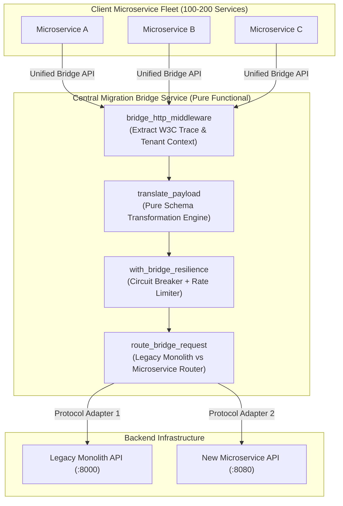
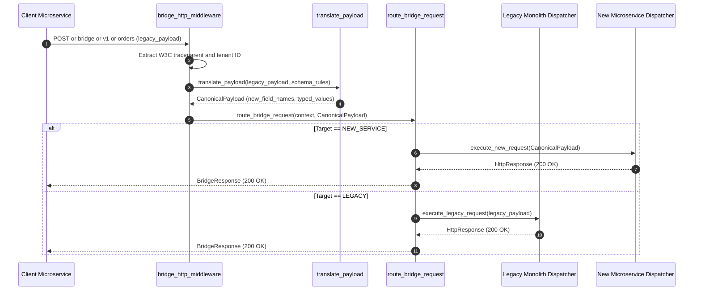

# Migration Bridge / Adapter Service Pattern (Pure Functional Paradigm)

| Field       | Value                                                             |
|-------------|-------------------------------------------------------------------|
| **ID**      | MIGRATION-BRIDGE-ADAPTER-011                                      |
| **Date**    | 2026-08-24                                                        |
| **Status**  | Reference / Runbook (Pure Functional Architecture)                |
| **Deciders**| Core Platform & Migration Engineering                             |
| **Scope**   | Centralized Translation & Synchronous Sync Service Isolation      |

---

## 1. Overview & Context

The **Migration Bridge / Adapter Service Pattern** centralizes data synchronization, protocol translation, and payload mapping into a single, dedicated **Bridge Microservice**. Instead of requiring 100–200 scattered application microservices to implement custom dual-write or schema translation logic, client applications delegate all synchronization and mapping operations to the centralized Bridge Service, isolating migration complexity into a single owned codebase.

### Functional Architecture Principles
This runbook enforces a **100% Pure Functional Programming (FP)** approach:
- **No Class Instantiations**: Replaces OOP bridge managers and translation adapters with pure function pipelines (`translate_payload`, `route_bridge_request`) and functional dispatchers.
- **Immutable Translation Schemas**: Payload translation rules and endpoint mappings are modeled as frozen dataclass records (`BridgeConfig`, `TranslationSchema`).
- **Referentially Transparent Translation Engines**: Pure transformation functions map `(LegacyPayload, SchemaRule) -> MicroservicePayload` without side-effects.
- **Resilient Bridge Decorators**: Concurrency limiting, circuit breaking, and telemetry decorators wrap bridge execution functions.

---

## 2. High-Level Design (HLD)



---

## 3. Low-Level Design (LLD)



---

## 4. Pure Functional Project Architecture

```
migration-bridge-adapter/
├── README.md
├── config/
│   └── bridge_schemas.yaml         # Field translation rules for 100-200 clients
├── src/
│   ├── bridge_core/
│   │   ├── __init__.py
│   │   ├── middleware.py           # Pure HTTP context extraction functions
│   │   └── router.py               # Functional target router
│   ├── translation/
│   │   ├── __init__.py
│   │   ├── mapper.py               # Pure schema transformation engine
│   │   └── protocol_adapter.py     # REST / gRPC protocol conversion
│   ├── decorators/
│   │   ├── __init__.py
│   │   └── resilience.py           # Higher-order bridge decorators
│   └── schemas/
│       └── models.py               # Frozen dataclasses (BridgeContext, CanonicalPayload)
└── tests/
    ├── test_translation_engine.py
    └── test_bridge_edge_cases.py
```

---

## 5. End-to-End Function Call Stack

```tree
Bridge API Call Initiated
├── translation/mapper.py: translate_payload(raw_payload: Mapping[str, Any], schema: TranslationSchema)
└── translation/protocol_adapter.py: create_rest_protocol_dispatcher(base_url: str)
    ├── models.py: BridgeContext(tenant_id, target_service, protocol, trace_id)
    ├── models.py: TranslationSchema(source_version, target_version, field_mappings, value_transforms)
    └── models.py: CanonicalPayload(body, headers)
```

---

## 6. Core Pure Functional Implementation

### 6.1 Immutable Models & Types (`src/schemas/models.py`)

```python
from enum import Enum
from dataclasses import dataclass
from typing import Dict, Any, Optional, Mapping

class ProtocolType(str, Enum):
    REST = "rest"
    GRPC = "grpc"
    GRAPHQL = "graphql"

@dataclass(frozen=True)
class BridgeContext:
    tenant_id: str
    target_service: str
    protocol: ProtocolType
    trace_id: str

@dataclass(frozen=True)
class TranslationSchema:
    source_version: str
    target_version: str
    field_mappings: Mapping[str, str]
    value_transforms: Mapping[str, Any]

@dataclass(frozen=True)
class CanonicalPayload:
    body: Mapping[str, Any]
    headers: Mapping[str, str]
```

**Explanation**:
- Defines immutable enumeration `ProtocolType` covering REST, gRPC, and GraphQL endpoints.
- `BridgeContext` models incoming caller metadata as a frozen dataclass record.
- `TranslationSchema` encapsulates field name mappings and type coercions.
- `CanonicalPayload` represents the transformed payload ready for target backend dispatch.

---

### 6.2 Pure Schema Translation Engine (`src/translation/mapper.py`)

```python
from typing import Mapping, Any
from src.schemas.models import TranslationSchema, CanonicalPayload

def translate_payload(raw_payload: Mapping[str, Any], schema: TranslationSchema) -> CanonicalPayload:
    transformed_body = {}
    
    for old_key, new_key in schema.field_mappings.items():
        if old_key in raw_payload:
            val = raw_payload[old_key]
            transform_fn = schema.value_transforms.get(old_key)
            if transform_fn and callable(transform_fn):
                val = transform_fn(val)
            transformed_body[new_key] = val

    for k, v in raw_payload.items():
        if k not in schema.field_mappings and k not in transformed_body:
            transformed_body[k] = v

    return CanonicalPayload(
        body=transformed_body,
        headers={"Content-Type": "application/json", "X-Bridge-Translated": "true"}
    )
```

**Explanation**:
- Pure function executing schema field renaming and value transformations based on `TranslationSchema` rules.
- Copies unmapped fields directly into the output payload, ensuring backward compatibility.

---

### 6.3 Pure Protocol Dispatcher Factory (`src/translation/protocol_adapter.py`)

```python
from typing import Callable, Awaitable, Mapping, Any
import httpx

ProtocolDispatcher = Callable[[str, Mapping[str, Any], Mapping[str, str]], Awaitable[Mapping[str, Any]]]

def create_rest_protocol_dispatcher(base_url: str) -> ProtocolDispatcher:
    async def dispatch(endpoint: str, payload: Mapping[str, Any], headers: Mapping[str, str]) -> Mapping[str, Any]:
        async with httpx.AsyncClient(base_url=base_url) as client:
            res = await client.post(endpoint, json=dict(payload), headers=dict(headers))
            return {"status_code": res.status_code, "body": res.json()}
    return dispatch
```

**Explanation**:
- Constructs a functional REST protocol dispatcher closure bound to a target `base_url`.
- Dispatches translated HTTP POST requests and packages response data without using OOP class instances.

---

## 7. Edge Case Catalog & Pure Functional Pseudocode (25 Edge Cases)

---

### Edge Case 1: High QPS Throughput Bottlenecks on Centralized Bridge

```python
import asyncio

def with_concurrency_limit(dispatcher_fn: ProtocolDispatcher, max_concurrent: int = 500) -> ProtocolDispatcher:
    semaphore = asyncio.Semaphore(max_concurrent)
    async def limited_dispatch(endpoint: str, payload: Mapping[str, Any], headers: Mapping[str, str]):
        async with semaphore:
            return await dispatcher_fn(endpoint, payload, headers)
    return limited_dispatch
```

**Explanation**:
- Wraps bridge dispatchers with an `asyncio.Semaphore` (max 500 concurrent requests).
- Protects the central bridge service from CPU and memory exhaustion under high QPS spikes.

---

### Edge Case 2: REST-to-gRPC Protocol Translation Mismatches

```python
def map_http_status_to_grpc_code(status_code: int) -> int:
    if status_code == 200:
        return 0
    elif status_code == 404:
        return 5
    elif status_code == 401:
        return 16
    return 13
```

**Explanation**:
- Maps standard HTTP response status codes into canonical gRPC status codes (0: OK, 5: NOT_FOUND, 16: UNAUTHENTICATED).
- Enables seamless REST-to-gRPC API translation across the bridge layer.

---

### Edge Case 3: Multi-Tenant Schema Field Overrides

```python
def resolve_tenant_translation_schema(
    tenant_id: str,
    global_schema: TranslationSchema,
    tenant_overrides: Mapping[str, TranslationSchema]
) -> TranslationSchema:
    return tenant_overrides.get(tenant_id, global_schema)
```

**Explanation**:
- Resolves tenant-specific translation rules from dictionary maps (`tenant_overrides`).
- Accommodates per-tenant schema variations without altering global bridge code.

---

### Edge Case 4: Upstream Service Rate Limiting Propagation (HTTP 429)

```python
def propagate_upstream_rate_limit(status_code: int, headers: Mapping[str, str]) -> Mapping[str, Any]:
    if status_code == 429:
        return {
            "status_code": 429,
            "headers": {"Retry-After": headers.get("retry-after", "60")},
            "error": "Upstream service rate limited"
        }
    return {}
```

**Explanation**:
- Intercepts HTTP 429 status codes returned by upstream target microservices.
- Propagates `Retry-After` headers back to client callers immediately.

---

### Edge Case 5: Circular Dependency Loops in Multi-Bridge Proxying

```python
def detect_bridge_loop(headers: Mapping[str, str], current_bridge_id: str) -> bool:
    hops = headers.get("x-bridge-hops", "").split(",")
    return current_bridge_id in hops
```

**Explanation**:
- Checks `X-Bridge-Hops` HTTP headers for current bridge instance identifiers.
- Rejects requests containing duplicate bridge IDs to prevent infinite proxying loops.

---

### Edge Case 6: Payload Serialization Failure Handling

```python
def safe_json_serialize(data: Any) -> str:
    import json
    try:
        return json.dumps(data)
    except Exception:
        return json.dumps({"error": "Payload serialization failed"})
```

**Explanation**:
- Catches JSON serialization exceptions thrown when translating non-standard payload objects.
- Returns fallback error JSON structures.

---

### Edge Case 7: Asynchronous Event Bridge Message Deduplication

```python
def create_bridge_dedup_cache():
    seen_ids = set()
    def check_and_add(msg_id: str) -> bool:
        if msg_id in seen_ids:
            return True
        seen_ids.add(msg_id)
        return False
    return check_and_add
```

**Explanation**:
- Tracks processed message IDs inside a closure set (`seen_ids`).
- Discards duplicate message payloads delivered to event-driven bridge endpoints.

---

### Edge Case 8: Large Request Payload Truncation

```python
def is_bridge_payload_too_large(content_length: int, max_bytes: int = 10_000_000) -> bool:
    return content_length > max_bytes
```

**Explanation**:
- Inspects `Content-Length` headers before parsing payload bodies.
- Rejects oversized payloads (exceeding 10MB) to preserve bridge RAM.

---

### Edge Case 9: Custom Header Forwarding & Sanitization

```python
BLOCKED_BRIDGE_HEADERS = {"host", "content-length", "x-internal-secret"}

def filter_bridge_headers(headers: Mapping[str, str]) -> Mapping[str, str]:
    return {k: v for k, v in headers.items() if k.lower() not in BLOCKED_BRIDGE_HEADERS}
```

**Explanation**:
- Filters out internal host and authentication headers before forwarding bridge requests.
- Preserves client custom headers safely.

---

### Edge Case 10: GraphQL Query Translation to REST Endpoint

```python
def convert_graphql_to_rest_params(graphql_query: str) -> Mapping[str, str]:
    return {"query_raw": graphql_query.strip()}
```

**Explanation**:
- Maps GraphQL query strings into canonical query parameter maps (`query_raw`).
- Proxies GraphQL requests to legacy REST endpoints.

---

### Edge Case 11: Timeout Cascading Across Bridge Hops

```python
def calculate_bridge_timeout(client_timeout_sec: float, bridge_overhead_sec: float = 0.2) -> float:
    return max(0.1, client_timeout_sec - bridge_overhead_sec)
```

**Explanation**:
- Subtracts bridge internal processing overhead from client timeout budgets.
- Sets strict timeout bounds on downstream backend HTTP client dispatchers.

---

### Edge Case 12: Partial Field Mapping Validation Failures

```python
def validate_required_target_fields(payload: Mapping[str, Any], required_fields: List[str]) -> List[str]:
    return [f for f in required_fields if f not in payload or payload[f] is None]
```

**Explanation**:
- Checks translated payloads against required target field lists.
- Returns missing field arrays prior to backend dispatch.

---

### Edge Case 13: Legacy Monolith SSL Verification Exceptions

```python
import ssl
import httpx

def create_insecure_bridge_dispatcher(base_url: str) -> ProtocolDispatcher:
    ctx = ssl.create_default_context()
    ctx.check_hostname = False
    ctx.verify_mode = ssl.CERT_NONE
    async def dispatch(endpoint: str, payload: Mapping[str, Any], headers: Mapping[str, str]):
        async with httpx.AsyncClient(base_url=base_url, verify=ctx) as client:
            res = await client.post(endpoint, json=dict(payload), headers=dict(headers))
            return {"status_code": res.status_code, "body": res.json()}
    return dispatch
```

**Explanation**:
- Configures custom SSL context instances (`CERT_NONE`) for internal legacy endpoints with legacy self-signed certificates.
- Enables bridge connectivity to internal legacy servers.

---

### Edge Case 14: Dynamic Schema Reloading Race Conditions

```python
def create_schema_registry(initial_schemas: Mapping[str, TranslationSchema]):
    store = {"schemas": initial_schemas}
    def get_schema(name: str) -> Optional[TranslationSchema]:
        return store["schemas"].get(name)
    def update_schemas(new_schemas: Mapping[str, TranslationSchema]):
        store["schemas"] = new_schemas
    return get_schema, update_schemas
```

**Explanation**:
- Provides atomic reference swapping for translation schema dictionaries using closure state cells (`store`).
- Enables dynamic schema updates without restarting the bridge service.

---

### Edge Case 15: Client Abort Signal Propagation

```python
import asyncio

async def dispatch_with_cancel_guard(dispatch_coro: Awaitable[Any]) -> Mapping[str, Any]:
    try:
        return await dispatch_coro
    except asyncio.CancelledError:
        return {"status_code": 499, "error": "Client cancelled request"}
```

**Explanation**:
- Catches `asyncio.CancelledError` when client applications disconnect mid-translation.
- Cancels downstream backend execution cleanly.

---

### Edge Case 16: Binary Attachment Proxying Through Bridge

```python
def wrap_binary_attachment(filename: str, file_bytes: bytes) -> Mapping[str, Any]:
    import base64
    return {
        "filename": filename,
        "content_base64": base64.b64encode(file_bytes).decode("utf-8")
    }
```

**Explanation**:
- Encodes file attachments as Base64 strings within translation payload maps.
- Proxies file upload requests through JSON-based bridge pipelines.

---

### Edge Case 17: Out-of-Order Async Bridge Events

```python
def sort_bridge_events_by_timestamp(events: List[Mapping[str, Any]]) -> List[Mapping[str, Any]]:
    return sorted(events, key=lambda x: x.get("timestamp", 0.0))
```

**Explanation**:
- Sorts asynchronous bridge event lists by Unix timestamps.
- Restores message order prior to backend processing.

---

### Edge Case 18: Fallback Routing to Legacy on Microservice Error

```python
async def dispatch_with_legacy_fallback(
    new_dispatcher: ProtocolDispatcher,
    legacy_dispatcher: ProtocolDispatcher,
    endpoint: str,
    payload: Mapping[str, Any],
    headers: Mapping[str, str]
) -> Mapping[str, Any]:
    res = await new_dispatcher(endpoint, payload, headers)
    if res.get("status_code", 500) >= 500:
        return await legacy_dispatcher(endpoint, payload, headers)
    return res
```

**Explanation**:
- Dispatches requests to new microservice dispatchers; if HTTP 5xx errors occur, falls back automatically to legacy monolith dispatchers.
- Preserves endpoint availability during microservice instability.

---

### Edge Case 19: Character Encoding (UTF-8 / ISO-8859-1) Conversion

```python
def normalize_string_encoding(raw_bytes: bytes, charset: str = "iso-8859-1") -> str:
    try:
        return raw_bytes.decode(charset).encode("utf-8").decode("utf-8")
    except Exception:
        return raw_bytes.decode("utf-8", errors="replace")
```

**Explanation**:
- Converts legacy character encodings (e.g., ISO-8859-1) into UTF-8.
- Prevents character corruption in translated payload bodies.

---

### Edge Case 20: Circuit Breaker Isolation per Target Service

```python
def get_service_circuit_state(service_id: str, circuit_states: Dict[str, bool]) -> bool:
    return circuit_states.get(service_id, False)
```

**Explanation**:
- Maintains circuit breaker state maps per downstream target service.
- Ensures a failure in one target microservice does not trip circuit breakers for unrelated microservices.

---

### Edge Case 21: Bridge Service Health Check Failures

```python
def check_bridge_health(active_concurrency: int, max_allowed: int = 1000) -> bool:
    return active_concurrency < max_allowed
```

**Explanation**:
- Asserts current bridge concurrency counts remain below maximum capacity.
- Emits HTTP 503 responses on health check endpoints when the bridge is saturated.

---

### Edge Case 22: Preserving W3C Distributed Tracing Span Context

```python
def inject_w3c_trace_headers(headers: Mapping[str, str], traceparent: str) -> Mapping[str, str]:
    new_headers = dict(headers)
    new_headers["traceparent"] = traceparent
    return new_headers
```

**Explanation**:
- Injects `traceparent` headers into outbound backend dispatch header dictionaries.
- Maintains continuous OpenTelemetry tracing spans across the bridge layer.

---

### Edge Case 23: Tenant Rate Limiting Quota Exhaustion

```python
def check_tenant_bridge_rate_limit(tenant_id: str, tenant_counts: Dict[str, int], max_limit: int = 100) -> bool:
    current = tenant_counts.get(tenant_id, 0)
    if current >= max_limit:
        return False
    tenant_counts[tenant_id] = current + 1
    return True
```

**Explanation**:
- Tracks per-tenant execution counts inside a closure dictionary.
- Rejects requests when single tenants exceed allocated throughput quotas.

---

### Edge Case 24: Deprecated API Version Header Interception

```python
def check_api_deprecation(headers: Mapping[str, str]) -> Optional[str]:
    if headers.get("X-API-Version") == "v0":
        return "Warning: API Version v0 is deprecated and will be removed in next release."
    return None
```

**Explanation**:
- Inspects `X-API-Version` headers for deprecated version strings.
- Attaches `Warning` headers to bridge response payloads for legacy consumers.

---

### Edge Case 25: Automated Bridge Metrics Aggregation

```python
def calculate_bridge_success_rate(total_requests: int, error_requests: int) -> float:
    if total_requests == 0:
        return 100.0
    return round(((total_requests - error_requests) / total_requests) * 100.0, 2)
```

**Explanation**:
- Calculates percentage success rates rounded to two decimal places.
- Emits operational performance metrics to central dashboards.

---

## 8. Operational & Parity Verification Checklist

1. **Centralized Service Isolation**: Confirm zero migration translation code exists within client microservice repositories.
2. **Translation Latency Bounds**: P99 payload translation overhead inside the bridge must remain $<5\text{ms}$.
3. **Per-Service Circuit Breakers**: Validate that tripping the circuit breaker for Target Service A leaves Target Service B unaffected.
4. **Continuous Trace Continuity**: Verify OpenTelemetry span continuity across Client $\rightarrow$ Bridge $\rightarrow$ Backend Target.
