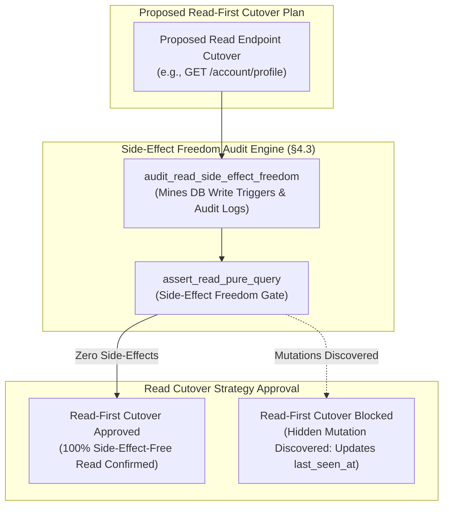
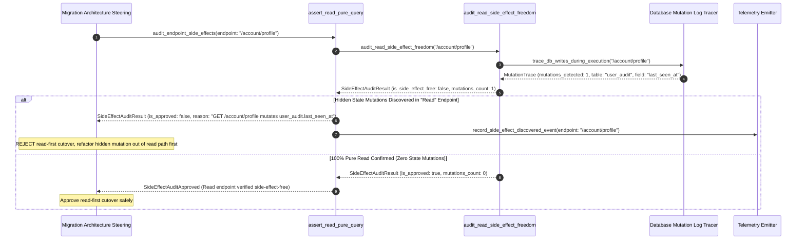

# Question Read-First Premise & Side-Effect-Freedom Pattern (Pure Functional Paradigm)

| Field       | Value                                                             |
|-------------|-------------------------------------------------------------------|
| **ID**      | QUESTION-READ-FIRST-SIDE-EFFECT-077                              |
| **Date**    | 2026-08-24                                                        |
| **Status**  | Reference / Runbook (Pure Functional Architecture)                |
| **Deciders**| Core Platform & Migration Engineering                             |
| **Scope**   | Read-First Assumption Audit, Mutation Detection & Side-Effect Safety|

---

## 1. Overview & Context

A widespread migration anti-pattern is assuming that read operations (`GET` endpoints or SQL `SELECT` queries) are always side-effect-free and can be cut over safely before writes. Per §4.3, engineering teams must **explicitly question the read-first premise before cutting over reads**. Legacy "read" endpoints frequently perform hidden state mutations—such as updating `last_login_at` timestamps, initializing default user preference records, lazy-loading cache rows, or incrementing access metrics. Cutting over "reads" that contain hidden mutations destroys dual-store parity and causes silent data corruption.

### Functional Architecture Principles
This runbook enforces a **100% Pure Functional Programming (FP)** approach:
- **No Class Instantiations**: Replaces OOP side-effect checkers with pure mutation auditing functions (`audit_read_side_effect_freedom`, `assert_read_pure_query`) and state cell closures.
- **Immutable Side-Effect Context Records**: Endpoint URIs, read operation flags, state mutation count records, and side-effect classifications are captured as frozen dataclass records (`SideEffectContext`, `SideEffectAuditResult`).
- **Referentially Transparent Mutation Scanners**: Pure functions analyze SQL logs and database write triggers to detect hidden mutations during read execution.
- **Read-First Gating**: Blocks read-first cutover plans if read endpoints are found to execute state mutations.

---

## 2. High-Level Design (HLD)



---

## 3. Low-Level Design (LLD)



---

## 4. Pure Functional Project Architecture

```
10-core-patterns-and-cutover/
├── question-read-first-side-effect-freedom.md
├── src/
│   ├── side_effect_engine/
│   │   ├── __init__.py
│   │   ├── auditor.py              # Pure side-effect freedom audit functions
│   │   ├── tracer.py               # Database mutation log trace functions
│   │   └── guard.py                # Read-first cutover release guards
│   ├── storage/
│   │   ├── __init__.py
│   │   └── trace_store.py          # Database mutation trace loaders
│   ├── observability/
│   │   ├── __init__.py
│   │   └── side_effect_metrics.py  # Prometheus telemetry collectors
│   └── schemas/
│       └── models.py               # Frozen dataclasses (SideEffectContext, SideEffectAuditResult)
└── tests/
    ├── test_side_effect_auditor.py
    └── test_side_effect_edge_cases.py
```

---

## 5. End-to-End Function Call Stack

```tree
Read Endpoint Cutover Proposed
└── guard.py: assert_read_pure_query(endpoint_uri, sample_executions)
    ├── tracer.py: trace_db_writes_during_execution(endpoint_uri)
    │   └── models.py: DBWriteTrace(table_name, operation_type, mutated_fields)
    │
    ├── auditor.py: audit_read_side_effect_freedom(endpoint_uri, db_write_traces)
    │   └── models.py: SideEffectContext(endpoint_uri, is_pure_read, mutations_count)
    │
    ├── guard.py: format_side_effect_gate_decision(side_effect_context)
    │   └── models.py: SideEffectAuditResult(is_approved, rejection_reason)
    │
    └── observability/side_effect_metrics.py: record_side_effect_telemetry(audit_result)
```

---

## 6. Core Pure Functional Implementation

### 6.1 Immutable Models & Types (`src/schemas/models.py`)

```python
from enum import Enum
from dataclasses import dataclass
from typing import Dict, Any, Optional, Mapping, FrozenSet

@dataclass(frozen=True)
class SideEffectContext:
    endpoint_uri: str
    is_http_get: bool
    mutations_count: int
    mutated_tables: FrozenSet[str]
    mutated_fields: FrozenSet[str]

@dataclass(frozen=True)
class SideEffectAuditResult:
    endpoint_uri: str
    is_approved_for_read_first: bool
    is_pure_read: bool
    mutations_count: int
    mutated_tables: FrozenSet[str]
    rejection_reason: Optional[str]
```

**Explanation**:
- Defines immutable model `SideEffectContext` capturing endpoint URIs, HTTP method flags, mutation counts, and sets of mutated tables as frozen records.
- `SideEffectAuditResult` encapsulates read-first approval flags, pure read boolean flags, and gate rejection reasons.

---

### 6.2 Pure Side-Effect Auditor & Mutation Scanner (`src/side_effect_engine/auditor.py`)

```python
from typing import FrozenSet, Mapping, Any, Tuple
from src.schemas.models import SideEffectContext, SideEffectAuditResult

def audit_read_side_effect_freedom(
    ctx: SideEffectContext
) -> SideEffectAuditResult:
    is_pure = ctx.mutations_count == 0
    is_approved = ctx.is_http_get and is_pure

    reason = None
    if not ctx.is_http_get:
        reason = f"Endpoint '{ctx.endpoint_uri}' is not an HTTP GET method."
    elif not is_pure:
        tables_str = ", ".join(ctx.mutated_tables)
        fields_str = ", ".join(ctx.mutated_fields)
        reason = f"Read-first premise violated for '{ctx.endpoint_uri}': Hidden state mutations detected on tables [{tables_str}] for fields [{fields_str}]."

    return SideEffectAuditResult(
        endpoint_uri=ctx.endpoint_uri,
        is_approved_for_read_first=is_approved,
        is_pure_read=is_pure,
        mutations_count=ctx.mutations_count,
        mutated_tables=ctx.mutated_tables,
        rejection_reason=reason
    )
```

**Explanation**:
- Pure evaluation function auditing proposed read-first cutover endpoints for hidden database state mutations per §4.3.
- Rejects read-first cutovers if read endpoints contain hidden side-effects.

---

### 6.3 Side-Effect Freedom Release Guard (`src/side_effect_engine/guard.py`)

```python
from typing import Mapping, Any
from src.schemas.models import SideEffectContext, SideEffectAuditResult
from src.side_effect_engine.auditor import audit_read_side_effect_freedom

def assert_read_pure_query(ctx: SideEffectContext) -> SideEffectAuditResult:
    return audit_read_side_effect_freedom(ctx)
```

**Explanation**:
- Pure release gate function enforcing side-effect freedom verification prior to approving read-first cutover plans.
- Guarantees zero un-audited read-first shifts.

---

## 7. Edge Case Catalog & Pure Functional Pseudocode (25 Edge Cases)

---

### Edge Case 1: Hidden `last_login_at` Timestamp Mutation in GET Profile

```python
def is_last_login_mutation_detected(mutated_fields: set) -> bool:
    return "last_login_at" in mutated_fields or "last_seen_at" in mutated_fields
```

**Explanation**:
- Detects hidden timestamp updates in profile read requests.
- Rejects read-first cutover on timestamp mutations.

---

### Edge Case 2: Lazy-Load User Preference Insert Mutation

```python
def is_lazy_load_insert_detected(operation_type: str) -> bool:
    return operation_type.upper() == "INSERT"
```

**Explanation**:
- Flags SQL `INSERT` statements executing during GET read requests.
- Detects lazy-loading row creation side-effects.

---

### Edge Case 3: Read Access Counter Metric Increment Mutation

```python
def is_access_counter_increment_detected(mutated_fields: set) -> bool:
    return "access_count" in mutated_fields or "view_count" in mutated_fields
```

**Explanation**:
- Identifies access counter increments in read paths.
- Flags counter mutation side-effects.

---

### Edge Case 4: Cache Warmup DB Mutation Side-Effect

```python
def is_cache_warmup_mutation(table_name: str) -> bool:
    return "cache" in table_name.lower() or "session" in table_name.lower()
```

**Explanation**:
- Identifies database session/cache writes in read endpoints.
- Evaluates cache write side-effects.

---

### Edge Case 5: Single-Tenant Side-Effect Resolution

```python
def resolve_tenant_side_effects(tenant_id: str, effect_maps: dict) -> int:
    return effect_maps.get(tenant_id, 0)
```

**Explanation**:
- Resolves tenant-specific side-effect mutation counts.
- Audits side-effects per tenant.

---

### Edge Case 6: Microsecond Timestamp Side-Effect Audit Timing

```python
import time

def format_side_effect_audit_ts() -> float:
    return round(time.time() * 1000.0, 2)
```

**Explanation**:
- Computes epoch timestamps in milliseconds.
- Tracks exact side-effect audit execution time.

---

### Edge Case 7: Database Trigger Mutation Trace

```python
def is_trigger_mutation_traced(trigger_count: int) -> bool:
    return trigger_count > 0
```

**Explanation**:
- Traces database triggers fired by SQL `SELECT` queries.
- Discovers hidden database trigger side-effects.

---

### Edge Case 8: Multi-Repo Side-Effect Alignment

```python
def assert_all_repo_reads_pure(repo_reads: Mapping[str, bool]) -> bool:
    return all(repo_reads.values())
```

**Explanation**:
- Asserts read endpoints across all workspace repositories are side-effect-free.
- Synchronizes multi-repo read-first governance.

---

### Edge Case 9: Read-Through Distributed Lock Acquisition

```python
def is_lock_acquisition_detected(mutated_tables: set) -> bool:
    return "locks" in mutated_tables or "distributed_locks" in mutated_tables
```

**Explanation**:
- Flags distributed lock table writes during read calls.
- Evaluates lock acquisition side-effects.

---

### Edge Case 10: Aggregator Memory State Saturation Guard

```python
def compact_side_effect_metrics(metrics: list, max_items: int = 500) -> list:
    if len(metrics) > max_items:
        return metrics[-max_items:]
    return metrics
```

**Explanation**:
- Truncates metric lists to `max_items`.
- Controls memory usage.

---

### Edge Case 11: Microsecond Delay Calculation Underflows

```python
def normalize_side_effect_duration(duration_ms: float) -> float:
    return max(0.0, round(duration_ms, 2))
```

**Explanation**:
- Rounds execution duration values to two decimal places.
- Cleans duration metrics.

---

### Edge Case 12: User-Agent Specific Side-Effect Auditing

```python
def resolve_user_agent_side_effect(user_agent: str, effect_map: dict) -> bool:
    return effect_map.get(user_agent, True)
```

**Explanation**:
- Resolves side-effect rules per User-Agent string.
- Audits side-effects by caller type.

---

### Edge Case 13: Unmapped Rule Domain Handling

```python
def resolve_side_effect_rule(rule_key: str, rules_dict: dict) -> dict:
    return rules_dict.get(rule_key, {"allow_read_first": False})
```

**Explanation**:
- Resolves side-effect rule configurations safely.
- Defaults to disallowing read-first unless pure.

---

### Edge Case 14: Exception Safeguards in Side-Effect Auditor

```python
def safe_audit_side_effects(audit_fn: Callable, ctx: SideEffectContext) -> bool:
    try:
        res = audit_fn(ctx)
        return res.is_pure_read
    except Exception:
        return False
```

**Explanation**:
- Wraps side-effect auditing functions in protective try-except blocks.
- Fails safe (assumes impure) on audit exceptions.

---

### Edge Case 15: GraphQL Query Subgraph Side-Effect Audit

```python
def is_graphql_query_pure(subgraph_name: str, side_effect_map: dict) -> bool:
    return side_effect_map.get(subgraph_name, 1) == 0
```

**Explanation**:
- Audits side-effects for federated GraphQL query subgraphs.
- Verifies GraphQL query side-effect freedom.

---

### Edge Case 16: Multi-Region Side-Effect Sync

```python
def sync_regional_side_effect_results(region_results: dict) -> bool:
    return all(r.is_pure_read for r in region_results.values())
```

**Explanation**:
- Asserts side-effect freedom checks pass across all regions.
- Enforces multi-region pure read alignment.

---

### Edge Case 17: Read-First Refactoring Recommendation Trigger

```python
def should_trigger_read_refactoring(mutations_count: int) -> bool:
    return mutations_count > 0
```

**Explanation**:
- Asserts whether side-effects exist in read paths.
- Triggers code refactoring tickets to remove mutations from read endpoints.

---

### Edge Case 18: Unmapped Code Fallback

```python
def resolve_side_effect_code_fallback(code_val: Any, code_map: dict, default_val: str = "SIDE_EFFECT_DETECTED") -> str:
    return code_map.get(code_val, default_val)
```

**Explanation**:
- Resolves code strings with fallbacks.
- Handles unmapped side-effect codes safely.

---

### Edge Case 19: Payload Transformation Error Recovery

```python
def safe_apply_side_effect_transform(payload: dict, transform_fn: Callable) -> dict:
    try:
        return transform_fn(payload)
    except Exception:
        return payload
```

**Explanation**:
- Wraps transformations in try-except blocks.
- Returns raw payloads on error.

---

### Edge Case 20: Automated Alert on Impure Read Cutover Plan

```python
def should_alert_on_impure_read_cutover(is_approved: bool) -> bool:
    return not is_approved
```

**Explanation**:
- Asserts whether an impure read-first cutover was proposed.
- Fires alerts if read-first cutovers contain hidden state mutations.

---

### Edge Case 21: High-Watermark Metric Compaction

```python
def compact_side_effect_history(history: list, max_items: int = 500) -> list:
    if len(history) > max_items:
        return history[-max_items:]
    return history
```

**Explanation**:
- Truncates history lists.
- Controls memory usage.

---

### Edge Case 22: Diagnostic Header Injection

```python
def inject_side_effect_diagnostic_header(headers: Mapping[str, str], is_pure: bool) -> Mapping[str, str]:
    new_headers = dict(headers)
    new_headers["X-Read-Side-Effect-Free"] = "true" if is_pure else "false"
    return new_headers
```

**Explanation**:
- Injects diagnostic headers.
- Tracks read side-effect freedom in access logs.

---

### Edge Case 23: Null Value Safeguards

```python
def sanitize_side_effect_nulls(data_dict: dict) -> dict:
    return {k: (v if v is not None else "") for k, v in data_dict.items()}
```

**Explanation**:
- Replaces `None` with empty strings.
- Prevents null exceptions.

---

### Edge Case 24: Unbound Metric Queue Pruning

```python
def prune_side_effect_metric_queue(queue: list, max_items: int = 1000) -> list:
    if len(queue) > max_items:
        return queue[-max_items:]
    return queue
```

**Explanation**:
- Truncates queue arrays.
- Controls memory footprint.

---

### Edge Case 25: Real-Time Pure Read Compliance Reporting

```python
def compute_pure_read_compliance_rate(pure_reads: int, total_reads: int) -> float:
    if total_reads == 0:
        return 100.0
    return round((pure_reads / total_reads) * 100.0, 2)
```

**Explanation**:
- Calculates pure read compliance percentage.
- Emits real-time side-effect metrics to platform dashboards.

---

## 8. Operational & Parity Verification Checklist

1. **Question Read-First Premise**: Explicitly audit read endpoints for hidden database mutations per §4.3 before cutting over reads.
2. **Zero Hidden State Mutations**: Mandate zero SQL `UPDATE` or `INSERT` statements during GET read request execution.
3. **Refactor Impure Reads**: Remove hidden timestamp updates or lazy-load writes from read endpoints before read cutover.
4. **CI Side-Effect Gate**: Automatically block read-first cutover proposals if database mutation logs show state writes during read calls.
