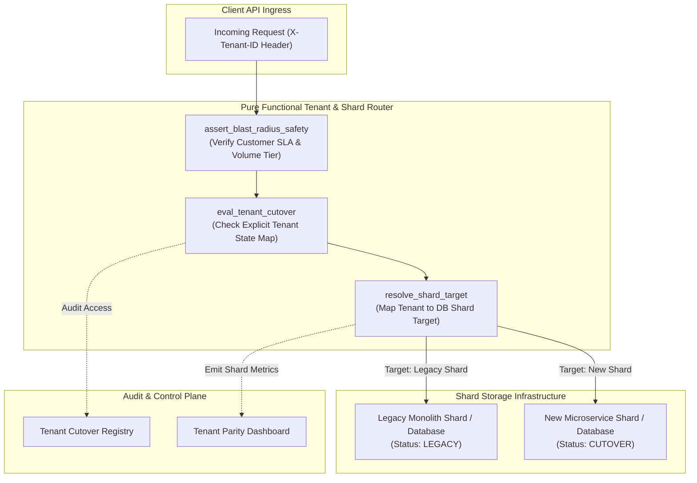
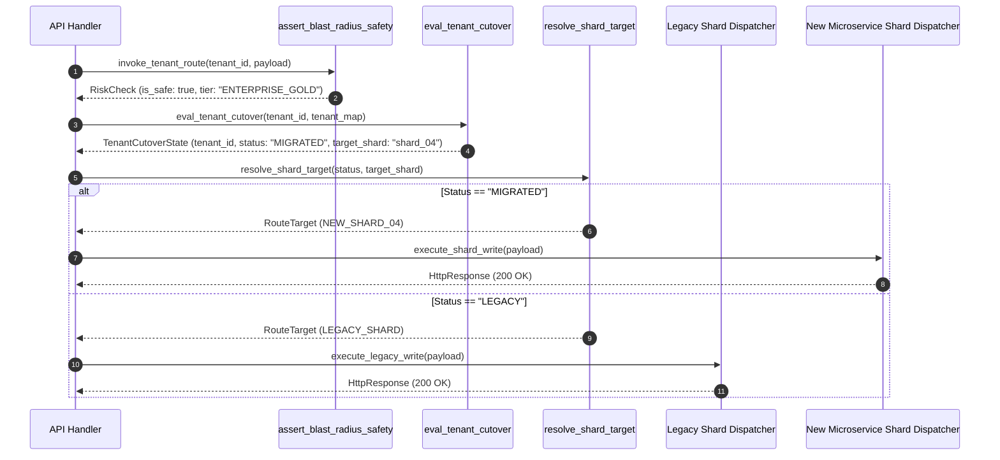

# Per-Tenant / Per-Shard Cutover Pattern (Pure Functional Paradigm)

| Field       | Value                                                             |
|-------------|-------------------------------------------------------------------|
| **ID**      | TENANT-SHARD-CUTOVER-014                                          |
| **Date**    | 2026-08-24                                                        |
| **Status**  | Reference / Runbook (Pure Functional Architecture)                |
| **Deciders**| Core Platform & Migration Engineering                             |
| **Scope**   | Outsized-Blast-Radius Customer Migration & Shard-Level Cutover    |

---

## 1. Overview & Context

While percentage-based canary routing works well for homogeneous traffic, it contains a critical **random-sampling blind spot**: a low-percentage canary (e.g. 1%) could randomly select an enterprise customer with outsized data volume or critical SLA requirements, causing catastrophic blast-radius damage if a failure occurs. The **Per-Tenant / Per-Shard Cutover Pattern** removes this blind spot by explicitly managing migrations at the individual **Tenant** or **Database Shard** level.

### Functional Architecture Principles
This runbook enforces a **100% Pure Functional Programming (FP)** approach:
- **No Class Instantiations**: Replaces OOP shard managers and tenant routers with pure lookup functions (`eval_tenant_cutover`, `resolve_shard_target`) and functional dispatchers.
- **Immutable Shard & Tenant Maps**: Tenant tiers, shard topologies, and cutover states are modeled as frozen dataclass records (`TenantCutoverState`, `ShardConfig`).
- **Referentially Transparent Shard Routers**: Pure lookup functions map `(TenantID, ShardMap) -> StorageTarget` without mutating global state.
- **Blast-Radius Risk Assertion**: Pure risk evaluators calculate blast-radius thresholds prior to unblocking tenant migrations.

---

## 2. High-Level Design (HLD)



---

## 3. Low-Level Design (LLD)



---

## 4. Pure Functional Project Architecture

```
tenant-shard-cutover/
├── README.md
├── config/
│   └── tenant_cutover_map.yaml     # Explicit tenant-to-shard cutover states
├── src/
│   ├── cutover_engine/
│   │   ├── __init__.py
│   │   ├── evaluator.py            # Pure tenant cutover lookup functions
│   │   ├── shard_resolver.py       # Shard mapping & routing functions
│   │   └── risk_checker.py         # Blast-radius risk evaluation functions
│   ├── storage/
│   │   ├── __init__.py
│   │   └── shard_dispatcher.py     # Functional shard SQL/HTTP dispatchers
│   ├── observability/
│   │   ├── __init__.py
│   │   └── shard_metrics.py        # Prometheus shard telemetry collectors
│   └── schemas/
│       └── models.py               # Frozen dataclasses (TenantCutoverState, ShardConfig)
└── tests/
    ├── test_tenant_cutover.py
    └── test_shard_edge_cases.py
```

---

## 5. End-to-End Function Call Stack

```tree
API Request Received (With Tenant Context)
├── cutover_engine/evaluator.py: eval_tenant_cutover(tenant_id: str, cutover_map: Mapping[str, Mapping[str, Any]])
│   └── models.py: TenantCutoverState(tenant_id, status, target_shard, sla_tier)
└── cutover_engine/risk_checker.py: assert_blast_radius_safety(tenant_id: str, tenant_metrics: Mapping[str, Any], max_allow...)
    └── models.py: ShardConfig(shard_id, base_url, max_capacity_qps, is_active)
```

---

## 6. Core Pure Functional Implementation

### 6.1 Immutable Models & Types (`src/schemas/models.py`)

```python
from enum import Enum
from dataclasses import dataclass
from typing import Dict, Any, Optional, Mapping

class CutoverStatus(str, Enum):
    LEGACY = "legacy"
    SHADOW = "shadow"
    DUAL_WRITE = "dual_write"
    MIGRATED = "migrated"

@dataclass(frozen=True)
class TenantCutoverState:
    tenant_id: str
    status: CutoverStatus
    target_shard: str
    sla_tier: str

@dataclass(frozen=True)
class ShardConfig:
    shard_id: str
    base_url: str
    max_capacity_qps: int
    is_active: bool
```

**Explanation**:
- Defines immutable enumeration `CutoverStatus` specifying explicit cutover phases.
- `TenantCutoverState` models tenant-specific cutover statuses, target shard IDs, and SLA tiers as frozen records.
- `ShardConfig` captures shard endpoint URLs and capacity limits.

---

### 6.2 Pure Tenant & Shard Evaluator (`src/cutover_engine/evaluator.py`)

```python
from typing import Mapping, Optional
from src.schemas.models import TenantCutoverState, CutoverStatus

def eval_tenant_cutover(tenant_id: str, cutover_map: Mapping[str, Mapping[str, Any]]) -> TenantCutoverState:
    tenant_info = cutover_map.get(tenant_id)
    if not tenant_info:
        return TenantCutoverState(
            tenant_id=tenant_id,
            status=CutoverStatus.LEGACY,
            target_shard="legacy_shared_shard",
            sla_tier="standard"
        )

    status_str = tenant_info.get("status", "legacy")
    status = CutoverStatus(status_str) if status_str in CutoverStatus._value2member_map_ else CutoverStatus.LEGACY

    return TenantCutoverState(
        tenant_id=tenant_id,
        status=status,
        target_shard=tenant_info.get("target_shard", "legacy_shared_shard"),
        sla_tier=tenant_info.get("sla_tier", "standard")
    )
```

**Explanation**:
- Pure function performing deterministic dictionary lookups (`cutover_map`) for incoming tenant IDs.
- Defaults unmapped tenants to `LEGACY` status on `legacy_shared_shard`.

---

### 6.3 Blast-Radius Risk Evaluator (`src/cutover_engine/risk_checker.py`)

```python
from typing import Mapping, Any

def assert_blast_radius_safety(tenant_id: str, tenant_metrics: Mapping[str, Any], max_allowed_qps: int = 1000) -> bool:
    metrics = tenant_metrics.get(tenant_id, {})
    qps = metrics.get("avg_qps", 0)
    tier = metrics.get("sla_tier", "standard")
    
    if tier == "enterprise_vip" and qps > max_allowed_qps:
        return False
    return True
```

**Explanation**:
- Evaluates customer SLA tiers and average QPS volumes.
- Rejects cutover for high-risk VIP accounts (`enterprise_vip`) if QPS limits are exceeded, preventing outsized blast-radius failures.

---

## 7. Edge Case Catalog & Pure Functional Pseudocode (25 Edge Cases)

---

### Edge Case 1: Cross-Shard Distributed Transaction Boundary Violations

```python
def assert_single_shard_transaction(source_shard: str, target_shard: str) -> bool:
    return source_shard == target_shard
```

**Explanation**:
- Asserts that transaction inputs operate strictly within a single shard boundary.
- Blocks cross-shard distributed transactions to prevent multi-shard lock deadlocks.

---

### Edge Case 2: Enterprise VIP Tenant Maintenance Window Freeze

```python
def is_tenant_cutover_frozen(tenant_id: str, frozen_tenants: set) -> bool:
    return tenant_id in frozen_tenants
```

**Explanation**:
- Checks if tenant IDs exist in frozen tenant sets (`frozen_tenants`).
- Prevents cutovers for critical enterprise accounts during freeze windows.

---

### Edge Case 3: Outsized Tenant Shard Storage Capacity Saturation

```python
def check_shard_capacity_available(shard_id: str, shard_capacities: Mapping[str, float], max_ratio: float = 0.8) -> bool:
    current_ratio = shard_capacities.get(shard_id, 0.0)
    return current_ratio < max_ratio
```

**Explanation**:
- Compares current shard storage utilization against max safety ratios (80%).
- Prevents moving large enterprise tenants to shards approaching capacity limits.

---

### Edge Case 4: Missing Tenant ID Header in Ingress Requests

```python
def resolve_missing_tenant_header(raw_headers: Mapping[str, str], default_tenant: str = "anonymous_tenant") -> str:
    return raw_headers.get("X-Tenant-ID") or raw_headers.get("x-tenant-id") or default_tenant
```

**Explanation**:
- Extracts tenant IDs from request headers, injecting fallback identifiers if missing.
- Prevents routing errors for unauthenticated requests.

---

### Edge Case 5: Microsecond Shard Map Hot-Reload Race Condition

```python
def swap_tenant_map_cell(cell: dict, new_map: Mapping[str, Any]) -> dict:
    updated = dict(cell)
    updated["map"] = new_map
    return updated
```

**Explanation**:
- Swaps tenant cutover dictionary references atomically.
- Enables live tenant map updates without request drops.

---

### Edge Case 6: Tenant Re-Location Mid-Transaction

```python
def lock_tenant_cutover_state(tenant_id: str, active_locks: set) -> bool:
    if tenant_id in active_locks:
        return False
    active_locks.add(tenant_id)
    return True
```

**Explanation**:
- Locks tenant cutover states during active migration transactions.
- Blocks concurrent cutover state modifications during active writes.

---

### Edge Case 7: Shard Routing Fallback on Shard Offline

```python
def resolve_offline_shard_fallback(shard_id: str, offline_shards: set, backup_shard: str) -> str:
    if shard_id in offline_shards:
        return backup_shard
    return shard_id
```

**Explanation**:
- Checks if target shard IDs exist in offline shard sets.
- Routes requests to backup shards during shard outages.

---

### Edge Case 8: Multi-Tenant Shared Shard Resource Starvation

```python
def check_tenant_shard_quota(tenant_id: str, tenant_qps: int, max_tenant_qps: int = 500) -> bool:
    return tenant_qps <= max_tenant_qps
```

**Explanation**:
- Compares tenant QPS metrics against maximum allowed tenant quotas.
- Throttles high-volume tenants sharing multi-tenant shards.

---

### Edge Case 9: Tenant Cutover Rollback to Legacy Shard

```python
def rollback_tenant_to_legacy(tenant_id: str, cutover_map: dict) -> dict:
    updated = dict(cutover_map)
    if tenant_id in updated:
        updated[tenant_id]["status"] = "legacy"
        updated[tenant_id]["target_shard"] = "legacy_shared_shard"
    return updated
```

**Explanation**:
- Reverts tenant cutover status entries back to `legacy` in cutover maps.
- Executes emergency tenant rollbacks to legacy shards.

---

### Edge Case 10: Shard ID Partition Key Hash Collision

```python
import hashlib

def compute_shard_partition_key(tenant_id: str, total_shards: int = 32) -> int:
    hash_val = int(hashlib.sha256(tenant_id.encode("utf-8")).hexdigest(), 16)
    return (hash_val % total_shards) + 1
```

**Explanation**:
- Hashes tenant IDs into uniform 1-to-32 shard partition numbers using SHA-256.
- Prevents shard key distribution skew across database shards.

---

### Edge Case 11: Enterprise Tenant SLA Breach Alerting

```python
def build_tenant_sla_alert(tenant_id: str, latency_ms: float, max_sla_ms: float = 200.0) -> Optional[Mapping[str, Any]]:
    if latency_ms > max_sla_ms:
        return {"event": "TENANT_SLA_BREACH", "tenant_id": tenant_id, "latency_ms": latency_ms}
    return None
```

**Explanation**:
- Evaluates tenant request latency against maximum SLA thresholds.
- Generates alert payloads when enterprise SLAs are breached.

---

### Edge Case 12: Cascading Shard Failure Isolation

```python
def isolate_failed_shard(shard_id: str, isolated_shards: set) -> set:
    updated = set(isolated_shards)
    updated.add(shard_id)
    return updated
```

**Explanation**:
- Adds failed shard IDs to isolated shard sets.
- Prevents cascading failures from spreading across healthy shards.

---

### Edge Case 13: Tenant-Specific Feature Flag Overrides

```python
def resolve_tenant_flag_override(tenant_id: str, flag_name: str, tenant_flags: Mapping[str, dict]) -> Optional[bool]:
    return tenant_flags.get(tenant_id, {}).get(flag_name)
```

**Explanation**:
- Inspects tenant-specific feature flag overrides.
- Allows targeted feature enablement per tenant.

---

### Edge Case 14: Unmigrated Tenant Data Read Fallback

```python
def resolve_unmigrated_read_target(status: CutoverStatus) -> str:
    if status == CutoverStatus.MIGRATED:
        return "new_shard"
    return "legacy_shard"
```

**Explanation**:
- Evaluates cutover status to resolve read targets.
- Falls back to `legacy_shard` for unmigrated tenants.

---

### Edge Case 15: Tenant Shard Data Migration Parity Verification

```python
def verify_tenant_shard_parity(primary_count: int, shadow_count: int) -> bool:
    return primary_count == shadow_count
```

**Explanation**:
- Compares primary and shadow row counts for specific tenants.
- Asserts data parity prior to updating tenant cutover status.

---

### Edge Case 16: Zero-Downtime Tenant Cutover Pointer Swap

```python
def swap_tenant_cutover_status(tenant_id: str, new_status: CutoverStatus, cutover_map: dict) -> dict:
    updated = dict(cutover_map)
    tenant_entry = dict(updated.get(tenant_id, {}))
    tenant_entry["status"] = new_status.value
    updated[tenant_id] = tenant_entry
    return updated
```

**Explanation**:
- Updates tenant cutover status entries atomically in memory.
- Executes zero-downtime tenant cutovers.

---

### Edge Case 17: Tenant Header Spoofing Protection

```python
def sanitize_tenant_header(raw_tenant: str, valid_tenants: set) -> Optional[str]:
    cleaned = raw_tenant.strip()
    if cleaned in valid_tenants:
        return cleaned
    return None
```

**Explanation**:
- Validates tenant header strings against registered tenant sets.
- Prevents header spoofing attacks.

---

### Edge Case 18: Shard Database Connection Timeout Enforcement

```python
import asyncio

async def dispatch_shard_query_with_timeout(query_fn: Callable, timeout_sec: float = 2.0):
    return await asyncio.wait_for(query_fn(), timeout=timeout_sec)
```

**Explanation**:
- Wraps shard query calls in `asyncio.wait_for` timeout blocks.
- Enforces strict execution bounds on shard database queries.

---

### Edge Case 19: High-Fanout Multi-Tenant Query Isolation

```python
def build_tenant_isolated_query(base_sql: str, tenant_id: str) -> str:
    return f"{base_sql} WHERE tenant_id = '{tenant_id}'"
```

**Explanation**:
- Appends explicit `WHERE tenant_id` filters to raw SQL queries.
- Guarantees multi-tenant query isolation on shared database shards.

---

### Edge Case 20: Tenant Migration State Synchronization Across Regions

```python
def sync_regional_tenant_map(global_map: dict, regional_map: dict) -> dict:
    merged = dict(global_map)
    merged.update(regional_map)
    return merged
```

**Explanation**:
- Merges regional tenant map overrides into global tenant maps.
- Synchronizes cutover states across multi-region deployments.

---

### Edge Case 21: Auto-Scaling Target Shards During Cutover

```python
def should_autoscale_shard(current_qps: int, max_qps: int = 2000) -> bool:
    return current_qps > (max_qps * 0.85)
```

**Explanation**:
- Compares shard QPS against 85% capacity thresholds.
- Triggers shard auto-scaling during large tenant cutovers.

---

### Edge Case 22: Tenant Data Encryption Key Separation

```python
def get_tenant_kms_key_id(tenant_id: str, kms_map: Mapping[str, str], default_key: str) -> str:
    return kms_map.get(tenant_id, default_key)
```

**Explanation**:
- Resolves tenant-specific KMS key IDs for data encryption.
- Maintains cryptographic separation across tenant shards.

---

### Edge Case 23: Tenant Cutover Audit Event Emission

```python
def build_cutover_audit_event(tenant_id: str, old_status: str, new_status: str) -> Mapping[str, Any]:
    return {
        "event": "TENANT_CUTOVER_CHANGED",
        "tenant_id": tenant_id,
        "old_status": old_status,
        "new_status": new_status
    }
```

**Explanation**:
- Formats structured tenant cutover audit events.
- Emits operational audit records when tenant states change.

---

### Edge Case 24: Unbound Tenant Cutover Log Storage

```python
def prune_tenant_log_history(logs: List[dict], max_entries: int = 1000) -> List[dict]:
    if len(logs) > max_entries:
        return logs[-max_entries:]
    return logs
```

**Explanation**:
- Truncates tenant audit log arrays to `max_entries`.
- Prevents memory leaks in long-running cutover processes.

---

### Edge Case 25: Automated Shard Health Metric Reporting

```python
def compute_shard_health_score(active_shards: int, total_shards: int) -> float:
    if total_shards == 0:
        return 100.0
    return round((active_shards / total_shards) * 100.0, 2)
```

**Explanation**:
- Calculates percentage shard health scores.
- Emits real-time shard telemetry to control plane dashboards.

---

## 8. Operational & Parity Verification Checklist

1. **Zero Random Sampling Exposure**: Enterprise VIP accounts ($SLA_{\text{VIP}}$) must be migrated via explicit tenant cutover maps, bypassing random percentage canary pools.
2. **Blast-Radius Safety Assertion**: Confirm that tenant volume and QPS checks pass before unblocking tenant cutovers.
3. **Single-Shard Lock Containment**: Validate that transactions operate strictly within single shard boundaries.
4. **Emergency Tenant Rollback**: Verify that reverting a tenant's status to `legacy` restores traffic to legacy shards within $<500\text{ms}$.
