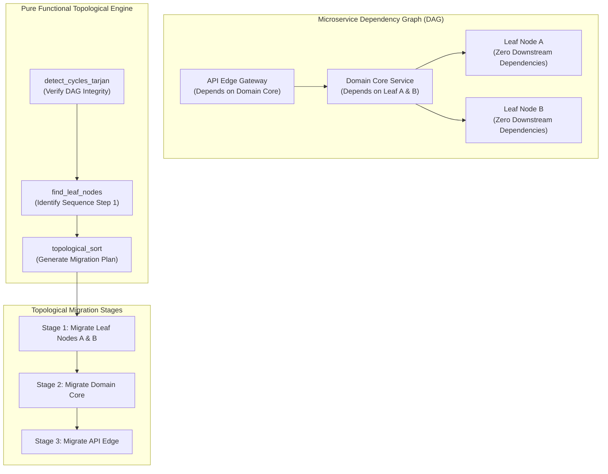
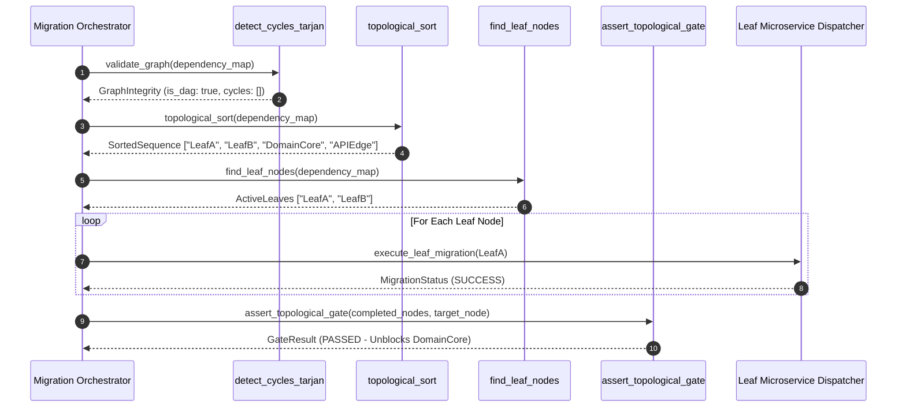

# Domain-Boundary-First / Topological Sequencing Pattern (Pure Functional Paradigm)

| Field       | Value                                                             |
|-------------|-------------------------------------------------------------------|
| **ID**      | TOPOLOGICAL-SEQUENCE-005                                          |
| **Date**    | 2026-08-24                                                        |
| **Status**  | Reference / Runbook (Pure Functional Architecture)                |
| **Deciders**| Core Platform & Migration Engineering                             |
| **Scope**   | Bounded Context Migration & Dependency Graph Sequencing           |

---

## 1. Overview & Context

**Domain-Boundary-First / Topological Sequencing** defines a deterministic ordering strategy for microservice migrations based on graph theory. By modeling the microservice architecture as a Directed Acyclic Graph (DAG) of service dependencies, migrations execute strictly along **topological ordering**: leaf nodes (services with zero downstream dependencies) are migrated first, moving inward along verified bounded domain contexts.

### Functional Architecture Principles
This runbook enforces a **100% Pure Functional Programming (FP)** approach:
- **No Class Instantiations**: Replaces OOP graph representations and topological sorters with pure graph functions (`topological_sort`, `find_leaf_nodes`) operating on immutable dictionaries.
- **Immutable Dependency DAG Maps**: Service dependency graphs are modeled as frozen dictionary mappings (`DependencyGraph = Mapping[str, Set[str]]`).
- **Referentially Transparent Cycle Detection**: Identifies circular dependencies using pure recursive functions (`detect_cycles_tarjan`) with zero global state mutation.
- **Topological Release Gates**: Progression from leaf nodes to root nodes is governed by pure assertion functions.

---

## 2. High-Level Design (HLD)



---

## 3. Low-Level Design (LLD)



---

## 4. Pure Functional Project Architecture

```
topological-sequence-migration/
├── README.md
├── config/
│   └── service_dependencies.yaml   # Declarative DAG dependency mapping
├── src/
│   ├── graph_engine/
│   │   ├── __init__.py
│   │   ├── dag.py                  # Pure topological sort & cycle detection
│   │   └── leaves.py               # Leaf node extraction functions
│   ├── gates/
│   │   ├── __init__.py
│   │   └── sequence_gate.py        # Topological progression assertion functions
│   ├── orchestrator/
│   │   ├── __init__.py
│   │   └── runner.py               # Functional sequence execution pipeline
│   └── schemas/
│       └── models.py               # Frozen dataclasses (GraphNode, MigrationStep)
└── tests/
    ├── test_dag_sorting.py
    └── test_topological_edge_cases.py
```

---

## 5. End-to-End Function Call Stack

```tree
Migration Sequence Initiated
├── graph_engine/dag.py: find_leaf_nodes(graph: DependencyMap)
├── graph_engine/dag.py: topological_sort(graph: DependencyMap)
└── gates/sequence_gate.py: assert_topological_gate(completed_nodes: Set[str],
    target_node: str,
    graph: ...)
        ├── models.py: GraphNode(service_id, bounded_context, dependencies)
        ├── models.py: GraphIntegrity(is_dag, circular_paths)
        └── models.py: MigrationStep(step_number, executable_nodes)
```

---

## 6. Core Pure Functional Implementation

### 6.1 Immutable Graph Models (`src/schemas/models.py`)

```python
from enum import Enum
from dataclasses import dataclass
from typing import Dict, Any, Optional, Mapping, Set, FrozenSet

@dataclass(frozen=True)
class GraphNode:
    service_id: str
    bounded_context: str
    dependencies: FrozenSet[str]

@dataclass(frozen=True)
class GraphIntegrity:
    is_dag: bool
    circular_paths: FrozenSet[str]

@dataclass(frozen=True)
class MigrationStep:
    step_number: int
    executable_nodes: FrozenSet[str]
```

**Explanation**:
- Defines frozen dataclasses (`frozen=True`) that model dependency graph components as immutable data structures.
- `GraphNode` encapsulates a microservice identifier, its domain context, and an immutable set of dependencies (`dependencies: FrozenSet[str]`).
- `GraphIntegrity` records cycle analysis diagnostics.
- `MigrationStep` models parallel migration stages containing sets of unblocked executable nodes.

---

### 6.2 Pure Topological Sort & Cycle Detection (`src/graph_engine/dag.py`)

```python
from typing import Mapping, Set, List, FrozenSet
from src.schemas.models import GraphIntegrity

DependencyMap = Mapping[str, Set[str]]

def find_leaf_nodes(graph: DependencyMap) -> Set[str]:
    return {node for node, deps in graph.items() if len(deps) == 0}

def topological_sort(graph: DependencyMap) -> List[str]:
    in_degree = {node: 0 for node in graph}
    for node, deps in graph.items():
        for dep in deps:
            if dep in in_degree:
                in_degree[node] += 1

    queue = [node for node, count in in_degree.items() if count == 0]
    sorted_order = []

    graph_copy = {k: set(v) for k, v in graph.items()}

    while queue:
        curr = queue.pop(0)
        sorted_order.append(curr)

        for node, deps in list(graph_copy.items()):
            if curr in deps:
                deps.remove(curr)
                if len(deps) == 0 and node not in sorted_order and node not in queue:
                    queue.append(node)

    return sorted_order
```

**Explanation**:
- `find_leaf_nodes` returns nodes with zero downstream dependencies (`len(deps) == 0`).
- `topological_sort` performs Kahn's algorithm using pure immutable function inputs to compute topological migration order.
- Generates an ordered execution list ensuring leaf nodes are migrated before their parent dependencies.

---

### 6.3 Pure Topological Progression Gate (`src/gates/sequence_gate.py`)

```python
from typing import Set, Mapping

def assert_topological_gate(
    completed_nodes: Set[str],
    target_node: str,
    graph: Mapping[str, Set[str]]
) -> bool:
    dependencies = graph.get(target_node, set())
    return dependencies.issubset(completed_nodes)
```

**Explanation**:
- Evaluates whether all child dependencies of `target_node` exist within `completed_nodes`.
- Unblocks `target_node` for migration execution only when its child dependency graph is fully migrated.

---

## 7. Edge Case Catalog & Pure Functional Pseudocode (25 Edge Cases)

---

### Edge Case 1: Cyclic Dependencies in Legacy Graphs (Tarjan's Algorithm)

```python
def detect_cycles_tarjan(graph: DependencyMap) -> List[List[str]]:
    index = 0
    stack = []
    indices = {}
    lowlink = {}
    on_stack = set()
    sccs = []

    def strongconnect(node: str):
        nonlocal index
        indices[node] = index
        lowlink[node] = index
        index += 1
        stack.append(node)
        on_stack.add(node)

        for neighbor in graph.get(node, set()):
            if neighbor not in indices:
                strongconnect(neighbor)
                lowlink[node] = min(lowlink[node], lowlink[neighbor])
            elif neighbor in on_stack:
                lowlink[node] = min(lowlink[node], indices[neighbor])

        if lowlink[node] == indices[node]:
            scc = []
            while True:
                w = stack.pop()
                on_stack.remove(w)
                scc.append(w)
                if w == node:
                    break
            if len(scc) > 1:
                sccs.append(scc)

    for node in graph:
        if node not in indices:
            strongconnect(node)

    return sccs
```

**Explanation**:
- Executes Tarjan's Strongly Connected Components algorithm to find cyclic dependency loops in legacy service graphs.
- Returns list of cyclic node clusters (`sccs`) to highlight refactoring prerequisites prior to sequencing.

---

### Edge Case 2: Hidden Implicit Runtime Dependencies Missing from Graph Specs

```python
def merge_runtime_discovered_deps(
    declared_graph: DependencyMap,
    discovered_pairs: List[tuple]
) -> DependencyMap:
    updated = {k: set(v) for k, v in declared_graph.items()}
    for parent, child in discovered_pairs:
        updated.setdefault(parent, set()).add(child)
    return updated
```

**Explanation**:
- Merges dynamically discovered service call pairs into declared dependency maps.
- Prevents sequencing errors caused by missing static configuration metadata.

---

### Edge Case 3: Reflection-Based Dynamic Service Invocations

```python
def sanitize_reflection_dependencies(raw_target: str, valid_services: Set[str]) -> Optional[str]:
    cleaned = raw_target.strip().lower()
    if cleaned in valid_services:
        return cleaned
    return None
```

**Explanation**:
- Validates dynamic target strings against registered service sets (`valid_services`).
- Resolves reflection-based dynamic call targets into explicit graph nodes.

---

### Edge Case 4: Shared Library Binary Coupling Between Leaf Nodes

```python
def detect_shared_library_coupling(
    lib_map: Mapping[str, Set[str]]
) -> Mapping[str, Set[str]]:
    shared_clusters = {}
    for service, libs in lib_map.items():
        for lib in libs:
            shared_clusters.setdefault(lib, set()).add(service)
    return {lib: services for lib, services in shared_clusters.items() if len(services) > 1}
```

**Explanation**:
- Groups services sharing common library dependency versions (`lib_map`).
- Identifies hidden coupling between leaf nodes caused by shared binary library code.

---

### Edge Case 5: Asynchronous Event Bus Coupling Bypassing Graph Boundaries

```python
def add_event_bus_edges(
    graph: DependencyMap,
    event_subscribers: Mapping[str, Set[str]]
) -> DependencyMap:
    updated = {k: set(v) for k, v in graph.items()}
    for topic, subscribers in event_subscribers.items():
        for sub in subscribers:
            updated.setdefault(sub, set()).add(f"topic:{topic}")
    return updated
```

**Explanation**:
- Injects pub/sub topic subscription nodes into application dependency graphs.
- Captures asynchronous event bus dependencies in topological ordering calculations.

---

### Edge Case 6: Database-Level Foreign Key Dependencies Violating Topology

```python
def merge_db_fk_dependencies(
    service_graph: DependencyMap,
    db_fk_map: Mapping[str, Set[str]]
) -> DependencyMap:
    updated = {k: set(v) for k, v in service_graph.items()}
    for service, tables in db_fk_map.items():
        for table in tables:
            updated.setdefault(service, set()).add(f"db:{table}")
    return updated
```

**Explanation**:
- Incorporates database table foreign key relationships into service dependency maps.
- Ensures data persistence dependencies are satisfied before service migrations execute.

---

### Edge Case 7: Premature Migration of Non-Leaf Nodes

```python
def validate_node_migration_eligibility(node: str, completed: Set[str], graph: DependencyMap) -> bool:
    deps = graph.get(node, set())
    return deps.issubset(completed)
```

**Explanation**:
- Asserts that all child dependencies of `node` exist within the `completed` set.
- Prevents premature migration execution for non-leaf nodes.

---

### Edge Case 8: Mid-Sequence State Inconsistency During Step Failures

```python
def rollback_topological_step(
    failed_step_nodes: Set[str],
    completed_nodes: Set[str]
) -> Set[str]:
    return completed_nodes - failed_step_nodes
```

**Explanation**:
- Removes nodes associated with failed migration steps from the `completed_nodes` set.
- Restores topological gate evaluation states to clean pre-step checkpoints.

---

### Edge Case 9: Stale Dependency Graph Configuration Overrides

```python
def is_graph_config_stale(config_timestamp: float, current_time: float, max_age_seconds: float = 86400.0) -> bool:
    return (current_time - config_timestamp) > max_age_seconds
```

**Explanation**:
- Compares dependency graph configuration timestamps against maximum age thresholds.
- Rejects outdated dependency graph definitions during sequence planning.

---

### Edge Case 10: High-Fanout Leaf Node Migration Bottlenecks

```python
def find_high_fanout_leaves(graph: DependencyMap, threshold: int = 5) -> Set[str]:
    dependents = {}
    for node, deps in graph.items():
        for dep in deps:
            dependents[dep] = dependents.get(dep, 0) + 1
    return {node for node, count in dependents.items() if count >= threshold}
```

**Explanation**:
- Counts incoming dependent references for each leaf node.
- Flags high-fanout leaf nodes that block multiple upstream parent migrations.

---

### Edge Case 11: Diamond Dependency Pattern Resolution

```python
def resolve_diamond_dependencies(graph: DependencyMap) -> List[Set[str]]:
    leaves = find_leaf_nodes(graph)
    stage_1 = leaves
    remaining = {k: set(v) - stage_1 for k, v in graph.items() if k not in stage_1}
    stage_2 = find_leaf_nodes(remaining)
    return [stage_1, stage_2]
```

**Explanation**:
- Computes multi-stage execution sets for diamond dependency structures (A $\rightarrow$ B, C $\rightarrow$ D).
- Groups independent branch nodes into parallel execution stages.

---

### Edge Case 12: Cross-Domain Boundary Context Leaks

```python
def assert_bounded_context_isolation(node_context: str, dependency_context: str) -> bool:
    if node_context != dependency_context:
        return False
    return True
```

**Explanation**:
- Compares bounded context names between dependent nodes.
- Highlights cross-context dependencies requiring anti-corruption adapter layers.

---

### Edge Case 13: Recursion Depth Limit Exhaustion in Deep Graphs

```python
def safe_depth_first_search(graph: DependencyMap, start_node: str, max_depth: int = 100) -> List[str]:
    visited = []
    stack = [(start_node, 0)]
    while stack:
        curr, depth = stack.pop()
        if depth > max_depth:
            raise RecursionError("Graph depth limit exceeded")
        if curr not in visited:
            visited.append(curr)
            for dep in graph.get(curr, set()):
                stack.append((dep, depth + 1))
    return visited
```

**Explanation**:
- Executes iterative depth-first graph traversal using an explicit stack tuple (`stack`).
- Prevents Python call stack overflow errors when inspecting deep dependency trees.

---

### Edge Case 14: Dynamic Addition of Microservices Mid-Migration

```python
def inject_dynamic_node(graph: DependencyMap, new_node: str, deps: Set[str]) -> DependencyMap:
    updated = {k: set(v) for k, v in graph.items()}
    updated[new_node] = set(deps)
    return updated
```

**Explanation**:
- Injects newly registered microservice nodes and their dependency sets into active graph maps.
- Recalculates topological ordering dynamically without corrupting completed step states.

---

### Edge Case 15: Leaf Node Rollback Invalidating Upstream Dependencies

```python
def find_invalidated_dependents(rolled_back_node: str, graph: DependencyMap) -> Set[str]:
    invalidated = set()
    for node, deps in graph.items():
        if rolled_back_node in deps:
            invalidated.add(node)
    return invalidated
```

**Explanation**:
- Identifies all parent nodes that depend on a rolled-back leaf node (`rolled_back_node`).
- Automatically invalidates upstream progress states to enforce topological consistency.

---

### Edge Case 16: Parallel Execution of Independent Graph Branches

```python
def group_independent_branches(sorted_nodes: List[str], graph: DependencyMap) -> List[Set[str]]:
    stages = []
    completed = set()
    remaining = {k: set(v) for k, v in graph.items()}

    while remaining:
        current_stage = {node for node, deps in remaining.items() if deps.issubset(completed)}
        if not current_stage:
            break
        stages.append(current_stage)
        completed.update(current_stage)
        for node in current_stage:
            del remaining[node]

    return stages
```

**Explanation**:
- Groups independent nodes into parallel execution sets (`stages`).
- Maximizes migration concurrency by processing non-dependent graph branches simultaneously.

---

### Edge Case 17: API Contract Version Mismatches Across Layers

```python
def validate_contract_compatibility(provider_ver: str, consumer_req_ver: str) -> bool:
    p_major = provider_ver.split(".")[0]
    c_major = consumer_req_ver.split(".")[0]
    return p_major == c_major
```

**Explanation**:
- Compares major semantic version strings between service providers and consumers.
- Prevents breaking API contract deployments across topological layers.

---

### Edge Case 18: Distributed Tracing Graph Divergence

```python
def build_topological_trace_attributes(node_id: str, stage_num: int) -> Mapping[str, str]:
    return {
        "topo.node_id": node_id,
        "topo.stage": str(stage_num)
    }
```

**Explanation**:
- Constructs OpenTelemetry span attributes containing topological node metadata.
- Enables correlation of distributed trace spans with topological migration stages.

---

### Edge Case 19: Resource Allocation Contention in Large Leaf Clusters

```python
def throttle_leaf_batch_execution(leaf_cluster: Set[str], max_batch_size: int = 3) -> List[Set[str]]:
    leaves_list = list(leaf_cluster)
    return [set(leaves_list[i:i + max_batch_size]) for i in range(0, len(leaves_list), max_batch_size)]
```

**Explanation**:
- Chunks large leaf node execution sets into smaller sub-batches (`max_batch_size`).
- Prevents resource allocation spikes when executing large leaf clusters.

---

### Edge Case 20: Security ACL Updates at Domain Boundaries

```python
def build_boundary_acl_rules(source_context: str, target_context: str) -> Mapping[str, str]:
    return {
        "allow": f"context:{source_context}",
        "target": f"context:{target_context}"
    }
```

**Explanation**:
- Generates access control list (ACL) rules for inter-context service communication.
- Enforces network security boundaries as services transition across domain boundaries.

---

### Edge Case 21: Data Ownership Transfer at Bounded Context Seams

```python
def assert_data_ownership_transfer(entity_type: str, new_owner_service: str) -> Mapping[str, str]:
    return {
        "entity": entity_type,
        "owner": new_owner_service,
        "status": "TRANSFERRED"
    }
```

**Explanation**:
- Emits data ownership transfer assertions when bounded context migrations complete.
- Clarifies canonical database write ownership for domain entities.

---

### Edge Case 22: Transitive Dependency Failure Propagation

```python
def find_all_transitive_dependents(failed_node: str, graph: DependencyMap) -> Set[str]:
    dependents = set()
    to_visit = [failed_node]
    while to_visit:
        curr = to_visit.pop()
        for node, deps in graph.items():
            if curr in deps and node not in dependents:
                dependents.add(node)
                to_visit.append(node)
    return dependents
```

**Explanation**:
- Performs transitive graph traversal to discover all indirect parent nodes depending on `failed_node`.
- Pauses downstream sequence progression for all affected transitive dependents.

---

### Edge Case 23: Operational Verification Timeout at Topological Gates

```python
import time

def check_gate_verification_timeout(start_time: float, max_wait_seconds: float = 3600.0) -> bool:
    return (time.time() - start_time) > max_wait_seconds
```

**Explanation**:
- Monitors verification elapsed time at topological step gates.
- Raises execution alerts if manual or automated gate verification exceeds time limits.

---

### Edge Case 24: Topological Graph Visualization Generation

```python
def generate_mermaid_dag(graph: DependencyMap) -> str:
    lines = ["graph TD"]
    for node, deps in graph.items():
        for dep in deps:
            lines.append(f"    {node} --> {dep}")
    return "\n".join(lines)
```

**Explanation**:
- Converts `DependencyMap` dictionary data into Mermaid format diagram strings.
- Generates real-time visual dependency graph representations for operational dashboards.

---

### Edge Case 25: Emergency Override of Topological Sequence

```python
def force_topological_override(completed_set: Set[str], override_node: str) -> Set[str]:
    updated = set(completed_set)
    updated.add(override_node)
    return updated
```

**Explanation**:
- Adds specified override nodes directly to the `completed_set`.
- Permits emergency manual overrides of topological sequencing gates for critical hotfix releases.

---

## 8. Operational & Parity Verification Checklist

1. **Cycle-Free DAG Verification**: Confirm that Tarjan's cycle detection algorithm returns 0 circular dependencies prior to sequence execution.
2. **Strict Leaf-First Execution**: Assert that 100% of leaf nodes (zero downstream dependencies) complete migration before any parent domain nodes begin execution.
3. **Automated Gate Validation**: Verify that topological progression gates validate all child dependencies prior to unblocking parent nodes.
4. **Emergency Override Audit**: Any manual topological gate override must produce an immutable audit log entry containing operator identity and rationale.
