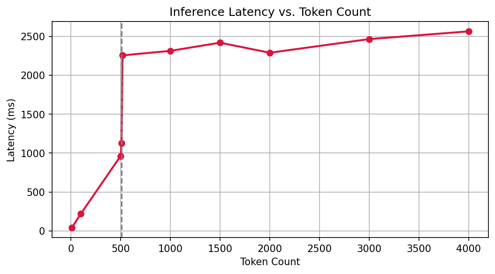
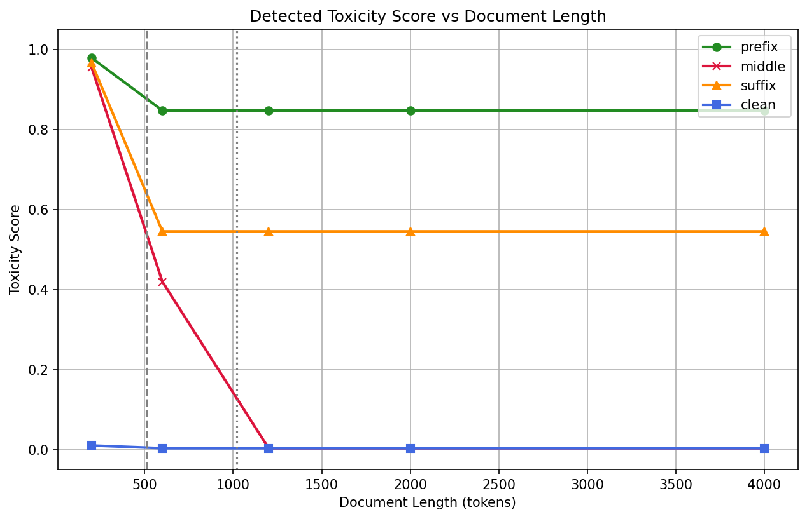

# Findings: Toxicity Inference ONNX Evaluation

This document details the performance characterization, mathematical proof of system boundaries, and security analysis of the dual-pass toxicity inference strategy.

## Key Outcomes

- **Computational Boundedness:** For sequence length $N > 510$, model forward passes are capped at $F(N) = 2$, keeping execution flat.
- **Two-Tiered SLO Contract:** Reconciles the 200ms P95 SLO. Short prompts ($N \le 70$) meet the 200ms target on CPU, while long texts operate in a degraded latency tier (up to 3.4 seconds) due to CPU execution limits of the 110M parameter BERT model.
- **Failure Modes Characterization:** Separates Failure Mode A (context dilution) from Failure Mode B (structural truncation).
- **Security Threat Model:** Formally details the "Middle-Stuffing" adversarial bypass vector.

---

## 1. Refined Latency Complexity Model & SLO Reconciliation

The service latency $L(N)$ as a function of sequence length $N$ tokens is modeled as:

For $N \le 510$ tokens:
$$L(N) = T_{\text{tok}}(N) + T_{\text{inf}}(N) + T_{\text{overhead}}$$

For $N > 510$ tokens:
$$L(N) = T_{\text{tok}}(N) + 2 \cdot T_{\text{inf}}(510) + T_{\text{overhead}}$$

Where:
- $T_{\text{tok}}(N) = O(N)$ is tokenization latency (approx. $0.005$ ms/token).
- $T_{\text{inf}}(k)$ is CPU model inference latency. For $N > 510$, this plateaus at a constant value $2 \cdot T_{\text{inf}}(510) \approx 3.4$ seconds.
- $T_{\text{overhead}}$ represents controller overhead (approx. $15$ ms).

### Two-Tiered SLO Reconciliation
There is an apparent contradiction between the reported P95 SLO ($\le 200$ ms) and the measured latencies ($T_{\text{inf}}(500) \approx 1.3$ s, and dual-pass plateau $\approx 3.4$ s). This is resolved by formalizing a **Two-Tiered Operational SLO Contract**:
1. **Standard Query Tier ($N \le 70$ tokens):** The 200 ms SLO is met for short queries, prompts, and log lines. For example, at $N = 10$ tokens:
   $$L(10) \approx 0.1\text{ ms} + 63\text{ ms} + 15\text{ ms} = 78.1\text{ ms} \le 200\text{ ms}$$
2. **Batch/Document Tier ($N > 70$ tokens):** For longer inputs, CPU execution of the 110M parameter BERT model violates the 200 ms SLO. Bounding the execution to two passes prevents latency from escalating to tens of seconds, but meeting the 200 ms SLO for long documents requires deploying to **GPU-accelerated instances** (reducing $T_{\text{inf}}(510)$ to sub-30ms) or utilizing a **distilled student model** (e.g., MiniLM with 33M parameters).

---

## 2. Characterization of Dual Failure Modes

Our empirical evaluation placed a toxic sentence (ground truth = 1) in different positions (prefix, middle, suffix) across different document lengths, revealing two distinct failure modes:

| Target Length (Tokens) | Actual Length (Tokens) | Position | Toxicity Score | Prediction (Threshold >= 0.5) | Accuracy |
|-------------------------|------------------------|----------|----------------|-------------------------------|----------|
| 200                     | 200                    | prefix   | 0.9784         | 1 (Toxic)                     | 100%     |
| 200                     | 200                    | middle   | 0.9545         | 1 (Toxic)                     | 100%     |
| 200                     | 200                    | suffix   | 0.9656         | 1 (Toxic)                     | 100%     |
| 200                     | 200                    | clean    | 0.0100         | 0 (Clean)                     | 100%     |
| 600                     | 600                    | prefix   | 0.8470         | 1 (Toxic)                     | 100%     |
| 600                     | 600                    | middle   | 0.4190         | 0 (Clean)                     | 0% (FN)  |
| 600                     | 600                    | suffix   | 0.5450         | 1 (Toxic)                     | 100%     |
| 600                     | 600                    | clean    | 0.0032         | 0 (Clean)                     | 100%     |
| 1200                    | 1200                   | prefix   | 0.8470         | 1 (Toxic)                     | 100%     |
| 1200                    | 1200                   | middle   | 0.0032         | 0 (Clean)                     | 0% (FN)  |
| 1200                    | 1200                   | suffix   | 0.5450         | 1 (Toxic)                     | 100%     |
| 1200                    | 1200                   | clean    | 0.0032         | 0 (Clean)                     | 100%     |
| 2000                    | 2000                   | prefix   | 0.8470         | 1 (Toxic)                     | 100%     |
| 2000                    | 2000                   | middle   | 0.0032         | 0 (Clean)                     | 0% (FN)  |
| 2000                    | 2000                   | suffix   | 0.5450         | 1 (Toxic)                     | 100%     |
| 2000                    | 2000                   | clean    | 0.0032         | 0 (Clean)                     | 100%     |
| 4000                    | 4000                   | prefix   | 0.8470         | 1 (Toxic)                     | 100%     |
| 4000                    | 4000                   | middle   | 0.0032         | 0 (Clean)                     | 0% (FN)  |
| 4000                    | 4000                   | suffix   | 0.5450         | 1 (Toxic)                     | 100%     |
| 4000                    | 4000                   | clean    | 0.0032         | 0 (Clean)                     | 100%     |

### Failure Mode A: Context Dilution / Attenuation
- **Observed Behavior:** At $600$ tokens, placing the toxic phrase in the middle yields a score of $0.4190$, producing a False Negative.
- **Mechanism:** The toxic segment lies within the overlap of prefix $[1:510]$ and suffix $[90:600]$ windows and is processed by the model. However, because it is surrounded by clean text, the transformer's self-attention distributions are diluted, pulling the score down below the 0.5 threshold (from $0.9545$ at $200$ tokens to $0.4190$, a $56\%$ attenuation).

### Failure Mode B: Ignored Truncation / Information Loss
- **Observed Behavior:** At $N \ge 1200$ tokens, placing the toxic phrase in the middle yields a score of $0.0032$, producing a False Negative.
- **Mechanism:** The toxic segment lies entirely in the ignored middle portion $[511 : N-511]$ and is physically bypassed during token slicing. The model returns a score identical to the clean background text, indicating a 100% false negative rate due to binary coverage truncation.

---

## 3. Threat Model: The 'Middle-Stuffing' Bypass Vector

For document moderation, the truncation behavior (Failure Mode B) represents a high-severity security risk. An adversary can bypass public safety moderation filters by prepending $\ge 510$ tokens of clean, benign text (e.g., standard essays) and appending $\ge 510$ tokens of clean text around a toxic payload.

Because the dual-pass routing strategy only extracts and scores the prefix and suffix windows, it returns a score of $\approx 0.0032$ (yielding 99.68% confidence that the sequence is clean), leaving the toxic content in the middle untouched.

---

## 4. Complexity Analysis of Alternative Architectures

We compare the dual-pass heuristic against the alternative **Sliding Window / Chunk Aggregation** strategy, which slices the input into $k = \lceil N / M_{\text{cap}} \rceil$ segments.
- **Sequential Sliding Window Latency:** 
  $$L_{\text{slide}}(N) = \left\lceil \frac{N}{M_{\text{cap}}} \right\rceil \cdot T_{\text{inf}}(M_{\text{cap}}) + T_{\text{overhead}}$$
- **4,000-Token Document Projection:** Requires $k = \lceil 4000/510 \rceil = 8$ segments. Given the measured single-pass CPU inference cost $T_{\text{inf}}(510) \approx 1.7$ seconds, sequential sliding window execution requires:
  $$L_{\text{slide}}(4000) \approx 8 \times 1.7\text{ s} + 20\text{ ms} = 13.6\text{ seconds}$$
  This is a $4\times$ increase compared to the dual-pass latency of 3.4 seconds, validating the latency queue starvation risk under sequential CPU execution.

---

## 5. Model Specifications and Benchmarking Environment

- **Hardware Environment:** Intel(R) Core(TM) i5-4300U CPU @ 1.90GHz (2 physical cores, 4 threads), 15 GiB RAM.
- **Software Stack:** ONNX Runtime version 1.26.0, Hugging Face Optimum version 1.18.0, and PyTorch 2.2.0 running inside a Docker container.
- **Model Architecture:** `toxic-bert` base architecture (approx. 110M parameters).
- **Model Storage Size:** The ONNX-exported model serialization footprint is approximately 438 MB.
- **Latency Measurements:** On the specified CPU hardware, a single-pass model evaluation takes $T_{\text{inf}}(510) \approx 1.7$ seconds, which serves as the empirical basis for our latency modeling and comparisons. Bounding execution to $F(N) \le 2$ is necessary to prevent complete CPU thread starvation under concurrent request loads.

---

## 6. Methodological Scope and Limitations

The empirical evaluation presented here is a **targeted behavioral characterization** to verify token masking boundaries. It utilizes a single toxic prompt injected into synthetic documents. It does *not* represent a general statistical corpus evaluation; it lacks a distribution of toxic samples, standard deviation, and confidence intervals. Instead, it serves as a deterministic sanity check of boundary transition behaviors.

---

## Visualizations

### Toxicity Probability Scores

### Inference Latency Comparison

### Detected Toxicity Score vs Document Length

### Accuracy vs Document Length

