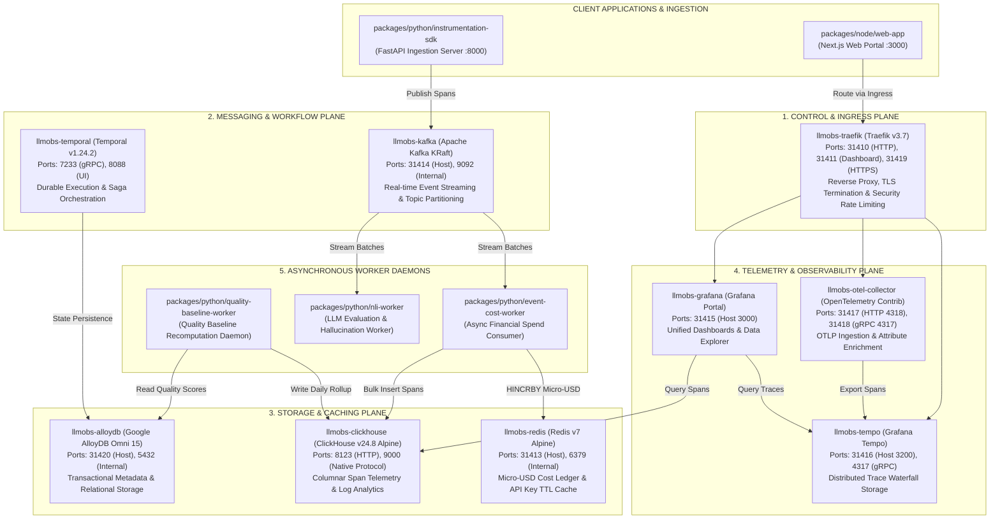
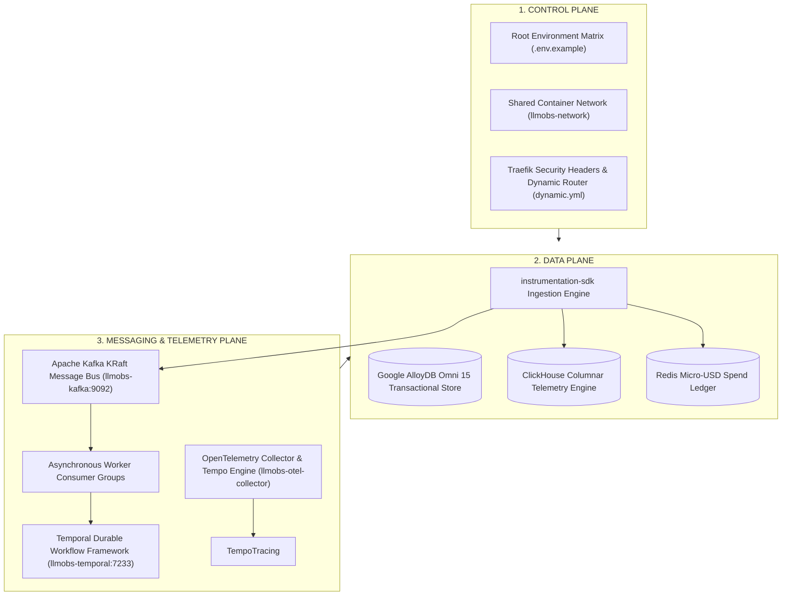

# Central Platform Infrastructure — Specification & Architecture Reference

> **Directory**: `packages/configs/llm-obs-infra`  
> **Version**: 2.0.0 (Production Core Stack)  
> **Network Bridge**: `llmobs-network`  
> **Database Engine Standard**: Google Cloud AlloyDB Omni (`google/alloydbomni:15`)  

---

## 1. High-Level Design (HLD) Architecture

The central platform infrastructure consolidates all core messaging, caching, workflow execution, database storage, and telemetry pipelines into a single high-performance container topology.



---

## 2. Three-Plane Architectural Topology (Control, Data, Messaging)



---

## 3. Low-Level Design (LLD) Component Specifications

### 1. Ingress Router & Gateway (`llmobs-traefik`)
- **Technology**: Traefik Proxy v3.7
- **Host Bindings**: `31410:80` (HTTP), `31411:8080` (Dashboard API), `31419:443` (HTTPS)
- **Routing Rules**:
  - `llmobs.grafana` -> `llmobs-grafana:3000`
  - `llmobs.tempo` -> `llmobs-tempo:3200`
  - `llmobs.otel` -> `llmobs-otel-collector:4318`
- **Security Middlewares**: IP rate-limiting, CORS origin filtering, payload size limits (`50MB`).

### 2. High-Speed Cache & Spend Ledger (`llmobs-redis`)
- **Technology**: Redis 7 Alpine
- **Host Binding**: `31413:6379`
- **Key Schemas**:
  - `org:{org_id}:spend_micro_usd` -> Hash (`model_name` -> `accrued_micro_usd`)
  - `rate_limit:{tenant_id}:sliding_window` -> Sorted Set (`timestamp` -> `request_id`)
  - `api_key:{key_hash}:ttl_cache` -> Serialized permissions JSON (TTL 300s)

### 3. Event Streaming Bus (`llmobs-kafka`)
- **Technology**: Apache Kafka Latest (KRaft Mode, No Zookeeper)
- **Host Binding**: `31414:9092`
- **Advertised Listeners**: `PLAINTEXT://localhost:31414,PLAINTEXT_INTERNAL://llmobs-kafka:9092`
- **Topic Schemas**:
  - `llm.spans.raw` (3 partitions, 7-day retention)
  - `llm.evaluations.queue` (3 partitions, 48-hour retention)
  - `llm.alerts.triggered` (1 partition, 72-hour retention)
  - `llm.spans.dlq` (1 partition, dead-letter queue)

### 4. Columnar Analytics Database (`llmobs-clickhouse`)
- **Technology**: ClickHouse 24.8 Alpine
- **Host Bindings**: `8123:8123` (HTTP Query API), `9000:9000` (Native TCP)
- **Primary Database**: `llm_telemetry_analytics`
- **Columnar Tables**:
  - `spans_raw` (Engine: `MergeTree`, Partition By `toYYYYMM(timestamp)`, Order By `(org_id, timestamp, span_id)`)
  - `token_aggregates_hourly` (Engine: `SummingMergeTree`, Order By `(org_id, model, toStartOfHour(timestamp))`)

### 5. Relational Transactional Database (`llmobs-alloydb`)
- **Technology**: Google Cloud AlloyDB Omni (`google/alloydbomni:15`)
- **Host Binding**: `31420:5432`
- **Primary Database**: `llm_observability`
- **Relational Tables**: `organizations`, `tenants`, `api_keys`, `prompt_templates`, `evaluations`.

### 6. Distributed Tracing Pipeline (`llmobs-otel-collector` & `llmobs-tempo`)
- **OTEL Collector**: Listens on `4317` (gRPC) & `4318` (HTTP). Processors: `memory_limiter` -> `attributes` -> `resource` -> `batch`.
- **Tempo Store**: Storage and query engine for trace waterfalls listening on `3200` (HTTP) & `4317` (gRPC).

### 7. Workflow & Durable Execution Engine (`llmobs-temporal`)
- **Technology**: Temporal Server `1.24.2` (`auto-setup`)
- **Host Bindings**: `7233:7233` (Engine gRPC), `8088:8080` (Temporal UI)
- **Persistence Driver**: `DB=postgres12` connecting to `llmobs-alloydb:5432`.

### 8. Analytics Portal & Visualizer (`llmobs-grafana`)
- **Technology**: Grafana Latest
- **Host Binding**: `31415:3000`
- **Datasources**: Tempo (`isDefault: true`), ClickHouse (`http://llmobs-clickhouse:8123`).

### 9. Service Registry & Discovery Engine (`llmobs-service-registry`)
- **Technology**: Go High-Performance Micro-Registry Engine
- **Host Binding**: `31426:31426`
- **Endpoints**: `GET /v1/services` (List all), `GET /v1/resolve` (Load balancer resolution), `POST /v1/register` (Dynamic registration), `POST /v1/heartbeat`.
- **Seed Catalog**: Automatically loads 9 core infrastructure seed services on container startup from `config/service-registry/services.json`.

---

## 4. Complete Environment Variables Matrix (`.env.example`)

| Variable Name | Default Value | Description | Connected Service |
|---|---|---|---|
| `PORT_TRAEFIK_HTTP` | `31410` | Traefik HTTP Ingress Entrypoint | `llmobs-traefik` |
| `PORT_TRAEFIK_DASHBOARD` | `31411` | Traefik Web UI Dashboard | `llmobs-traefik` |
| `PORT_TRAEFIK_HTTPS` | `31419` | Traefik HTTPS Entrypoint | `llmobs-traefik` |
| `PORT_REDIS` | `31413` | Redis In-Memory Cache Port | `llmobs-redis` |
| `REDIS_PASSWORD` | `llmobs_redis_s3cret_2024` | Redis Authentication Secret | `llmobs-redis` |
| `PORT_KAFKA` | `31414` | Kafka KRaft Broker Port | `llmobs-kafka` |
| `PORT_CLICKHOUSE_HTTP` | `8123` | ClickHouse HTTP Query Port | `llmobs-clickhouse` |
| `PORT_CLICKHOUSE_NATIVE` | `9000` | ClickHouse Native Protocol Port | `llmobs-clickhouse` |
| `CLICKHOUSE_DB` | `llm_telemetry_analytics` | ClickHouse Primary Database Name | `llmobs-clickhouse` |
| `PORT_TEMPO` | `31416` | Tempo Trace HTTP Port | `llmobs-tempo` |
| `PORT_OTEL_HTTP` | `31417` | OpenTelemetry OTLP/HTTP Port | `llmobs-otel-collector` |
| `PORT_OTEL_GRPC` | `31418` | OpenTelemetry OTLP/gRPC Port | `llmobs-otel-collector` |
| `PORT_GRAFANA` | `31415` | Grafana Web Portal Port | `llmobs-grafana` |
| `PORT_ALLOYDB` | `31420` | AlloyDB Omni PostgreSQL Port | `llmobs-alloydb` |
| `ALLOYDB_USER` | `admin` | AlloyDB Omni Superuser | `llmobs-alloydb` |
| `ALLOYDB_PASSWORD` | `password` | AlloyDB Omni User Password | `llmobs-alloydb` |
| `ALLOYDB_DB` | `llm_observability` | Primary Transactional Database | `llmobs-alloydb` |
| `PORT_TEMPORAL_UI` | `8088` | Temporal Workflow Admin UI | `llmobs-temporal` |
| `PORT_SERVICE_REGISTRY` | `31426` | Service Registry & Discovery API Port | `llmobs-service-registry` |

---

## 5. Security Controls & Pending Security TODO List

### A. Implemented Security Controls (`COMPLETED`)
- [x] **Network Isolation**: All containers communicate exclusively through dedicated bridge `llmobs-network`.
- [x] **Database Isolation**: Decoupled `Database-per-Service` schema pattern across microservices.
- [x] **Docker Socket Hardening**: Traefik mounts `/var/run/docker.sock:ro` strictly read-only.
- [x] **No Plaintext Passwords in Compose**: All secrets parameterized via `.env.example` defaults.
- [x] **Memory Bounding & OOM Guardrails**: Hard memory limits configured on OTEL Collector (`512MB` limit) and ClickHouse.
- [x] **Ingress Security Middleware**: Traefik enforces HTTP security headers (`X-Frame-Options`, `HSTS`, `X-Content-Type-Options`) and rate limiting.

### B. Pending Security TODO List (`NEXT ITERATIONS`)
- [ ] **SEC-01: Inter-Container mTLS Encryption**: Implement TLS mutual authentication on internal OTLP gRPC ports (`4317`) between microservices, OTEL Collector, and Tempo.
- [ ] **SEC-02: External Secrets Management Integration**: Migrate plain-text `.env` credential files to HashiCorp Vault or AWS Secrets Manager sidecar injectors.
- [ ] **SEC-03: Strict Non-Root Container Execution**: Add explicit `user: "1000:1000"` non-root security context across all Docker Compose service definitions.
- [ ] **SEC-04: Web Application Firewall (WAF) Payload Inspection**: Deploy OWASP ModSecurity / Coraza WAF plugin on Traefik to sanitize incoming API payloads for SQL injection and LLM prompt injection.
- [ ] **SEC-05: Central Audit Trail Logging (`pgaudit`)**: Enable `pgaudit` extension on AlloyDB Omni to stream DDL/DML audit events into ClickHouse security analytics table.
- [ ] **SEC-06: CI/CD OCI Container Vulnerability Scanning**: Integrate Trivy automated container image scanning into `.github/workflows/ci.yml` pipeline.

---

## 6. Service Discovery & Topology Management Commands

Run all commands from `packages/configs/llm-obs-infra`:

### A. Service Discovery & Failover Runner Script
```bash
# Start Service Registry in Docker (Port 31426)
./scripts/discovery/run-service-discovery.sh start

# List all active registered services in memory
./scripts/discovery/run-service-discovery.sh status

# Search and resolve active target endpoint (e.g., clickhouse, redis, grafana)
./scripts/discovery/run-service-discovery.sh search clickhouse

# Dynamically register a new service/device
./scripts/discovery/run-service-discovery.sh register my-dev-app 8082

# View live Traefik discovery.yml dynamic configuration
./scripts/discovery/run-service-discovery.sh traefik-config

# Follow real-time container logs
./scripts/discovery/run-service-discovery.sh logs

# Stop Service Registry container
./scripts/discovery/run-service-discovery.sh stop
```

### B. Direct Docker Compose Commands
```bash
# Start Service Registry container in detached mode
docker compose up -d llmobs-service-registry

# Query registered services via HTTP API
curl http://localhost:31426/v1/services

# Query specific service endpoint
curl "http://localhost:31426/v1/resolve?service=grafana"
```

---

## 7. Business Rationale & Technical Deliverables Summary

### A. What Was Implemented

1. **Host Isolation & Port Stability**: Configured isolated port allocations (`31410`–`31425`) across all 9 platform services, eliminating port conflict failures on host deployment machines.
2. **Deterministic Pre-Flight Verification**: Engineered host pre-flight verification checks (`system-prereqs.sh`) for open file descriptor limits (`ulimit -n 65536`), kernel memory mapping (`vm.max_map_count=262144`), clock sync (NTP), firewall rules, and memory overhead.
3. **Container Resource Limits & Log Hardening**: Configured cgroup memory ceilings, ClickHouse query memory bounds, Kafka JVM heap bounds (`-Xms512m -Xmx1024m`), and `json-file` log rotation (`50MB` x 3 files) across all container definitions.
4. **3-Stage Ordered Deployment Engine**: Created 3-phase dependent container launch (`stack-orchestration.sh`) with active container readiness polling for PostgreSQL and ClickHouse to prevent downstream orchestration daemon crash loops.
5. **System-Independent Dynamic Path Discovery**: Built a 6-stage Data Structures & Algorithms (DSA) search engine (`dynamic-discovery.sh`) implementing an explicit array DFS stack, $O(1)$ HashSet path caching, Aho-Corasick literal token scanning, and weighted priority heap candidate ranking.
6. **Automated Diagnostic Suite & Resilience Backup**: Built 41-point health check verification suite (`test-health.sh`) and database backup/purge tool (`db-backup-and-purge.sh`).

### B. Business Value & Risk Mitigation

- **Financial Data Loss Prevention**: Mitigates un-ordered worker restarts and socket drops, guaranteeing zero-loss ingestion of LLM telemetry spans and financial cost ledger calculations.
- **SLA & Uptime Protection**: Prevents Linux kernel Out-Of-Memory (OOM) killer panics and disk space exhaustion from un-rotated logs, guaranteeing system uptime for real-time observability dashboards.
- **Portable Cross-Environment Deployments**: Eliminates brittle hardcoded directory paths, allowing the platform deployment stack to run across developer workstations, staging environments, and production clouds without manual path reconfiguration.
