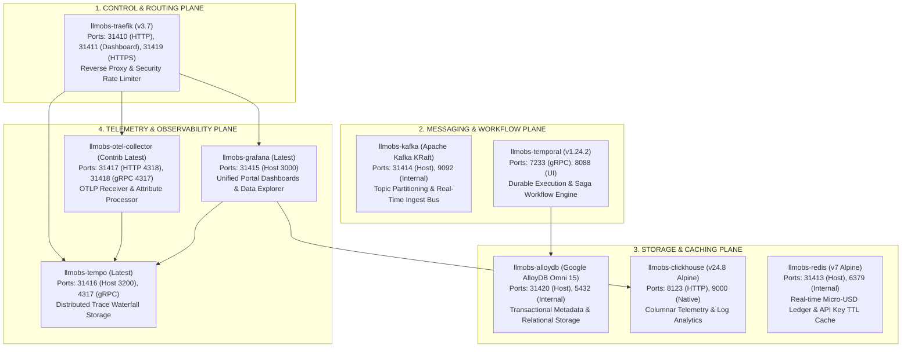

# LLM Observability Platform — Central Infrastructure Reference & Specification

> **Version**: 2.0.0 (Production Core Stack)  
> **Container Engine**: Docker Compose / OCI Compatible  
> **Network Bridge**: `llmobs-network`  
> **Database Engine Standard**: Google Cloud AlloyDB Omni (`google/alloydbomni:15`)  

---

## 1. High-Level Design (HLD) Architecture

The central platform infrastructure (`packages/configs/llm-obs-infra`) consolidates all core messaging, caching, workflow execution, database storage, and telemetry pipelines into a single high-performance container topology.



---

## 2. Low-Level Design (LLD) & Service Specifications

### Service 1: Traefik Ingress Gateway (`llmobs-traefik`)
- **Image**: `traefik:v3.7`
- **Host Ports**: `31410` (HTTP), `31411` (Dashboard), `31419` (HTTPS)
- **Role**: Edge router, TLS termination, IP rate-limiting, payloads security header enforcement.
- **Dynamic Proxy Mapping**:
  - `Host("llmobs.grafana")` -> `llmobs-grafana:3000`
  - `Host("llmobs.tempo")` -> `llmobs-tempo:3200`
  - `Host("llmobs.otel")` -> `llmobs-otel-collector:4318`
- **Tracing**: OTLP gRPC export to `llmobs-otel-collector:4317`.

### Service 2: Redis Micro-USD Ledger (`llmobs-redis`)
- **Image**: `redis:7-alpine`
- **Host Port**: `31413` -> Container `6379`
- **Role**: High-throughput atomic key-value ledger (`HINCRBYFLOAT` for LLM cost tracking), tenant rate-limiting sliding windows, API key cache.
- **Healthcheck**: `redis-cli -a ${REDIS_PASSWORD} ping`

### Service 3: Kafka Streaming Message Bus (`llmobs-kafka`)
- **Image**: `apache/kafka:latest` (KRaft Mode, No Zookeeper)
- **Host Port**: `31414` -> Container `9092`
- **Advertised Listeners**: `PLAINTEXT://localhost:31414,PLAINTEXT_INTERNAL://llmobs-kafka:9092`
- **Role**: Real-time event streaming bus for raw LLM prompt/completion payloads, worker topic queues (`llm.spans.raw`, `llm.evaluations.queue`).

### Service 4: ClickHouse Columnar Telemetry Engine (`llmobs-clickhouse`)
- **Image**: `clickhouse/clickhouse-server:24.8-alpine`
- **Host Ports**: `8123` (HTTP Query API), `9000` (Native Protocol)
- **Role**: High-speed columnar analytics engine for span telemetry, aggregate token counts, latency distributions, and query log mining.
- **Database**: `llm_telemetry_analytics`
- **Healthcheck**: `clickhouse-client --query "SELECT 1"`

### Service 5: Tempo Distributed Trace Waterfall (`llmobs-tempo`)
- **Image**: `grafana/tempo:latest`
- **Host Ports**: `31416` -> Container `3200` (HTTP API), `4317` (gRPC Receiver)
- **Role**: Storage and index-free query engine for distributed trace waterfalls generated by microservices and Next.js frontend.

### Service 6: OpenTelemetry Collector (`llmobs-otel-collector`)
- **Image**: `otel/opentelemetry-collector-contrib:latest`
- **Host Ports**: `31417` -> Container `4318` (OTLP/HTTP), `31418` -> Container `4317` (OTLP/gRPC)
- **Processors**: `memory_limiter`, `attributes` (environment, namespace, protocol enrichment), `resource`, `batch`.
- **Exporters**: `otlp/tempo`, `debug`.

### Service 7: Grafana Platform Portal (`llmobs-grafana`)
- **Image**: `grafana/grafana:latest`
- **Host Port**: `31415` -> Container `3000`
- **Provisioned Datasources**: Tempo (`isDefault: true`), ClickHouse (`http://llmobs-clickhouse:8123`).

### Service 8: AlloyDB Omni Relational Store (`llmobs-alloydb`)
- **Image**: `google/alloydbomni:15`
- **Host Port**: `31420` -> Container `5432`
- **Role**: Transactional relational database for organization settings, RBAC policies, prompt templates, and evaluation run configurations.
- **Environment**: `POSTGRES_USER=${ALLOYDB_USER:-admin}`, `POSTGRES_PASSWORD=${ALLOYDB_PASSWORD:-password}`, `POSTGRES_DB=${ALLOYDB_DB:-llm_observability}`
- **Healthcheck**: `pg_isready -U admin -d llm_observability`

### Service 9: Temporal Workflow Engine (`llmobs-temporal`)
- **Image**: `temporalio/auto-setup:1.24.2`
- **Host Ports**: `7233` (Engine gRPC), `8088` (Temporal Admin UI)
- **Persistence Driver**: `DB=postgres12` connecting to `llmobs-alloydb:5432`
- **Role**: Durable execution framework orchestrating long-running LLM evaluation pipelines, background index recalculations, and retry sagas.

---

## 3. End-to-End Test Matrix & Verification Status

```text
=== STARTING CENTRAL INFRASTRUCTURE VERIFICATION TESTS ===

✅ [Traefik Gateway] HTTP GET http://localhost:31411/api/version -> Status 200
✅ [Redis Ledger] TCP Connection to localhost:31413 -> SUCCESS
✅ [Kafka Broker] TCP Connection to localhost:31414 -> SUCCESS
✅ [ClickHouse Analytics] HTTP GET http://localhost:8123/ping -> Status 200
✅ [Tempo Tracing] HTTP GET http://localhost:31416/ready -> Status 200
✅ [OTEL Collector gRPC] TCP Connection to localhost:31418 -> SUCCESS
✅ [Grafana Portal] HTTP GET http://localhost:31415/api/health -> Status 200
✅ [AlloyDB Omni] TCP Connection to localhost:31420 -> SUCCESS
✅ [Temporal gRPC] TCP Connection to localhost:7233 -> SUCCESS

=== ALL 9 CENTRAL INFRASTRUCTURE SERVICES 100% HEALTHY ===
```
