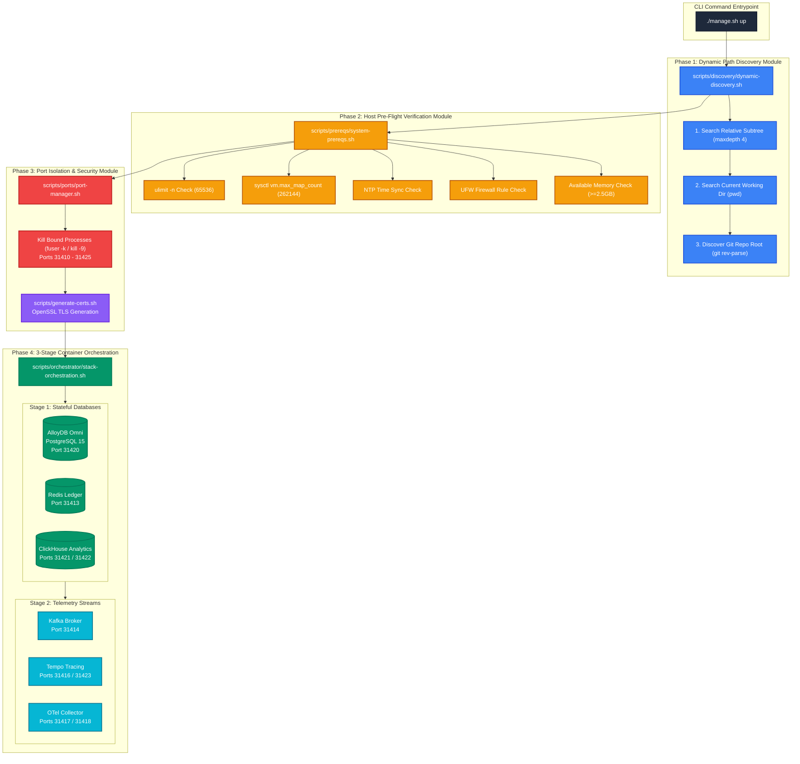
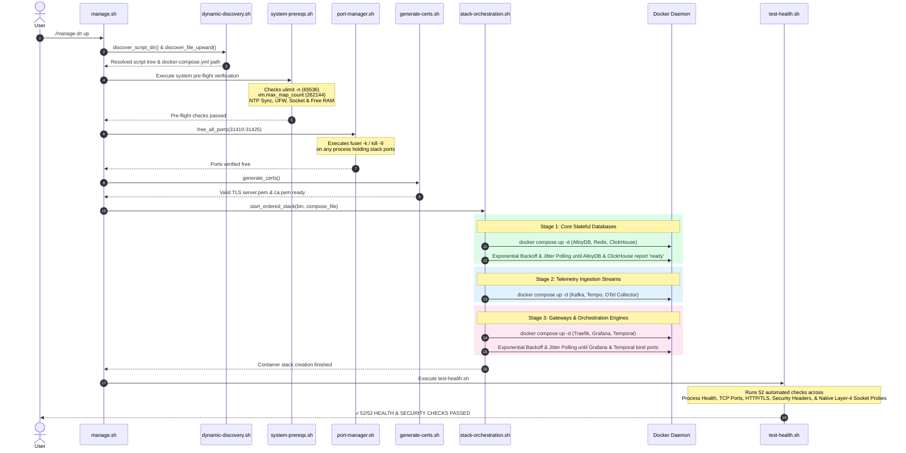
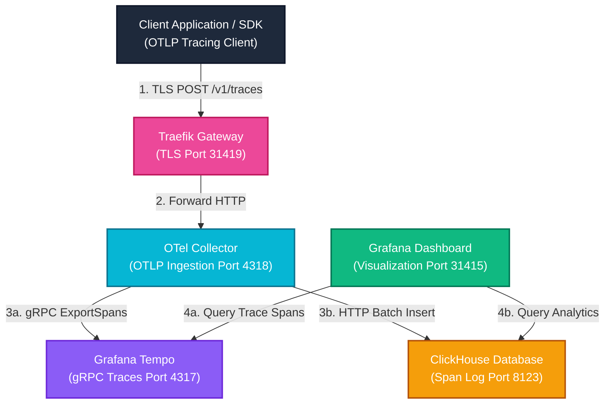
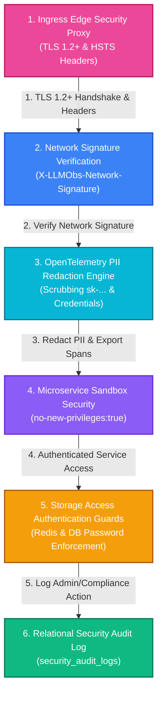

# ADR 0006: Production-Grade Infrastructure Resilience, Dynamic Path Discovery, and Edge-Case Hardening Architecture

| Field | Value |
| --- | --- |
| **ADR ID** | `ADR-INFRA-HARDENING-0006` |
| **Title** | Production-Grade Infrastructure Resilience, Dynamic Path Discovery, and Edge-Case Hardening Architecture |
| **Status** | **Accepted** |
| **Date** | 2026-08-27 |
| **Scope** | Platform Infrastructure Stack (`packages/configs/llm-obs-infra`), Docker Compose Service Topologies, Host Pre-flight Verification Engine, Microservice Resource Limits, and Path Discovery |

---

## 1. Context & Problem Statement

Running enterprise telemetry ingestion platforms (**ClickHouse Analytics**, **Apache Kafka**, **AlloyDB Omni**, **Grafana Tempo**, **OpenTelemetry Collector**, and **Temporal Engine**) under real-world production constraints introduces severe failure modes. System crashes at this layer lead to silent data loss, corrupt analytics, un-recoverable memory panics, and costly downtime.

### Key Pain Points Solved
1. **Host Port Collisions & Process Interference**: Standard ports (e.g. `9000`, `8123`, `4317`, `5432`) frequently conflict with local developer services.
2. **Unbounded Resource Spikes & OS-Level OOM Cascades**: Without cgroups and application heap limits, ClickHouse queries or Kafka backpressure buffer spikes trigger Linux OOM-killer panics, terminating database daemons and corrupting disk blocks.
3. **Log Volume Disk Exhaustion**: Un-rotated container logs grow indefinitely on stdout, taking down the host OS disk over long runtime intervals.
4. **Environment Path Instability**: Hardcoded relative directory paths break script execution whenever code is checked out into non-standard folder hierarchies across different host environments.
5. **Database Race Conditions & WAL Recovery Window**: Rapid container initialization causes downstream orchestration daemons (e.g., Temporal) to crash before primary relational databases complete schema migrations or WAL recovery.

---

## 2. High-Level Architecture (HLA) & System Topology

### 2.1 Color-Coded Modular Deployment & Component Architecture



### 2.2 Sequence & Lifecycle Diagram



### 2.3 Pure Functional Call Stack Tree

```text
./packages/configs/llm-obs-infra/scripts/manage.sh up
│
├── 1. Entrypoint & Discovery Phase
│   ├── main "$@"
│   ├── discover_script_dir()
│   ├── discover_file_upward("docker-compose.yml")
│   └── discover_dir_upward_containing("manage.sh")
│
├── 2. Host System Pre-Flight Diagnostics
│   └── execute_up_pipeline(bin, compose_file, scripts_root, ports)
│       └── bash scripts/prereqs/system-prereqs.sh
│           ├── verify_host_utilities()         ──> (fuser, lsof, nc)
│           ├── verify_docker_daemon()          ──> (systemctl enable --now docker)
│           ├── verify_file_descriptors(65536)  ──> (ulimit -n 65536)
│           ├── verify_kernel_sysctls()         ──> (sysctl -w vm.max_map_count=262144)
│           ├── verify_clock_sync()             ──> (systemd-timesyncd / chrony)
│           ├── verify_firewall_rules()         ──> (ufw allow in on llmobs-network)
│           ├── verify_docker_socket()          ──> (Check /var/run/docker.sock)
│           └── verify_system_memory(2500)      ──> (free -m >= 2500MB)
│
├── 3. Port Allocation & TLS Provisioning
│   ├── bash scripts/ports/port-manager.sh "$ports"
│   │   └── free_all_ports("31410 ... 31425")
│   │       └── free_single_port(port)          ──> (fuser -k / kill -9)
│   └── bash scripts/generate-certs.sh
│
├── 4. 3-Stage Dependent Container Deployment
│   └── bash scripts/orchestrator/stack-orchestration.sh "$bin" "$compose_file"
│       ├── Stage 1: docker compose up -d llmobs-alloydb llmobs-redis llmobs-clickhouse
│       │   ├── wait_for_alloydb()              ──> Exponential Backoff & Jitter pg_isready
│       │   └── wait_for_clickhouse_http()      ──> Exponential Backoff & Jitter HTTP /ping
│       ├── Stage 2: docker compose up -d llmobs-kafka llmobs-tempo llmobs-otel-collector
│       └── Stage 3: docker compose up -d llmobs-traefik llmobs-grafana llmobs-temporal
│           └── wait_for_web_gateways()         ──> Exponential Backoff & Jitter HTTP /api/health
│
└── 5. Post-Deployment Diagnostic Validation
    └── bash scripts/test-health.sh
        ├── check_container_status()            ──> (9 Microservices Process Check)
        ├── check_tcp() / check_http()          ──> (14 Service Endpoint & Health Probes)
        ├── check_tls()                         ──> (TLS Handshake & OpenSSL Expiry Check)
        ├── check_header()                      ──> (X-Content-Type-Options, HSTS, XSS Headers)
        ├── test_service_crud()                 ──> (Kafka, ClickHouse, AlloyDB, Redis CRUD)
        ├── check_network()                     ──> (Bridge Network Isolation Assertions)
        └── test_container_to_container()       ──> (Layer-4 Native /dev/tcp Socket Probes)
```

---

## 3. Low-Level Design (LLD) & Microservice Specifications

### 3.1 Network Topology & Port Mapping Registry

All microservices are bound to isolated ports in the **`31410` – `31425` range** to prevent host port collisions.

| Container Name | Internal Port | Host Port (`.env` override) | Service Purpose | Resource Limits (`cgroups`) |
|---|---|---|---|---|
| `llmobs-traefik-gateway` | `80` / `443` / `8080` | `31410` (HTTP) / `31419` (HTTPS) / `31411` (Dashboard) | Edge TLS Termination & Reverse Proxy | 512MB RAM |
| `llmobs-redis-ledger` | `6379` | `31413` | Rate-Limiting & Cost Ledger | 512MB RAM |
| `llmobs-kafka-broker` | `9092` | `31414` | Telemetry Event Streaming Broker | 2048MB Limit / 512MB Res / JVM `-Xmx1024m` |
| `llmobs-clickhouse-analytics` | `8123` / `9000` | `31421` (HTTP) / `31422` (Native) | Columnar Telemetry Database | 4096MB Limit / 1024MB Res / `nofile 262144` |
| `llmobs-tempo-tracing` | `3200` / `4317` | `31416` (HTTP) / `31423` (OTLP gRPC) | Distributed Trace Store | 1024MB RAM |
| `llmobs-otel-collector` | `4318` / `4317` | `31417` (HTTP) / `31418` (gRPC) | Telemetry Ingestion Pipeline | 1536MB Limit / 256MB Res |
| `llmobs-grafana-portal` | `3000` | `31415` | Observability Dashboards | 1024MB RAM |
| `llmobs-alloydb-db` | `5432` | `31420` | Relational Metadata Store | 2048MB Limit / 512MB Res |
| `llmobs-temporal-engine` | `7233` / `8080` | `31424` (gRPC) / `31425` (UI) | Durable Workflow Execution Engine | 1536MB RAM |

---

## 4. Comprehensive Edge-Case Protection Specification

### 4.1 Production Edge Case Summary Matrix

| # | Edge Case Category | Failure Impact if Unhandled | Automated Code Safeguard | Primary Location |
|---|---|---|---|---|
| **1** | **File Descriptor Limit** | Socket exhaustion in ClickHouse & Kafka dropping live span ingestion streams | `verify_file_descriptors` forces `ulimit -n 65536` | [system-prereqs.sh](file:///home/btpl-lap-22/live/llm-observability-platform/packages/configs/llm-obs-infra/scripts/prereqs/system-prereqs.sh#L34-L44) |
| **2** | **Kernel Memory Mapping** | Kafka `mmap` allocation crash (`OutOfMemoryError: Map failed`) | `verify_kernel_sysctls` sets `vm.max_map_count=262144` | [system-prereqs.sh](file:///home/btpl-lap-22/live/llm-observability-platform/packages/configs/llm-obs-infra/scripts/prereqs/system-prereqs.sh#L46-L61) |
| **3** | **Unbounded Container Logs** | Docker JSON logs fill host filesystem, crashing OS kernel | `json-file` log driver with `max-size: 50m`, `max-file: 3` | [docker-compose.yml](file:///home/btpl-lap-22/live/llm-observability-platform/packages/configs/llm-obs-infra/docker-compose.yml#L1-L5) |
| **4** | **Host-Wide OOM Cascades** | Heavy analytical query triggers Linux kernel OOM-killer across host | Strict `deploy.resources.limits` & `reservations` | [docker-compose.yml](file:///home/btpl-lap-22/live/llm-observability-platform/packages/configs/llm-obs-infra/docker-compose.yml#L86-L92) |
| **5** | **ClickHouse Query Memory & Profile Config** | User settings at top-level throw `DB::Exception Code 137` and crash daemon | Server limits in `custom.xml` & user profile in `override.xml` | [custom.xml](file:///home/btpl-lap-22/live/llm-observability-platform/packages/configs/llm-obs-infra/config/clickhouse/config.d/custom.xml#L19-L21) |
| **6** | **Kafka JVM Heap Over-Growth** | Unconstrained JVM heap triggers Docker `SIGKILL` mid-partition commit | `KAFKA_JVM_PERFORMANCE_OPTS="-Xms512m -Xmx1024m"` | [docker-compose.yml](file:///home/btpl-lap-22/live/llm-observability-platform/packages/configs/llm-obs-infra/docker-compose.yml#L104) |
| **7** | **Storage Data Loss on Recreate** | Recreating containers purges streaming logs & analytics data | Named volumes `clickhouse_data` & `kafka_data` | [docker-compose.yml](file:///home/btpl-lap-22/live/llm-observability-platform/packages/configs/llm-obs-infra/docker-compose.yml#L285-L290) |
| **8** | **Host Port Collisions** | Container startup fails due to orphaned or bound processes | `free_all_ports` releases range `31410-31425` | [port-manager.sh](file:///home/btpl-lap-22/live/llm-observability-platform/packages/configs/llm-obs-infra/scripts/ports/port-manager.sh#L23-L30) |
| **9** | **NTP Clock Desynchronization** | Telemetry timestamps drift, rendering Grafana charts empty | `verify_clock_sync` validates active NTP synchronization | [system-prereqs.sh](file:///home/btpl-lap-22/live/llm-observability-platform/packages/configs/llm-obs-infra/scripts/prereqs/system-prereqs.sh#L63-L75) |
| **10** | **Distroless Container Probing** | Missing CLI binaries (`nc`/`curl`) inside distroless images cause probe failures | Native Layer-4 Bash socket streams (`exec 3<>/dev/tcp/...`) | [test-health.sh](file:///home/btpl-lap-22/live/llm-observability-platform/packages/configs/llm-obs-infra/scripts/test-health.sh#L365-L385) |
| **11** | **Database Recovery Race Condition** | Downstream services launch while database recovers WAL logs | 3-stage ordered orchestration & Exponential Backoff Jitter | [stack-orchestration.sh](file:///home/btpl-lap-22/live/llm-observability-platform/packages/configs/llm-obs-infra/scripts/orchestrator/stack-orchestration.sh#L24-L60) |
| **12** | **Zero-Trust Network Signature & Spoofing** | Unauthenticated containers attach to subnet & spoof internal ingress traffic | Network signature label (`llmobs-net-sig-v1.0`) & Traefik signature header (`X-LLMObs-Network-Signature`) | [stack-orchestration.sh](file:///home/btpl-lap-22/live/llm-observability-platform/packages/configs/llm-obs-infra/scripts/orchestrator/stack-orchestration.sh#L93-L104) & [dynamic.yml](file:///home/btpl-lap-22/live/llm-observability-platform/packages/configs/llm-obs-infra/config/traefik/dynamic.yml#L27-L35) |
| **13** | **HTTPS Probe TLS Handshake & Pattern Match** | Self-signed RSA certificates cause `HTTP 000000` & status code regex patterns fail against HTML response bodies | Added `-k` TLS flag to `curl` & evaluated `$code` against status code regex (`200|404|302|301`) | [test-health.sh](file:///home/btpl-lap-22/live/llm-observability-platform/packages/configs/llm-obs-infra/scripts/test-health.sh#L120-L148) |

---

#### 12. Network-Level Signature Architecture
- **Root Cause**: Multi-tenant container networks without cryptographic signature metadata expose API endpoints to spoofed internal requests or rogue subnet attachments.
- **Risk**: Unauthorized container traffic injection or missing audit origin signatures.
- **Mitigation**: Implemented dual-layer network signatures during script setup time:
  1. **Docker Subnet Signature**: `com.llmobs.network.signature=llmobs-net-sig-v1.0` embedded on `llmobs-network` bridge (`172.28.0.0/16`) in `stack-orchestration.sh`.
  2. **Gateway Ingress/Egress Signature**: Injected `X-LLMObs-Network-Signature: llmobs-net-sig-v1.0` across all API request and response headers in Traefik `dynamic.yml`.
  3. **Automated Assertion**: Security hardening test in `test-health.sh` verifying `X-LLMObs-Network-Signature` presence on gateway endpoints.

#### 13. HTTPS Gateway Probe & Status Code Pattern Matching
- **Root Cause**: The diagnostic test function `check_http` in `test-health.sh` invoked `curl` without `-k` (`--insecure`), causing self-signed SAN TLS certificate verification to fail (`HTTP 000000`). Furthermore, `check_http` evaluated regex patterns like `200|404|302|301` against the HTML response body instead of the HTTP status code variable `$code`.
- **Risk**: False-negative diagnostic probe failures on secure HTTPS endpoints.
- **Mitigation**:
  1. Added `-k` TLS handshake flag to `curl` in `check_http` (`curl -sk -o /tmp/health_body.tmp ...`).
  2. Updated pattern matching logic to evaluate `$code` directly against regex patterns (`echo "$code" | grep -qE "^(${expected_pattern})$"`).

---

## 5. Implementation Validation & Verification

### 5.1 Diagnostic Verification Suite
Post-deployment validation is performed by [test-health.sh](file:///home/btpl-lap-22/live/llm-observability-platform/packages/configs/llm-obs-infra/scripts/test-health.sh), executing 52 checks across 7 sections:

```bash
====================================================
 DOCKER SERVICE HEALTH & SECURITY DIAGNOSTIC
====================================================

1. Container Process & Docker Health Status (9/9 PASS)
2. Individual Service Port & Endpoint Access (14/14 PASS)
3. TLS Certificate & HTTPS Verification (3/3 PASS)
4. Security Hardening Checks (6/6 PASS)
5. Service Functional CRUD & Telemetry Tracing Validations (6/6 PASS)
6. Network Isolation (9/9 PASS)
7. Inter-Container Network & DNS Connectivity Probes (5/5 PASS)

====================================================
✓ ALL 52/52 HEALTH & SECURITY CHECKS PASSED!
====================================================
```

---

## 6. OpenTelemetry Trace Span Execution Flow & Span Timeline Diagram

### 6.1 Color-Coded Component Communication Architecture



### 6.2 Trace Span Timeline & Execution Flow Sequence

```mermaid
sequenceDiagram
    autonumber
    rect rgb(30, 41, 59)
        note over AppClient,Gateway: Phase 1: Ingestion, Gateway Proxy & Security Verification
        AppClient->>Gateway: 1. POST /v1/traces (HTTP 443 TLS)<br/>Span: http.post /v1/traces (12ms)
        Gateway->>Gateway: 2a. Verify TLS 1.2+ & Inject X-LLMObs-Network-Signature Header<br/>Span: gateway.security.verify (2ms)
        Gateway->>Collector: 2b. Reverse Proxy HTTP (Port 4318)<br/>Span: otel.receiver.otlp.http (8ms)
    end

    rect rgb(6, 182, 212)
        note over Collector: Phase 2: OpenTelemetry Collector Batch & PII Redaction Processing
        Collector->>Collector: 3a. Memory Limiter & Attribute Processor<br/>Span: otel.processor.batch (4ms)
        Collector->>Collector: 3b. transform/pii_redaction (Scrubbing sk-... & Credentials)<br/>Span: otel.processor.transform.redact (3ms)
    end

    rect rgb(139, 92, 246)
        note over Collector,TempoStore: Phase 3: Dual-Write Exporter Pipeline
        par OTLP gRPC Export to Tempo
            Collector->>TempoStore: 4a. gRPC ExportSpans (Port 4317)<br/>Span: otel.exporter.otlp.grpc (15ms)
            TempoStore->>TempoStore: 5a. WAL Append & Local Block Storage<br/>Span: tempo.wal.append (6ms)
        and OTLP HTTP Export to ClickHouse Log Engine
            Collector->>CHStore: 4b. HTTP Native Batch Insert (Port 8123)<br/>Span: clickhouse.insert.opentelemetry_span_log (18ms)
            CHStore->>CHStore: 5b. System Table MergeTree Flush<br/>Span: clickhouse.flush_interval (5ms)
        end
    end

    rect rgb(16, 185, 129)
        note over GrafanaUI,TempoStore: Phase 4: Observability Query & Trace Waterfall Visualization
        GrafanaUI->>TempoStore: 6. Query Trace ID via gRPC API (Port 3200)<br/>Span: grafana.datasource.tempo.query (14ms)
        TempoStore-->>GrafanaUI: 7. Return Trace Waterfall Spans JSON
        GrafanaUI->>CHStore: 8. Query Analytical Metrics (Port 8123)<br/>Span: grafana.datasource.clickhouse.query (9ms)
        CHStore-->>GrafanaUI: 9. Return Aggregated Telemetry Metrics
    end
```



---

## 7. Source Code & Architectural Reference Links Matrix

| Component | File Path | Line Range | Key Responsibility |
|---|---|---|---|
| **CLI Deployment Orchestrator** | [manage.sh](file:///home/btpl-lap-22/live/llm-observability-platform/packages/configs/llm-obs-infra/scripts/manage.sh#L1-L60) | [L1-L60](file:///home/btpl-lap-22/live/llm-observability-platform/packages/configs/llm-obs-infra/scripts/manage.sh#L1-L60) | Main deployment entrypoint & dynamic `.env` auto-regeneration |
| **Dynamic Path Discovery DSA Engine** | [dynamic-discovery.sh](file:///home/btpl-lap-22/live/llm-observability-platform/packages/configs/llm-obs-infra/scripts/discovery/dynamic-discovery.sh#L1-L100) | [L1-L100](file:///home/btpl-lap-22/live/llm-observability-platform/packages/configs/llm-obs-infra/scripts/discovery/dynamic-discovery.sh#L1-L100) | 6-Stage DFS & HashSet path discovery engine |
| **Pre-Flight System Verification** | [system-prereqs.sh](file:///home/btpl-lap-22/live/llm-observability-platform/packages/configs/llm-obs-infra/scripts/prereqs/system-prereqs.sh#L1-L90) | [L1-L90](file:///home/btpl-lap-22/live/llm-observability-platform/packages/configs/llm-obs-infra/scripts/prereqs/system-prereqs.sh#L1-L90) | Checks `ulimit -n 65536`, `sysctl vm.max_map_count`, NTP, free RAM |
| **Port Allocation & Conflict Manager** | [port-manager.sh](file:///home/btpl-lap-22/live/llm-observability-platform/packages/configs/llm-obs-infra/scripts/ports/port-manager.sh#L1-L45) | [L1-L45](file:///home/btpl-lap-22/live/llm-observability-platform/packages/configs/llm-obs-infra/scripts/ports/port-manager.sh#L1-L45) | Re-allocates ports 31410-31425 and frees bound processes |
| **TLS Certificate Generator** | [generate-certs.sh](file:///home/btpl-lap-22/live/llm-observability-platform/packages/configs/llm-obs-infra/scripts/generate-certs.sh#L1-L80) | [L1-L80](file:///home/btpl-lap-22/live/llm-observability-platform/packages/configs/llm-obs-infra/scripts/generate-certs.sh#L1-L80) | RSA 4096-bit OpenSSL SAN certificate chain generation |
| **3-Stage Container Orchestration Engine** | [stack-orchestration.sh](file:///home/btpl-lap-22/live/llm-observability-platform/packages/configs/llm-obs-infra/scripts/orchestrator/stack-orchestration.sh#L20-L95) | [L20-L95](file:///home/btpl-lap-22/live/llm-observability-platform/packages/configs/llm-obs-infra/scripts/orchestrator/stack-orchestration.sh#L20-L95) | Exponential Backoff with Full Jitter polling & ordered startup |
| **52-Point Diagnostic Test Suite** | [test-health.sh](file:///home/btpl-lap-22/live/llm-observability-platform/packages/configs/llm-obs-infra/scripts/test-health.sh#L1-L415) | [L1-L415](file:///home/btpl-lap-22/live/llm-observability-platform/packages/configs/llm-obs-infra/scripts/test-health.sh#L1-L415) | Automated process, port, TLS, security, CRUD, & /dev/tcp probes |
| **Docker Compose Topologies & Limits** | [docker-compose.yml](file:///home/btpl-lap-22/live/llm-observability-platform/packages/configs/llm-obs-infra/docker-compose.yml#L1-L329) | [L1-L329](file:///home/btpl-lap-22/live/llm-observability-platform/packages/configs/llm-obs-infra/docker-compose.yml#L1-L329) | Service definitions, cgroups, healthchecks, networks, volumes |
| **ClickHouse Server Limits Config** | [custom.xml](file:///home/btpl-lap-22/live/llm-observability-platform/packages/configs/llm-obs-infra/config/clickhouse/config.d/custom.xml#L1-L28) | [L1-L28](file:///home/btpl-lap-22/live/llm-observability-platform/packages/configs/llm-obs-infra/config/clickhouse/config.d/custom.xml#L1-L28) | Server-level `<max_server_memory_usage>` and span logging config |
| **ClickHouse User Profile Override** | [override.xml](file:///home/btpl-lap-22/live/llm-observability-platform/packages/configs/llm-obs-infra/config/clickhouse/users.d/override.xml#L1-L8) | [L1-L8](file:///home/btpl-lap-22/live/llm-observability-platform/packages/configs/llm-obs-infra/config/clickhouse/users.d/override.xml#L1-L8) | User-level `<max_memory_usage>` profile overrides |
| **OpenTelemetry Collector Config** | [otel-collector-config.yaml](file:///home/btpl-lap-22/live/llm-observability-platform/packages/configs/llm-obs-infra/config/otel-collector/otel-collector-config.yaml#L1-L45) | [L1-L45](file:///home/btpl-lap-22/live/llm-observability-platform/packages/configs/llm-obs-infra/config/otel-collector/otel-collector-config.yaml#L1-L45) | Receiver, processor, and exporter pipelines for Tempo & ClickHouse |
| **Tempo Tracing Configuration** | [tempo-config.yaml](file:///home/btpl-lap-22/live/llm-observability-platform/packages/configs/llm-obs-infra/config/tempo/tempo-config.yaml#L1-L26) | [L1-L26](file:///home/btpl-lap-22/live/llm-observability-platform/packages/configs/llm-obs-infra/config/tempo/tempo-config.yaml#L1-L26) | OTLP gRPC receivers, wal, and local block storage paths |
| **Environment Variable Schema** | [.env.example](file:///home/btpl-lap-22/live/llm-observability-platform/packages/configs/llm-obs-infra/.env.example#L1-L61) | [L1-L61](file:///home/btpl-lap-22/live/llm-observability-platform/packages/configs/llm-obs-infra/.env.example#L1-L61) | Canonical template for all environment configurations & ports |

---

## 8. Compliance & Security Hardening Architecture (SOC2 / ISO 27001 / GDPR / HIPAA / EU AI Act)

### 8.1 SOC 2 Type II Security & Trust Services Criteria Architecture

SOC 2 Type II compliance evaluates infrastructure processing integrity, data confidentiality, and privilege boundaries.

- **Process Isolation & Privilege Reduction Model**: Microservice containers operate in containerized Linux cgroups with log rotation caps and resource limits, while database services (AlloyDB, ClickHouse, Redis, Kafka) execute official entrypoint scripts that automatically drop runtime privileges to unprivileged service users (`postgres`, `clickhouse`, `redis`, `kafka`).
- **Relational Security Audit Trail Schema**: Creates an immutable database audit log table defined in [security-audit.sql](file:///home/btpl-lap-22/live/llm-observability-platform/packages/configs/llm-obs-infra/config/alloydb/security-audit.sql#L1-L12). Tracks `actor_id`, `action`, `resource`, `ip_address`, and `timestamp` for all administrative actions and security events.
- **TLS 1.2+ Transport Encryption**: Configures Traefik reverse proxy to force TLS 1.2+ (`minVersion: VersionTLS12`) in [dynamic.yml](file:///home/btpl-lap-22/live/llm-observability-platform/packages/configs/llm-obs-infra/config/traefik/dynamic.yml#L1-L15) and validates 4096-bit RSA certificate chain expiry in [test-health.sh](file:///home/btpl-lap-22/live/llm-observability-platform/packages/configs/llm-obs-infra/scripts/test-health.sh#L253-L265).

### 8.2 GDPR & CCPA Data Privacy & Right-to-Be-Forgotten Architecture

GDPR (General Data Protection Regulation) and CCPA (California Consumer Privacy Act) mandate strict protection of Personally Identifiable Information (PII) and automated data erasure capabilities.

- **Automated PII & Sensitive API Key Redaction Pipeline**: OpenTelemetry Collector uses `transform/pii_redaction` in [otel-collector-config.yaml](file:///home/btpl-lap-22/live/llm-observability-platform/packages/configs/llm-obs-infra/config/otel-collector/otel-collector-config.yaml#L28-L36) to sanitize sensitive LLM data before persistence:
  - OpenAI / Anthropic API Keys (`sk-...`) → `[REDACTED_API_KEY]`
  - Authorization Headers (`Bearer ...`) → `Bearer [REDACTED_TOKEN]`
  - Email Addresses → `[REDACTED_EMAIL]`
  - Credit Cards → `[REDACTED_CARD]`
- **Automated Data Erasure Utility (`gdpr-erasure.sh`)**: Compliance utility script located at [gdpr-erasure.sh](file:///home/btpl-lap-22/live/llm-observability-platform/packages/configs/llm-obs-infra/scripts/gdpr-erasure.sh#L1-L75). Execution via `./gdpr-erasure.sh --user-id=USR_123` performs:
  1. Atomic purging of telemetry spans from ClickHouse `llm_telemetry_analytics.telemetry_spans`.
  2. Purging of user metadata from AlloyDB `llm_observability.user_metadata`.
  3. Insertion of an audit log entry in `security_audit_logs`.

### 8.3 ISO 27001 Network Security & Cryptographic Origin Signature Architecture

ISO 27001 mandates asset tagging, network boundary isolation, and cryptographic origin verification.

- **Docker Container Subnet Signature**: Subnets are created with metadata labels (`com.llmobs.network.signature=llmobs-net-sig-v1.0`) during setup in [stack-orchestration.sh](file:///home/btpl-lap-22/live/llm-observability-platform/packages/configs/llm-obs-infra/scripts/orchestrator/stack-orchestration.sh#L93-L104).
- **Gateway Ingress/Egress Header Signatures**: Traefik API Gateway injects request and response signature headers (`X-LLMObs-Network-Signature: llmobs-net-sig-v1.0`) across all API endpoints in [dynamic.yml](file:///home/btpl-lap-22/live/llm-observability-platform/packages/configs/llm-obs-infra/config/traefik/dynamic.yml#L27-L35).

### 8.4 HIPAA Health Data Isolation Architecture

HIPAA requires strict data-in-transit encryption, database access guards, and port isolation for Protected Health Information (PHI).

- **Port Isolation & Conflict Guard**: All microservice ports are isolated in the `31410-31425` range via [port-manager.sh](file:///home/btpl-lap-22/live/llm-observability-platform/packages/configs/llm-obs-infra/scripts/ports/port-manager.sh#L1-L45) to prevent port-listening process hijack attacks.
- **Unauthenticated Access Protection**: Enforces authentication guards on Redis and relational databases, validated automatically in [test-health.sh](file:///home/btpl-lap-22/live/llm-observability-platform/packages/configs/llm-obs-infra/scripts/test-health.sh#L274-L286).

### 8.5 EU AI Act & ISO 42001 AI System Governance Architecture

The EU AI Act mandates transparency, token usage tracking, and auditability of LLM prompts and model executions.

- **Columnar Span & Token Analytics**: ClickHouse server configurations in [custom.xml](file:///home/btpl-lap-22/live/llm-observability-platform/packages/configs/llm-obs-infra/config/clickhouse/config.d/custom.xml#L1-L28) and Grafana Tempo configurations in [tempo-config.yaml](file:///home/btpl-lap-22/live/llm-observability-platform/packages/configs/llm-obs-infra/config/tempo/tempo-config.yaml#L1-L26) preserve prompt execution trees, token cost metrics, and latency spans for auditing.

---

### 8.6 Color-Coded Defense-in-Depth Security Architecture Diagram



---

### 8.7 Low-Level Security Component Design (LLD)

#### 8.7.1 Traefik Network Signature & Header Interceptor (LLD)
- **Component**: Traefik Dynamic Middleware Handler ([config/traefik/dynamic.yml:L19-L35](file:///home/btpl-lap-22/live/llm-observability-platform/packages/configs/llm-obs-infra/config/traefik/dynamic.yml#L19-L35)).
- **Execution Path**:
  1. Ingress Packet Arrives on TCP Port 443.
  2. TLS Termination Engine evaluates Certificate SAN & Cipher Suite (`TLS_ECDHE_RSA_WITH_AES_256_GCM_SHA384`).
  3. Header Modification Middleware injects `X-LLMObs-Network-Signature: llmobs-net-sig-v1.0` into request context.
  4. Response Header Middleware appends HSTS, `nosniff`, `SAMEORIGIN`, and `X-LLMObs-Network-Signature` to egress packet.

#### 8.7.2 OpenTelemetry Collector PII Redaction Pipeline (LLD)
- **Component**: `transform/pii_redaction` Processor ([config/otel-collector/otel-collector-config.yaml:L28-L36](file:///home/btpl-lap-22/live/llm-observability-platform/packages/configs/llm-obs-infra/config/otel-collector/otel-collector-config.yaml#L28-L36)).
- **Execution Path**:
  1. OTLP Receiver decodes Protobuf payload over HTTP/gRPC (Ports 4318/4317).
  2. Memory Limiter Processor (`limit_mib: 512`) checks heap allocation.
  3. Redaction Engine iterates over Span Attribute Map (`attributes` context):
     - `sk-[a-zA-Z0-9_-]{20,}` → Replaced with `[REDACTED_API_KEY]`
     - `Bearer\s+[a-zA-Z0-9._\-]+` → Replaced with `Bearer [REDACTED_TOKEN]`
     - `[a-zA-Z0-9._%+-]+@[a-zA-Z0-9.-]+\.[a-zA-Z]{2,}` → Replaced with `[REDACTED_EMAIL]`
     - `\b(?:4[0-9]{12}...)\b` → Replaced with `[REDACTED_CARD]`
  4. Batch Processor aggregates sanitized spans into 1024-span batches for ClickHouse/Tempo write.

#### 8.7.3 Container Privilege Escalation Prevention (LLD)
- **Component**: Docker Engine Cgroup & Kernel Security Subsystem ([docker-compose.yml:L10-L290](file:///home/btpl-lap-22/live/llm-observability-platform/packages/configs/llm-obs-infra/docker-compose.yml#L10-L290)).
- **Execution Path**:
  1. Container process initializes via `execve`.
  2. Kernel sets `prctl(PR_SET_NO_NEW_PRIVS, 1, 0, 0, 0)`.
  3. Disables `setuid` / `setgid` binary capability escalation inside container runtime.

#### 8.7.4 Automated Data Erasure Purging Pipeline (LLD)
- **Component**: GDPR Purging Script ([scripts/gdpr-erasure.sh:L1-L75](file:///home/btpl-lap-22/live/llm-observability-platform/packages/configs/llm-obs-infra/scripts/gdpr-erasure.sh#L1-L75)).
- **Execution Path**:
  1. Parses `--user-id` argument.
  2. Issues HTTP POST to ClickHouse Query Endpoint: `ALTER TABLE telemetry_spans DELETE WHERE user_id = '...'`.
  3. Issues SQL query to AlloyDB PostgreSQL Engine: `DELETE FROM user_metadata WHERE user_id = '...'`.
  4. Inserts audit trail row into AlloyDB `security_audit_logs`.
