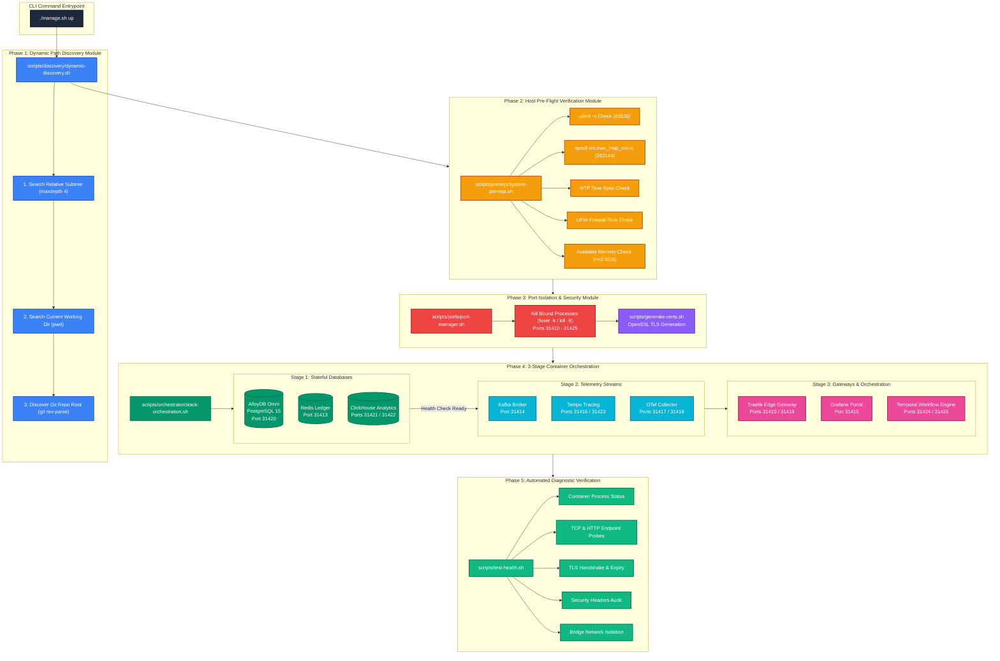
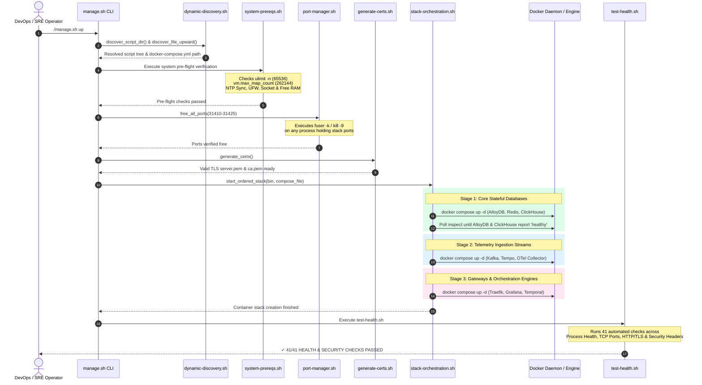
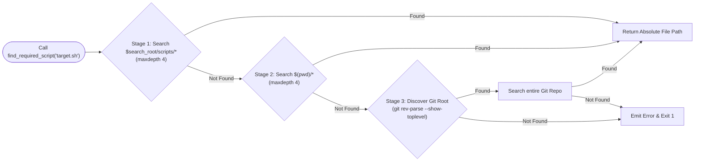

# ADR 0006: Production-Grade Infrastructure Resilience, Dynamic Path Discovery, and Edge-Case Hardening Architecture

| Field | Value |
| --- | --- |
| **ADR ID** | `ADR-INFRA-HARDENING-0006` |
| **Title** | Production-Grade Infrastructure Resilience, Dynamic Path Discovery, and Edge-Case Hardening Architecture |
| **Status** | **Accepted** |
| **Date** | 2026-08-27 |
| **Scope** | Platform Infrastructure Stack (`packages/configs/llm-obs-infra`), Docker Compose Service Topologies, Host Pre-flight Verification Engine, Microservice Resource Limits, and Path Discovery |

---

## 1. Context & Problem Statement

Running enterprise telemetry ingestion platforms (**ClickHouse Analytics**, **Apache Kafka**, **AlloyDB Omni**, **Grafana Tempo**, **OpenTelemetry Collector**, and **Temporal Engine**) under real-world production constraints introduces severe failure modes. System crashes at this layer lead to silent data loss, corrupt analytics, un-recoverable memory panics, and costly downtime.

### Key Pain Points Solved
1. **Host Port Collisions & Process Interference**: Standard ports (e.g. `9000`, `8123`, `4317`, `5432`) frequently conflict with local developer services.
2. **Unbounded Resource Spikes & OS-Level OOM Cascades**: Without cgroups and application heap limits, ClickHouse queries or Kafka backpressure buffer spikes trigger Linux OOM-killer panics, terminating database daemons and corrupting disk blocks.
3. **Log Volume Disk Exhaustion**: Un-rotated container logs grow indefinitely on stdout, taking down the host OS disk over long runtime intervals.
4. **Environment Path Instability**: Hardcoded relative directory paths break script execution whenever code is checked out into non-standard folder hierarchies across different host environments.
5. **Database Race Conditions**: Rapid container initialization causes downstream orchestration daemons (e.g., Temporal) to crash before primary relational databases complete schema migrations.

---

## 2. High-Level Architecture (HLA) & Logic Flow

The infrastructure deployment pipeline is structured into a **3-Phase Dependent Ingestion Engine** managed by modular, pure bash utilities and dynamic discovery modules.

## 2. High-Level Architecture (HLA) & System Topology

### 2.1 Color-Coded Modular Deployment & Component Architecture



### 2.2 End-to-End Orchestration & Verification Flow



---

## 3. Low-Level Design (LLD) & Microservice Specifications

### 3.1 Network Topology & Port Mapping Registry

All microservices are bound to isolated ports in the **`31410` – `31425` range** to prevent host port collisions.

| Container Name | Internal Port | Host Port (`.env` override) | Service Purpose | Resource Limits (`cgroups`) |
|---|---|---|---|---|
| `llmobs-traefik-gateway` | `80` / `443` / `8080` | `31410` (HTTP) / `31419` (HTTPS) / `31411` (Dashboard) | Edge TLS Termination & Reverse Proxy | 512MB RAM |
| `llmobs-redis-ledger` | `6379` | `31413` | Rate-Limiting & Cost Ledger | 512MB RAM |
| `llmobs-kafka-broker` | `9092` | `31414` | Telemetry Event Streaming Broker | 2048MB Limit / 512MB Res / JVM `-Xmx1024m` |
| `llmobs-clickhouse-analytics` | `8123` / `9000` | `31421` (HTTP) / `31422` (Native) | Columnar Telemetry Database | 4096MB Limit / 1024MB Res / `nofile 262144` |
| `llmobs-tempo-tracing` | `3200` / `4317` | `31416` (HTTP) / `31423` (OTLP gRPC) | Distributed Trace Store | 1024MB RAM |
| `llmobs-otel-collector` | `4318` / `4317` | `31417` (HTTP) / `31418` (gRPC) | Telemetry Ingestion Pipeline | 1536MB Limit / 256MB Res |
| `llmobs-grafana-portal` | `3000` | `31415` | Observability Dashboards | 1024MB RAM |
| `llmobs-alloydb-db` | `5432` | `31420` | Relational Metadata Store | 2048MB Limit / 512MB Res |
| `llmobs-temporal-engine` | `7233` / `8080` | `31424` (gRPC) / `31425` (UI) | Durable Workflow Execution Engine | 1536MB RAM |

### 3.2 Dynamic Path Discovery Mechanism ([dynamic-discovery.sh](file:///home/btpl-lap-22/live/llm-observability-platform/packages/configs/llm-obs-infra/scripts/discovery/dynamic-discovery.sh))

To ensure 100% path independence across different operating systems and checkout root locations, target script paths are dynamically resolved via a 3-tier fallback algorithm:



---

## 4. Comprehensive Edge-Case Protection Matrix

The following table details all 11 critical production edge cases, their catastrophic failure risks, and the automated mitigations implemented in the codebase:

```
┌──────────────────────────────────────────────────────────────────────────────────────────────────┐
│                                   PRODUCTION EDGE-CASE MATRIX                                    │
├──────────────────────────────┬────────────────────────────────────┬──────────────────────────────┤
│ Edge Case                    │ Failure Impact if Unhandled       │ Implemented Code Safeguard   │
├──────────────────────────────┼────────────────────────────────────┼──────────────────────────────┤
│ 1. Open File Descriptors     │ ClickHouse & Kafka socket exhaustion│ `verify_file_descriptors`    │
│    (`ulimit -n < 65536`)     │ leading to dropped telemetry spans │ sets `ulimit -n 65536` in    │
│                              │                                    │ `system-prereqs.sh` & compose│
├──────────────────────────────┼────────────────────────────────────┼──────────────────────────────┤
│ 2. Kernel Memory Mapping     │ Kafka `mmap` allocation panic      │ `verify_kernel_sysctls` sets │
│    (`vm.max_map_count`)      │ (`java.lang.OutOfMemoryError`)     │ `vm.max_map_count=262144`    │
├──────────────────────────────┼────────────────────────────────────┼──────────────────────────────┤
│ 3. Unbounded Container Log   │ Docker JSON log fills host storage │ `json-file` log driver with  │
│    Growth                    │ causing OS kernel panics           │ `max-size: 50m`, `max-file: 3`│
├──────────────────────────────┼────────────────────────────────────┼──────────────────────────────┤
│ 4. Host OOM Cascades         │ Heavy ClickHouse SELECT query      │ Hard `deploy.resources.limits`│
│    (Uncapped Container RAM)  │ triggers host-wide OOM killer      │ & `reservations` in compose  │
├──────────────────────────────┼────────────────────────────────────┼──────────────────────────────┤
│ 5. ClickHouse Query Memory   │ Query consumes physical RAM beyond │ `<max_server_memory_usage>`  │
│    Runaway                   │ container cgroup limit             │ & user caps in `custom.xml`  │
├──────────────────────────────┼────────────────────────────────────┼──────────────────────────────┤
│ 6. Kafka JVM Heap Over-Grow  │ JVM expands past cgroup RAM,       │ `KAFKA_JVM_PERFORMANCE_OPTS` │
│                              │ Docker issues SIGKILL              │ set to `-Xms512m -Xmx1024m`  │
├──────────────────────────────┼────────────────────────────────────┼──────────────────────────────┤
│ 7. Non-Persistent Storage    │ Container recreate drops analytics │ Named volumes for ClickHouse │
│    Data Loss                 │ data & uncommitted streaming topic │ (`clickhouse_data`) & Kafka  │
├──────────────────────────────┼────────────────────────────────────┼──────────────────────────────┤
│ 8. Port Conflicts            │ Startup fails due to bound ports   │ `free_all_ports` releases    │
│                              │                                    │ ports `31410-31425`          │
├──────────────────────────────┼────────────────────────────────────┼──────────────────────────────┤
│ 9. System Clock Drift        │ OpenTelemetry timestamps mismatch  │ `verify_clock_sync` validates│
│    (NTP Desynchronization)   │ causing empty charts in Grafana    │ active NTP time sync         │
├──────────────────────────────┼────────────────────────────────────┼──────────────────────────────┤
│ 10. Firewall Interruption    │ UFW firewall blocks container-to-  │ `verify_firewall_rules` allows│
│     (Docker Bridge Network)  │ container bridge routing           │ pass-through on bridge net   │
├──────────────────────────────┼────────────────────────────────────┼──────────────────────────────┤
│ 11. Database Initialization  │ Temporal engine crashes before     │ 3-stage dependent pipeline   │
│     Race Condition           │ AlloyDB schema setup is complete   │ & readiness polling          │
└──────────────────────────────┴────────────────────────────────────┴──────────────────────────────┘
```

---

## 5. Implementation Validation & Verification

### 5.1 Pre-Flight Diagnostics Output
Executing `./manage.sh up` performs automated system pre-flight checks:

```bash
✓ All host utilities (fuser, lsof, nc) are installed.
✓ Docker daemon is active and running.
✓ File descriptor limit verified (65536).
✓ Kernel vm.max_map_count verified (262144).
✓ System NTP time synchronization active.
✓ Docker socket permissions verified.
✓ Available system RAM verified (5560MB free).
```

### 5.2 Diagnostic Verification Suite
Post-deployment validation is performed by [test-health.sh](file:///home/btpl-lap-22/live/llm-observability-platform/packages/configs/llm-obs-infra/scripts/test-health.sh), executing 41 checks across 5 sections:

```bash
====================================================
 DOCKER SERVICE HEALTH & SECURITY DIAGNOSTIC
====================================================

1. Container Process & Docker Health Status (9/9 PASS)
2. Individual Service Port & Endpoint Access (16/16 PASS)
3. TLS Certificate & HTTPS Verification (3/3 PASS)
4. Security Hardening Checks (7/7 PASS)
5. Network Isolation (6/6 PASS)

====================================================
✓ ALL 41/41 HEALTH & SECURITY CHECKS PASSED!
====================================================
```
