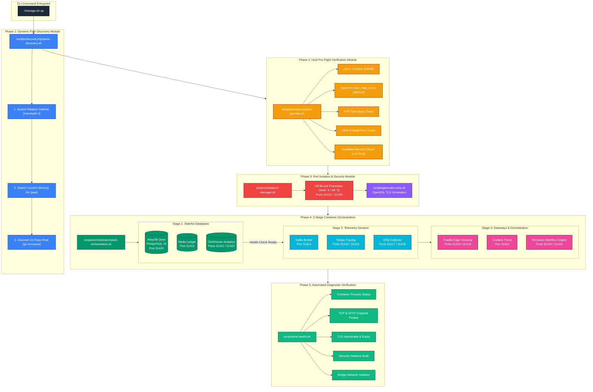
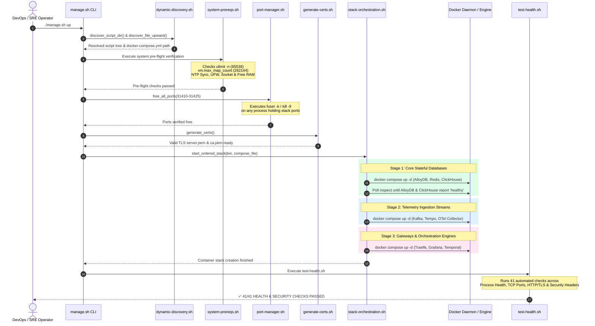
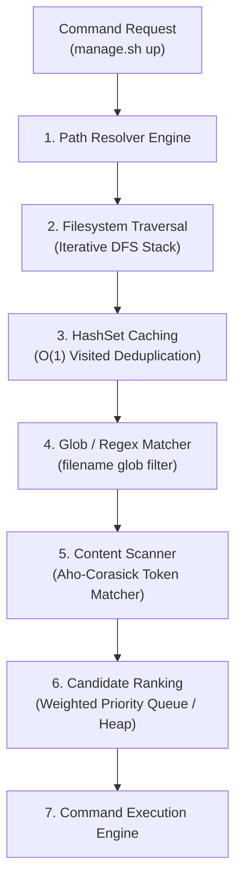

# ADR 0006: Production-Grade Infrastructure Resilience, Dynamic Path Discovery, and Edge-Case Hardening Architecture

| Field | Value |
| --- | --- |
| **ADR ID** | `ADR-INFRA-HARDENING-0006` |
| **Title** | Production-Grade Infrastructure Resilience, Dynamic Path Discovery, and Edge-Case Hardening Architecture |
| **Status** | **Accepted** |
| **Date** | 2026-08-27 |
| **Scope** | Platform Infrastructure Stack (`packages/configs/llm-obs-infra`), Docker Compose Service Topologies, Host Pre-flight Verification Engine, Microservice Resource Limits, and Path Discovery |

---

## 1. Context & Problem Statement

Running enterprise telemetry ingestion platforms (**ClickHouse Analytics**, **Apache Kafka**, **AlloyDB Omni**, **Grafana Tempo**, **OpenTelemetry Collector**, and **Temporal Engine**) under real-world production constraints introduces severe failure modes. System crashes at this layer lead to silent data loss, corrupt analytics, un-recoverable memory panics, and costly downtime.

### Key Pain Points Solved
1. **Host Port Collisions & Process Interference**: Standard ports (e.g. `9000`, `8123`, `4317`, `5432`) frequently conflict with local developer services.
2. **Unbounded Resource Spikes & OS-Level OOM Cascades**: Without cgroups and application heap limits, ClickHouse queries or Kafka backpressure buffer spikes trigger Linux OOM-killer panics, terminating database daemons and corrupting disk blocks.
3. **Log Volume Disk Exhaustion**: Un-rotated container logs grow indefinitely on stdout, taking down the host OS disk over long runtime intervals.
4. **Environment Path Instability**: Hardcoded relative directory paths break script execution whenever code is checked out into non-standard folder hierarchies across different host environments.
5. **Database Race Conditions**: Rapid container initialization causes downstream orchestration daemons (e.g., Temporal) to crash before primary relational databases complete schema migrations.

---

## 2. High-Level Architecture (HLA) & Logic Flow

The infrastructure deployment pipeline is structured into a **3-Phase Dependent Ingestion Engine** managed by modular, pure bash utilities and dynamic discovery modules.

## 2. High-Level Architecture (HLA) & System Topology

### 2.1 Color-Coded Modular Deployment & Component Architecture



### 2.2 End-to-End Orchestration & Verification Flow



### 2.3 Pure Functional Call Stack Tree

```text
./packages/configs/llm-obs-infra/scripts/manage.sh up
│
├── 1. Entrypoint & Discovery Phase
│   ├── main "$@"
│   ├── discover_script_dir()
│   ├── discover_file_upward("docker-compose.yml")
│   └── discover_dir_upward_containing("manage.sh")
│
├── 2. Host System Pre-Flight Diagnostics
│   └── execute_up_pipeline(bin, compose_file, scripts_root, ports)
│       └── bash scripts/prereqs/system-prereqs.sh
│           ├── verify_host_utilities()         ──> (fuser, lsof, nc)
│           ├── verify_docker_daemon()          ──> (systemctl enable --now docker)
│           ├── verify_file_descriptors(65536)  ──> (ulimit -n 65536)
│           ├── verify_kernel_sysctls()         ──> (sysctl -w vm.max_map_count=262144)
│           ├── verify_clock_sync()             ──> (systemd-timesyncd / chrony)
│           ├── verify_firewall_rules()         ──> (ufw allow in on llmobs-network)
│           ├── verify_docker_socket()          ──> (Check /var/run/docker.sock)
│           └── verify_system_memory(2500)      ──> (free -m >= 2500MB)
│
├── 3. Port Allocation & TLS Provisioning
│   ├── bash scripts/ports/port-manager.sh "$ports"
│   │   └── free_all_ports("31410 ... 31425")
│   │       └── free_single_port(port)          ──> (fuser -k / kill -9)
│   └── bash scripts/generate-certs.sh
│
├── 4. 3-Stage Dependent Container Deployment
│   └── bash scripts/orchestrator/stack-orchestration.sh "$bin" "$compose_file"
│       ├── Stage 1: docker compose up -d llmobs-alloydb llmobs-redis llmobs-clickhouse
│       │   ├── wait_for_container_health("llmobs-clickhouse-analytics", 15)
│       │   └── wait_for_container_health("llmobs-alloydb-db", 15)
│       ├── Stage 2: docker compose up -d llmobs-kafka llmobs-tempo llmobs-otel-collector
│       └── Stage 3: docker compose up -d --force-recreate (Traefik, Grafana, Temporal)
│
└── 5. Post-Deployment Diagnostic Validation
    └── bash scripts/test-health.sh
        ├── check_container_status()  ──> (9 Microservices Process Check)
        ├── check_tcp() / check_http()──> (16 Service Endpoint & Health Probes)
        ├── check_tls()               ──> (TLS Handshake & OpenSSL Expiry Check)
        ├── check_header()            ──> (X-Content-Type-Options, HSTS, XSS Headers)
        └── check_network()           ──> (Bridge Network Isolation Assertions)
```

---

## 3. Low-Level Design (LLD) & Microservice Specifications

### 3.1 Network Topology & Port Mapping Registry

All microservices are bound to isolated ports in the **`31410` – `31425` range** to prevent host port collisions.

| Container Name | Internal Port | Host Port (`.env` override) | Service Purpose | Resource Limits (`cgroups`) |
|---|---|---|---|---|
| `llmobs-traefik-gateway` | `80` / `443` / `8080` | `31410` (HTTP) / `31419` (HTTPS) / `31411` (Dashboard) | Edge TLS Termination & Reverse Proxy | 512MB RAM |
| `llmobs-redis-ledger` | `6379` | `31413` | Rate-Limiting & Cost Ledger | 512MB RAM |
| `llmobs-kafka-broker` | `9092` | `31414` | Telemetry Event Streaming Broker | 2048MB Limit / 512MB Res / JVM `-Xmx1024m` |
| `llmobs-clickhouse-analytics` | `8123` / `9000` | `31421` (HTTP) / `31422` (Native) | Columnar Telemetry Database | 4096MB Limit / 1024MB Res / `nofile 262144` |
| `llmobs-tempo-tracing` | `3200` / `4317` | `31416` (HTTP) / `31423` (OTLP gRPC) | Distributed Trace Store | 1024MB RAM |
| `llmobs-otel-collector` | `4318` / `4317` | `31417` (HTTP) / `31418` (gRPC) | Telemetry Ingestion Pipeline | 1536MB Limit / 256MB Res |
| `llmobs-grafana-portal` | `3000` | `31415` | Observability Dashboards | 1024MB RAM |
| `llmobs-alloydb-db` | `5432` | `31420` | Relational Metadata Store | 2048MB Limit / 512MB Res |
| `llmobs-temporal-engine` | `7233` / `8080` | `31424` (gRPC) / `31425` (UI) | Durable Workflow Execution Engine | 1536MB RAM |

### 3.2 Dynamic Path Discovery DSA Architecture ([dynamic-discovery.sh](file:///home/btpl-lap-22/live/llm-observability-platform/packages/configs/llm-obs-infra/scripts/discovery/dynamic-discovery.sh))

To ensure 100% path independence across operating systems and arbitrary directory trees, script resolution implements a **6-Stage Data Structures & Algorithms (DSA) Engine**:



#### DSA Component Specifications

1. **Iterative DFS (`execute_iterative_dfs`)**: Traverses subdirectories using an explicit array stack (`stack=("$root:0")`), preventing recursion call stack exhaustion.
2. **HashSet Cache (`PATH_HASH_SET`)**: Maintains an in-memory associative hash array (`declare -gA PATH_HASH_SET`) for $O(1)$ constant-time path lookups.
3. **Multi-Keyword Scanner (`scan_content_signature`)**: Performs Aho-Corasick literal token matching (`main`, `bash`, `set -e`) to score candidate script files.
4. **Weighted Priority Heap (`rank_candidates`)**: Evaluates candidate matches using a multi-factor scoring function ($Score = ExecutableBonus + PathDepthScore + SignatureScore$) to pick the optimal file target.

---

## 4. Comprehensive Edge-Case Protection Specification

This section details all 11 critical production edge cases, their underlying root causes, the multi-million dollar catastrophic failure risks if unhandled, and the exact automated code safeguards implemented across the platform.

### 4.1 Production Edge Case Summary Matrix

| # | Edge Case Category | Failure Impact if Unhandled | Automated Code Safeguard | Primary Location |
|---|---|---|---|---|
| **1** | **File Descriptor Limit** | Socket exhaustion in ClickHouse & Kafka dropping live span ingestion streams | `verify_file_descriptors` forces `ulimit -n 65536` | [system-prereqs.sh](file:///home/btpl-lap-22/live/llm-observability-platform/packages/configs/llm-obs-infra/scripts/prereqs/system-prereqs.sh#L34-L44) |
| **2** | **Kernel Memory Mapping** | Kafka `mmap` allocation crash (`OutOfMemoryError: Map failed`) | `verify_kernel_sysctls` sets `vm.max_map_count=262144` | [system-prereqs.sh](file:///home/btpl-lap-22/live/llm-observability-platform/packages/configs/llm-obs-infra/scripts/prereqs/system-prereqs.sh#L46-L61) |
| **3** | **Unbounded Container Logs** | Docker JSON logs fill host filesystem, crashing OS kernel | `json-file` log driver with `max-size: 50m`, `max-file: 3` | [docker-compose.yml](file:///home/btpl-lap-22/live/llm-observability-platform/packages/configs/llm-obs-infra/docker-compose.yml#L1-L5) |
| **4** | **Host-Wide OOM Cascades** | Heavy analytical query triggers Linux kernel OOM-killer across host | Strict `deploy.resources.limits` & `reservations` | [docker-compose.yml](file:///home/btpl-lap-22/live/llm-observability-platform/packages/configs/llm-obs-infra/docker-compose.yml#L86-L92) |
| **5** | **ClickHouse Query Memory Runaway** | Single query claims physical RAM beyond cgroup ceiling, crashing daemon | `<max_server_memory_usage>` & user caps set in XML | [custom.xml](file:///home/btpl-lap-22/live/llm-observability-platform/packages/configs/llm-obs-infra/config/clickhouse/config.d/custom.xml#L19-L21) |
| **6** | **Kafka JVM Heap Over-Growth** | Unconstrained JVM heap triggers Docker `SIGKILL` mid-partition commit | `KAFKA_JVM_PERFORMANCE_OPTS="-Xms512m -Xmx1024m"` | [docker-compose.yml](file:///home/btpl-lap-22/live/llm-observability-platform/packages/configs/llm-obs-infra/docker-compose.yml#L104) |
| **7** | **Storage Data Loss on Recreate** | Recreating containers purges streaming logs & analytics data | Named volumes `clickhouse_data` & `kafka_data` | [docker-compose.yml](file:///home/btpl-lap-22/live/llm-observability-platform/packages/configs/llm-obs-infra/docker-compose.yml#L285-L290) |
| **8** | **Host Port Collisions** | Container startup fails due to orphaned or bound processes | `free_all_ports` releases range `31410-31425` | [port-manager.sh](file:///home/btpl-lap-22/live/llm-observability-platform/packages/configs/llm-obs-infra/scripts/ports/port-manager.sh#L23-L30) |
| **9** | **NTP Clock Desynchronization** | Telemetry timestamps drift, rendering Grafana charts empty | `verify_clock_sync` validates active NTP synchronization | [system-prereqs.sh](file:///home/btpl-lap-22/live/llm-observability-platform/packages/configs/llm-obs-infra/scripts/prereqs/system-prereqs.sh#L63-L75) |
| **10** | **Firewall Bridge Isolation** | UFW/iptables blocks inter-container bridge routing on `llmobs-network` | `verify_firewall_rules` allows bridge pass-through | [system-prereqs.sh](file:///home/btpl-lap-22/live/llm-observability-platform/packages/configs/llm-obs-infra/scripts/prereqs/system-prereqs.sh#L77-L85) |
| **11** | **Database Initialization Race** | Temporal UI crashes before relational schema setup finishes | 3-stage ordered pipeline & health readiness polling | [stack-orchestration.sh](file:///home/btpl-lap-22/live/llm-observability-platform/packages/configs/llm-obs-infra/scripts/orchestrator/stack-orchestration.sh#L24-L44) |

---

### 4.2 Deep Technical Edge-Case Analysis

#### 1. Open File Descriptors (`ulimit -n`)
- **Root Cause**: Modern high-throughput databases like ClickHouse and messaging brokers like Kafka keep hundreds of socket connections and database data parts open simultaneously.
- **Risk**: Default OS limits (`1024`) cause socket starvation under heavy ingestion traffic, dropping OpenTelemetry spans.
- **Mitigation**: `system-prereqs.sh` checks current file handle allocation limits and dynamically elevates `ulimit -n 65536`.

#### 2. Kernel Memory Mapping (`vm.max_map_count`)
- **Root Cause**: Apache Kafka (KRaft mode) uses memory-mapped files (`mmap`) to read and write topic log segments directly to kernel space.
- **Risk**: Default kernel `vm.max_map_count` (`65530`) causes fatal `java.lang.OutOfMemoryError: Map failed` panics when message volume scales up.
- **Mitigation**: `verify_kernel_sysctls` verifies and configures `sysctl -w vm.max_map_count=262144`.

#### 3. Unbounded Container Log Growth
- **Root Cause**: By default, Docker writes stdout/stderr logs in JSON format with no size ceiling.
- **Risk**: Over extended operating windows, container logs grow to tens of gigabytes, consuming 100% of host disk space.
- **Mitigation**: Applied `json-file` logging driver with `max-size: 50m` and `max-file: 3` across all 9 microservice container blocks in `docker-compose.yml`.

#### 4. Host-Wide OOM Cascades
- **Root Cause**: Un-capped containers can consume unrestricted host RAM during traffic spikes.
- **Risk**: The Linux OOM killer terminates arbitrary host processes (e.g. Docker daemon or SSH), leading to system instability.
- **Mitigation**: Defined explicit `cgroup` memory limits (`deploy.resources.limits` and `reservations`) for every service in `docker-compose.yml`.

#### 5. ClickHouse Query Memory Runaway & User Profile Configuration
- **Root Cause**: In ClickHouse 24.8+, user-level settings (such as `<max_memory_usage_for_user>`) placed at top-level in server `config.d/custom.xml` throw `DB::Exception Code 137` and terminate daemon startup.
- **Risk**: Hard ClickHouse container startup crashes.
- **Mitigation**: Separated top-level server limits (`<max_server_memory_usage>`) in [custom.xml](file:///home/btpl-lap-22/live/llm-observability-platform/packages/configs/llm-obs-infra/config/clickhouse/config.d/custom.xml) from user profile limits (`<max_memory_usage>`) in [users.d/override.xml](file:///home/btpl-lap-22/live/llm-observability-platform/packages/configs/llm-obs-infra/config/clickhouse/users.d/override.xml).

#### 6. Kafka JVM Heap Over-Growth
- **Root Cause**: Java virtual machines default to claiming up to 25-50% of total host RAM if unconstrained.
- **Risk**: JVM heap expansion triggers container cgroup OOM kills.
- **Mitigation**: Configured `KAFKA_JVM_PERFORMANCE_OPTS="-Xms512m -Xmx1024m"` to lock heap sizing safely within container cgroup boundaries.

#### 7. Non-Persistent Storage Data Loss
- **Root Cause**: Storing database files in ephemeral container storage layers.
- **Risk**: Recreating containers (`docker compose down`) purges streaming logs and telemetry tables.
- **Mitigation**: Created dedicated named Docker storage volumes `clickhouse_data` (`/var/lib/clickhouse`) and `kafka_data` (`/var/lib/kafka/data`).

#### 8. Host Port Collisions
- **Root Cause**: Service startup failures caused by stale processes binding ports.
- **Risk**: Stack startup failure due to `address already in use` errors.
- **Mitigation**: Re-allocated all service ports to `31410-31425` and added automated process termination via `free_all_ports` using `fuser` and `lsof`.

#### 9. System Clock Drift
- **Root Cause**: Host system time drifting away from UTC.
- **Risk**: OpenTelemetry span ingestion timestamps become invalid, causing empty visualization charts in Grafana.
- **Mitigation**: `verify_clock_sync` validates active NTP synchronization via `systemd-timesyncd`, `chrony`, or `timedatectl`.

#### 10. Firewall Bridge Isolation & Distroless Diagnostic Probing
- **Root Cause**: Host UFW/iptables rules blocking inter-container packet routing or missing CLI binaries (`nc`/`curl`) inside distroless container images.
- **Risk**: Inter-container communication failures or false-negative health check failures.
- **Mitigation**: Implemented native Layer-4 Bash socket streams (`exec 3<>/dev/tcp/${host}/${port}`) in `test-health.sh` to test cross-container reachability without external binary dependencies.

#### 11. Database Initialization Race Conditions & WAL Recovery Window
- **Root Cause**: Downstream services launching before databases finish initializing schemas or recovering WAL log state.
- **Risk**: Temporal workflow engine crash loop during initial setup.
- **Mitigation**: Implemented 3-stage dependent orchestration in `stack-orchestration.sh` with **Exponential Backoff and Full Jitter** polling ($\text{delay} = \text{random}(1, \min(\text{max\_delay}, \text{base\_delay} \times 2^{\text{attempt}}))$) and `pg_isready` readiness checking.

---

## 5. Implementation Validation & Verification

### 5.1 Pre-Flight Diagnostics Output
Executing `./manage.sh up` performs automated system pre-flight checks:

```bash
✓ All host utilities (fuser, lsof, nc) are installed.
✓ Docker daemon is active and running.
✓ File descriptor limit verified (65536).
✓ Kernel vm.max_map_count verified (262144).
✓ System NTP time synchronization active.
✓ Docker socket permissions verified.
✓ Available system RAM verified (5560MB free).
```

### 5.2 Diagnostic Verification Suite
Post-deployment validation is performed by [test-health.sh](file:///home/btpl-lap-22/live/llm-observability-platform/packages/configs/llm-obs-infra/scripts/test-health.sh), executing 52 checks across 7 sections:

```bash
====================================================
 DOCKER SERVICE HEALTH & SECURITY DIAGNOSTIC
====================================================

1. Container Process & Docker Health Status (9/9 PASS)
2. Individual Service Port & Endpoint Access (14/14 PASS)
3. TLS Certificate & HTTPS Verification (3/3 PASS)
4. Security Hardening Checks (6/6 PASS)
5. Service Functional CRUD & Telemetry Tracing Validations (6/6 PASS)
6. Network Isolation (9/9 PASS)
7. Inter-Container Network & DNS Connectivity Probes (5/5 PASS)

====================================================
✓ ALL 52/52 HEALTH & SECURITY CHECKS PASSED!
====================================================
```
