# Platform Infrastructure Documentation Gateway (`llm-obs-infra`)

> **Package**: `packages/configs/llm-obs-infra`  
> **Version**: 2.0.0 (Production Core Stack)  
> **Network Bridge**: `llmobs-network`  
> **Database Standard**: Google Cloud AlloyDB Omni 15 & ClickHouse v24.8  

---

## Overview

Welcome to the central engineering, operational, and security documentation gateway for the **LLM Observability Platform Infrastructure (`llm-obs-infra`)**. This directory contains the complete set of architectural specifications, performance benchmarks, and security compliance reports governing the core container topology.

All documents follow the standardized platform documentation templates established in `policies/rules/doc-template`.

---

## Master Document Catalog

```mermaid
graph TD
    classDef arch fill:#e1f5fe,stroke:#0288d1,stroke-width:2px;
    classDef perf fill:#fff3e0,stroke:#f57c00,stroke-width:2px;
    classDef sec fill:#e8f5e9,stroke:#388e3c,stroke-width:2px;

    Root["Infrastructure Docs Gateway"]

    Root --> Arch["1. Architecture Docs (architectureDoc/)"]
    Root --> Perf["2. Performance Docs (performanceDoc/)"]
    Root --> Sec["3. Security Docs (securityDoc/)"]

    Arch --> Arch1["System Architecture"]:::arch
    Arch --> Arch2["High-Level Design (HLD)"]:::arch
    Arch --> Arch3["Low-Level Design (LLD)"]:::arch
    Arch --> Arch4["Cloud & Infra Review"]:::arch
    Arch --> Arch5["Technical Design"]:::arch
    Arch --> Arch6["ADR Catalog"]:::arch
    Arch --> Arch7["Resilience ADR"]:::arch

    Perf --> Perf1["Application Performance Review"]:::perf
    Perf --> Perf2["Capacity Planning Report"]:::perf
    Perf --> Perf3["Load & Stress Test Report"]:::perf
    Perf --> Perf4["Performance Benchmark Report"]:::perf

    Sec --> Sec1["Acceptable Use Policy (AUP)"]:::sec
    Sec --> Sec2["Incident Response Report"]:::sec
    Sec --> Sec3["Pre-Deployment Checklist"]:::sec
    Sec --> Sec4["Threat Response Playbook"]:::sec
    Sec --> Sec5["RACI Escalation Matrix"]:::sec
    Sec --> Sec6["Security Architecture Review"]:::sec
    Sec --> Sec7["Security Assessment Report"]:::sec
    Sec --> Sec8["KPI & Metrics Dashboard"]:::sec
    Sec --> Sec9["Threat Model Report"]:::sec
    Sec --> Sec10["Vulnerability Assessment"]:::sec
    Sec --> Sec11["Security Mandate ADR"]:::sec
```

---

### 1. Architecture Documentation (`docs/architectureDoc/`)

| Document | Description | Target Audience |
|---|---|---|
| [system-architecture-document.md](file:///home/btpl-lap-22/live/llm-observability-platform/packages/configs/llm-obs-infra/docs/architectureDoc/system-architecture-document.md) | Solution & System Architecture master document detailing the 3-plane topology. | Enterprise Architects & Tech Leads |
| [high-level-design.md](file:///home/btpl-lap-22/live/llm-observability-platform/packages/configs/llm-obs-infra/docs/architectureDoc/high-level-design.md) | High-Level Design (HLD) covering microservices, ingress, and data routing flows. | System Architects & Staff Engineers |
| [low-level-design.md](file:///home/btpl-lap-22/live/llm-observability-platform/packages/configs/llm-obs-infra/docs/architectureDoc/low-level-design.md) | Low-Level Design (LLD) specifying DB schemas, topic partitions, & container bounds. | Backend & DevOps Engineers |
| [cloud-infra-architecture-review.md](file:///home/btpl-lap-22/live/llm-observability-platform/packages/configs/llm-obs-infra/docs/architectureDoc/cloud-infra-architecture-review.md) | Well-Architected Framework review covering Security, Reliability, & Cost pillars. | Cloud Engineering Leadership |
| [technical-design-document.md](file:///home/btpl-lap-22/live/llm-observability-platform/packages/configs/llm-obs-infra/docs/architectureDoc/technical-design-document.md) | Deep technical design for multi-container orchestration & readiness polling. | Senior Systems Developers |
| [architecture-decision-record.md](file:///home/btpl-lap-22/live/llm-observability-platform/packages/configs/llm-obs-infra/docs/architectureDoc/architecture-decision-record.md) | Consolidated ADR log & architectural decision selection rules. | Technical Steering Committee |
| [infrastructure-resilience-and-edge-case-hardening.md](file:///home/btpl-lap-22/live/llm-observability-platform/packages/configs/llm-obs-infra/docs/architectureDoc/infrastructure-resilience-and-edge-case-hardening.md) | ADR 0006 — Production-grade infrastructure resilience & dynamic discovery. | DevOps & Systems Engineers |

---

### 2. Performance Documentation (`docs/performanceDoc/`)

| Document | Description | Target Audience |
|---|---|---|
| [application-performance-review.md](file:///home/btpl-lap-22/live/llm-observability-platform/packages/configs/llm-obs-infra/docs/performanceDoc/application-performance-review.md) | Real-world APM performance metrics for ingestion pipelines and collector endpoints. | SREs & Performance Engineers |
| [infrastructure-capacity-planning-report.md](file:///home/btpl-lap-22/live/llm-observability-platform/packages/configs/llm-obs-infra/docs/performanceDoc/infrastructure-capacity-planning-report.md) | 12-month forward-looking resource exhaustion analysis (ClickHouse/AlloyDB disk & RAM). | Infrastructure & FinOps Leads |
| [load-stress-test-report.md](file:///home/btpl-lap-22/live/llm-observability-platform/packages/configs/llm-obs-infra/docs/performanceDoc/load-stress-test-report.md) | High-throughput synthetic load & burst stress testing results (50,000 req/sec). | Performance Engineering Team |
| [performance-benchmark-report.md](file:///home/btpl-lap-22/live/llm-observability-platform/packages/configs/llm-obs-infra/docs/performanceDoc/performance-benchmark-report.md) | Database write/query benchmark analysis for ClickHouse, Redis, and AlloyDB Omni. | Database Administrators & SREs |

---

### 3. Security & Governance Documentation (`docs/securityDoc/`)

| Document | Description | Target Audience |
|---|---|---|
| [acceptable-use-policy.md](file:///home/btpl-lap-22/live/llm-observability-platform/packages/configs/llm-obs-infra/docs/securityDoc/acceptable-use-policy.md) | Policy governing infrastructure access, key usage, and container operations. | Security Officers & All Personnel |
| [incident-response-report.md](file:///home/btpl-lap-22/live/llm-observability-platform/packages/configs/llm-obs-infra/docs/securityDoc/incident-response-report.md) | Incident post-mortem template and SEV-1 to SEV-4 classification breakdown. | Security Incident Responders |
| [pre-deployment-security-checklist.md](file:///home/btpl-lap-22/live/llm-observability-platform/packages/configs/llm-obs-infra/docs/securityDoc/pre-deployment-security-checklist.md) | Mandatory 25-point verification gate before production deployment launches. | DevOps Engineers & SecOps |
| [response-playbook.md](file:///home/btpl-lap-22/live/llm-observability-platform/packages/configs/llm-obs-infra/docs/securityDoc/response-playbook.md) | Actionable incident response playbooks for DDoS, container breakout, and key leaks. | On-Call Engineers & SecOps |
| [security-and-engineering-raci-escalation-matrix.md](file:///home/btpl-lap-22/live/llm-observability-platform/packages/configs/llm-obs-infra/docs/securityDoc/security-and-engineering-raci-escalation-matrix.md) | RACI matrix defining ownership and 24/7 on-call escalation procedures. | Engineering Management & SecOps |
| [security-architecture-review.md](file:///home/btpl-lap-22/live/llm-observability-platform/packages/configs/llm-obs-infra/docs/securityDoc/security-architecture-review.md) | Formal evaluation of container bridge isolation, TLS endpoints, and authorization. | Security Architects & CISO |
| [security-assessment-report.md](file:///home/btpl-lap-22/live/llm-observability-platform/packages/configs/llm-obs-infra/docs/securityDoc/security-assessment-report.md) | Penetration testing report covering Traefik ingress and API exposure vectors. | Security Engineers |
| [security-program-metrics-and-kpi-dashboard.md](file:///home/btpl-lap-22/live/llm-observability-platform/packages/configs/llm-obs-infra/docs/securityDoc/security-program-metrics-and-kpi-dashboard.md) | Executive Security Dashboard tracking vulnerability remediation SLAs and MTTR. | Executive Leadership & CISOs |
| [threat-model-report.md](file:///home/btpl-lap-22/live/llm-observability-platform/packages/configs/llm-obs-infra/docs/securityDoc/threat-model-report.md) | Comprehensive STRIDE threat model evaluating span tampering and API key abuse. | Security Leads & System Designers |
| [vulnerability-assessment-report.md](file:///home/btpl-lap-22/live/llm-observability-platform/packages/configs/llm-obs-infra/docs/securityDoc/vulnerability-assessment-report.md) | Container image vulnerability scan audit and dependency CVE tracking. | SecOps & Infrastructure Engineers |
| [critical-security-remediation-mandate.md](file:///home/btpl-lap-22/live/llm-observability-platform/packages/configs/llm-obs-infra/docs/securityDoc/critical-security-remediation-mandate.md) | ADR 0007 — Critical security remediation mandate & adversarial review. | Security Engineers & CISOs |
| [audits/README.md](file:///home/btpl-lap-22/live/llm-observability-platform/packages/configs/llm-obs-infra/docs/securityDoc/audits/README.md) | Master Audit & Remediation Registry cataloging all independent security & resilience audits. | Security Auditors, Architects & CISOs |
| [audits/complete/independent-audit-adr-0006.md](file:///home/btpl-lap-22/live/llm-observability-platform/packages/configs/llm-obs-infra/docs/securityDoc/audits/complete/independent-audit-adr-0006.md) | AUD-0006 — Architecture & resilience security audit report (17 findings, fully remediated). | Security Auditors, Architects & CISOps |
| [audits/pending/independent-audit-infra-deployment-config.md](file:///home/btpl-lap-22/live/llm-observability-platform/packages/configs/llm-obs-infra/docs/securityDoc/audits/pending/independent-audit-infra-deployment-config.md) | AUD-0007 — Critical implementation-level security audit of the deployed stack (39 findings). | Security Auditors, Architects & CISOs |
| [audits/pending/remediation-plan-infra-deployment-config.md](file:///home/btpl-lap-22/live/llm-observability-platform/packages/configs/llm-obs-infra/docs/securityDoc/audits/pending/remediation-plan-infra-deployment-config.md) | AUD-0007 phased technical remediation plan with per-finding patches and verification commands. | Infrastructure & Security Engineers |

---

## Related Package Directories & Existing ADRs

- **Package Root**: `packages/configs/llm-obs-infra/`
- **Main Specifications**: [README.md](file:///home/btpl-lap-22/live/llm-observability-platform/packages/configs/llm-obs-infra/README.md) & [REQUIREMENTS.md](file:///home/btpl-lap-22/live/llm-observability-platform/packages/configs/llm-obs-infra/REQUIREMENTS.md)
- **Original ADR Directory**: [adr/](file:///home/btpl-lap-22/live/llm-observability-platform/packages/configs/llm-obs-infra/adr) (Preserved intact)
