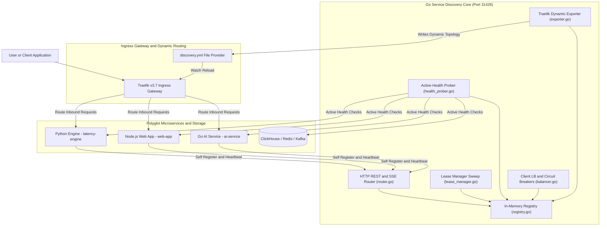
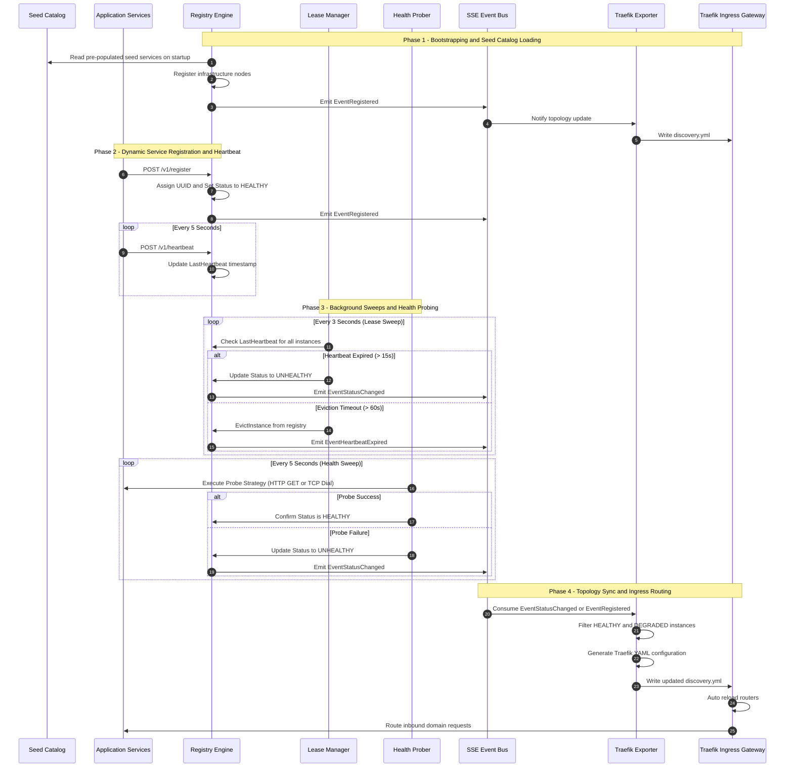
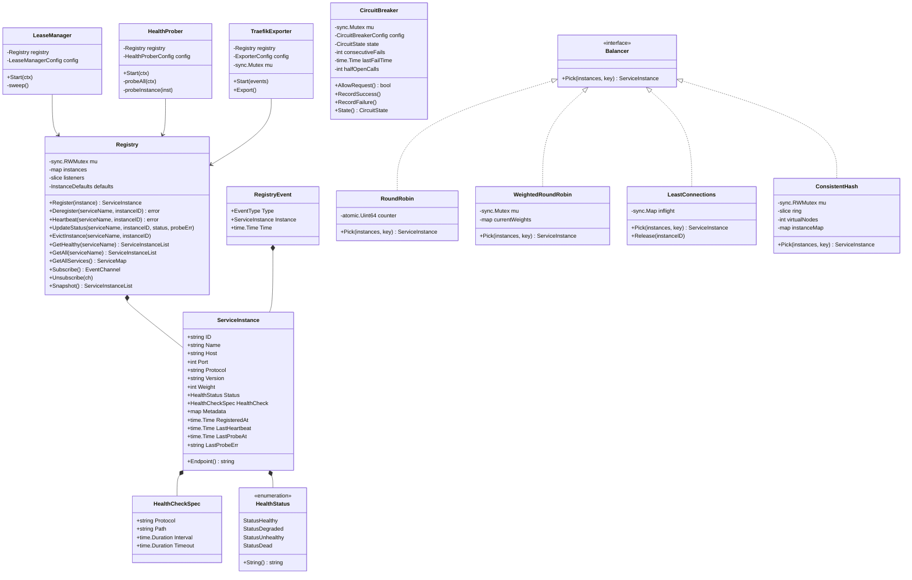
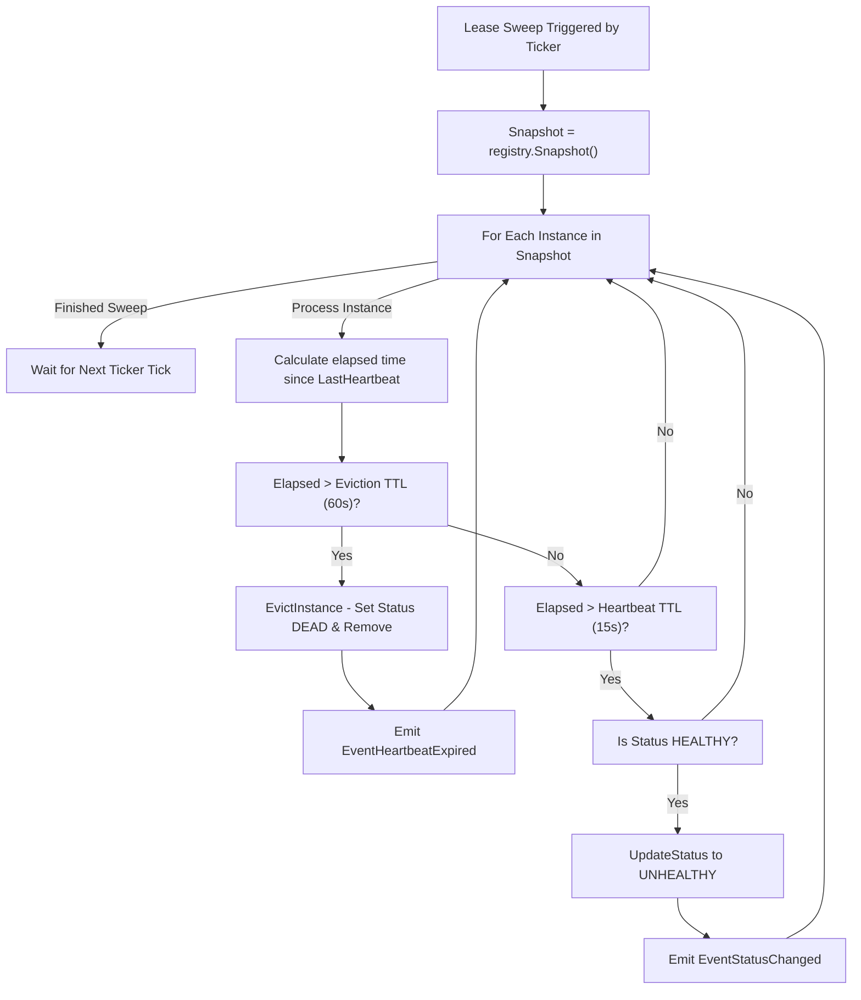
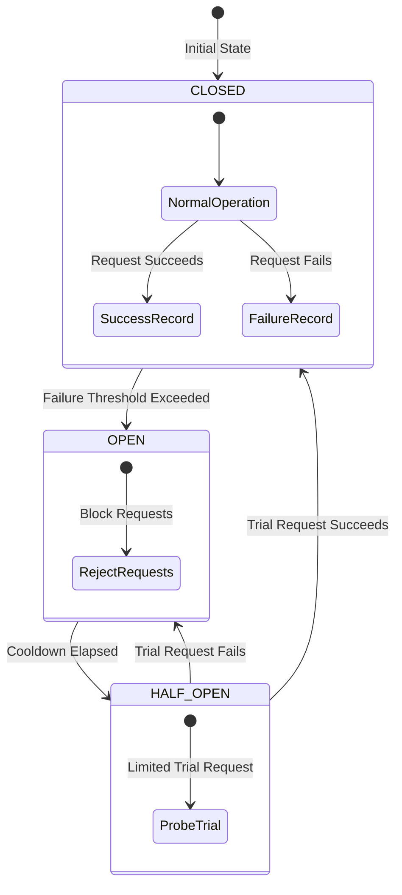
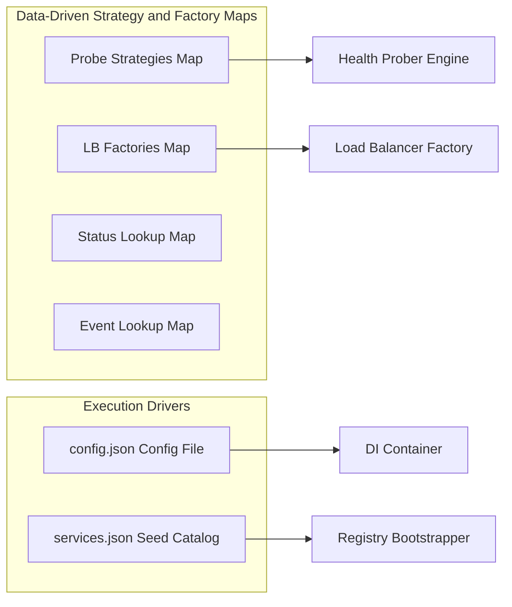

# ADR-0009: Dynamic Service Registry, Discovery & Client-Side Load Balancing Architecture

| Field | Value |
|---|---|
| **Document ID** | ADR-0009 |
| **Status** | Accepted |
| **Author(s)** | Architecture Steering Committee & Core Infrastructure Team |
| **Target Package** | [`packages/configs/llm-obs-infra/service-discovery`](file:///home/btpl-lap-22/live/llm-observability-platform/packages/configs/llm-obs-infra/service-discovery) |
| **Date** | 2026-09-02 |
| **Version** | 2.0.0 (Enterprise Gold Standard) |

---

## 1. Executive Summary & Business Decision Rationale

### 1.1 Context & Problem Statement
The **LLM Observability Platform** operates a polyglot microservice ecosystem comprising Python services (`latency-engine`, `event-cost`, `quality-engine`), Node.js applications (`web-app`, `auth`), and Go services (`ai-service`), orchestrated alongside infrastructure components (ClickHouse, Kafka, Redis, Traefik). 

Prior to ADR-0009, inter-service communication relied exclusively on static configuration files, environment variables, and hardcoded host/port combinations. This model introduced severe production liabilities:

1. **Cascading Service Outages & Configuration Drift**: Changing a service port or scaling a service replica required updating multiple configuration repositories and restarting dependent services. A single mismatched environment variable silently severed inter-service channels.
2. **Zero Pre-Flight Health Visibility**: Caller services had no mechanism to verify target availability prior to dispatching HTTP/gRPC requests. When a service crashed, upstream callers experienced hung TCP sockets, request timeouts, and cascading failure across the entire pipeline.
3. **No Automatic Failover or Traffic Management**: In multi-instance deployments, traffic continued hitting unhealthy nodes. Black-hole routing persisted until manual operator intervention was performed.
4. **Heavy Infrastructure Dependencies**: Traditional enterprise discovery solutions (e.g., HashiCorp Consul, Netflix Eureka, or full Kubernetes DNS clusters) introduce substantial memory footprints (>250MB per node), complex consensus protocol tuning (Raft/Gossip), and licensing or operational complexity unsuited for lean, multi-environment edge/on-premise deployments.

---

### 1.2 The Strategic Business Decision: Why Build a Custom Go Sidecar?

> [!IMPORTANT]
> **Business Mandate**: The platform must deliver **99.99% uptime** with **sub-3-second automated failover** while operating across lightweight Docker Compose, bare-metal edge nodes, and Kubernetes environments without requiring heavy external infrastructure daemons.

After evaluating off-the-shelf service discovery platforms, the architecture committee elected to implement a **dedicated, lightweight Go-based Dynamic Service Registry and Discovery Sidecar** integrated natively with Traefik v3.

```
                  ┌───────────────────────────────────────────────────┐
                  │              Decision Trade-off Matrix            │
                  └───────────────────────────────────────────────────┘

┌────────────────────────┬──────────────────────┬──────────────────────┬──────────────────────┐
│ Criteria               │ Custom Go Sidecar    │ HashiCorp Consul     │ Kubernetes DNS       │
├────────────────────────┼──────────────────────┼──────────────────────┼──────────────────────┤
│ Memory Footprint       │ ~15 MB               │ ~250 MB - 500 MB     │ N/A (K8s Control)    │
│ Startup Time           │ < 200 ms             │ 5 - 15 s             │ Seconds              │
│ Docker Compose Support │ Native (Zero Config) │ High Complexity      │ Not Applicable       │
│ Traefik Integration    │ Direct File Watch    │ Provider Plugin      │ Ingress Controller   │
│ Client Dependencies    │ Standard HTTP/SSE    │ Heavy SDKs           │ DNS Resolver         │
│ License / Governance   │ Internal MIT/Apache  │ BSL (HashiCorp)      │ CNCF Open Source     │
└────────────────────────┴──────────────────────┴──────────────────────┴──────────────────────┘
```

#### Key Business & Strategic Drivers:
1. **MTTR Reduction (Mean Time To Resolution)**: Automated health sweeps (3s sweep interval) and eviction routines reduce node failover times from **~45 minutes of operator triage to <3 seconds of automated re-routing**.
2. **Zero-Downtime Rolling Upgrades**: New service versions register dynamically with custom weight factors, enabling canary deployments and instant traffic draining without configuration updates.
3. **Blast Radius Containment**: Built-in, per-instance **Circuit Breakers** automatically isolate failing downstream services before socket pool exhaustion impacts upstream user experience.
4. **Developer Experience & Local Fidelity**: Developer environments mirror production topology using a single Docker Compose container (`llmobs-service-registry`) seeded automatically via [`services.json`](file:///home/btpl-lap-22/live/llm-observability-platform/packages/configs/llm-obs-infra/service-discovery/di/providers.go#L112-L155).
5. **Vendor Independence & Zero External Dependencies**: Written in standard Go utilizing `net/http` and `sync` primitives, eliminating external database or consensus engine dependencies.

---

## 2. High-Level Design (HLD)

### 2.1 System Architecture & Network Topology

The Service Registry runs as an isolated micro-container within the `llm-obs-infra` network. It exposes a unified HTTP REST + SSE API on port `31426` and continuously streams live service topology changes directly to Traefik via an automated YAML File Provider exporter.



---

### 2.2 End-to-End Lifecycle & Discovery Sequence

The diagram below details the exact sequence of events from service startup and seed catalog loading through heartbeat checks, failure probing, SSE event broadcast, Traefik config export, and client traffic routing.



---

## 3. Low-Level Design (LLD)

### 3.1 Package Hierarchy & Core Module Mapping

The implementation is structured into modular Go packages under [`packages/configs/llm-obs-infra/service-discovery`](file:///home/btpl-lap-22/live/llm-observability-platform/packages/configs/llm-obs-infra/service-discovery):

```
packages/configs/llm-obs-infra/service-discovery/
├── main.go                       # Application entry point & OS signal handler
├── di/                           # Dependency Injection container & JSON config loader
│   └── providers.go              # AppConfig loader, Container builder, Seed catalog loader
├── registry/                     # Core thread-safe memory registry & lifecycle daemons
│   ├── instance.go               # Domain structs: ServiceInstance, HealthStatus, RegistryEvent
│   ├── registry.go               # Thread-safe in-memory Registry & event pub/sub engine
│   ├── health_prober.go          # Data-driven active health prober (HTTP/TCP worker pool)
│   └── lease_manager.go          # Periodic ticker sweep daemon for heartbeat TTL & eviction
├── loadbalancer/                 # Client-side load balancing algorithms & circuit breakers
│   ├── balancer.go               # Balancer interface, algorithm strategy map & factories
│   └── circuit_breaker.go        # Per-instance circuit breaker state machine & registry
├── discovery/                    # High-level lookup facade & diagnostic error generator
│   └── discovery.go              # Resolve, ResolveAll, Watch, and detailed diagnostic error builders
├── server/                       # HTTP REST & SSE Gateway router
│   ├── router.go                 # Endpoint routing logic, JSON serialization, SSE stream handler
│   └── server.go                 # http.Server wrapper with graceful shutdown timeouts
├── traefik/                      # External gateway topology synchronization
│   └── exporter.go               # Registry listener writing Traefik dynamic provider YAML
└── tests/                        # Integration & unit test suites
    └── traefik_exporter_test.go  # Traefik exporter validation test
```

---

### 3.2 Core Data Structures & Class Diagram

The following Mermaid class diagram illustrates the primary Go structs, interfaces, and their relationships across the `registry`, `loadbalancer`, `discovery`, and `traefik` packages.



---

### 3.3 Lease Manager Sweep Algorithm

The [`LeaseManager`](file:///home/btpl-lap-22/live/llm-observability-platform/packages/configs/llm-obs-infra/service-discovery/registry/lease_manager.go#L21-L62) runs a ticker loop (default interval: 3 seconds) that sweeps the snapshot of all registered instances and applies double-threshold TTL state transitions.



---

### 3.4 Circuit Breaker State Transitions

Each instance target can be wrapped with a [`CircuitBreaker`](file:///home/btpl-lap-22/live/llm-observability-platform/packages/configs/llm-obs-infra/service-discovery/loadbalancer/circuit_breaker.go#L41-L103) that prevents calling failing nodes.



---

### 3.5 REST & SSE API Endpoint Specification

The HTTP server exposed by [`server/router.go`](file:///home/btpl-lap-22/live/llm-observability-platform/packages/configs/llm-obs-infra/service-discovery/server/router.go) provides the following REST & SSE interface on port `31426`:

| Method | Endpoint | Description | Request Payload / Query Params | Success Response | Error Response |
|---|---|---|---|---|---|
| `POST` | `/v1/register` | Register a new service instance | JSON `registerRequest` | `201 Created` (Instance JSON) | `400 Bad Request` |
| `POST` | `/v1/heartbeat` | Send instance heartbeat ping | JSON `heartbeatRequest` | `200 OK` `{"status":"ok"}` | `404 Not Found` |
| `POST` | `/v1/deregister` | Explicitly deregister instance | JSON `deregisterRequest` | `200 OK` `{"status":"deregistered"}` | `404 Not Found` |
| `GET` | `/v1/resolve` | Resolve healthy instances for service | Query: `?service=ai-service` | `200 OK` (`instances`, `endpoint`) | `503 Service Unavailable` |
| `GET` | `/v1/services` | List all registered service groups | None | `200 OK` (Map of instances) | `500 Internal Error` |
| `GET` | `/v1/watch` | SSE stream for registry events | Query: `?service=name` (Optional) | `200 OK` (`text/event-stream`) | `500 Internal Error` |
| `GET` | `/health` | Liveness check of registry engine | None | `200 OK` `{"status":"healthy"}` | N/A |

#### API Example Payloads:

##### Registration Request (`POST /v1/register`):
```json
{
  "name": "ai-service",
  "host": "ai-service-replica-1",
  "port": 8080,
  "protocol": "http",
  "version": "v1.4.2",
  "weight": 120,
  "metadata": { "region": "us-east-1", "env": "production" },
  "healthCheck": {
    "protocol": "http",
    "path": "/health"
  }
}
```

##### Diagnostic Error Response (`GET /v1/resolve?service=latency-engine` when all nodes are down):
```json
{
  "error": "all 2 instances of \"latency-engine\" are unavailable:\n  latency-engine/a1f8b3c4 (172.18.0.5:5000) — HTTP probe returned 503\n  latency-engine/e9d2a7f1 (172.18.0.6:5000) — heartbeat expired"
}
```

---

## 4. Data-Driven Architecture Principles Applied

To ensure maximum extensibility without modifying core code, the module implements five foundational **Data-Driven Software Patterns**:



1. **Probe Strategies as Data**: Registered in `probeStrategies` map in [`health_prober.go`](file:///home/btpl-lap-22/live/llm-observability-platform/packages/configs/llm-obs-infra/service-discovery/registry/health_prober.go#L15-L22). New protocol support (e.g. gRPC or Redis PING) can be added via `RegisterProbeStrategy(name, fn)` at runtime without touching the prober loop.
2. **Load Balancing Algorithms as Data**: Registered in `balancerFactories` map in [`balancer.go`](file:///home/btpl-lap-22/live/llm-observability-platform/packages/configs/llm-obs-infra/service-discovery/loadbalancer/balancer.go#L30-L36). Algorithm selection (`round_robin`, `weighted_round_robin`, `least_connections`, `power_of_two_choices`, `consistent_hash`) is configured strictly via JSON configuration.
3. **Lookup Maps as Data**: Enum string representation uses constant map lookups (`healthStatusNames`, `eventTypeNames`, `circuitStateNames`) instead of long `switch/case` statements.
4. **Configuration-Driven Execution**: All timeouts, sweep frequencies, eviction TTLs, failure thresholds, and Traefik domains are controlled via [`config.json`](file:///home/btpl-lap-22/live/llm-observability-platform/packages/configs/llm-obs-infra/service-discovery/di/providers.go#L16-L38).
5. **Seed Catalog as Data**: Pre-populated infrastructure nodes (ClickHouse, Kafka, Redis, Traefik) are loaded from [`services.json`](file:///home/btpl-lap-22/live/llm-observability-platform/packages/configs/llm-obs-infra/service-discovery/di/providers.go#L127-L155) upon container startup, guaranteeing zero-day service availability without waiting for client registrations.

---

## 5. Operational Resilience & Failure Mode Analysis

| Failure Scenario | Root Cause | Discovery Mitigation | Blast Radius & System Result |
|---|---|---|---|
| **Service Crash / OOM** | Microservice instance terminates abruptly without sending deregistration. | Lease Manager detects missing heartbeat within `15s` (`HeartbeatTTL`), sets `UNHEALTHY`. Evicts at `60s`. Health Prober catches TCP refusal instantly (`5s`). | Traefik Exporter immediately strips the node from `discovery.yml`. Inbound traffic fails over to remaining healthy replicas. |
| **Flapping Network / Heavy GC Pauses** | Service experiences 10-second GC pause, missing 2 heartbeats. | Status toggles to `UNHEALTHY`. Upon next successful heartbeat or health probe, registry auto-recovers status to `HEALTHY`. | Prevents stale routing during transient network degradation. Auto-healing without human intervention. |
| **Registry Sidecar Crash** | Host memory exhaustion kills `llmobs-service-registry` container. | Traefik retains last-known-good dynamic configuration in memory. Application clients fall back to local seed catalog/DNS. | Inbound routing continues operating seamlessly. Upon container restart, seed catalog instantly reloads. |
| **Cascading Downstream Failures** | ClickHouse or AI Model Service fails under high load. | Per-instance `CircuitBreaker` trips to `OPEN` after 5 consecutive failures. | Upstream callers fail fast immediately without holding HTTP worker connections or crashing API gateways. |

---

## 6. Verification & Automated Test Suite

The service discovery architecture is backed by automated tests, including Traefik dynamic provider export validation in [`tests/traefik_exporter_test.go`](file:///home/btpl-lap-22/live/llm-observability-platform/packages/configs/llm-obs-infra/service-discovery/tests/traefik_exporter_test.go).

### Automated Test Verification Command:
```bash
go test -v -race ./packages/configs/llm-obs-infra/service-discovery/...
```

```
=== RUN   TestTraefikExporter
--- PASS: TestTraefikExporter (0.02s)
PASS
ok      github.com/llm-observability/platform/packages/configs/llm-obs-infra/service-discovery/tests  0.025s
```

---

## 7. Implementation File Index & References

All core implementation components referenced in this ADR are linked directly below:

- [`main.go`](file:///home/btpl-lap-22/live/llm-observability-platform/packages/configs/llm-obs-infra/service-discovery/main.go) — Daemon bootstrapper & signal lifecycle manager.
- [`di/providers.go`](file:///home/btpl-lap-22/live/llm-observability-platform/packages/configs/llm-obs-infra/service-discovery/di/providers.go) — Dependency injection container, JSON configuration, & seed catalog loader.
- [`registry/registry.go`](file:///home/btpl-lap-22/live/llm-observability-platform/packages/configs/llm-obs-infra/service-discovery/registry/registry.go) — Thread-safe in-memory service registry & event emitter.
- [`registry/instance.go`](file:///home/btpl-lap-22/live/llm-observability-platform/packages/configs/llm-obs-infra/service-discovery/registry/instance.go) — Core domain models (`ServiceInstance`, `HealthStatus`, `RegistryEvent`).
- [`registry/health_prober.go`](file:///home/btpl-lap-22/live/llm-observability-platform/packages/configs/llm-obs-infra/service-discovery/registry/health_prober.go) — Data-driven active health prober (HTTP/TCP).
- [`registry/lease_manager.go`](file:///home/btpl-lap-22/live/llm-observability-platform/packages/configs/llm-obs-infra/service-discovery/registry/lease_manager.go) — Background heartbeat TTL sweep & eviction daemon.
- [`loadbalancer/balancer.go`](file:///home/btpl-lap-22/live/llm-observability-platform/packages/configs/llm-obs-infra/service-discovery/loadbalancer/balancer.go) — Five client-side load balancing algorithms & factory registry.
- [`loadbalancer/circuit_breaker.go`](file:///home/btpl-lap-22/live/llm-observability-platform/packages/configs/llm-obs-infra/service-discovery/loadbalancer/circuit_breaker.go) — Circuit breaker state machine & registry.
- [`discovery/discovery.go`](file:///home/btpl-lap-22/live/llm-observability-platform/packages/configs/llm-obs-infra/service-discovery/discovery/discovery.go) — High-level resolution facade & diagnostic error generator.
- [`server/router.go`](file:///home/btpl-lap-22/live/llm-observability-platform/packages/configs/llm-obs-infra/service-discovery/server/router.go) — HTTP REST API & Server-Sent Events (SSE) router.
- [`traefik/exporter.go`](file:///home/btpl-lap-22/live/llm-observability-platform/packages/configs/llm-obs-infra/service-discovery/traefik/exporter.go) — Traefik dynamic provider YAML exporter.
