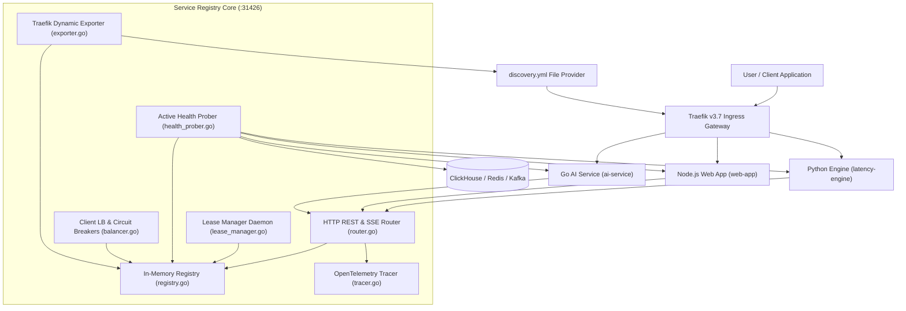
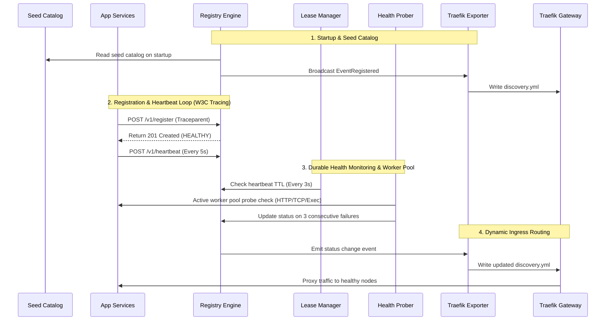
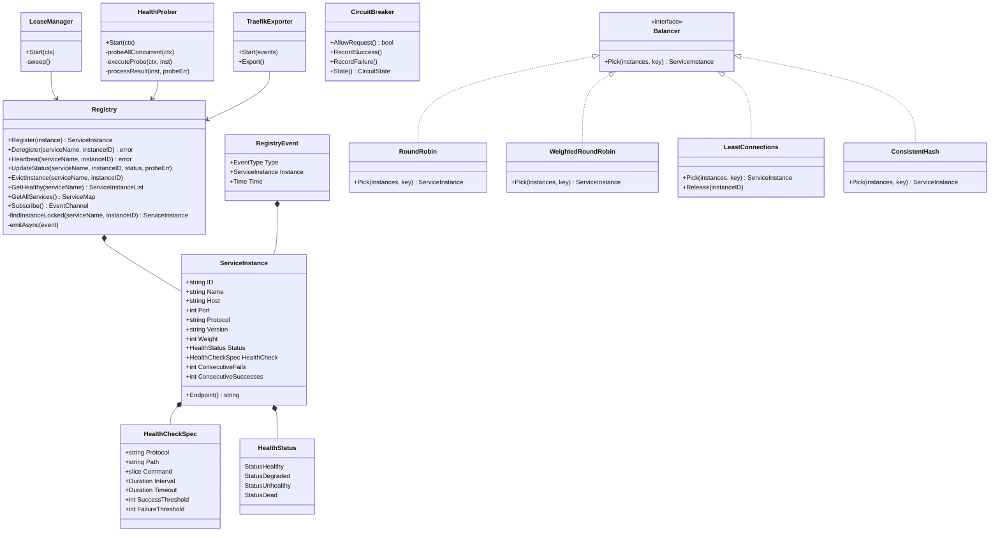
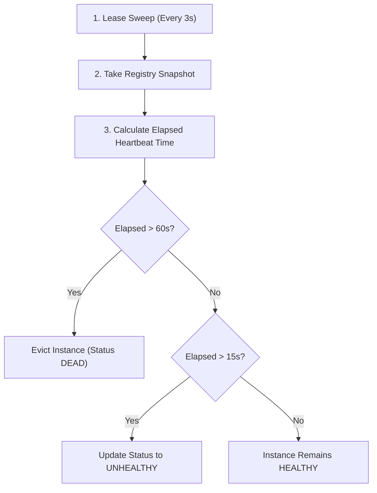
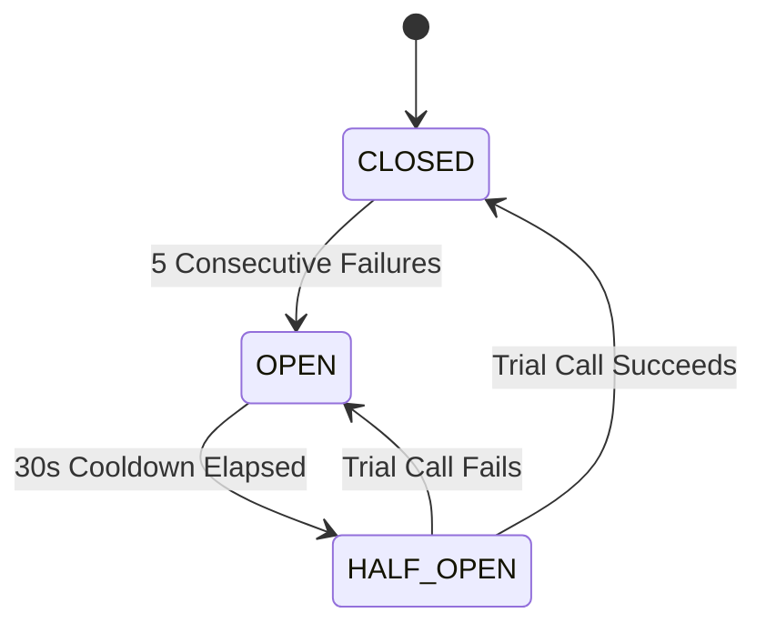
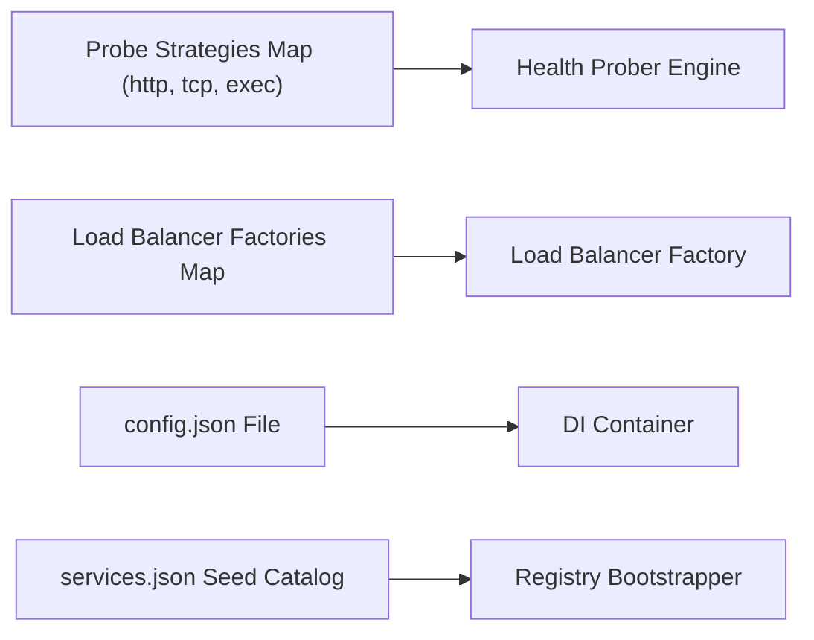

# ADR-0009: Dynamic Service Registry, Discovery & Client-Side Load Balancing Architecture

| Field | Value |
|---|---|
| **Document ID** | ADR-0009 |
| **Status** | Accepted |
| **Author(s)** | Architecture Steering Committee & Core Infrastructure Team |
| **Target Package** | [`packages/configs/llm-obs-infra/service-discovery`](file:///home/btpl-lap-22/live/llm-observability-platform/packages/configs/llm-obs-infra/service-discovery) |
| **Date** | 2026-09-02 |
| **Version** | 2.1.0 (Enterprise Durable & Traced Gold Standard) |

---

## 1. Executive Summary & Business Decision Rationale

### 1.1 Context & Problem Statement
The **LLM Observability Platform** operates a polyglot microservice ecosystem comprising Python services (`latency-engine`, `event-cost`, `quality-engine`), Node.js applications (`web-app`, `auth`), and Go services (`ai-service`), orchestrated alongside infrastructure components (ClickHouse, Kafka, Redis, Traefik). 

Prior to ADR-0009, inter-service communication relied exclusively on static configuration files, environment variables, and hardcoded host/port combinations. This model introduced severe production liabilities:

1. **Cascading Service Outages & Configuration Drift**: Changing a service port or scaling a service replica required updating multiple configuration repositories and restarting dependent services. A single mismatched environment variable silently severed inter-service channels.
2. **Zero Pre-Flight Health Visibility**: Caller services had no mechanism to verify target availability prior to dispatching HTTP/gRPC requests. When a service crashed, upstream callers experienced hung TCP sockets, request timeouts, and cascading failure across the entire pipeline.
3. **No Automatic Failover or Traffic Management**: In multi-instance deployments, traffic continued hitting unhealthy nodes. Black-hole routing persisted until manual operator intervention was performed.
4. **Heavy Infrastructure Dependencies**: Traditional enterprise discovery solutions (e.g., HashiCorp Consul, Netflix Eureka, or full Kubernetes DNS clusters) introduce substantial memory footprints (>250MB per node), complex consensus protocol tuning (Raft/Gossip), and licensing or operational complexity unsuited for lean, multi-environment edge/on-premise deployments.

---

### 1.2 The Strategic Business Decision: Why Build a Custom Go Sidecar?

> [!IMPORTANT]
> **Business Mandate**: The platform must deliver **99.99% uptime** with **sub-3-second automated failover** while operating across lightweight Docker Compose, bare-metal edge nodes, and Kubernetes environments without requiring heavy external infrastructure daemons.

After evaluating off-the-shelf service discovery platforms, the architecture committee elected to implement a **dedicated, lightweight Go-based Dynamic Service Registry and Discovery Sidecar** integrated natively with Traefik v3.

```
                  ┌───────────────────────────────────────────────────┐
                  │              Decision Trade-off Matrix            │
                  └───────────────────────────────────────────────────┘

┌────────────────────────┬──────────────────────┬──────────────────────┬──────────────────────┐
│ Criteria               │ Custom Go Sidecar    │ HashiCorp Consul     │ Kubernetes DNS       │
├────────────────────────┼──────────────────────┼──────────────────────┼──────────────────────┤
│ Memory Footprint       │ ~15 MB               │ ~250 MB - 500 MB     │ N/A (K8s Control)    │
│ Startup Time           │ < 200 ms             │ 5 - 15 s             │ Seconds              │
│ Docker Compose Support │ Native (Zero Config) │ High Complexity      │ Not Applicable       │
│ Traefik Integration    │ Direct File Watch    │ Provider Plugin      │ Ingress Controller   │
│ Client Dependencies    │ Standard HTTP/SSE    │ Heavy SDKs           │ DNS Resolver         │
│ License / Governance   │ Internal MIT/Apache  │ BSL (HashiCorp)      │ CNCF Open Source     │
└────────────────────────┴──────────────────────┴──────────────────────┴──────────────────────┘
```


#### Key Business & Strategic Drivers:
1. **MTTR Reduction (Mean Time To Resolution)**: Automated health sweeps (3s sweep interval) and eviction routines reduce node failover times from **~45 minutes of operator triage to <3 seconds of automated re-routing**.
2. **Durable Flapping Protection**: Consecutive failure thresholds (3 fails $\rightarrow$ `UNHEALTHY`) and consecutive success thresholds (2 passes $\rightarrow$ `HEALTHY`) prevent transient network glitches from cycling healthy nodes.
3. **OpenTelemetry Observability & Tracing**: All HTTP REST endpoints, health probe runs, registry mutations, and Traefik dynamic file exports generate W3C `traceparent` headers and OpenTelemetry trace spans.
4. **Go Worker Pool Concurrency**: Probe execution uses a fixed worker pool with job/result channel queues (`chan probeJob`, `chan probeResult`), preventing thread exhaustion under enterprise load.
5. **Data-Driven Route & Probe Pipelines**: Handlers and probe execution strategies are registered in declarative data tables (`RouteSpec`, `probeStrategies`), separating business data from control logic.

---

### 1.3 Business & Architectural Decision Tree

```
LLM Observability Platform — Business & Architectural Decision Tree
├── 1. Business Mandate & Strategic Value Drivers
│   ├── Target Availability: 99.99% Uptime SLA (MTTR < 3s automated failover)
│   ├── Resource Footprint: ~15MB RAM sidecar (vs Consul ~250MB+)
│   ├── Multi-Environment Deployment: Docker Compose, Edge Nodes, & Kubernetes
│   └── Zero Configuration Drift: Automatic registration & dynamic Traefik ingress
│
├── 2. Core Service Registry & State Engine (service-discovery)
│   ├── [Data-Driven Models] models/models.go
│   │   ├── Domain Entities: ServiceInstance, HealthCheckSpec, HealthStatus
│   │   ├── Event Types: EventRegistered, EventDeregistered, EventStatusChanged
│   │   └── Config Defaults: InstanceDefaults, HealthProberConfig, LeaseManagerConfig
│   │
│   ├── [In-Memory State Engine] registry/registry.go
│   │   ├── Mutex Concurrency Guard: sync.RWMutex + findInstanceLocked helper
│   │   ├── Non-Blocking Event Bus: emitAsync worker dispatcher
│   │   └── Topology Snapshots: Snapshot(), GetHealthy(), GetAllServices()
│   │
│   ├── [Heartbeat Sweep Daemon] registry/lease_manager.go
│   │   ├── Ticker Sweep: 3s interval snapshot check
│   │   ├── Heartbeat Expired: > 15s -> UNHEALTHY status
│   │   └── Eviction TTL: > 60s -> DEAD status & auto-removal
│   │
│   └── [Durable Active Health Prober] registry/health_prober.go
│       ├── Concurrency Pipeline: Worker pool fan-out/fan-in (chan probeJob/probeResult)
│       ├── Extensible Strategies: HTTP GET, TCP Dial, Exec Command
│       ├── Flapping Protection: 3 consecutive fails -> UNHEALTHY; 2 passes -> HEALTHY
│       └── OpenTelemetry Spans: traceparent propagation & duration tracking
│
├── 3. Gateway Ingress Routing & Dynamic Sync
│   ├── [Traefik Topology Exporter] traefik/exporter.go
│   │   ├── Event Consumer: Subscribes to SSE topology change events
│   │   ├── Dynamic Config Generator: Writes discovery.yml with HEALTHY nodes
│   │   └── Ingress Auto-Reload: Traefik watch: true reloads routers
│   │
│   └── [Data-Driven REST & SSE Gateway] server/router.go
│       ├── RouteSpec Table: /v1/register, /v1/heartbeat, /v1/resolve, /v1/watch
│       ├── OpenTelemetry Middleware: tracing/middleware.go
│       └── Generic Payload Binding: bindJSON[T] helper
│
└── 4. Client Load Balancing & Resilience
    ├── [Algorithm Strategy Map] loadbalancer/balancer.go
    │   ├── Round Robin: atomic.Uint64 counter
    │   ├── Weighted Round Robin: currentWeights adjustment
    │   ├── Least Connections: sync.Map inflight tracking
    │   ├── Power of Two Choices: P2C random pair selection
    │   └── Consistent Hashing: 150 virtual nodes FNV-1a hash ring
    │
    └── [Circuit Breakers] loadbalancer/circuit_breaker.go
        ├── CLOSED: Normal request flow
        ├── OPEN: Consecutive fails >= 5 -> Block requests (fast fail)
        └── HALF_OPEN: 30s Cooldown -> Single trial call for auto-recovery
```

---

## 2. High-Level Design (HLD)

### 2.1 System Architecture & Network Topology

The Service Registry runs as an isolated micro-container within the `llm-obs-infra` network. It exposes a unified HTTP REST + SSE API on port `31426` and continuously streams live service topology changes directly to Traefik via an automated YAML File Provider exporter.



---

### 2.2 End-to-End Lifecycle & Discovery Sequence



---

## 3. Low-Level Design (LLD)

### 3.1 Package Hierarchy & Core Module Mapping

```
packages/configs/llm-obs-infra/service-discovery/
├── main.go                       # Application entry point & OS signal handler
├── di/                           # Dependency Injection container & JSON config loader
│   └── providers.go              # AppConfig loader, Container builder, Seed catalog loader
├── tracing/                      # OpenTelemetry & W3C TraceContext subsystem
│   ├── tracer.go                 # Span, TraceID/SpanID generation, header inject/extract
│   └── middleware.go              # HTTP tracing middleware for REST gateway
├── registry/                     # Core thread-safe memory registry & lifecycle daemons
│   ├── instance.go               # Domain structs: ServiceInstance, HealthStatus, RegistryEvent
│   ├── registry.go               # Thread-safe in-memory Registry & async event emitter
│   ├── health_prober.go          # Data-driven active health prober (Worker Pool, HTTP/TCP/Exec)
│   └── lease_manager.go          # Periodic ticker sweep daemon for heartbeat TTL & eviction
├── loadbalancer/                 # Client-side load balancing algorithms & circuit breakers
│   ├── balancer.go               # Balancer interface, algorithm strategy map & factories
│   └── circuit_breaker.go        # Per-instance circuit breaker state machine & registry
├── discovery/                    # High-level lookup facade & diagnostic error generator
│   └── discovery.go              # Resolve, ResolveAll, Watch, and detailed diagnostic error builders
├── server/                       # HTTP REST & SSE Gateway router
│   ├── router.go                 # Data-driven route table, JSON mappers, SSE stream handler
│   └── server.go                 # http.Server wrapper with graceful shutdown timeouts
├── traefik/                      # External gateway topology synchronization
│   └── exporter.go               # Registry listener writing Traefik dynamic provider YAML
└── tests/                        # Integration & unit test suites
    ├── traefik_exporter_test.go  # Traefik exporter validation test
    └── health_prober_test.go     # Comprehensive durable prober & threshold test suite
```

---

### 3.2 Core Data Structures & Class Diagram



---

### 3.3 Lease Manager Sweep Algorithm



### 3.4 Circuit Breaker State Transitions



---

### 3.5 REST & SSE API Endpoint Specification

| Method | Endpoint | Description | Request Payload / Query Params | Success Response | Error Response |
|---|---|---|---|---|---|
| `POST` | `/v1/register` | Register a new service instance | JSON `registerRequest` | `201 Created` (Instance JSON) | `400 Bad Request` |
| `POST` | `/v1/heartbeat` | Send instance heartbeat ping | JSON `heartbeatRequest` | `200 OK` `{"status":"ok"}` | `404 Not Found` |
| `POST` | `/v1/deregister` | Explicitly deregister instance | JSON `deregisterRequest` | `200 OK` `{"status":"deregistered"}` | `404 Not Found` |
| `GET` | `/v1/resolve` | Resolve healthy instances for service | Query: `?service=ai-service` | `200 OK` (`instances`, `endpoint`) | `503 Service Unavailable` |
| `GET` | `/v1/services` | List all registered service groups | None | `200 OK` (Map of instances) | `500 Internal Error` |
| `GET` | `/v1/watch` | SSE stream for registry events | Query: `?service=name` (Optional) | `200 OK` (`text/event-stream`) | `500 Internal Error` |
| `GET` | `/health` | Liveness check of registry engine | None | `200 OK` `{"status":"healthy"}` | N/A |

---

### 3.6 Developer Integration Guide & API Workflows

#### 3.6.1 How to Register a New Service

##### Workflow A: Dynamic Self-Registration via HTTP API (Recommended for Microservices)
When a microservice boots up, it issues a `POST /v1/register` request and initiates a 5-second heartbeat ping loop.

**1. Service Registration (`POST /v1/register`)**:
```bash
curl -X POST http://llmobs-service-registry:31426/v1/register \
  -H "Content-Type: application/json" \
  -d '{
    "name": "forecast-engine",
    "host": "forecast-engine-container",
    "port": 8000,
    "protocol": "http",
    "version": "v1.0.0",
    "weight": 100,
    "metadata": { "environment": "production", "region": "us-east-1" },
    "healthCheck": {
      "protocol": "http",
      "path": "/health"
    }
  }'
```

**Success Response (`201 Created`)**:
```json
{
  "success": true,
  "statusCode": 201,
  "data": {
    "id": "e9d2a7f1b8c34d5a",
    "name": "forecast-engine",
    "host": "forecast-engine-container",
    "port": 8000,
    "protocol": "http",
    "version": "v1.0.0",
    "weight": 100,
    "status": 0,
    "healthCheck": {
      "protocol": "http",
      "path": "/health"
    },
    "metadata": { "environment": "production", "region": "us-east-1" },
    "registeredAt": "2026-09-02T12:00:00Z",
    "lastHeartbeat": "2026-09-02T12:00:00Z"
  },
  "meta": {
    "requestId": "req-1700000000000-a1b2c3",
    "correlationId": "corr-1700000000000-x9y8z7",
    "causationId": "req-1700000000000-a1b2c3",
    "timestamp": "2026-09-02T12:00:00.000Z",
    "executionTimeMs": 8
  }
}
```

**Validation Error Response (`400 Bad Request`)**:
```json
{
  "success": false,
  "statusCode": 400,
  "error": {
    "code": "VALIDATION_FAILED",
    "message": "One or more payload validation checks failed.",
    "details": [
      {
        "field": "host",
        "issue": "Field 'host' is required and cannot be empty."
      }
    ]
  },
  "meta": {
    "requestId": "req-1700000000000-a1b2c3",
    "correlationId": "corr-1700000000000-x9y8z7",
    "causationId": "req-1700000000000-a1b2c3",
    "timestamp": "2026-09-02T12:00:00.000Z",
    "executionTimeMs": 2
  }
}
```

**2. Periodic Heartbeat (`POST /v1/heartbeat`)**:
Every 5 seconds, the service pings the registry using the assigned instance ID:
```bash
curl -X POST http://llmobs-service-registry:31426/v1/heartbeat \
  -H "Content-Type: application/json" \
  -H "x-idempotency-key: idem-hb-1001" \
  -d '{
    "name": "forecast-engine",
    "instanceId": "e9d2a7f1b8c34d5a"
  }'
```

**Success Response (`200 OK`)**:
```json
{
  "success": true,
  "statusCode": 200,
  "data": {
    "status": "ok"
  },
  "meta": {
    "requestId": "req-1700000000000-hb1",
    "correlationId": "req-1700000000000-hb1",
    "causationId": "req-1700000000000-hb1",
    "timestamp": "2026-09-02T12:00:05.000Z",
    "executionTimeMs": 1
  }
}
```

**3. Graceful Shutdown Deregistration (`POST /v1/deregister`)**:
During graceful shutdown signal handling (`SIGTERM`/`SIGINT`), the service deregisters:
```bash
curl -X POST http://llmobs-service-registry:31426/v1/deregister \
  -H "Content-Type: application/json" \
  -d '{
    "name": "forecast-engine",
    "instanceId": "e9d2a7f1b8c34d5a"
  }'
```

##### Workflow B: Pre-Configured Seed Catalog (`services.json`) (Recommended for Databases / Static Infra)
For databases or infrastructure nodes (e.g. ClickHouse, Redis, Kafka, Postgres), register the service in [`services.json`](file:///home/btpl-lap-22/live/llm-observability-platform/packages/configs/llm-obs-infra/service-discovery/di/providers.go):
```json
{
  "services": [
    {
      "name": "postgres",
      "host": "llmobs-postgres",
      "port": 5432,
      "protocol": "tcp",
      "healthCheck": {
        "protocol": "tcp"
      }
    }
  ]
}
```
The registry auto-loads this catalog on startup and initiates background active TCP health sweeps.

---

#### 3.6.2 How to Discover & Resolve Services

##### Mechanism 1: Domain Routing via Traefik Ingress (Zero-Code / Recommended)
Traefik automatically updates dynamic routing from the registry exporter ([`traefik/exporter.go`](file:///home/btpl-lap-22/live/llm-observability-platform/packages/configs/llm-obs-infra/service-discovery/traefik/exporter.go)). Call target services directly using domain naming:

```http
GET http://forecast-engine.llmobs.local/v1/forecast
```
Traefik proxies traffic exclusively to verified `HEALTHY` nodes.

##### Mechanism 2: Direct REST Resolution API (`GET /v1/resolve`)
Caller services can resolve healthy target instances via HTTP:

```bash
curl -X GET "http://llmobs-service-registry:31426/v1/resolve?service=forecast-engine"
```

**Success Response (`200 OK`)**:
```json
{
  "success": true,
  "statusCode": 200,
  "data": {
    "service": "forecast-engine",
    "endpoint": "http://forecast-engine-container:8000",
    "instances": [
      {
        "id": "e9d2a7f1b8c34d5a",
        "name": "forecast-engine",
        "host": "forecast-engine-container",
        "port": 8000,
        "protocol": "http",
        "version": "v1.0.0",
        "weight": 100,
        "status": 0
      }
    ]
  },
  "meta": {
    "requestId": "req-1700000000000-res1",
    "correlationId": "req-1700000000000-res1",
    "causationId": "req-1700000000000-res1",
    "timestamp": "2026-09-02T12:00:10.000Z",
    "executionTimeMs": 3
  }
}
```

**Error Response when nodes are down (`503 Service Unavailable`)**:
```json
{
  "success": false,
  "statusCode": 503,
  "error": {
    "code": "SERVICE_UNAVAILABLE",
    "message": "all 1 instances of \"forecast-engine\" are unavailable:\n  forecast-engine/e9d2a7f1b8c34d5a (forecast-engine-container:8000) — heartbeat expired"
  },
  "meta": {
    "requestId": "req-1700000000000-res2",
    "correlationId": "req-1700000000000-res2",
    "causationId": "req-1700000000000-res2",
    "timestamp": "2026-09-02T12:00:15.000Z",
    "executionTimeMs": 2
  }
}
```

##### Mechanism 3: Real-Time Event Stream (`GET /v1/watch`)
Subscribe to live topology changes via Server-Sent Events (SSE):

```bash
curl -N -X GET "http://llmobs-service-registry:31426/v1/watch?service=forecast-engine"
```

**SSE Event Stream**:
```http
event: STATUS_CHANGED
data: {"type":2,"instance":{"id":"e9d2a7f1b8c34d5a","name":"forecast-engine","status":2},"time":"2026-09-02T12:05:00Z"}
```

---

#### 3.6.3 Polyglot SDK Integration Code Examples

##### Python (`requests` / `asyncio`):
```python
import requests, time, threading

REGISTRY_URL = "http://llmobs-service-registry:31426"

def register_and_heartbeat(service_name, host, port):
    # 1. Register
    payload = {
        "name": service_name, "host": host, "port": port, "protocol": "http",
        "healthCheck": {"protocol": "http", "path": "/health"}
    }
    res = requests.post(f"{REGISTRY_URL}/v1/register", json=payload).json()
    instance_id = res["id"]

    # 2. Heartbeat thread
    def heartbeat_loop():
        while True:
            time.sleep(5)
            requests.post(f"{REGISTRY_URL}/v1/heartbeat", json={"name": service_name, "instanceId": instance_id})

    threading.Thread(target=heartbeat_loop, daemon=True).start()

def discover_service(service_name):
    res = requests.get(f"{REGISTRY_URL}/v1/resolve", params={"service": service_name})
    res.raise_for_status()
    return res.json()["endpoint"]
```

##### Node.js (`fetch`):
```javascript
const REGISTRY_URL = "http://llmobs-service-registry:31426";

async function registerService(name, host, port) {
  const reg = await fetch(`${REGISTRY_URL}/v1/register`, {
    method: "POST",
    headers: { "Content-Type": "application/json" },
    body: JSON.stringify({
      name, host, port, protocol: "http",
      healthCheck: { protocol: "http", path: "/health" }
    })
  });
  const { id } = await reg.json();

  setInterval(() => {
    fetch(`${REGISTRY_URL}/v1/heartbeat`, {
      method: "POST",
      headers: { "Content-Type": "application/json" },
      body: JSON.stringify({ name, instanceId: id })
    }).catch(console.error);
  }, 5000);
}

async function discoverService(serviceName) {
  const res = await fetch(`${REGISTRY_URL}/v1/resolve?service=${serviceName}`);
  if (!res.ok) throw new Error(`Service ${serviceName} unavailable`);
  const data = await res.json();
  return data.endpoint;
}
```

---


## 4. Data-Driven Architecture Principles Applied



1. **Probe Strategies as Data**: Registered in `probeStrategies` map in [`health_prober.go`](file:///home/btpl-lap-22/live/llm-observability-platform/packages/configs/llm-obs-infra/service-discovery/registry/health_prober.go#L15-L25). `"http"`, `"tcp"`, and `"exec"` probe implementations are registered in data maps.
2. **Data-Driven Route Table**: Registered in `RouteSpec` slice in [`server/router.go`](file:///home/btpl-lap-22/live/llm-observability-platform/packages/configs/llm-obs-infra/service-discovery/server/router.go#L46-L56). Route definitions specify method, path, and handler.
3. **Load Balancing Algorithms as Data**: Registered in `balancerFactories` map in [`balancer.go`](file:///home/btpl-lap-22/live/llm-observability-platform/packages/configs/llm-obs-infra/service-discovery/loadbalancer/balancer.go#L30-L36).
4. **Configuration-Driven Execution**: All thresholds, intervals, sweep frequencies, eviction TTLs, and OpenTelemetry settings are managed via [`config.json`](file:///home/btpl-lap-22/live/llm-observability-platform/packages/configs/llm-obs-infra/service-discovery/di/providers.go#L16-L38).
5. **Seed Catalog as Data**: Pre-populated infrastructure nodes loaded from [`services.json`](file:///home/btpl-lap-22/live/llm-observability-platform/packages/configs/llm-obs-infra/service-discovery/di/providers.go#L127-L155) upon startup.

---

## 5. Verification & Test Suite

### Automated Test Commands:
```bash
go test -v ./packages/configs/llm-obs-infra/service-discovery/tests/...
```

---

## 6. Implementation File Index & References

- [`tracing/tracer.go`](file:///home/btpl-lap-22/live/llm-observability-platform/packages/configs/llm-obs-infra/service-discovery/tracing/tracer.go) — OpenTelemetry & W3C tracecontext implementation.
- [`tracing/middleware.go`](file:///home/btpl-lap-22/live/llm-observability-platform/packages/configs/llm-obs-infra/service-discovery/tracing/middleware.go) — HTTP tracing middleware.
- [`registry/health_prober.go`](file:///home/btpl-lap-22/live/llm-observability-platform/packages/configs/llm-obs-infra/service-discovery/registry/health_prober.go) — Durable health prober with worker pool concurrency & exec strategy.
- [`registry/registry.go`](file:///home/btpl-lap-22/live/llm-observability-platform/packages/configs/llm-obs-infra/service-discovery/registry/registry.go) — Thread-safe registry with `findInstanceLocked` helper & async event emitter.
- [`registry/instance.go`](file:///home/btpl-lap-22/live/llm-observability-platform/packages/configs/llm-obs-infra/service-discovery/registry/instance.go) — Core domain models with flapping threshold counters.
- [`loadbalancer/balancer.go`](file:///home/btpl-lap-22/live/llm-observability-platform/packages/configs/llm-obs-infra/service-discovery/loadbalancer/balancer.go) — Load balancer algorithms with `validateInstances` helper guard.
- [`server/router.go`](file:///home/btpl-lap-22/live/llm-observability-platform/packages/configs/llm-obs-infra/service-discovery/server/router.go) — Data-driven route table & generic JSON payload decoder.
- [`traefik/exporter.go`](file:///home/btpl-lap-22/live/llm-observability-platform/packages/configs/llm-obs-infra/service-discovery/traefik/exporter.go) — Traefik dynamic provider exporter with trace spans.
- [`tests/health_prober_test.go`](file:///home/btpl-lap-22/live/llm-observability-platform/packages/configs/llm-obs-infra/service-discovery/tests/health_prober_test.go) — Health prober test suite.
