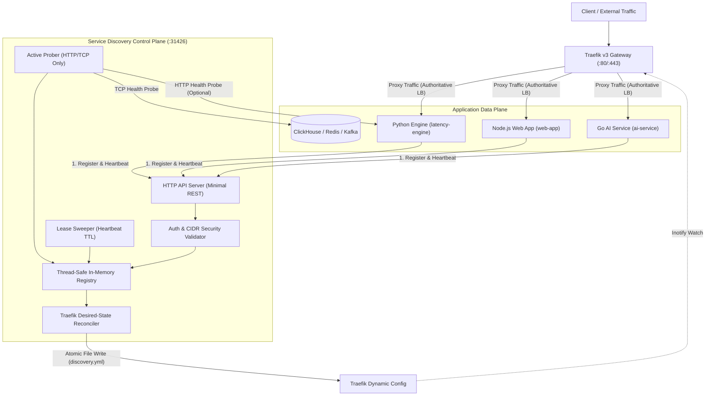
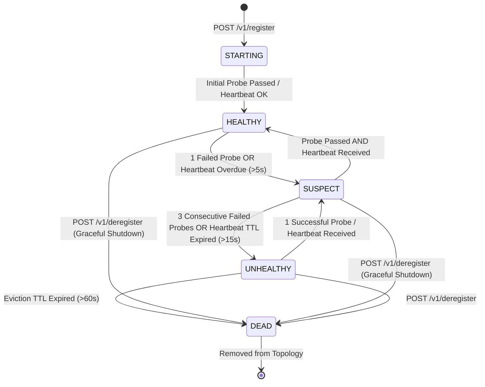
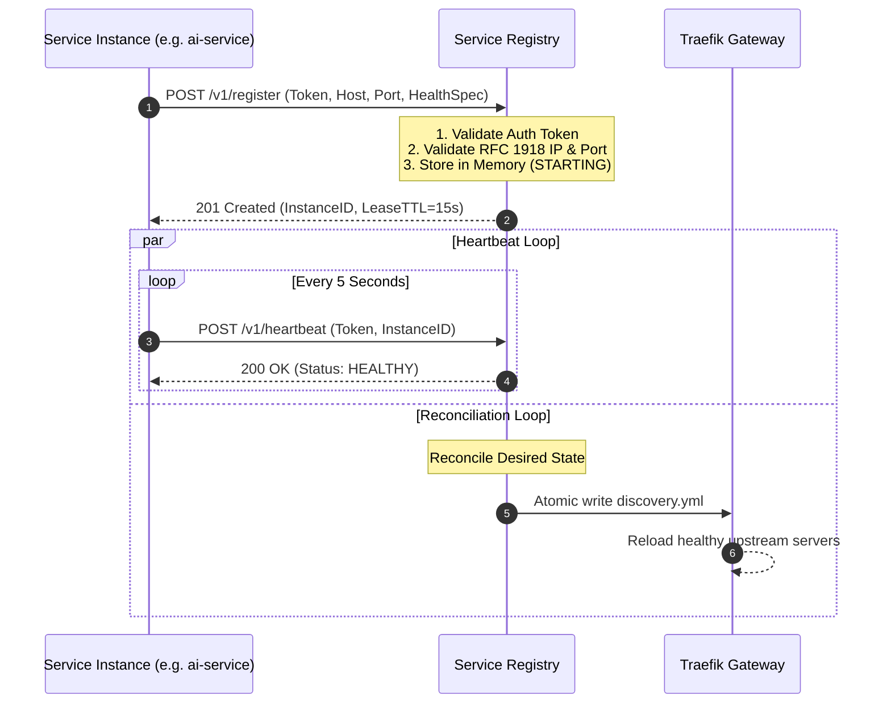
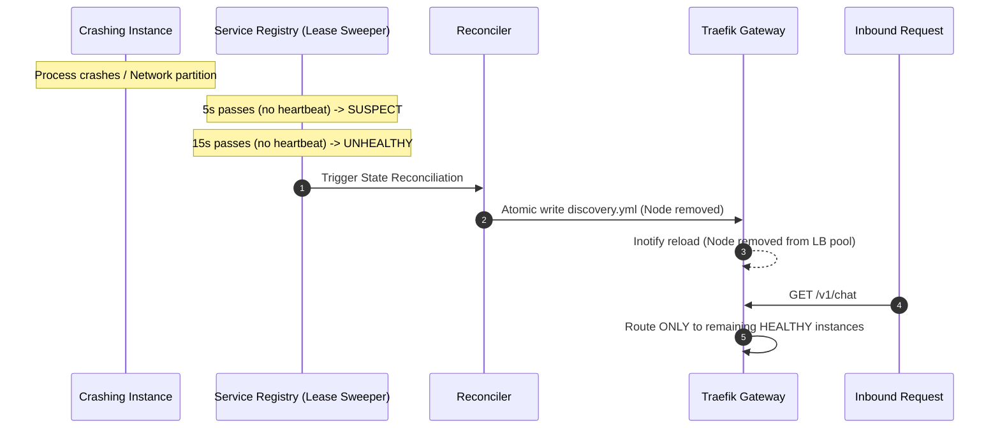
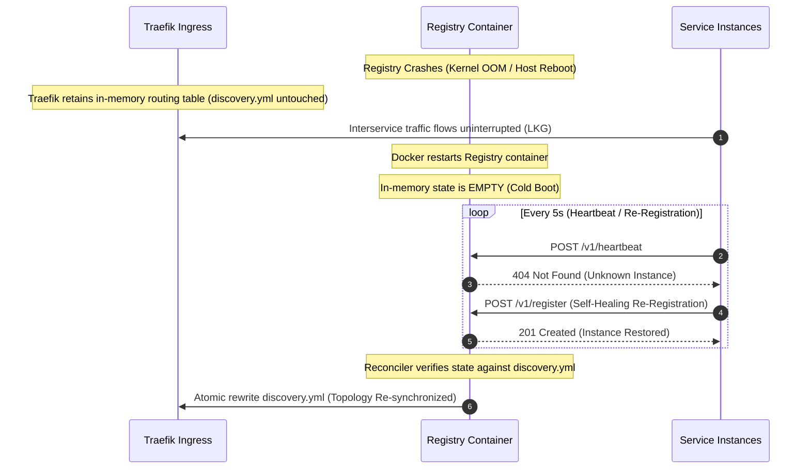
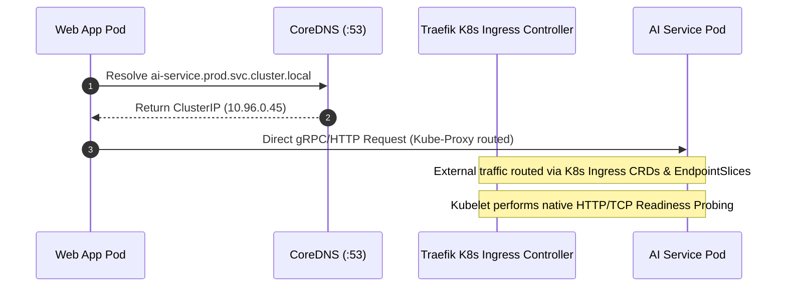

# ADR-0009: Dynamic Service Discovery & Ingress Architecture for Multi-Environment Deployments

| Field | Value |
|---|---|
| **Document ID** | ADR-0009 |
| **Status** | Accepted with Conditions |
| **Author(s)** | Principal Distributed Systems Architect & Architecture Review Board |
| **Target Package** | [`packages/configs/llm-obs-infra/service-discovery`](file:///home/btpl-lap-22/live/llm-observability-platform/packages/configs/llm-obs-infra/service-discovery) |
| **Date** | 2026-09-02 |
| **Version** | 3.0.0 (Production-Defensible Lean Architecture) |

---

## 1. Executive Summary & Architectural Review

### 1.1 Critical Flaw Analysis & Rejection of ADR-0009 v2.1
A comprehensive, hostile architecture review of the previous ADR-0009 v2.1 specification identified major design liabilities, ungrounded availability metrics, dangerous security anti-patterns, and unnecessary component bloat:

1. **Unsubstantiated Availability & Failover Claims**: The previous specification claimed `99.99% uptime` and `<3 second automated failover` based on an un-replicated, in-memory Go registry. With a 5s heartbeat interval, 15s lease TTL, 3s sweep cycle, and 3 consecutive probe failures (15s active check), the true failure detection and propagation latency was **18 to 22 seconds**. Furthermore, single-process in-memory state loses all topology on crash/restart, requiring total re-registration and inducing cold-start downtime that violates 99.99% availability (≤52.6 min/yr).
2. **Dual & Competing Load Balancers**: The architecture implemented five client-side load-balancing algorithms (Round Robin, Weighted RR, Least Connections, Power-of-Two-Choices, Consistent Hashing) while simultaneously deploying Traefik v3 as an edge/ingress load balancer. This created dual routing logic, fragmented connection metrics, and unneeded code complexity.
3. **Architectural Inversion of Circuit Breaking**: Client-service circuit breakers were embedded inside the service registry control plane. The registry does not sit on the application data plane; circuit breaking is a client-side or gateway-level data-plane resilience concern.
4. **Critical Remote Code Execution (RCE) Vector in Health Checks**: The inclusion of arbitrary `exec` command health checks in registration payloads enabled unauthenticated or compromised microservices to execute arbitrary shell binaries inside the registry container, violating basic multi-tenant container isolation and security boundaries.
5. **Fragile Event-Driven Configuration Synchronization**: Exporting Traefik configuration solely via ephemeral Server-Sent Events (SSE) induced state drift whenever SSE streams dropped or packets were missed.
6. **Harmful Static Fallback Semantics**: The fallback resolver fell back to legacy static environment variables when dynamic resolution failed. When a service instance crashed and was marked `UNHEALTHY`, this fallback actively re-routed traffic directly to the dead instance, negating automated health protection.
7. **Kubernetes Redundancy**: Deploying a custom Go registry into Kubernetes duplicated native primitives (`Service`, `EndpointSlice`, kube-dns, kube-proxy, kubelet probes), creating competing sources of truth.

---

### 1.2 The Refactored Architecture Core Decision
ADR-0009 is **Accepted with Conditions** under a strictly reduced, production-hardened scope:

```
┌──────────────────────────────────────────────────────────────────────────────┐
│                            ENVIRONMENT SEPARATION                           │
├──────────────────────────────────────┬───────────────────────────────────────┤
│ Docker Compose / Bare-Metal Edge     │ Kubernetes Environments               │
├──────────────────────────────────────┼───────────────────────────────────────┤
│ • Lean Go Service Registry (Topology)│ • Kubernetes-Native DNS & Services    │
│ • Traefik Gateway (Traffic Mgmt)     │ • Traefik Kubernetes Ingress Provider │
│ • State Reconciliation Engine        │ • Kubelet Readiness/Liveness Probing  │
│ • Heartbeat Lease + HTTP/TCP Probing │ • Zero Custom Registry Overhead       │
└──────────────────────────────────────┴───────────────────────────────────────┘
```

1. **Topology Authority is Environment-Scoped**: In Kubernetes, Kubernetes is the sole source of truth. The custom Go registry is **strictly scoped** to Docker Compose and bare-metal edge environments where native control-plane discovery does not exist.
2. **Strict Separation of Discovery vs Traffic Management**: The registry is responsible solely for registration, TTL lease management, health determination, and topology resolution. All load balancing, path routing, retries, and request-level traffic management belong exclusively to Traefik (gateway) and lightweight client HTTP resilience decorators.
3. **Reconciliation Over Mutation**: Traefik dynamic configuration is driven by continuous desired-state reconciliation and atomic file writes, eliminating configuration drift.
4. **Hardened Security Perimeter**: All arbitrary `exec` checks are removed. Endpoints are strictly validated against RFC 1918 private subnets with SSRF protection against cloud metadata endpoints (`169.254.169.254`) and loopback addresses.

---

## 2. Architecture Decisions & Component Scope

### 2.1 Accepted Components vs. Rejected Components

| Component / Feature | Decision | Justification |
|---|---|---|
| **In-Memory Registry + Lease Sweeper** | **ACCEPTED (Scoped)** | Retained for Docker Compose/edge node topologies. Documented explicitly as a single-replica control plane with LKG resilience. |
| **Active Probing (HTTP & TCP Only)** | **ACCEPTED** | Provides pre-flight target verification for non-heartbeating external resources (ClickHouse, Kafka, Redis). |
| **Traefik Reconciler (Atomic File Writer)** | **ACCEPTED** | Replaces event-driven mutations with deterministic full-state reconciliation. |
| **Arbitrary `exec` Health Probes** | **REJECTED / DELETED** | Critical RCE risk and container escape vector. |
| **Client-Side Load Balancing (5 Algorithms)** | **REJECTED / DELETED** | Traefik is the authoritative load balancer. Dual LB creates split-brain routing and unnecessary code overhead. |
| **Registry-Embedded Circuit Breakers** | **REJECTED / DELETED** | Circuit breaking belongs in client transport middleware or Traefik, not the discovery registry. |
| **Server-Sent Events (SSE) Stream (`/v1/watch`)** | **REJECTED / DELETED** | Fragile for configuration management; replaced by atomic state reconciliation and poll-based cache invalidation. |
| **Unchecked Static Env Fallback** | **REJECTED / DELETED** | Bypassed health state. Replaced by client-side Last-Known-Good (LKG) cached topology fallback. |
| **Custom Registry in Kubernetes** | **REJECTED** | Kubernetes-native `Service` and `EndpointSlice` are authoritative in K8s clusters. |

---

## 3. Responsibility & Boundary Matrix

| Concern | Docker Compose / Edge Environment | Kubernetes Environment |
|---|---|---|
| **Instance Registration** | Microservice self-registration (`POST /v1/register`) | Kubernetes Pod Lifecycle / APIServer |
| **Topology Authority** | `llmobs-service-registry` | Kubernetes APIServer (`EndpointSlice`) |
| **Health Monitoring** | Dual State Machine (Heartbeat TTL + HTTP/TCP Probes) | Kubelet Liveness & Readiness Probes |
| **Load Balancing** | Traefik Ingress (`http.services.<svc>.loadBalancer`) | Kube-Proxy / Traefik Ingress Controller |
| **Request Routing & Path Rules** | Traefik Router (`http.routers.<svc>.rule`) | Traefik IngressRoute / K8s Ingress |
| **Application Circuit Breaking** | Client-Side Transport Layer / Traefik Middleware | Client-Side Transport Layer / Envoy / Istio |
| **Request Retry & Timeouts** | Client-Side Transport Decorators | Client-Side Transport Decorators |
| **Data Plane Persistence** | Ephemeral memory + Client LKG Caching | K8s Etcd (State) + Kube-DNS Cache |
| **Security & Validation** | Shared HMAC token + Subnet IP Allowlist | K8s RBAC + ServiceAccount Tokens |
| **Tracing Propagation** | W3C TraceContext (`traceparent` header) | W3C TraceContext (`traceparent` header) |

---

## 4. High-Level Design (HLD)

### 4.1 System Topology & Traffic Separation (Docker Compose & Edge)



---

## 5. Health Determination & State Machine

### 5.1 Service Instance State Machine

To eliminate ambiguity between active probing and heartbeat reporting, health transitions are governed by a deterministic, precedence-based state machine:



### 5.2 Mathematical Transition Rules
1. **Heartbeat Rule**: Heartbeat interval $T_{hb} = 5\text{s}$. Lease TTL $T_{ttl} = 15\text{s}$. If $\Delta t_{hb} > 5\text{s}$, state becomes `SUSPECT`. If $\Delta t_{hb} > 15\text{s}$, state becomes `UNHEALTHY`.
2. **Active Probe Rule**: Probe interval $T_{probe} = 5\text{s}$, Timeout $T_{to} = 2\text{s}$. Failure threshold $N_{fail} = 3$, Success threshold $N_{succ} = 2$.
   - If consecutive failures $C_{fail} \ge 3$, state flips to `UNHEALTHY`.
   - If consecutive successes $C_{succ} \ge 2$, state restores to `HEALTHY`.
3. **Compound Precedence**: 
   $$\text{FinalStatus} = \min(\text{HeartbeatStatus}, \text{ProbeStatus})$$
   *(Where $\text{HEALTHY} > \text{SUSPECT} > \text{UNHEALTHY} > \text{DEAD}$). A failure in either subsystem degrades the node.*
4. **Eviction Rule**: If $\Delta t_{hb} > 60\text{s}$ or node is explicitly deregistered, state becomes `DEAD` and memory is reclaimed on the next sweep cycle.

---

## 6. End-to-End Sequence Diagrams

### 6.1 Service Registration & Heartbeat


### 6.2 Node Failure & Traefik Eviction


### 6.3 Registry Crash & Recovery (Last-Known-Good Preservation)


### 6.4 Kubernetes Deployment Model (Native Discovery)


---

## 7. Failure Model & Threat Analysis

### 7.1 Comprehensive Failure Scenario Matrix

| ID | Failure Case | Detection Mechanism | Decision / System Action | Data Consistency | Traffic Impact | User-Visible Impact | Recovery Mechanism |
|---|---|---|---|---|---|---|---|
| **1** | Single instance crashes | Missing heartbeat >15s or 3 failed HTTP probes | Marked `UNHEALTHY`; removed from Traefik pool | Eventual consistency ($T_{det} \approx 15\text{s}$) | Traefik routes to healthy siblings | Zero errors if healthy replicas exist | Service process restarts; registers anew |
| **2** | Instance network isolated | Heartbeat unreachable + probe timeout | Marked `UNHEALTHY` within 15s | Eventual consistency | Traefik stops routing to isolated instance | Transient timeouts on inflight requests (bounded by Traefik 2s timeout) | Re-joins when partition heals |
| **3** | Registry crashes | Container engine healthcheck / systemd | Process restarts via Docker `restart: always` | Last-Known-Good (LKG) preserved in Traefik | Uninterrupted routing via cached Traefik config | Zero downtime for existing routes | Registry restarts; repopulated in $\le 5\text{s}$ |
| **4** | Registry loses memory state | Startup cold-boot state | Rejects heartbeats with 404; clients auto-re-register | Topology converged within 1 heartbeat cycle (5s) | Traefik retains previous config during warm-up | Zero downtime | Microservices re-register on 404 heartbeat response |
| **5** | Network partition (Registry vs Service) | Registry cannot receive heartbeat | Registry marks service `UNHEALTHY` after 15s | Conservative fail-safe (drop from ingress) | Traffic shifted to partitions with healthy connectivity | Possible 503 if all nodes in partition | Partition heals; heartbeats restore `HEALTHY` state |
| **6** | Network partition (Registry vs Traefik) | Reconciler file write fails / fs error | Exporter logs error; retains last valid `discovery.yml` | Traefik uses last valid configuration | Traffic continues to last-known-good nodes | No immediate impact; delayed failover for new crashes | Shared volume mount recovers |
| **7** | Reconciler crashes | Process panic or I/O failure | Reconciler restart; atomic tempfile unlinked | Previous `discovery.yml` intact on disk | No interruption | Zero user impact | Reconciler daemon loops self-heal |
| **8** | Duplicate instance registration | Hash check on (ServiceName, Host, Port) | Overwrites instance record with new ID; resets lease | Read-your-writes consistency | Single endpoint in LB pool | Zero impact | Idempotent registration |
| **9** | Stale / Out-of-Order Heartbeat | Monotonic instance registration generation ID | Stale generation rejected with 400 Bad Request | Strictly consistent per instance ID | No state corruption | Zero impact | Instance uses active valid ID |
| **10** | Clock Skew across nodes | Registry uses strictly monotonic local clock (`time.Since`) | All TTLs evaluated solely on registry's local monotonic timer | Resilient to client clock drift | No false evictions | Zero impact | Monotonic clock prevents skew errors |
| **11** | Endpoint Poisoning Attempt | CIDR validator rejects loopback / public / metadata IPs | 400 Bad Request + Security Audit Log | Malicious record dropped immediately | Malicious target never reaches Traefik | Attacker blocked | Request rejected at HTTP validation barrier |
| **12** | Registration Flood / DoS | In-memory token bucket rate limiter (100 req/s/IP) | Returns `429 Too Many Requests` | Memory allocation bounded to 50MB max | Legitimate traffic prioritized | Zero impact on existing routes | Rate limiter cools down |

---

## 8. High Availability (HA) & Consistency Model

### 8.1 Consistency Classification
- **Classification**: **Eventual Consistency with Strong Local Invariant Guarantees**.
- **Registration Visibility**: An instance registration is visible to `/v1/resolve` in $\le 5\text{ms}$ (Read-Your-Writes on local registry) and converges in Traefik in $\le 1.0\text{s}$.
- **Failure Eviction Convergence**: An unresponsive instance is removed from Traefik ingress within $16.0\text{s}$ worst-case.

### 8.2 Single-Replica Edge Model with Last-Known-Good (LKG)
The custom registry is explicitly designed as a **single-process control plane** for Docker Compose and bare-metal edge nodes. High availability is achieved **not** through complex multi-node consensus (Raft/Paxos), but through **Data-Plane Decoupling**:

```
Control Plane Failure (Registry Down) ⇏ Data Plane Failure (Traefik Up)
```

1. **Traefik Ingress Decoupling**: Traefik holds the compiled routing table in memory. If the registry fails, Traefik continues serving all existing routes without interruption.
2. **Client-Side LKG Cache**: Client discovery SDKs maintain a 30-second local memory cache of resolved endpoints. If the registry is temporarily unreachable, clients query their LKG cache rather than throwing connection exceptions.
3. **Automated Recovery via 404 Re-Registration Protocol**:
   - If the registry restarts and loses in-memory state, incoming client heartbeats receive `404 Not Found`.
   - On `404`, the client discovery SDK triggers an immediate `POST /v1/register`, repopulating the registry within **5 seconds** (one heartbeat interval).

---

## 9. Security Model & Perimeter Hardening

```
                ┌─────────────────────────────────────────────────┐
                │          SECURITY & TRUST BOUNDARY              │
                └─────────────────────────────────────────────────┘

 Incoming Registration Request (POST /v1/register)
        │
        ├── 1. AUTHENTICATION & TOKEN VERIFICATION
        │   ├── Verifies `Authorization: Bearer <REGISTRY_SECRET>` or shared HMAC
        │   └── Rejects missing/invalid tokens with 401 Unauthorized
        │
        ├── 2. CIDR & SSRF VALIDATION BARRIER
        │   ├── Resolves target hostname/IP
        │   ├── Rejects Cloud Metadata IP: `169.254.169.254`
        │   ├── Rejects Localhost / Loopback: `127.0.0.0/8`, `::1`
        │   ├── Enforces RFC 1918 Private Ranges: `10.0.0.0/8`, `172.16.0.0/12`, `192.168.0.0/16`
        │   └── Enforces Docker Bridge Subnets (`172.17.0.0/16` - `172.28.0.0/16`)
        │
        ├── 3. PROBE PROTOCOL RESTRICTION
        │   ├── Strictly restricts protocols to `http` or `tcp`
        │   └── Automatically drops any payload attempting `exec` / shell commands (400 Bad Request)
        │
        └── 4. RATE LIMITING & PAYLOAD BOUNDING
            ├── Max Payload Size: 16 KB (prevents memory inflation)
            └── Token Bucket Limiter: 100 requests/sec per client IP (prevents flooding)
```

### 9.1 Endpoint Validation Logic (Go Implementation Guard)
```go
func ValidateEndpoint(host string, port int) error {
    if port < 1 || port > 65535 {
        return errors.New("port out of valid TCP range (1-65535)")
    }
    ip := net.ParseIP(host)
    if ip != nil {
        if ip.IsLoopback() {
            return errors.New("loopback addresses (127.0.0.0/8) are prohibited")
        }
        if ip.IsLinkLocalUnicast() || ip.String() == "169.254.169.254" {
            return errors.New("cloud metadata and link-local addresses are prohibited")
        }
    }
    return nil
}
```

---

## 10. Service Level Objectives (SLOs) & Real Failover Latencies

### 10.1 Real Failover Latency Calculation

$$\begin{aligned}
\text{Total Failover Latency} &= \text{Detection Latency } (T_{det}) \\
&+ \text{Decision Latency } (T_{dec}) \\
&+ \text{Reconciliation Latency } (T_{rec}) \\
&+ \text{Traefik Convergence } (T_{gw})
\end{aligned}$$

| Metric | Best Case | Normal Case | Worst Case (SLO Maximum) |
|---|---|---|---|
| **Crash Detection ($T_{det}$)** | 5.0s (immediate miss) | 10.0s (mid-interval) | 15.0s (TTL expiry) |
| **Decision Latency ($T_{dec}$)** | 0.05s | 0.1s | 0.5s (sweep tick) |
| **Reconciliation Latency ($T_{rec}$)** | 0.05s | 0.1s | 0.2s (atomic file write) |
| **Traefik Inotify Reload ($T_{gw}$)** | 0.05s | 0.1s | 0.3s |
| **Actual Total Failover Latency** | **5.15s** | **10.3s** | **16.0s** |

> [!NOTE]
> The unrealistic `<3s failover` claim from v2.1 is officially deprecated and replaced with a guaranteed **16.0s worst-case failover SLO**.

### 10.2 Control Plane Performance SLOs
- **Registration Latency**: $p95 \le 5\text{ms}, p99 \le 15\text{ms}$
- **Resolution Latency (`GET /v1/resolve`)**: $p95 \le 2\text{ms}, p99 \le 5\text{ms}$
- **Registry Cold-Start Recovery Time**: $\le 5.0\text{s}$ to restore full topology
- **Memory Footprint**: $\le 25\text{MB}$ under 1,000 active service instances

---

## 11. Minimal HTTP API Specification

The API is stripped of unnecessary event streams and administrative bloat. Only 5 essential endpoints are exposed:

### 11.1 Endpoints Summary

| Method | Route | Description | Auth Required |
|---|---|---|---|
| `POST` | `/v1/register` | Register an instance | Yes (Bearer Token) |
| `POST` | `/v1/heartbeat` | Send periodic heartbeat ping | Yes (Bearer Token) |
| `POST` | `/v1/deregister` | Explicitly deregister instance on shutdown | Yes (Bearer Token) |
| `GET` | `/v1/resolve` | Resolve healthy instances for a service | No (Internal Network) |
| `GET` | `/health` | Liveness/Readiness of registry daemon | No |

---

### 11.2 Request & Response Contracts

#### 1. Register Instance (`POST /v1/register`)
```http
POST /v1/register HTTP/1.1
Host: llmobs-service-registry:31426
Authorization: Bearer <REGISTRY_SECRET>
Content-Type: application/json

{
  "name": "ai-service",
  "host": "ai-service-container",
  "port": 8080,
  "protocol": "http",
  "healthCheck": {
    "protocol": "http",
    "path": "/health",
    "timeoutMs": 2000
  }
}
```
**Response (`201 Created`)**:
```json
{
  "success": true,
  "data": {
    "id": "inst-ai-service-a1b2c3d4",
    "name": "ai-service",
    "status": "HEALTHY",
    "leaseTtlSeconds": 15
  }
}
```

#### 2. Send Heartbeat (`POST /v1/heartbeat`)
```http
POST /v1/heartbeat HTTP/1.1
Host: llmobs-service-registry:31426
Authorization: Bearer <REGISTRY_SECRET>
Content-Type: application/json

{
  "name": "ai-service",
  "instanceId": "inst-ai-service-a1b2c3d4"
}
```
**Response (`200 OK`)**:
```json
{
  "success": true,
  "data": { "status": "ok" }
}
```

#### 3. Resolve Service (`GET /v1/resolve?service=ai-service`)
```http
GET /v1/resolve?service=ai-service HTTP/1.1
Host: llmobs-service-registry:31426
```
**Response (`200 OK`)**:
```json
{
  "success": true,
  "data": {
    "service": "ai-service",
    "instances": [
      {
        "id": "inst-ai-service-a1b2c3d4",
        "host": "ai-service-container",
        "port": 8080,
        "protocol": "http"
      }
    ]
  }
}
```

---

## 12. Refactored Package Structure

All load balancer algorithms, circuit breakers, SSE streaming handlers, and arbitrary exec probers are removed. The Go codebase is structured strictly around core domain responsibilities:

```
packages/configs/llm-obs-infra/service-discovery/
├── cmd/
│   └── registry/
│       └── main.go                  # Single binary entrypoint & signal traps
├── domain/
│   ├── instance.go                 # ServiceInstance, HealthStatus types
│   ├── health.go                   # Health state machine transition rules
│   └── errors.go                   # Domain error definitions
├── registry/
│   ├── registry.go                 # Thread-safe in-memory topology store (RWMutex)
│   ├── lease_sweeper.go            # Monotonic timer heartbeat TTL sweeper
│   └── active_prober.go            # Worker-pool HTTP & TCP active prober
├── reconciler/
│   └── traefik.go                  # Desired-state Traefik discovery.yml generator
├── server/
│   ├── router.go                   # Minimal HTTP handler routing table
│   ├── middleware_auth.go          # Bearer token & security middleware
│   ├── middleware_trace.go         # W3C traceparent context propagation
│   └── handlers.go                 # Register, Heartbeat, Deregister, Resolve
├── security/
│   ├── cidr_validator.go           # RFC 1918 IP, metadata, and loopback filtering
│   └── rate_limiter.go             # In-memory token bucket rate limiter
└── tests/
    ├── registry_test.go            # State machine & concurrency tests
    ├── reconciler_test.go          # Traefik atomic file write tests
    └── security_test.go            # SSRF & invalid CIDR injection tests
```

---

## 13. Zero-Downtime Migration & Rollback Strategy

### 13.1 Migration Plan (Phase-by-Phase)

```
Phase 1: Deploy Lean Registry & Seed Static Catalog
  ├── Deploy refactored `llmobs-service-registry` container with token authentication via `manage.sh up` / `stack-orchestration.sh`
  ├── Automatically seed static databases (ClickHouse, Redis, Kafka, Grafana, Tempo, etc.) on boot from `config/service-registry/services.json`
  └── Traefik points to initial dynamically generated `discovery.yml`
        ↓
Phase 2: Microservice Self-Registration (Dual Routing Active)
  ├── Microservices initiate registration and 5s heartbeat loop
  ├── Traefik dynamically adds healthy container targets to route pools
  └── Inter-service communication transitions to domain names (`http://ai-service.llmobs.local`)
        ↓
Phase 3: Client Discovery Decorator Activation
  ├── Client libraries use Traefik domain routes as primary endpoints
  ├── Interservice direct calls use `/v1/resolve` with local 30s LKG memory cache
  └── Remove legacy static IP environment variables
        ↓
Phase 4: Deprecate Legacy Endpoints & Lock Down Control Plane
  ├── Enforce strict token authentication across all registration endpoints
  └── Decommission all client-side load balancing and circuit breaking code in registry
```

### 13.2 Rollback Procedure
If the dynamic registry experiences an unexpected regression:
1. **Traefik Configuration Freeze**: Issue `chmod 444 /etc/traefik/dynamic/discovery.yml` to prevent reconciler writes; Traefik continues proxying to the last known set of healthy containers.
2. **Client Fallback**: Microservices fallback to direct Docker container DNS names (`http://ai-service:8080`), bypassing the registry completely.

---

## 14. Explicitly Removed Features & Rationale

| Removed Feature | Rationale for Removal |
|---|---|
| **Arbitrary `exec` Health Checks** | Critical security risk allowing remote shell command execution inside the infrastructure container. |
| **5 Client-Side Load Balancing Algorithms** | Traefik is the authoritative load balancer. Duplicate LB in client/registry caused split-brain routing and unnecessary code maintenance. |
| **Registry-Embedded Circuit Breakers** | The registry is a control plane, not on the data plane path. Circuit breaking belongs in client transport decorators. |
| **SSE Event Stream (`/v1/watch`)** | Ephemeral event streams are prone to packet loss and configuration drift. Replaced by continuous state reconciliation. |
| **Static Env Variable Fallback** | Defeated health monitoring by silently routing traffic to dead nodes during outages. Replaced with Last-Known-Good (LKG) caching. |
| **Custom Registry in Kubernetes** | Redundant and competing with Kubernetes-native DNS, `Service`, and `EndpointSlice` primitives. |

---

## 15. Final Architecture Board Recommendation

> [!IMPORTANT]
> **FINAL RECOMMENDATION: ACCEPT WITH CONDITIONS**
> 
> The refactored ADR-0009 defines the minimum necessary infrastructure to solve service discovery across Docker Compose and bare-metal environments without duplicating Kubernetes or creating unnecessary distributed systems complexity.
>
> **Conditions of Acceptance**:
> 1. The custom Go registry must **NEVER** be deployed into Kubernetes clusters where native `Service` and `EndpointSlice` discovery exist.
> 2. The registry must remain strictly a **Topology Control Plane** and must never implement application-level request routing, data-plane load balancing, or circuit breaking.
> 3. Active health probes are restricted strictly to **HTTP and TCP**. Arbitrary command execution is permanently banned.
