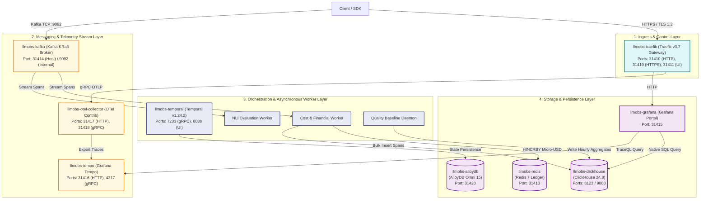
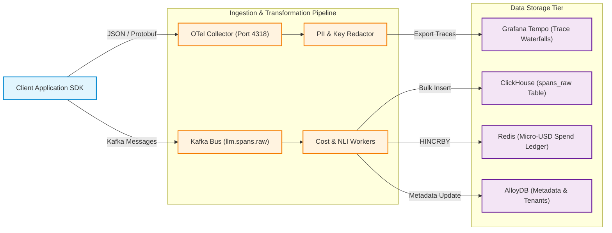
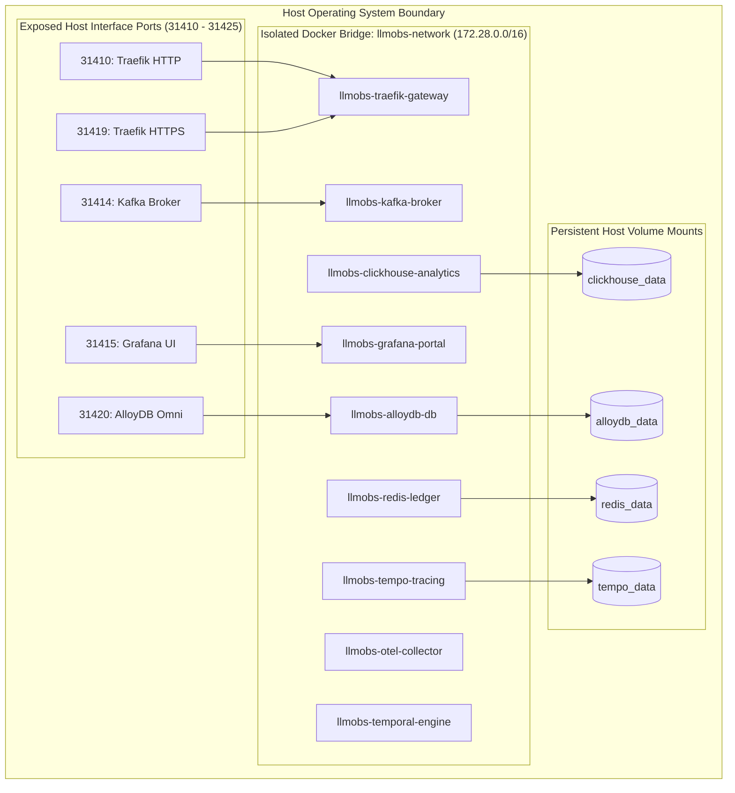

# High-Level Design (HLD) — Platform Infrastructure (`llm-obs-infra`)

| Field | Value |
|---|---|
| Document ID | HLD-LLMOBS-INFRA-001 |
| Version | 2.0.0 |
| Status | Approved |
| Related LLD(s) | [low-level-design.md](./low-level-design.md) |
| Related ADRs | [architecture-decision-record.md](./architecture-decision-record.md) |
| Author(s) | Principal Systems Architect |
| Approvers | Infrastructure Steering Committee |
| Date | 2026-08-28 |

---

## 1. Introduction & Purpose

The **High-Level Design (HLD)** defines the overall platform architecture, container boundaries, control planes, data pipelines, and external context for the **LLM Observability Platform Infrastructure (`llm-obs-infra`)**.

- **Purpose of this document:** Establish the structural blueprint and communication channels governing the 9 core infrastructure container services.
- **Intended audience:** Enterprise Architects, DevOps Engineers, SREs, Security Reviewers, and Backend Developers.
- **How to read this document:** Use this HLD for macro-level system topologies and data flows. For specific schema definitions, method signatures, sequence activations, and class diagrams, refer to the [Low-Level Design (LLD)](./low-level-design.md).

---

## 2. Business Context & Goals

| Item | Detail |
|---|---|
| Business problem being solved | Real-time LLM telemetry span ingestion, prompt evaluation, and micro-USD financial spend tracking |
| Success metrics | Ingest 50,000 spans/sec at p95 < 25ms, sub-100ms analytics queries across 50M rows |
| Stakeholders | Platform Infrastructure Team, FinOps, SRE, Product Engineering |
| Related initiatives | Next.js Web Portal, FastAPI Ingestion SDK, Temporal Worker Daemons |

---

## 3. Scope

| In Scope | Out of Scope |
|---|---|
| Control Plane (Traefik v3.7 gateway, TLS termination) | Application business logic inside web app UI |
| Messaging & Workflow Plane (Kafka KRaft, Temporal) | Front-end React component rendering logic |
| Storage & Caching Plane (AlloyDB Omni 15, ClickHouse 24.8, Redis 7) | External third-party LLM provider API hosting |
| Telemetry & Observability (OTel Collector, Tempo, Grafana) | Cloud provider billing account management |

- **Assumptions:** Host Linux OS meets system prerequisites (`ulimit -n 65536`, `vm.max_map_count=262144`).
- **Constraints:** Host port allocation restricted to `31410`–`31425` range to avoid collisions.

---

## 4. System Context

The System Context diagram illustrates how external client applications, ingestion SDKs, web dashboards, and third-party LLM providers interact with the `llm-obs-infra` platform boundary.

```mermaid
graph LR
    classDef actor fill:#e1f5fe,stroke:#0288d1,stroke-width:2px;
    classDef system fill:#e8f5e9,stroke:#388e3c,stroke-width:2px,font-weight:bold;
    classDef external fill:#fff3e0,stroke:#f57c00,stroke-width:2px;

    PythonSDK["Python Ingestion SDK (FastAPI :8000)"]:::actor
    NextWeb["Next.js Web Portal (:3000)"]:::actor
    AdminUser["Platform Admin"]:::actor

    subgraph SystemBoundary ["System Boundary: llm-obs-infra Stack"]
        CoreInfra["Central Infrastructure Topology (llmobs-network)"]:::system
    end

    LLMProviders["Third-Party LLM APIs (OpenAI / Anthropic / Google)"]:::external
    AlertSinks["Alert Destinations (PagerDuty / Slack / Webhooks)"]:::external

    PythonSDK -->|"1. HTTPS / OTLP gRPC (Publish Spans)"| CoreInfra
    NextWeb -->|"2. REST / HTTPS (Query Analytics & Traces)"| CoreInfra
    AdminUser -->|"3. HTTPS (Traefik & Grafana Portals)"| CoreInfra

    PythonSDK -.->"Proxy Model Calls"| LLMProviders
    CoreInfra -->|"4. HTTPS Webhooks (Trigger Alerts)"| AlertSinks
```

| External Entity | Type | Interaction |
|---|---|---|
| Python Ingestion SDK | External Client | Pushes OpenTelemetry span batches via OTLP/HTTP or OTLP/gRPC |
| Next.js Web Portal | Front-End App | Queries ClickHouse analytics and Tempo trace waterfalls via Traefik |
| Alert Sinks | Third-Party System | Receives triggered alert webhooks from notification workers |

---

## 5. High-Level Architecture

The High-Level Architecture (HLA) organizes the platform into 4 operational tiers: Ingress Gateway, Asynchronous Worker & Workflow Tier, Telemetry & Messaging Tier, and Storage & Caching Tier.



### 5.1 Major Components

| Component | Responsibility | Owning Team | LLD Reference |
|---|---|---|---|
| `llmobs-traefik` | Ingress gateway, TLS termination, CORS & rate limiting | Infra Team | [LLD Section 4](./low-level-design.md#4-api-specification) |
| `llmobs-kafka` | Real-time telemetry event streaming message bus | Infra Team | [LLD Section 3.3](./low-level-design.md#33-kafka-topic--partition-schema) |
| `llmobs-otel-collector` | Span batching, PII redaction, OTLP processing | Telemetry Team | [LLD Section 2.1](./low-level-design.md#21-module--class-structure) |
| `llmobs-clickhouse` | High-throughput columnar span data warehouse | Database Team | [LLD Section 3.1](./low-level-design.md#31-clickhouse-columnar-telemetry-database) |
| `llmobs-alloydb` | Relational store for metadata, tenancy, and Temporal sagas | Database Team | [LLD Section 3.2](./low-level-design.md#32-alloydb-omni-relational-database) |
| `llmobs-redis` | In-memory spend ledger and sliding-window rate limit cache | Infrastructure | [LLD Section 3.4](./low-level-design.md#34-redis-in-memory-key-schema) |

### 5.2 Component Interaction Matrix

| From | To | Interaction Type | Sync/Async | Failure Handling Protocol |
|---|---|---|---|---|
| Ingestion SDK | Traefik / OTel | OTLP over HTTP/gRPC | Async | Client-side memory queue & retry |
| Ingestion SDK | Kafka Broker | Kafka TCP (`9092`) | Async | Producer buffer retry + DLQ |
| Cost Worker | Redis Ledger | RESP (`6379`) | Sync | Exponential backoff retry |
| Cost Worker | ClickHouse | HTTP Bulk (`8123`) | Async | Batch buffer fallback |
| Grafana | ClickHouse / Tempo | Native SQL / TraceQL | Sync | Query timeout (5s) |

---

## 6. High-Level Data Architecture

The Data Flow diagram tracks the transformation of raw LLM span payloads from client ingestion to columnar storage, financial ledger updating, and Grafana dashboard visualization.



| Data Domain | Primary Store | Classification | Owning Component |
|---|---|---|---|
| Raw Telemetry Spans | ClickHouse (`spans_raw`) | Confidential | Telemetry Pipeline |
| Micro-USD Spend Ledger | Redis (`org:spend`) | Financial / Confidential | Cost Worker |
| Trace Waterfalls | Grafana Tempo | Internal | OTel Collector |
| Tenancy & API Keys | AlloyDB Omni (`organizations`) | Restricted | Platform Core |

---

## 7. Integration & Interfaces

| Integration | Purpose | Protocol | Owned By |
|---|---|---|---|
| OTLP Span Receiver | Ingest raw LLM telemetry spans | OTLP / gRPC (`4317`) & HTTP (`4318`) | Internal / OpenTelemetry |
| Kafka Event Bus | Decouple ingestion from worker processing | Kafka Protocol (`9092`) | Internal / Apache Kafka |
| Grafana Exporters | Connect dashboards to telemetry backends | ClickHouse Native / Postgres Wire / TraceQL | Internal / Grafana |

---

## 8. Non-Functional Requirements

| NFR | Target | Approach (High Level) |
|---|---|---|
| Ingestion Latency | p95 < 25ms | Asynchronous batch processing in OTel Collector |
| Read Performance | p95 < 100ms for 10M rows | ClickHouse `SummingMergeTree` pre-aggregated tables |
| Financial Precision | Micro-USD ($0.000001) | Redis atomic `HINCRBY` bit-level integer arithmetic |
| Availability | 99.9% Stack Uptime | 3-stage ordered container boot with active readiness polling |

---

## 9. Deployment Topology

The Deployment Topology defines the single-host container network architecture inside `llmobs-network`.



| Environment | Region / Host | Infrastructure Detail |
|---|---|---|
| Development / Staging | Single Host Linux | Docker Compose v2.0+ with `llmobs-network` bridge |
| Production | Enterprise Host / Swarm | Multi-node cluster with NVMe persistent storage volumes |

---

## 10. Technology Choices & Rationale

| Layer | Technology | Rationale | ADR Reference |
|---|---|---|---|
| Ingress Gateway | Traefik v3.7 | Dynamic configuration, TLS termination, zero-downtime routing | [ADR-0004](./architecture-decision-record.md#adr-0004-traefik-v37-ingress-gateway) |
| Message Bus | Kafka KRaft | High-throughput streaming without ZooKeeper memory overhead | [ADR-0001](./architecture-decision-record.md#adr-0001-apache-kafka-kraft-over-zookeeper) |
| Columnar Database | ClickHouse 24.8 | 8:1 data compression, sub-second aggregation across 50M rows | [ADR-0003](./architecture-decision-record.md#adr-0003-clickhouse-columnar-span-warehouse) |
| Relational Database | AlloyDB Omni 15 | PostgreSQL 15 compatibility with 3x query acceleration | [ADR-0002](./architecture-decision-record.md#adr-0002-google-cloud-alloydb-omni-15) |

---

## 11. Security & Compliance Overview

- **Data sensitivity handled:** Confidential telemetry spans, prompt tokens, micro-USD financial ledger entries.
- **Key security controls:** Private bridge network isolation (`llmobs-network`), non-root container users (`user: 1000:1000`), read-only Docker socket mount (`/var/run/docker.sock:ro`), rate limiting.
- **Compliance frameworks:** SOC 2 Type II, ISO 27001, GDPR, HIPAA, EU AI Act.
- **Link to full Security Architecture Review:** [security-architecture-review.md](../securityDoc/security-architecture-review.md)

---

## 12. Risks, Assumptions & Open Issues

| Item | Type | Impact | Mitigation / Owner |
|---|---|---|---|
| Single-Host Container Bottleneck | Risk | High throughput spikes may saturate host disk IOPS | NVMe volume recommendation & sharding (DB Team) |
| Un-rotated Telemetry Retention | Risk | Disk full panic if ClickHouse retention purge disabled | Automated cron purge script `db-backup-and-purge.sh` |

---

## 13. Alternatives Considered

| Alternative Architecture | Why Rejected |
|---|---|
| Raw PostgreSQL for Spans | Relational write bottleneck at > 5,000 spans/sec; lacks columnar compression |
| Kafka with ZooKeeper | Requires 3 extra container daemons consuming > 1GB RAM |
| Elasticsearch for Tracing | 4x higher RAM consumption compared to ClickHouse `MergeTree` |

---

## 14. Appendix

- **A. Master Architecture Index Diagrams**
- **B. Related LLD Documents:** [low-level-design.md](./low-level-design.md)
- **C. Related ADRs:** [architecture-decision-record.md](./architecture-decision-record.md)
- **D. Sign-off:** Lead Systems Architect, DevOps Lead, SecOps Lead
