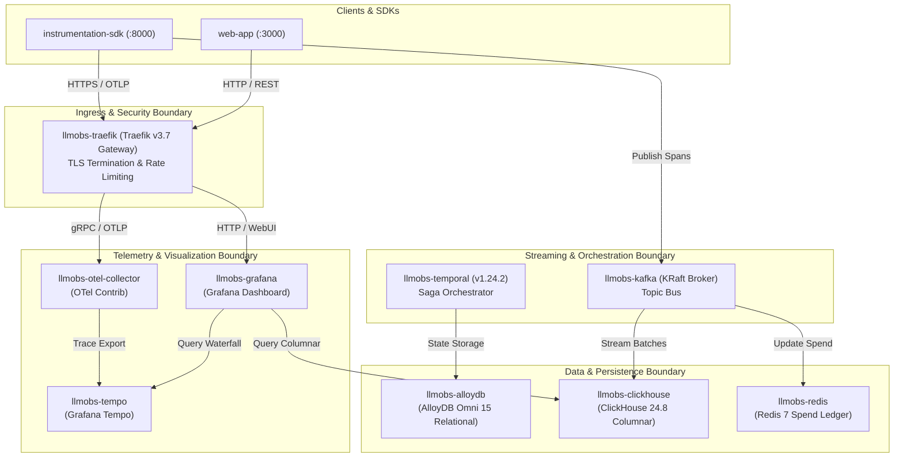

# High-Level Design (HLD) — Platform Infrastructure (`llm-obs-infra`)

| Field | Value |
|---|---|
| Document ID | HLD-LLMOBS-INFRA-001 |
| Version | 2.0.0 |
| Status | Approved |
| Parent Architecture Doc | [system-architecture-document.md](file:///home/btpl-lap-22/live/llm-observability-platform/packages/configs/llm-obs-infra/docs/architectureDoc/system-architecture-document.md) |
| Author(s) | Lead Systems Architect |
| Target Package | `packages/configs/llm-obs-infra` |
| Date | 2026-08-28 |

---

## 1. Overview & System Purpose

The **High-Level Design (HLD)** defines the major functional components, container boundaries, ingress routing, message streaming, and data storage layers composing `llm-obs-infra`.

This system acts as the central foundation for the entire LLM Observability Platform, capturing spans, traces, prompt evaluations, financial spend analytics, and quality metrics from downstream SDKs and API gateways.

---

## 2. Platform Architecture Boundary Map

---

## 3. High-Level Subsystem Breakdown

### 3.1 Ingress & Routing Subsystem (`llmobs-traefik`)
- **Role**: Entry point for external telemetry and administrative UI requests.
- **Port Mapping**:
  - `31410:80` (HTTP Ingress & Auto-redirect)
  - `31411:8080` (Traefik Admin Dashboard)
  - `31419:443` (HTTPS TLS Ingress)
- **Protocols**: HTTPS, WSS, OTLP/gRPC.

### 3.2 Messaging Subsystem (`llmobs-kafka`)
- **Role**: High-throughput distributed message bus for async span ingestion.
- **Architecture**: KRaft mode (no ZooKeeper dependency).
- **Core Topics**:
  - `llm.spans.raw` (3 partitions, 7-day retention)
  - `llm.evaluations.queue` (3 partitions, 48-hour retention)
  - `llm.alerts.triggered` (1 partition, 72-hour retention)

### 3.3 Analytics & Storage Subsystem (`llmobs-clickhouse` & `llmobs-alloydb`)
- **ClickHouse**: Columnar data warehouse optimized for multi-billion record span queries, token aggregations, and latency distribution calculation.
- **AlloyDB Omni 15**: Relational store for transactional entity metadata, customer tenants, authorization keys, and Temporal saga workflow states.

### 3.4 In-Memory Micro-USD Ledger (`llmobs-redis`)
- **Role**: High-speed atomic state store for financial ledger updates (`HINCRBY`), rate limiting sliding window checks, and API key token caches.

---

## 4. Key Data Flow Protocols

| Source Component | Target Component | Transport / Protocol | Payload Description |
|---|---|---|---|
| Ingestion SDK | Traefik / OTel | OTLP over gRPC / HTTP | OpenTelemetry span batches |
| Ingestion SDK | Kafka Broker | Kafka Native TCP (`9092`) | JSON/Protobuf serialized LLM span events |
| Cost Worker | Redis Ledger | Redis RESP (`6379`) | Micro-USD spend increments (`HINCRBY`) |
| Cost Worker | ClickHouse | HTTP Bulk Ingest (`8123`) | Flattened columnar span records |
| OTel Collector | Grafana Tempo | gRPC OTLP (`4317`) | Distributed trace waterfalls |
| Grafana | ClickHouse / Tempo | Native SQL / TraceQL | Dashboard visualization queries |

---

## 5. Security & Isolation Boundaries

1. **Network Boundary**: Container-to-container communication occurs exclusively on the internal Docker bridge network (`llmobs-network`).
2. **Host Port Boundary**: Only explicitly mapped ports (`31410`–`31420`) are accessible on host interfaces.
3. **Storage Boundary**: Data volumes are isolated to Docker named volumes (`alloydb_data`, `clickhouse_data`, `redis_data`, `tempo_data`, `kafka_data`).

---

## 6. References

- [Low-Level Design (LLD)](file:///home/btpl-lap-22/live/llm-observability-platform/packages/configs/llm-obs-infra/docs/architectureDoc/low-level-design.md)
- [Technical Design Document](file:///home/btpl-lap-22/live/llm-observability-platform/packages/configs/llm-obs-infra/docs/architectureDoc/technical-design-document.md)
