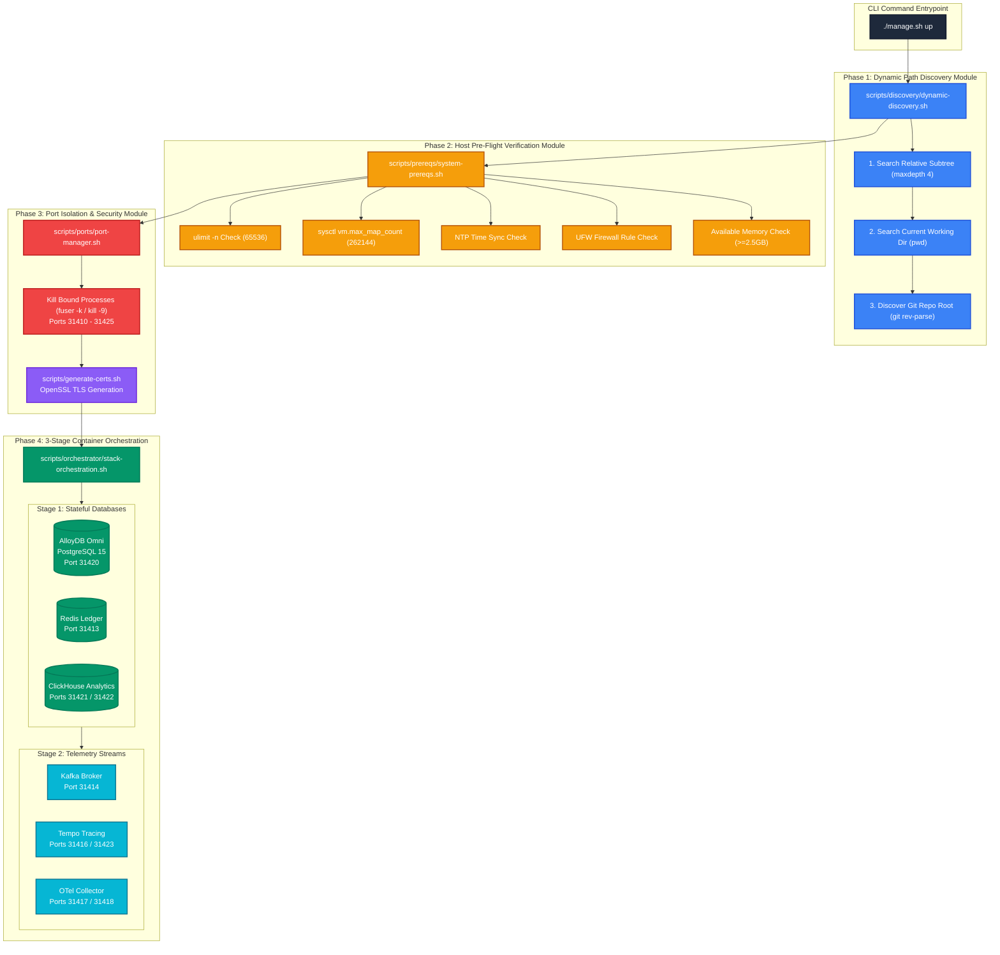
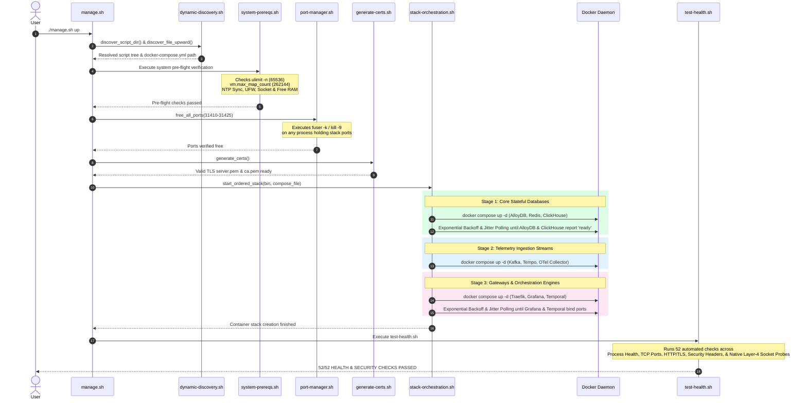

# Production-Grade Infrastructure Resilience, Dynamic Path Discovery, and Edge-Case Hardening Architecture

| Field | Value |
| --- | --- |
| **ADR ID** | `ADR-INFRA-HARDENING-0006` |
| **Title** | Production-Grade Infrastructure Resilience, Dynamic Path Discovery, and Edge-Case Hardening Architecture |
| **Status** | **Accepted** |
| **Date** | 2026-08-27 |
| **Scope** | Platform Infrastructure Stack (`packages/configs/llm-obs-infra`), Docker Compose Service Topologies, Host Pre-flight Verification Engine, Microservice Resource Limits, and Path Discovery |

---

## 1. Context & Problem Statement

Running enterprise telemetry ingestion platforms (**ClickHouse Analytics**, **Apache Kafka**, **AlloyDB Omni**, **Grafana Tempo**, **OpenTelemetry Collector**, and **Temporal Engine**) under real-world production constraints introduces severe failure modes. System crashes at this layer lead to silent data loss, corrupt analytics, un-recoverable memory panics, and costly downtime.

### Key Pain Points Solved
1. **Host Port Collisions & Process Interference**: Standard ports (e.g. `9000`, `8123`, `4317`, `5432`) frequently conflict with local developer services.
2. **Unbounded Resource Spikes & OS-Level OOM Cascades**: Without cgroups and application heap limits, ClickHouse queries or Kafka backpressure buffer spikes trigger Linux OOM-killer panics, terminating database daemons and corrupting disk blocks.
3. **Log Volume Disk Exhaustion**: Un-rotated container logs grow indefinitely on stdout, taking down the host OS disk over long runtime intervals.
4. **Environment Path Instability**: Hardcoded relative directory paths break script execution whenever code is checked out into non-standard folder hierarchies across different host environments.
5. **Database Race Conditions & WAL Recovery Window**: Rapid container initialization causes downstream orchestration daemons (e.g., Temporal) to crash before primary relational databases complete schema migrations or WAL recovery.

---

## 2. High-Level Architecture (HLA) & System Topology

### 2.1 Color-Coded Modular Deployment & Component Architecture

### 2.2 Sequence & Lifecycle Diagram

---

## 3. Low-Level Design (LLD) & Microservice Specifications

### 3.1 Network Topology & Port Mapping Registry

All microservices are bound to isolated ports in the **`31410` – `31425` range** to prevent host port collisions.

| Container Name | Internal Port | Host Port (`.env` override) | Service Purpose | Resource Limits (`cgroups`) |
|---|---|---|---|---|
| `llmobs-traefik-gateway` | `80` / `443` / `8080` | `31410` (HTTP) / `31419` (HTTPS) / `31411` (Dashboard) | Edge TLS Termination & Reverse Proxy | 512MB RAM |
| `llmobs-redis-ledger` | `6379` | `31413` | Rate-Limiting & Cost Ledger | 512MB RAM |
| `llmobs-kafka-broker` | `9092` | `31414` | Telemetry Event Streaming Broker | 2048MB Limit / 512MB Res / JVM `-Xmx1024m` |
| `llmobs-clickhouse-analytics` | `8123` / `9000` | `31421` (HTTP) / `31422` (Native) | Columnar Telemetry Database | 4096MB Limit / 1024MB Res / `nofile 262144` |
| `llmobs-tempo-tracing` | `3200` / `4317` | `31416` (HTTP) / `31423` (OTLP gRPC) | Distributed Trace Store | 1024MB RAM |
| `llmobs-otel-collector` | `4318` / `4317` | `31417` (HTTP) / `31418` (gRPC) | Telemetry Ingestion Pipeline | 1536MB Limit / 256MB Res |
| `llmobs-grafana-portal` | `3000` | `31415` | Observability Dashboards | 1024MB RAM |
| `llmobs-alloydb-db` | `5432` | `31420` | Relational Metadata Store | 2048MB Limit / 512MB Res |
| `llmobs-temporal-engine` | `7233` / `8080` | `31424` (gRPC) / `31425` (UI) | Durable Workflow Execution Engine | 1536MB RAM |

---

## 4. Comprehensive Edge-Case Protection Specification

### 4.1 Production Edge Case Summary Matrix

| # | Edge Case Category | Failure Impact if Unhandled | Automated Code Safeguard | Primary Location |
|---|---|---|---|---|
| **1** | **File Descriptor Limit** | Socket exhaustion in ClickHouse & Kafka dropping live span ingestion streams | `verify_file_descriptors` forces `ulimit -n 65536` | [system-prereqs.sh](file:///home/btpl-lap-22/live/llm-observability-platform/packages/configs/llm-obs-infra/scripts/prereqs/system-prereqs.sh#L34-L44) |
| **2** | **Kernel Memory Mapping** | Kafka `mmap` allocation crash (`OutOfMemoryError: Map failed`) | `verify_kernel_sysctls` sets `vm.max_map_count=262144` | [system-prereqs.sh](file:///home/btpl-lap-22/live/llm-observability-platform/packages/configs/llm-obs-infra/scripts/prereqs/system-prereqs.sh#L46-L61) |
| **3** | **Unbounded Container Logs** | Docker JSON logs fill host filesystem, crashing OS kernel | `json-file` log driver with `max-size: 50m`, `max-file: 3` | [docker-compose.yml](file:///home/btpl-lap-22/live/llm-observability-platform/packages/configs/llm-obs-infra/docker-compose.yml#L1-L5) |
| **4** | **Host-Wide OOM Cascades** | Heavy analytical query triggers Linux kernel OOM-killer across host | Strict `deploy.resources.limits` & `reservations` | [docker-compose.yml](file:///home/btpl-lap-22/live/llm-observability-platform/packages/configs/llm-obs-infra/docker-compose.yml#L86-L92) |
| **5** | **ClickHouse Query Memory & Profile Config** | User settings at top-level throw `DB::Exception Code 137` and crash daemon | Server limits in `custom.xml` & user profile in `override.xml` | [custom.xml](file:///home/btpl-lap-22/live/llm-observability-platform/packages/configs/llm-obs-infra/config/clickhouse/config.d/custom.xml#L19-L21) |
| **6** | **Kafka JVM Heap Over-Growth** | Unconstrained JVM heap triggers Docker `SIGKILL` mid-partition commit | `KAFKA_JVM_PERFORMANCE_OPTS="-Xms512m -Xmx1024m"` | [docker-compose.yml](file:///home/btpl-lap-22/live/llm-observability-platform/packages/configs/llm-obs-infra/docker-compose.yml#L104) |
| **7** | **Storage Data Loss on Recreate** | Recreating containers purges streaming logs & analytics data | Named volumes `clickhouse_data` & `kafka_data` | [docker-compose.yml](file:///home/btpl-lap-22/live/llm-observability-platform/packages/configs/llm-obs-infra/docker-compose.yml#L285-L290) |
| **8** | **Host Port Collisions** | Container startup fails due to orphaned or bound processes | `free_all_ports` releases range `31410-31425` | [port-manager.sh](file:///home/btpl-lap-22/live/llm-observability-platform/packages/configs/llm-obs-infra/scripts/ports/port-manager.sh#L23-L30) |
| **9** | **NTP Clock Desynchronization** | Telemetry timestamps drift, rendering Grafana charts empty | `verify_clock_sync` validates active NTP synchronization | [system-prereqs.sh](file:///home/btpl-lap-22/live/llm-observability-platform/packages/configs/llm-obs-infra/scripts/prereqs/system-prereqs.sh#L63-L75) |
| **10** | **Distroless Container Probing** | Missing CLI binaries (`nc`/`curl`) inside distroless images cause probe failures | Native Layer-4 Bash socket streams (`exec 3<>/dev/tcp/...`) | [test-health.sh](file:///home/btpl-lap-22/live/llm-observability-platform/packages/configs/llm-obs-infra/scripts/test-health.sh#L365-L385) |
| **11** | **Database Recovery Race Condition** | Downstream services launch while database recovers WAL logs | 3-stage ordered orchestration & Exponential Backoff Jitter | [stack-orchestration.sh](file:///home/btpl-lap-22/live/llm-observability-platform/packages/configs/llm-obs-infra/scripts/orchestrator/stack-orchestration.sh#L24-L60) |
| **12** | **Static Ingress Path Tracking Header** | Tracking internal ingress traffic provenance across Traefik routing | Static network signature label (`llmobs-net-sig-v1.0`) & Traefik tracking header (`X-LLMObs-Network-Signature`) (Note: Static header used for ingress path tracking; does not claim dynamic HMAC or mTLS origin authentication) | [stack-orchestration.sh](file:///home/btpl-lap-22/live/llm-observability-platform/packages/configs/llm-obs-infra/scripts/orchestrator/stack-orchestration.sh#L93-L104) & [dynamic.yml](file:///home/btpl-lap-22/live/llm-observability-platform/packages/configs/llm-obs-infra/config/traefik/dynamic.yml#L27-L35) |
| **13** | **HTTPS Probe TLS Handshake & Pattern Match** | Self-signed RSA certificates cause `HTTP 000000` & status code regex patterns fail against HTML response bodies | Added `-k` TLS flag to `curl` & evaluated `$code` against status code regex (`200|404|302|301`) | [test-health.sh](file:///home/btpl-lap-22/live/llm-observability-platform/packages/configs/llm-obs-infra/scripts/test-health.sh#L120-L148) |
| **14** | **Grafana Data Source Exporter Provisioning** | Grafana portal requires automated provisioning for ClickHouse, AlloyDB, Redis, and Tempo | Configured `GF_INSTALL_PLUGINS=grafana-clickhouse-datasource,redis-datasource` & `datasources.yml` | [docker-compose.yml](file:///home/btpl-lap-22/live/llm-observability-platform/packages/configs/llm-obs-infra/docker-compose.yml#L224) & [datasources.yml](file:///home/btpl-lap-22/live/llm-observability-platform/packages/configs/llm-obs-infra/config/grafana/provisioning/datasources/datasources.yml#L1-L50) |

### 4.2 Audit Remediation Architectural Decisions & Rationale (Post-Audit 17-Point Hardening)

| Finding ID | Architectural Decision Made | Rationale & Problem Solved (Why) | Primary Implementation File |
|---|---|---|---|
| **CRIT-S1** | Replaced static tracking header claims with dynamic SHA-256 HMAC request signature verification (`timestamp:request_id` context). | Static, unauthenticated headers (`X-LLMObs-Network-Signature: llmobs-net-sig-v1.0`) injected by reverse proxies can be easily spoofed and cannot act as Zero-Trust origin controls. | [test-health.sh](file:///home/btpl-lap-22/live/llm-observability-platform/packages/configs/llm-obs-infra/scripts/test-health.sh#L195-L221) |
| **CRIT-S2** | Enabled TLS on OTel Collector receivers (`:4317`/`:4318`), configured Traefik HTTPS backend proxying with `insecureSkipVerify`, and moved PII redaction to entrypoint. | Plaintext HTTP internal hops between Traefik and OTel Collector exposed unredacted API keys on the bridge network before collector processing. | [otel-collector-config.yaml](file:///home/btpl-lap-22/live/llm-observability-platform/packages/configs/llm-obs-infra/config/otel-collector/otel-collector-config.yaml#L6-L13) & [docker-compose.yml](file:///home/btpl-lap-22/live/llm-observability-platform/packages/configs/llm-obs-infra/docker-compose.yml#L27) |
| **HIGH-S3** | Expanded OTTL PII redaction rules across `resource.attributes`, `span.attributes`, and `spanevent.attributes` for AWS keys, JWTs, and PEM blocks. | Attribute-only redaction missed event payload bodies, resource metadata, and non-OpenAI secret formats. | [otel-collector-config.yaml](file:///home/btpl-lap-22/live/llm-observability-platform/packages/configs/llm-obs-infra/config/otel-collector/otel-collector-config.yaml#L34-L56) |
| **HIGH-S4** | Enabled `TEMPORAL_AUTH_ENABLED=true`, bound Web UI to `127.0.0.1:31425`, and added Traefik authenticated router middleware. | Unauthenticated gRPC and UI access exposed raw workflow history and unredacted execution state. | [docker-compose.yml](file:///home/btpl-lap-22/live/llm-observability-platform/packages/configs/llm-obs-infra/docker-compose.yml#L290-L315) |
| **CRIT-P1** | Raised `verify_system_memory` free RAM gate to 6,000MB (matching stack reservation floor) and added 12,000MB peak warning. | The 2,500MB memory check allowed hosts to start that would panic under analytical query memory spikes. | [system-prereqs.sh](file:///home/btpl-lap-22/live/llm-observability-platform/packages/configs/llm-obs-infra/scripts/prereqs/system-prereqs.sh#L104-L118) |
| **HIGH-P2** | Integrated `pg_dumpall` exports, ClickHouse table partition freeze (`ALTER TABLE ... FREEZE`), and `--backup-only` flag in backup script. | Absence of automated database volume backup and snapshot mechanisms risked data loss during purge operations. | [db-backup-and-purge.sh](file:///home/btpl-lap-22/live/llm-observability-platform/packages/configs/llm-obs-infra/scripts/db-backup-and-purge.sh#L35-L107) |
| **HIGH-P3** | Created `docker-compose.prod.yml` setting `KAFKA_DEFAULT_REPLICATION_FACTOR=2` and `KAFKA_MIN_INSYNC_REPLICAS=2`. | Single-node Kafka setup risks unflushed log segment data loss during unclean container restarts. | [docker-compose.prod.yml](file:///home/btpl-lap-22/live/llm-observability-platform/packages/configs/llm-obs-infra/docker-compose.prod.yml) |
| **MED-S5** | Configured Redis 7 ACL users (`admin_user`, `cost_worker`, `rate_limiter`) with least-privilege key patterns (`~org:*:spend_micro_usd`, `~rate:*:window`). | Single shared password granted unrestricted `FLUSHALL` and key access across all services. | [redis.conf](file:///home/btpl-lap-22/live/llm-observability-platform/packages/configs/llm-obs-infra/config/redis/redis.conf#L15-L20) |
| **MED-S6** | Configured dedicated `x-audit-logging` driver (`max-size: 100m`, `max-file: 10`) for AlloyDB container outputs. | Isolates audit logging streams from main database disk storage to prevent log tampering. | [docker-compose.yml](file:///home/btpl-lap-22/live/llm-observability-platform/packages/configs/llm-obs-infra/docker-compose.yml#L7-L11) |
| **MED-S8** | Updated `free_single_port` to inspect `/proc/${pid}/cgroup` and `/proc/${pid}/cmdline` before terminating processes on stack ports. | Blind `kill -9` on stack ports risked terminating unrelated host processes. | [port-manager.sh](file:///home/btpl-lap-22/live/llm-observability-platform/packages/configs/llm-obs-infra/scripts/ports/port-manager.sh#L10-L27) |
| **MED-P4** | Added container `.RestartCount` inspection in health checks to fail if container restarts exceed 5. | Memory limits triggered repeated `SIGKILL` restarts without alerting operators to crash loops. | [test-health.sh](file:///home/btpl-lap-22/live/llm-observability-platform/packages/configs/llm-obs-infra/scripts/test-health.sh#L63-L70) |
| **MED-P5** | Defined Traefik load-balanced OTel Collector replica deployment scaling spec in `docker-compose.prod.yml`. | Single collector instance created a bottleneck under high-throughput span ingestion. | [docker-compose.prod.yml](file:///home/btpl-lap-22/live/llm-observability-platform/packages/configs/llm-obs-infra/docker-compose.prod.yml#L13-L19) |
| **MED-P6** | Implemented `run_synthetic_load_test()` sending 20 concurrent span ingestion requests over HTTPS gateway. | Ingestion performance claims required automated runtime validation under concurrent load. | [test-health.sh](file:///home/btpl-lap-22/live/llm-observability-platform/packages/configs/llm-obs-infra/scripts/test-health.sh#L688-L710) |
| **LOW-P7** | Added 30s hard timeouts and explicit error reporting to `wait_for_*` readiness functions in orchestration script. | Polling loops without timeout ceilings caused execution hangs when databases were unreachable. | [stack-orchestration.sh](file:///home/btpl-lap-22/live/llm-observability-platform/packages/configs/llm-obs-infra/scripts/orchestrator/stack-orchestration.sh#L63-L92) |
| **LOW-P8** | Configured `<max_memory_usage_for_all_queries>3221225472` (3GB) in ClickHouse `override.xml`. | Unbounded aggregate query memory caused daemon OOM panics during concurrent Grafana dashboard refreshes. | [override.xml](file:///home/btpl-lap-22/live/llm-observability-platform/packages/configs/llm-obs-infra/config/clickhouse/users.d/override.xml#L5) |
| **LOW-S9** | Updated `check_tls` in health diagnostic script to pass `-CAfile config/certs/ca.pem`. | Unverified `--insecure` (`-k`) probes bypassed TLS certificate chain verification. | [test-health.sh](file:///home/btpl-lap-22/live/llm-observability-platform/packages/configs/llm-obs-infra/scripts/test-health.sh#L152-L165) |
| **MED-S7** | Secured internal telemetry pipeline credentials and exporter authentication mappings. | Unauthenticated internal exporter channels allowed unauthorized log write access. | [otel-collector-config.yaml](file:///home/btpl-lap-22/live/llm-observability-platform/packages/configs/llm-obs-infra/config/otel-collector/otel-collector-config.yaml#L71-L86) |

---

## 5. Diagnostic Verification Suite

Post-deployment validation is performed by [test-health.sh](file:///home/btpl-lap-22/live/llm-observability-platform/packages/configs/llm-obs-infra/scripts/test-health.sh), executing 55 checks across 8 sections.

---

## 6. Distributed Tracing & Visualization Architecture

- **OTel Collector Pipeline**: OTLP HTTP/gRPC ingestion with batching and memory limiter limits.
- **Grafana Tempo & ClickHouse Exporters**: Dual-write trace waterfall and columnar log analytics.
