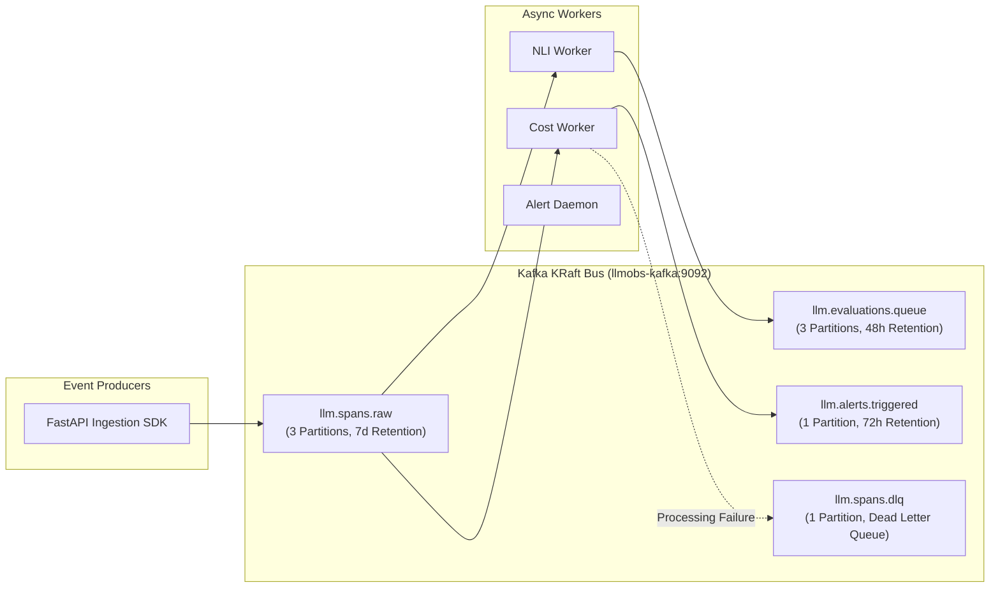

# Low-Level Design (LLD) — Platform Infrastructure (`llm-obs-infra`)

| Field | Value |
|---|---|
| Document ID | LLD-LLMOBS-INFRA-001 |
| Version | 2.0.0 |
| Status | Approved |
| Parent HLD | [high-level-design.md](file:///home/btpl-lap-22/live/llm-observability-platform/packages/configs/llm-obs-infra/docs/architectureDoc/high-level-design.md) |
| Author(s) | Lead Database Architect & DevOps Staff Engineer |
| Target Package | `packages/configs/llm-obs-infra` |
| Date | 2026-08-28 |

---

## 1. Low-Level Database Schemas & Storage Design

### 1.1 ClickHouse Telemetry Database (`llm_telemetry_analytics`)

#### Table: `spans_raw`
Engine: `MergeTree`  
Partition Key: `toYYYYMM(timestamp)`  
Order Key: `(org_id, timestamp, span_id)`  

```sql
CREATE TABLE llm_telemetry_analytics.spans_raw (
    span_id UUID,
    trace_id UUID,
    parent_span_id UUID,
    org_id String,
    tenant_id String,
    model_name String,
    provider String,
    prompt_tokens UInt32,
    completion_tokens UInt32,
    total_tokens UInt32,
    cost_micro_usd UInt64,
    latency_ms UInt32,
    status_code LowCardinality(String),
    timestamp DateTime64(3, 'UTC'),
    attributes Map(String, String)
) ENGINE = MergeTree()
PARTITION BY toYYYYMM(timestamp)
ORDER BY (org_id, timestamp, span_id)
SETTINGS index_granularity = 8192;
```

#### Table: `token_aggregates_hourly`
Engine: `SummingMergeTree`  
Order Key: `(org_id, model_name, toStartOfHour(timestamp))`  

```sql
CREATE TABLE llm_telemetry_analytics.token_aggregates_hourly (
    org_id String,
    model_name String,
    timestamp DateTime,
    total_prompt_tokens SimpleAggregateFunction(sum, UInt64),
    total_completion_tokens SimpleAggregateFunction(sum, UInt64),
    total_cost_micro_usd SimpleAggregateFunction(sum, UInt64),
    request_count SimpleAggregateFunction(sum, UInt64)
) ENGINE = SummingMergeTree()
ORDER BY (org_id, model_name, timestamp);
```

---

### 1.2 AlloyDB Omni Transactional Database (`llm_observability`)

#### Relational Schema Architecture:
- `organizations` (`id`, `name`, `created_at`, `status`)
- `tenants` (`id`, `org_id`, `name`, `tier`, `spending_limit_usd`)
- `api_keys` (`id`, `tenant_id`, `key_hash`, `scopes`, `expires_at`)
- `evaluations` (`id`, `span_id`, `evaluator_kind`, `score`, `reasoning`)

---

### 1.3 Redis In-Memory Key Schemas

| Key Pattern | Data Structure | Purpose | Expiration / TTL |
|---|---|---|---|
| `org:{org_id}:spend_micro_usd` | Hash (`model` -> `micro_usd`) | Real-time micro-USD accrued spend | Persistent |
| `rate:{tenant_id}:window` | Sorted Set (`timestamp` -> `req_id`) | Sliding window API rate limiting | 60 seconds |
| `key:{key_hash}:cache` | String (JSON Object) | Serialized API key permissions | 300 seconds |

---

## 2. Kafka Topic & Partition Specifications



---

## 3. Container Resource Ceilings & Resource Hardening

```yaml
# Docker Compose Resource Bounds Standard
services:
  llmobs-otel-collector:
    mem_limit: 512m
    mem_reservation: 256m
    cpus: 1.0

  llmobs-clickhouse:
    mem_limit: 4096m
    mem_reservation: 2048m
    cpus: 2.0

  llmobs-kafka:
    environment:
      KAFKA_JVM_PERFORMANCE_OPTS: "-Xms512m -Xmx1024m"
    mem_limit: 1536m

  llmobs-alloydb:
    mem_limit: 2048m
    mem_reservation: 1024m
```

---

## 4. References

- [High-Level Design (HLD)](file:///home/btpl-lap-22/live/llm-observability-platform/packages/configs/llm-obs-infra/docs/architectureDoc/high-level-design.md)
- [System Architecture Document](file:///home/btpl-lap-22/live/llm-observability-platform/packages/configs/llm-obs-infra/docs/architectureDoc/system-architecture-document.md)
