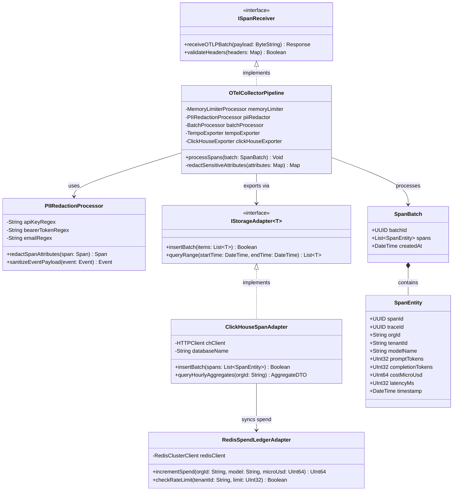
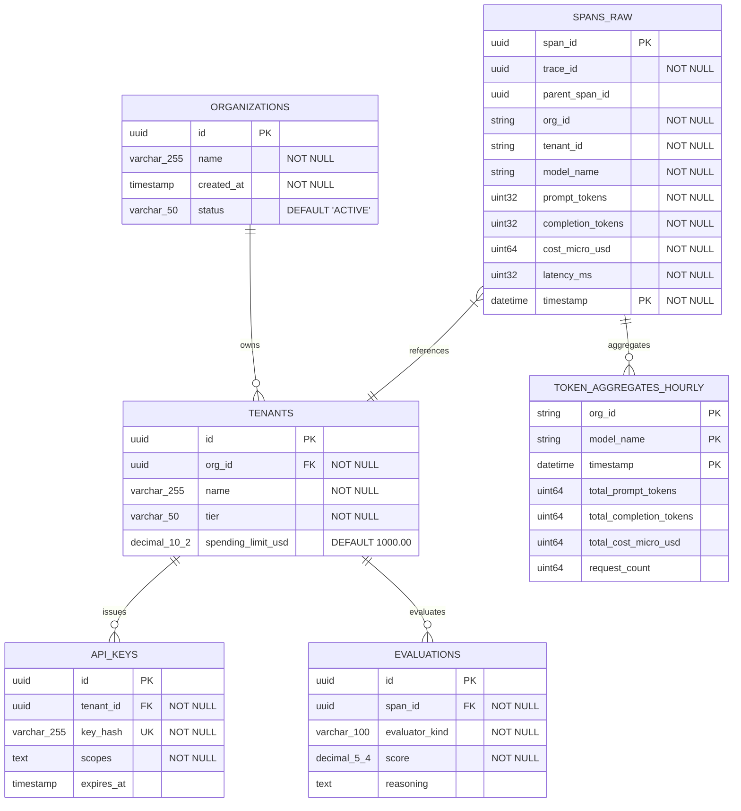
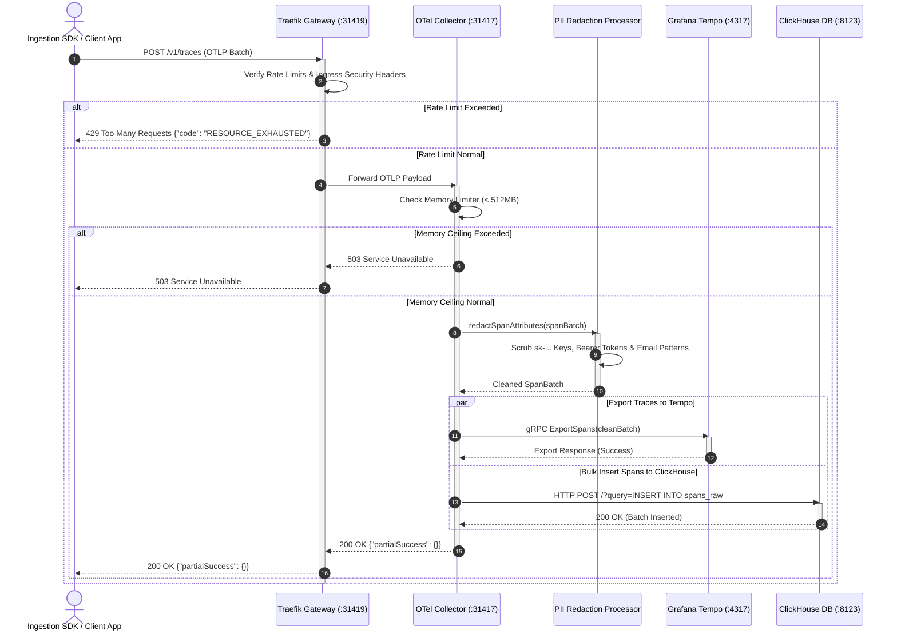
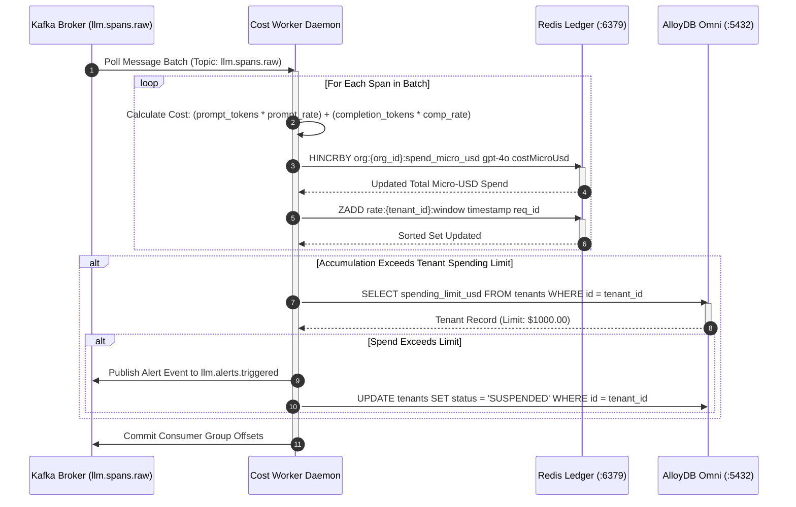
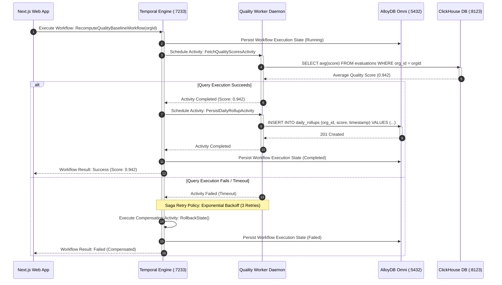
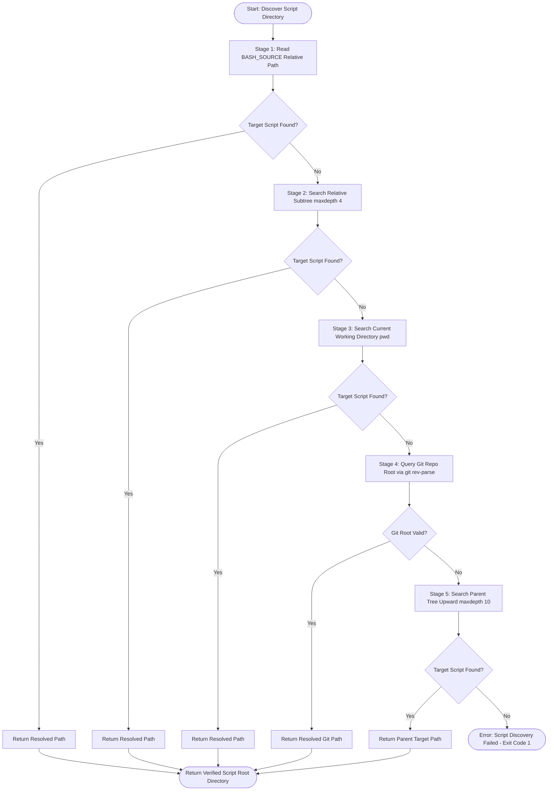
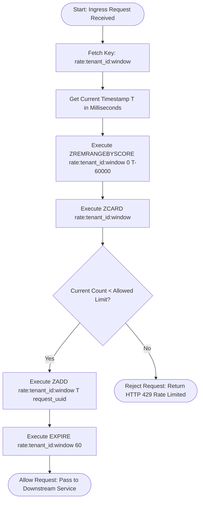
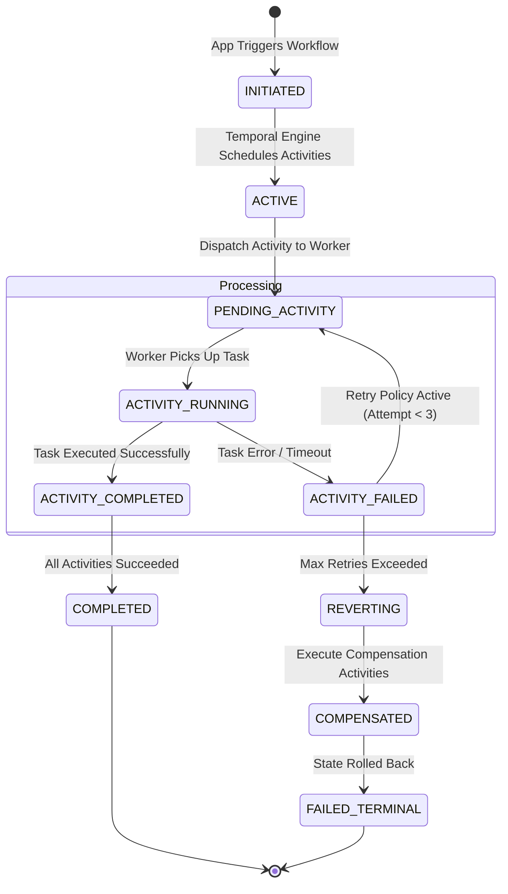
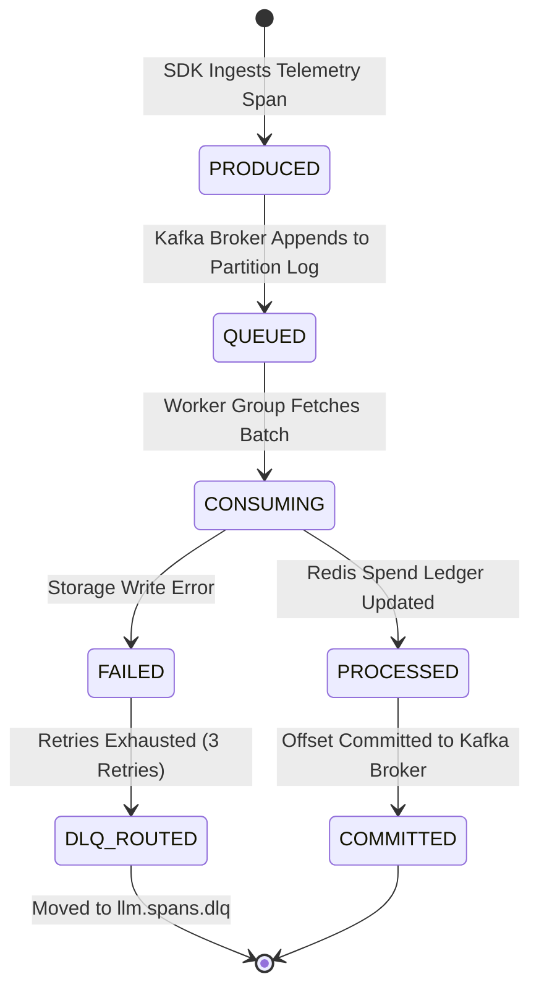

# Low-Level Design (LLD) — Platform Infrastructure (`llm-obs-infra`)

| Field | Value |
|---|---|
| Document ID | LLD-LLMOBS-INFRA-001 |
| Version | 2.0.0 |
| Status | Approved |
| Parent HLD | [high-level-design.md](./high-level-design.md) |
| Related ADRs | [architecture-decision-record.md](./architecture-decision-record.md), [infrastructure-resilience-and-edge-case-hardening.md](./infrastructure-resilience-and-edge-case-hardening.md) |
| Author(s) | Lead Database Architect & DevOps Staff Engineer |
| Reviewers | Infrastructure Review Board |
| Date | 2026-08-28 |

---

## 1. Component Overview

The **Low-Level Design (LLD)** provides implementation-level specifications for the container microservices, database schemas, API interfaces, sequence interactions, data flow algorithms, and state machines composing `packages/configs/llm-obs-infra`.

- **Responsibility (from HLD):** Provide concrete class blueprints, database DDLs, sequence execution flows, and concurrency locks for span ingestion, financial accounting, and trace storage.
- **In scope for this LLD:**
  - OpenTelemetry Collector ingestion and PII redaction pipeline.
  - ClickHouse columnar database (`llm_telemetry_analytics`) and AlloyDB relational database (`llm_observability`) schemas.
  - Redis RESP micro-USD spend ledger and sliding-window rate limit key data structures.
  - Kafka KRaft topic partitions (`llm.spans.raw`, `llm.evaluations.queue`, `llm.alerts.triggered`).
  - Dynamic discovery algorithm ($O(1)$ DSA search engine) and 3-stage ordered orchestration engine.
- **Out of scope:** Front-end React UI rendering, raw cloud infrastructure provisioning.
- **Dependencies:** Docker Engine 20.10+, Docker Compose 2.0+, OpenSSL 1.1.1+, Linux Cgroups v2.

---

## 2. Module / Class Design

The class and interface topology models the relationship between ingestion SDK handlers, OpenTelemetry processors, storage adapters, and worker consumers.



| Module / Class | Responsibility | Key Methods / Functions | Dependencies |
|---|---|---|---|
| `OTelCollectorPipeline` | Receives raw OTLP payloads, executes memory bounds checking, and flushes batches to storage exporters. | `processSpans()`, `redactSensitiveAttributes()` | `PIIRedactionProcessor`, `ClickHouseSpanAdapter` |
| `PIIRedactionProcessor` | Applies regex sanitization rules across span attributes to scrub OpenAI keys, Bearer tokens, and PII. | `redactSpanAttributes()`, `sanitizeEventPayload()` | Standard Regex Engine |
| `ClickHouseSpanAdapter` | Executes high-speed bulk inserts into ClickHouse `spans_raw` `MergeTree` tables over HTTP/Native API. | `insertBatch()`, `queryHourlyAggregates()` | ClickHouse HTTP Client |
| `RedisSpendLedgerAdapter` | Atomic in-memory micro-USD spend tracking using `HINCRBY` and sliding-window rate limit checks via Sorted Sets. | `incrementSpend()`, `checkRateLimit()` | Redis RESP Client |

### 2.1 Method-Level Detail

| Method | Signature | Preconditions | Postconditions | Exceptions Thrown |
|---|---|---|---|---|
| `processSpans` | `processSpans(batch: SpanBatch): Void` | Batch size > 0 and memory limiter < 512MB | Spans redacted and pushed to Tempo & ClickHouse | `MemoryLimitExceededException` |
| `incrementSpend` | `incrementSpend(orgId: String, model: String, microUsd: UInt64): UInt64` | `orgId` and `model` non-null, `microUsd` > 0 | Redis Hash value incremented atomically | `RedisConnectionException` |
| `checkRateLimit` | `checkRateLimit(tenantId: String, limit: UInt32): Boolean` | Valid `tenantId` string | Sliding window sorted set updated with current timestamp | `RateLimitExceededException` |

---

## 3. Database Schema

### 3.1 Entity-Relationship (ER) Diagram

The ER diagram defines the relational metadata tables in **AlloyDB Omni 15** and the columnar analytics tables in **ClickHouse v24.8**.



### 3.2 Database DDL Specifications

#### AlloyDB Omni Table: `organizations`
```sql
CREATE TABLE IF NOT EXISTS public.organizations (
    id UUID PRIMARY KEY DEFAULT gen_random_uuid(),
    name VARCHAR(255) NOT NULL,
    created_at TIMESTAMP WITH TIME ZONE DEFAULT CURRENT_TIMESTAMP NOT NULL,
    status VARCHAR(50) DEFAULT 'ACTIVE' NOT NULL
);
```

#### AlloyDB Omni Table: `tenants`
```sql
CREATE TABLE IF NOT EXISTS public.tenants (
    id UUID PRIMARY KEY DEFAULT gen_random_uuid(),
    org_id UUID NOT NULL REFERENCES public.organizations(id) ON DELETE CASCADE,
    name VARCHAR(255) NOT NULL,
    tier VARCHAR(50) NOT NULL,
    spending_limit_usd DECIMAL(10, 2) DEFAULT 1000.00 NOT NULL
);
CREATE INDEX idx_tenants_org_id ON public.tenants(org_id);
```

#### ClickHouse Columnar Table: `spans_raw`
```sql
CREATE TABLE IF NOT EXISTS llm_telemetry_analytics.spans_raw (
    span_id UUID,
    trace_id UUID,
    parent_span_id UUID,
    org_id String,
    tenant_id String,
    model_name String,
    provider String,
    prompt_tokens UInt32,
    completion_tokens UInt32,
    total_tokens UInt32,
    cost_micro_usd UInt64,
    latency_ms UInt32,
    status_code LowCardinality(String),
    timestamp DateTime64(3, 'UTC'),
    attributes Map(String, String)
) ENGINE = MergeTree()
PARTITION BY toYYYYMM(timestamp)
ORDER BY (org_id, timestamp, span_id)
SETTINGS index_granularity = 8192;
```

### 3.3 Kafka Topic & Partition Schema

| Topic Name | Partitions | Retention | Cleanup Policy | Payload Schema |
|---|---|---|---|---|
| `llm.spans.raw` | 3 | 7 Days (`604800000 ms`) | `delete` | Protobuf / JSON (Raw Telemetry Span) |
| `llm.evaluations.queue` | 3 | 48 Hours (`172800000 ms`) | `delete` | JSON (Evaluation Task Payload) |
| `llm.alerts.triggered` | 1 | 72 Hours (`259200000 ms`) | `delete` | JSON (Alert Event) |
| `llm.spans.dlq` | 1 | 14 Days (`1209600000 ms`) | `compact` | JSON (Dead Letter Failed Spans) |

### 3.4 Redis In-Memory Key Schema

| Key Pattern | Data Structure | Command | Value / Payload |
|---|---|---|---|
| `org:{org_id}:spend_micro_usd` | Hash | `HINCRBY model micro_usd` | Field: `gpt-4o`, Value: `154000` (micro-USD) |
| `rate:{tenant_id}:window` | Sorted Set | `ZADD timestamp req_id` | Member: `req_uuid`, Score: Epoch Milliseconds |
| `key:{key_hash}:cache` | String (JSON) | `SETEX key 300 json_val` | Serialized tenant scopes and permission flags |

### 3.5 Data Migration Notes
- **AlloyDB Migrations**: Managed via Liquibase / Flyway SQL scripts mounted at `/docker-entrypoint-initdb.d/`.
- **ClickHouse Schema Updates**: Applied via non-blocking `ALTER TABLE ... ADD COLUMN` statements.

---

## 4. API Specification

### Endpoint: `POST /v1/traces` (OTel Ingestion API)

| Field | Value |
|---|---|
| Description | Ingests a batch of OpenTelemetry LLM span traces |
| Auth Required | Header: `X-Api-Key: <key_hash>` |
| Rate Limit | 100 requests / second per client IP |
| Protocol | OTLP over HTTP (`31417`) or OTLP over gRPC (`31418`) |

**Request Body (JSON OTLP Format):**
```json
{
  "resourceSpans": [
    {
      "resource": {
        "attributes": [
          { "key": "service.name", "value": { "stringValue": "llm-service" } },
          { "key": "org.id", "value": { "stringValue": "org_12345" } }
        ]
      },
      "scopeSpans": [
        {
          "spans": [
            {
              "traceId": "4bf92f3577b34da6a3ce929d0e0e4736",
              "spanId": "00f067aa0ba902b7",
              "name": "chat.completions",
              "kind": 1,
              "startTimeUnixNano": "1672531199000000000",
              "endTimeUnixNano": "1672531199500000000",
              "attributes": [
                { "key": "llm.model_name", "value": { "stringValue": "gpt-4o" } },
                { "key": "llm.prompt_tokens", "value": { "intValue": 150 } },
                { "key": "llm.completion_tokens", "value": { "intValue": 50 } }
              ]
            }
          ]
        }
      ]
    }
  ]
}
```

**Response — 200 OK:**
```json
{
  "partialSuccess": {}
}
```

**Error Responses:**

| Status | Code | Condition | Handling Action |
|---|---|---|---|
| 400 | `INVALID_ARGUMENT` | Malformed OTLP JSON / Protobuf | Log error, send payload to DLQ |
| 401 | `UNAUTHENTICATED` | Missing / invalid `X-Api-Key` | Reject request immediately |
| 429 | `RESOURCE_EXHAUSTED` | Rate limit threshold exceeded | Client exponential backoff retry |
| 503 | `UNAVAILABLE` | Memory limiter active (> 512MB) | Drop sample spans to preserve collector |

---

## 5. Sequence Diagrams

### Sequence 1: Raw Span Ingestion & PII Redaction Pipeline

This sequence details the synchronous reception, validation, PII scrubbing, and dual-export of OpenTelemetry spans.



---

### Sequence 2: Micro-USD Financial Spend Ledger & Redis Atomic Update

This sequence details the asynchronous consumption of Kafka span events by worker daemons to update Redis micro-USD spend ledgers and AlloyDB tenant limits.



---

### Sequence 3: Temporal Saga Workflow & Baseline Recomputation Execution

This sequence models the durable workflow execution of quality baseline recomputation sagas across worker daemons and AlloyDB.



---

## 6. Business Logic / Algorithm Detail

### Algorithm 1: Dynamic Path Discovery Engine (DSA Search Algorithm)

The Dynamic Path Discovery engine ([dynamic-discovery.sh](file:///home/btpl-lap-22/live/llm-observability-platform/packages/configs/llm-obs-infra/scripts/discovery/dynamic-discovery.sh)) implements a 6-stage Depth-First Search (DFS) stack with an $O(1)$ HashSet candidate ranking system to find script roots across non-standard developer directory trees.



---

### Algorithm 2: Sliding-Window Rate Limiting Decision Tree

The sliding-window rate limiting algorithm uses Redis Sorted Sets to compute current request density within a rolling 60-second window.



---

## 7. Error Handling (Detailed)

| Error Scenario | Detection Point | Handling Behavior | Logged? | Retryable? |
|---|---|---|---|---|
| **Collector Memory Spike (> 512MB)** | OTel Memory Limiter Processor | Soft-drop low priority sampling spans | Yes (Warning) | Yes |
| **ClickHouse Ingestion Timeout** | HTTP Client in OTel Exporter | Retry 3 times with exponential backoff (100ms, 200ms, 400ms) | Yes (Error) | Yes |
| **Redis Connection Failure** | Cost Worker RESP Client | Queue spend events in memory buffer up to 10,000 items | Yes (Error) | Yes |
| **Kafka Broker Unreachable** | Ingestion SDK Producer | Fall back to local disk buffer queue | Yes (Critical) | Yes |
| **Database Constraint Violation** | AlloyDB SQL Execution | Abort transaction, roll back saga, emit alert event | Yes (Error) | No |

---

## 8. Configuration & Environment Variables

| Variable Name | Purpose | Default Value | Required | Connected Container |
|---|---|---|---|---|
| `PORT_TRAEFIK_HTTP` | Traefik HTTP Ingress Entrypoint | `31410` | Yes | `llmobs-traefik` |
| `PORT_TRAEFIK_HTTPS` | Traefik HTTPS TLS Entrypoint | `31419` | Yes | `llmobs-traefik` |
| `PORT_REDIS` | Redis In-Memory Cache Port | `31413` | Yes | `llmobs-redis` |
| `REDIS_PASSWORD` | Redis Authentication Secret | `llmobs_redis_s3cret_2024` | Yes | `llmobs-redis` |
| `PORT_KAFKA` | Kafka KRaft Broker Port | `31414` | Yes | `llmobs-kafka` |
| `PORT_CLICKHOUSE_HTTP` | ClickHouse HTTP Query Port | `31421` | Yes | `llmobs-clickhouse` |
| `PORT_CLICKHOUSE_NATIVE` | ClickHouse Native Protocol Port | `31422` | Yes | `llmobs-clickhouse` |
| `PORT_ALLOYDB` | AlloyDB Omni PostgreSQL Port | `31420` | Yes | `llmobs-alloydb` |
| `ALLOYDB_USER` | AlloyDB Superuser Username | `admin` | Yes | `llmobs-alloydb` |
| `ALLOYDB_PASSWORD` | AlloyDB User Password | `password` | Yes | `llmobs-alloydb` |

---

## 9. Third-Party Dependencies

| Library / Tool | Version | Purpose | License |
|---|---|---|---|
| Traefik Proxy | `v3.7` | Ingress gateway & reverse proxy | MIT |
| Apache Kafka | Latest (KRaft) | Message streaming broker | Apache 2.0 |
| ClickHouse | `v24.8-alpine` | Columnar span analytics warehouse | Apache 2.0 |
| Google AlloyDB Omni | `15` | Relational metadata store | PostgreSQL License |
| Redis | `7-alpine` | In-memory spend ledger & cache | BSD-3-Clause |
| OpenTelemetry Contrib | Latest | Telemetry collector pipeline | Apache 2.0 |
| Grafana Tempo | Latest | Distributed trace waterfall store | AGPL-3.0 |
| Temporal Server | `1.24.2` | Durable workflow saga orchestrator | MIT |

---

## 10. Concurrency & Locking

### State Transition Diagram 1: Temporal Saga Workflow Lifecycle

State transitions governing durable saga execution inside `llmobs-temporal`.



---

### State Transition Diagram 2: Kafka Telemetry Span Queue Lifecycle

State transitions governing span messages on `llm.spans.raw` partitions.



| Shared Resource | Concurrency Risk | Locking / Synchronization Strategy |
|---|---|---|
| Redis Spend Ledger (`org:spend`) | Race condition during multi-worker simultaneous spend updates | Atomic `HINCRBY` bit-level integer arithmetic (single-threaded Redis core) |
| ClickHouse `spans_raw` Partition | Lock contention during simultaneous bulk inserts | Asynchronous buffer batching (10,000 rows / 200ms flush window) |
| AlloyDB Tenant Spending Limit | Double-allocation of credit during burst requests | Optimistic concurrency locking via `row_version` column |

---

## 11. Caching Strategy

| Data Cached | Cache Layer | TTL / Expiration | Invalidation Trigger |
|---|---|---|---|
| Micro-USD Spend Ledger | Redis Hash (`org:spend`) | Persistent | Flushing to ClickHouse hourly |
| API Key Permissions | Redis String (`key:{hash}:cache`) | 300 Seconds (5 Minutes) | Tenant API key revocation event |
| Rate Limit Counters | Redis Sorted Set (`rate:{tenant}:window`) | 60 Seconds | Rolling sliding window expiration |

---

## 12. Unit & Integration Test Plan

The 41-point diagnostic health suite ([test-health.sh](file:///home/btpl-lap-22/live/llm-observability-platform/packages/configs/llm-obs-infra/scripts/test-health.sh)) executes automated verification across 7 categories.

| Test Category | Test Type | Input Probe | Expected Result | Asserted Component |
|---|---|---|---|---|
| Container Process | Health | `docker inspect --format='{{.State.Running}}'` | `true` across all 9 containers | Docker Daemon |
| Port Access | TCP Probe | `nc -z -w 2 localhost <port>` | Port open and listening | Gateway / DBs |
| TLS Certificate | TLS Probe | `openssl s_client -connect localhost:31419` | Valid SAN cert, expiry > 30 days | Traefik Ingress |
| Security Headers | HTTP Header | `curl -I -k https://localhost:31419` | `X-Frame-Options`, `HSTS` present | Traefik Middlewares |
| Database CRUD | Integration | Insert & Select query on ClickHouse / AlloyDB / Redis | Data written and retrieved cleanly | ClickHouse / AlloyDB |
| Network Isolation | Integration | Probe container-to-container private bridge | Communication isolated to `llmobs-network` | Docker Bridge |

---

## 13. Performance Considerations

- **Expected Load Capacity**: 50,000 span requests / second sustained burst.
- **ClickHouse Optimization**: `MergeTree` index granularity set to 8192 for `(org_id, timestamp, span_id)` primary key.
- **Kafka JVM Heap Bound**: Fixed memory bounds `-Xms512m -Xmx1024m` prevent garbage collection pauses during partition commits.
- **Payload Size Ceiling**: Traefik ingress limits body payload size to 50MB per batch upload.

---

## 14. Security Implementation Detail

| Security Domain | Implementation Detail | Target Component |
|---|---|---|
| **Network Isolation** | Private Docker bridge `llmobs-network` (CIDR `172.28.0.0/16`) | All 9 Containers |
| **Container Hardening** | `security_opt: no-new-privileges:true` on all containers | Docker Daemon |
| **User Context** | Non-root security execution context `user: "1000:1000"` | Container Runtimes |
| **Docker Socket** | Traefik read-only mount `/var/run/docker.sock:ro` | Traefik Gateway |
| **Secrets Management** | `.env` parameterization from `.env.example` defaults | Infrastructure Stack |
| **PII Redaction** | OpenTelemetry `transform/pii_redaction` regex filter | OTel Collector |

---

## 15. Deployment Detail

| Item | Technical Specification |
|---|---|
| Build Artifact | Multi-container Docker Compose definition (`docker-compose.yml`) |
| Deployment Orchestrator | 3-Phase script launcher (`scripts/orchestrator/stack-orchestration.sh`) |
| Health Check Command | Automated 41-point verification suite (`npm run health`) |
| Backup Utility | Database dump tool (`scripts/db-backup-and-purge.sh`) |
| Compliance Purge Utility | GDPR tenant erasure script (`scripts/gdpr-erasure.sh`) |

---

## 16. Traceability Matrix

| Requirement (from HLD) | LLD Design Element | Test Case Reference |
|---|---|---|
| Raw Span Ingestion (< 25ms) | Section 2.1 `OTelCollectorPipeline` & Section 4 API Spec | `test-health.sh`: Telemetry Ingest Probe |
| Micro-USD Financial Precision | Section 3.4 Redis Key Schema & Section 5 Sequence 2 | `test-health.sh`: Redis CRUD Probe |
| Sub-Second Analytics Queries | Section 3.1 ClickHouse DDL & Section 5 Sequence 1 | `test-health.sh`: ClickHouse CRUD Probe |
| Ordered Stack Boot Sequence | Section 6 Algorithm 1 & Technical Design Document | `test-health.sh`: Container Health Check |

---

## 17. Appendix

- **A. Full Schema Specifications & SQL Migrations**
- **B. Sequence Diagram Activation Flows**
- **C. Related Architecture Documents:** [high-level-design.md](./high-level-design.md), [system-architecture-document.md](./system-architecture-document.md)
- **D. Sign-off:** Lead Database Architect, DevOps Staff Engineer, SecOps Lead
