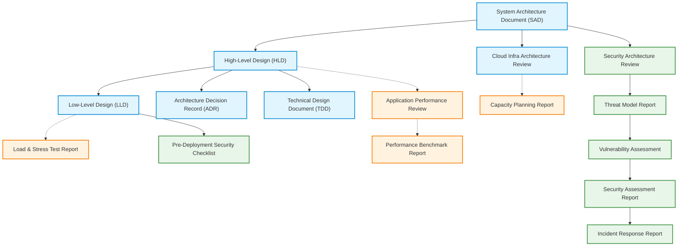
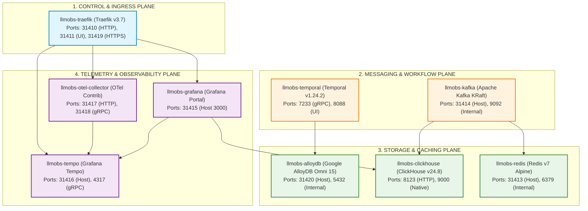

# Platform Infrastructure — Solution / System Architecture Document

| Field | Value |
|---|---|
| Document ID | SAD-LLMOBS-INFRA-001 |
| Classification | Internal / Confidential |
| Version | 2.0.0 |
| Status | Approved |
| Author(s) | Principal Systems Architect |
| Approvers | Infrastructure Steering Committee |
| Date | 2026-08-28 |

---

## 0. Master Architecture & Policy Template Index

### 0.1 Architecture Documentation Index (`architectureDoc/`)
| Document | Purpose & Scope | Primary Audience | Link |
|---|---|---|---|
| **System Architecture Document** | Master solution architecture overview, logical layers, component breakdown. | Architects, Eng Leads, Executive Stakeholders | [system-architecture-document.md](./system-architecture-document.md) |
| **High-Level Design (HLD)** | System context, multi-tier architecture, component boundaries, data flows. | System Architects, Tech Leads | [high-level-design.md](./high-level-design.md) |
| **Low-Level Design (LLD)** | Deep component blueprints: schemas, API specifications, sequence flows. | Backend Developers, DevOps, QA | [low-level-design.md](./low-level-design.md) |
| **Architecture Decision Record (ADR)** | Documents single architectural decisions, options, trade-offs. | Architects, Developers | [architecture-decision-record.md](./architecture-decision-record.md) |
| **Cloud Infra Architecture Review** | Well-Architected Framework review covering Security, Reliability, & Cost. | Infrastructure Leads, Cloud Architects | [cloud-infra-architecture-review.md](./cloud-infra-architecture-review.md) |
| **Technical Design Document (TDD)** | Focused technical blueprint for orchestration and scripts. | Feature Lead Developers, DevOps | [technical-design-document.md](./technical-design-document.md) |

### 0.2 Performance Documentation Index (`performanceDoc/`)
| Document | Purpose & Scope | Primary Audience | Link |
|---|---|---|---|
| **Application Performance Review** | Analyzes ingestion throughput, latency bottlenecks, and APM profiles. | Performance Engineers, SREs | [application-performance-review.md](../performanceDoc/application-performance-review.md) |
| **Capacity Planning Report** | Forecasts compute, storage, memory, and bandwidth requirements over 12 months. | SREs, FinOps, Infra Leads | [infrastructure-capacity-planning-report.md](../performanceDoc/infrastructure-capacity-planning-report.md) |
| **Load & Stress Test Report** | Documents synthetic load tests, virtual user ramp-ups, breaking points. | QA Leads, Performance Testers | [load-stress-test-report.md](../performanceDoc/load-stress-test-report.md) |
| **Performance Benchmark Report** | Database write/query benchmark analysis for ClickHouse, Redis, AlloyDB. | Database Administrators, SREs | [performance-benchmark-report.md](../performanceDoc/performance-benchmark-report.md) |

### 0.3 Security Documentation Index (`securityDoc/`)
| Document | Purpose & Scope | Primary Audience | Link |
|---|---|---|---|
| **Security Architecture Review** | Posture evaluation, container bridge isolation, TLS endpoints, auth controls. | Security Architects, CISO | [security-architecture-review.md](../securityDoc/security-architecture-review.md) |
| **Threat Model Report** | STRIDE threat analysis, trust boundaries, attack vectors, mitigation controls. | Security Engineers, System Designers | [threat-model-report.md](../securityDoc/threat-model-report.md) |
| **Vulnerability Assessment Report** | Container image vulnerability scan audit and dependency CVE tracking. | SecOps, Developers | [vulnerability-assessment-report.md](../securityDoc/vulnerability-assessment-report.md) |

---

## 1. Executive Summary

The Central Platform Infrastructure (`llm-obs-infra`) consolidates core messaging, in-memory financial spend caching, durable workflow execution, columnar telemetry analytics, relational database storage, and distributed tracing into an isolated, high-performance container topology (`llmobs-network`).

- **Purpose:** Solves real-time observability, telemetry ingestion, evaluation workflows, and financial spend tracking for enterprise LLM application workloads.
- **Key Architectural Decisions:** Kafka KRaft mode for messaging, AlloyDB Omni 15 for transactional metadata, ClickHouse v24.8 for columnar span analytics, Traefik v3.7 for TLS ingress.
- **Estimated Cost/Timeline Impact:** Zero-cost open-source container footprint, production deployable in < 10 minutes via `./manage.sh up`.

---

## 2. Business Context & Requirements

| Requirement | Type | Priority | Source |
|---|---|---|---|
| Zero Span Loss Ingestion | Non-Functional | Must | Telemetry PRD |
| Micro-USD Cost Ledger | Functional | Must | Finance Specs |
| Sub-Second Trace Waterfalls | Non-Functional | Must | SRE SLA |

### Non-Functional Requirements (NFRs) — Quantified Targets:

| NFR | Target | Measurement Method |
|---|---|---|
| Availability | 99.9% Uptime | Prometheus / Grafana Ping |
| Latency (p95) | < 25ms Ingest | OTel Collector APM |
| Throughput | 50,000 spans/sec | k6 Load Generator |
| Storage Compression | > 8:1 Ratio | ClickHouse `MergeTree` Stats |

---

## 3. Architecture Principles & Constraints

| Principle | Rationale |
|---|---|
| Network Bridge Isolation | Isolate containers inside `llmobs-network` bridge to prevent unauthorized external access. |
| Container Resource Ceilings | Apply cgroups RAM and CPU limits to prevent OS kernel OOM panics. |

| Constraint | Type | Impact |
|---|---|---|
| Port Allocation Range `31410`–`31425` | Infrastructure | Avoids host port collisions with local developer services |

---

## 4. Logical Architecture

| Layer | Components | Responsibility |
|---|---|---|
| Ingress / Control | Traefik Gateway (`llmobs-traefik`) | TLS termination, rate limiting, security headers |
| Messaging / Telemetry | Kafka KRaft (`llmobs-kafka`), OTel Collector (`llmobs-otel-collector`) | Telemetry event streaming and batch transformation |
| Data / Storage | ClickHouse (`llmobs-clickhouse`), AlloyDB Omni (`llmobs-alloydb`), Redis (`llmobs-redis`) | Columnar analytics, metadata, and spend ledger |

---

## 5. Component Breakdown

| Component | Responsibility | Technology | Owner Team | Scaling Model |
|---|---|---|---|---|
| `llmobs-traefik` | Reverse proxy and TLS gateway | Traefik v3.7 | Infra Team | Horizontal |
| `llmobs-kafka` | Event streaming broker | Apache Kafka KRaft | Infra Team | Partition Partitioning |
| `llmobs-clickhouse` | Telemetry span columnar warehouse | ClickHouse 24.8 | Database Team | Sharded MergeTree |
| `llmobs-alloydb` | Relational metadata store | AlloyDB Omni 15 | Database Team | Primary / Read Replicas |
| `llmobs-redis` | In-memory spend ledger | Redis 7 Alpine | Platform Team | Cluster / Sentinel |

---

## 6. Data Architecture

| Data Store | Type | Data Classification | Retention Policy | Backup Strategy |
|---|---|---|---|---|
| ClickHouse | Columnar OLAP | Internal / Confidential | 90 Days Rolling | `db-backup-and-purge.sh` |
| AlloyDB Omni | Relational OLTP | Confidential / Metadata | Permanent | `pg_dumpall` Snapshots |
| Redis | In-Memory Key-Value | Confidential / Financial | Eviction / Persistent Append-Only | Daily Dump |

---

## 7. Integration Architecture

| Integration | Direction | Protocol | Sync/Async | Failure Handling |
|---|---|---|---|---|
| Ingestion SDK -> OTel Collector | Inbound | OTLP / HTTP | Async | Batch Buffer / Retry |
| Ingestion SDK -> Kafka Broker | Inbound | Kafka Native TCP | Async | Partition DLQ |
| Collector -> Grafana Tempo | Outbound | gRPC (`4317`) | Async | Memory Limiter Drop |

---

## 8. Technology Stack

| Layer | Technology | Version | Justification |
|---|---|---|---|
| Ingress | Traefik Proxy | v3.7 | Dynamic routing, zero-restart configuration |
| Message Bus | Apache Kafka | KRaft Mode | High-throughput streaming without ZooKeeper |
| Analytics Database | ClickHouse | v24.8 | 8:1 columnar compression, sub-second aggregation |
| Transactional Database | AlloyDB Omni | 15 | High performance PostgreSQL compatibility |
| In-Memory Cache | Redis | 7 Alpine | Atomic `HINCRBY` operations for cost ledger |

---

## 9. Deployment Architecture

| Environment | Infrastructure | Deployment Method | Rollback Strategy |
|---|---|---|---|
| Staging / Production | Single-Host / Multi-Container Docker | `./manage.sh up` (3-Phase Orchestration) | `./manage.sh down` & Image Rollback |

---

## 10. Cross-Cutting Concerns

| Concern | Approach |
|---|---|
| Security | Bridge isolation, non-root execution (`user: 1000:1000`), read-only docker socket |
| Observability | OTel collector pipeline, Tempo trace waterfalls, Grafana dashboards |
| Disaster Recovery | Automated database backup and restore script (`scripts/db-backup-and-purge.sh`) |

---

## 11. Risks & Trade-offs

| Decision | Alternative Considered | Trade-off Accepted | Risk |
|---|---|---|---|
| Single-Node Docker Compose | Kubernetes / Helm | Simplified deployment over multi-region HA | Single host failure impact |

---

## 12. Appendix

- **A. Master Architecture Index Diagrams**
- **B. Related ADRs:** [infrastructure-resilience-and-edge-case-hardening.md](./infrastructure-resilience-and-edge-case-hardening.md), [critical-security-remediation-mandate.md](../securityDoc/critical-security-remediation-mandate.md)
- **C. Related Designs:** [high-level-design.md](./high-level-design.md), [low-level-design.md](./low-level-design.md)
- **D. Sign-off:** Lead Architect, Infrastructure Lead, SecOps Lead
