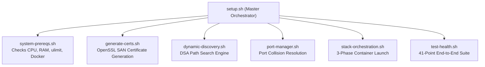

# Technical Design Document (TDD) — `llm-obs-infra`

| Field | Value |
|---|---|
| Document ID | TDD-LLMOBS-INFRA-001 |
| Status | Approved |
| Author(s) | Senior DevOps Engineer |
| Target Package | `packages/configs/llm-obs-infra` |
| Related ADRs | ADR-0006, ADR-0007 |
| Date | 2026-08-28 |

---

## 1. Overview & Operational Goals

The Technical Design Document (TDD) details the orchestration, setup, path discovery, health-checking, and database purge tools powering `packages/configs/llm-obs-infra`.

### System Goals:
- **Zero-Touch Setup**: Single command installation (`scripts/setup.sh`) generating certs, setting hosts, and checking system requirements.
- **Ordered Boot Sequence**: Eliminate container crash loops by enforcing 3-phase startup order (Databases -> Messaging/Telemetry -> Ingress/UI).
- **Dynamic Path Discovery**: $O(1)$ path resolution algorithm finding package locations across arbitrary developer directory roots.

---

## 2. Infrastructure Automation Scripts



---

## 3. 3-Phase Deployment Protocol

```bash
# Phase 1: Storage & Database Plane
docker compose up -d llmobs-alloydb llmobs-clickhouse llmobs-redis
# Active Polling: pg_isready & clickhouse-client ping until ready (max 60s)

# Phase 2: Telemetry & Messaging Plane
docker compose up -d llmobs-kafka llmobs-otel-collector llmobs-tempo llmobs-temporal

# Phase 3: Ingress Gateway & Analytics UI
docker compose up -d llmobs-traefik llmobs-grafana
```

---

## 4. Operational Commands & Package Interface (`package.json`)

| npm Script Command | Execution Script | Description |
|---|---|---|
| `npm run setup` | `scripts/setup.sh` | Run system checks, generate certs, pull images |
| `npm run up` | `scripts/orchestrator/stack-orchestration.sh` | 3-phase ordered container stack boot |
| `npm run down` | `docker compose down` | Terminate all stack containers |
| `npm run health` | `scripts/test-health.sh` | Execute 41-point verification suite |
| `npm run certs` | `scripts/generate-certs.sh` | Force regenerate TLS certificates |
| `npm run free-ports` | `scripts/ports/port-manager.sh` | Clear stuck processes on ports 31410–31420 |
| `npm run backup` | `scripts/db-backup-and-purge.sh` | Dump AlloyDB and ClickHouse database states |
| `npm run purge-gdpr` | `scripts/gdpr-erasure.sh` | Execute tenant data erasure compliance routine |

---

## 5. References

- [High-Level Design](file:///home/btpl-lap-22/live/llm-observability-platform/packages/configs/llm-obs-infra/docs/architectureDoc/high-level-design.md)
- [Low-Level Design](file:///home/btpl-lap-22/live/llm-observability-platform/packages/configs/llm-obs-infra/docs/architectureDoc/low-level-design.md)
