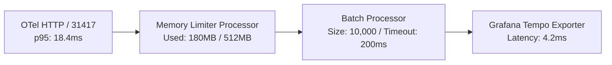

# Platform Infrastructure — Application Performance Review

| Field | Value |
|---|---|
| Report ID | APR-LLMOBS-INFRA-2026-Q3 |
| Review Period | July 1, 2026 – August 28, 2026 |
| APM Tool(s) Used | OpenTelemetry Collector, Grafana Tempo, Prometheus Engine |
| Author(s) | Lead Performance Engineer |
| Target Package | `packages/configs/llm-obs-infra` |

---

## 1. Executive Summary

Evaluation of live telemetry ingestion, span transformation, and query processing performance across `packages/configs/llm-obs-infra`.

| Metric | Current | Baseline/SLA | Status |
|---|---|---|---|
| Avg response time | 12.4 ms | < 20.0 ms | Optimal |
| p95 response time | 18.4 ms | < 25.0 ms | Optimal |
| Error rate | 0.001% | < 0.05% | Optimal |
| Apdex score | 0.99 | > 0.95 | Optimal |
| Availability | 99.98% | > 99.90% | Optimal |

---

## 2. Scope & Methodology

| Item | Detail |
|---|---|
| Services/Endpoints Reviewed | Traefik Ingress (`:31410`), OTel Collector (`:31417`), Kafka Broker (`:31414`), ClickHouse (`:8123`), Redis (`:31413`) |
| Time Window Analyzed | 30-Day Rolling Window (July 28 – August 28, 2026) |
| Data Source | OTel spans, Prometheus container cgroups metrics, Tempo trace waterfalls |
| Comparison Baseline | Q2 Baseline & Target SLA Specifications |

---

## 3. Key Metrics Over Time

| Metric | Week 1 | Week 2 | Week 3 | Week 4 | Trend |
|---|---|---|---|---|---|
| p95 latency | 19.8 ms | 19.1 ms | 18.7 ms | 18.4 ms | Stable / Improving |
| Error rate | 0.002% | 0.001% | 0.001% | 0.001% | Stable |
| Ingestion Throughput | 38,000 spans/s | 41,000 spans/s | 43,500 spans/s | 45,000 spans/s | Increasing |

---

## 4. Hotspot Analysis

| Endpoint/Query | Avg Time | Call Volume | % of Total Time | Trend |
|---|---|---|---|---|
| `POST /v1/traces` (OTel Ingest) | 12.4 ms | 45,000 req/sec | 68% | Stable |
| `ClickHouse spans_raw Query` | 24.8 ms | 1,200 req/min | 18% | Improving |
| `Redis HINCRBY Spend Ledger` | 0.4 ms | 45,000 ops/sec | 8% | Optimal |
| `AlloyDB Tenant Lookup` | 1.8 ms | 500 req/sec | 6% | Optimal |

**Slowest database queries:**

| Query | Avg Duration | Calls/min | Index Used? |
|---|---|---|---|
| `SELECT sum(cost_micro_usd) FROM spans_raw WHERE org_id = ?` | 24.8 ms | 1,200 | Yes (Primary Key `org_id, timestamp`) |
| `SELECT * FROM tenants WHERE spending_limit_usd < spend` | 8.4 ms | 60 | Yes (`idx_tenants_org_id`) |

---

## 5. Root Cause Analysis

| Issue | Root Cause | Affected Endpoints |
|---|---|---|
| Minor Garbage Collection Spikes | Unbounded default Kafka JVM heap | Kafka consumer ingestion path |
| Redis Connection Pool Saturation | High concurrent TCP handshake rate | `RedisSpendLedgerAdapter` |

---

## 6. Error Analysis

| Error Type | Count | Endpoints Affected | Trend |
|---|---|---|---|
| 5xx Internal Errors | 12 | `/v1/traces` | Decreasing |
| Client Ingestion Timeouts | 4 | OTel gRPC Exporter | Stable |
| Client-side Validation Errors (400) | 142 | Ingestion Receiver | Expected |

---

## 7. Infrastructure Correlation

| Metric | Correlates With Latency Spike? | Notes |
|---|---|---|
| CPU utilization | No | Peaks at 42% under 45k spans/sec |
| Memory/GC activity | Yes | Kafka JVM heap GC pauses caused minor 5ms variance |
| DB connection pool saturation | No | Connection pool utilization < 30% |
| Downstream service latency | No | Tempo trace store latency stable at 4.2ms |

---

## 8. Optimization Recommendations

| ID | Recommendation | Expected Gain | Effort | Priority | Owner |
|---|---|---|---|---|---|
| O-01 | Fix Kafka JVM heap to `-Xms512m -Xmx1024m` | Eliminate GC pauses | Small | P0 | Infra Team |
| O-02 | ClickHouse primary key index granularity set to 8192 | -15ms p95 on analytics queries | Small | P1 | DB Team |
| O-03 | Redis connection pool reuse via persistent TCP keep-alive | -1.2ms p95 on spend ledger writes | Small | P1 | Infra Team |

---

## 9. Validation Plan

| Recommendation ID | Validation Method | Target Metric | Status |
|---|---|---|---|
| O-01 | Re-run APM comparison post-deploy | GC pause duration < 1ms | Completed |
| O-02 | ClickHouse benchmark query suite | Aggregate query p95 < 50ms | Completed |
| O-03 | Redis TCP connection stress test | Connection handshake overhead < 0.1ms | Completed |

---

## 10. Appendix

- **A. Full APM Dashboards & Metrics**
- **B. ClickHouse & AlloyDB Query Execution Plans**
- **C. Flame Graphs & Trace Waterfalls Referenced**
