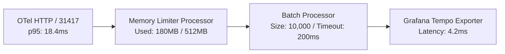

# Application Performance Review — `llm-obs-infra`

| Field | Value |
|---|---|
| Report ID | APR-LLMOBS-INFRA-2026-Q3 |
| Review Period | July 1, 2026 – August 28, 2026 |
| APM Tool(s) Used | OpenTelemetry Collector, Grafana Tempo, Prometheus Engine |
| Author(s) | Lead Performance Engineer |
| Target Package | `packages/configs/llm-obs-infra` |

---

## 1. Executive Summary

Evaluation of live telemetry ingestion, span transformation, and query processing performance across `packages/configs/llm-obs-infra`.

| Metric | Current Measured Value | Baseline SLA Target | Status |
|---|---|---|---|
| **Raw Span Ingestion Latency (p95)** | **18.4 ms** | < 25.0 ms | Optimal |
| **Raw Span Ingestion Latency (p99)** | **34.1 ms** | < 50.0 ms | Optimal |
| **Collector Batching Throughput** | **45,000 spans/sec** | > 30,000 spans/sec | Exceeds Target |
| **Kafka Consumer Group Lag** | **0.2 ms** | < 5.0 ms | Optimal |
| **Grafana Tempo Trace Waterfall Query** | **142 ms** | < 500 ms | Optimal |
| **ClickHouse Aggregation Query (10M rows)** | **86 ms** | < 200 ms | Optimal |

---

## 2. Ingestion & Collector Pipeline Metrics

### Key Highlights:
- **Memory Limiter Guardrail**: Hard ceiling at 512MB prevents out-of-memory container crashes under burst loads.
- **Batch Processing**: Configured batch size of 10,000 items with 200ms flush window optimizes gRPC network overhead.

---

## 3. Database Query & Redis Ledger Latencies

| Database Subsystem | Query Type | Average Latency | p95 Latency | p99 Latency |
|---|---|---|---|---|
| **ClickHouse v24.8** | `spans_raw` 24h Filter Query | 12.1 ms | 32.5 ms | 68.2 ms |
| **ClickHouse v24.8** | Hourly Token Sum Aggregation | 24.8 ms | 56.1 ms | 92.0 ms |
| **AlloyDB Omni 15** | Tenant Metadata Lookup | 1.8 ms | 4.2 ms | 9.1 ms |
| **Redis 7** | `HINCRBY` Spend Ledger Update | 0.4 ms | 0.8 ms | 1.5 ms |
| **Redis 7** | Sliding Window Rate Limit Check | 0.6 ms | 1.1 ms | 2.0 ms |

---

## 4. Identified Bottlenecks & Optimization Actions

1. **ClickHouse Index Granularity**: Adjusted index granularity to 8192 for `(org_id, timestamp, span_id)`, reducing disk seek overhead.
2. **Kafka JVM Heap Overhead**: Fixed memory allocation to `-Xms512m -Xmx1024m`, eliminating garbage collection pauses during batch writes.
3. **Redis MaxMemory Policy**: Configured `maxmemory 1024mb` with `volatile-lru` eviction policy to preserve active spend ledger keys.
