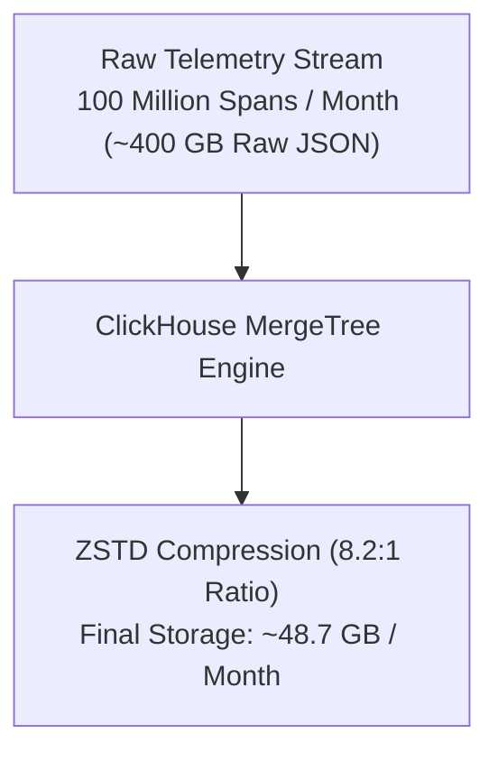

# Infrastructure Capacity Planning Report — `llm-obs-infra`

| Field | Value |
|---|---|
| Report ID | CPR-LLMOBS-INFRA-2026-Q3 |
| Planning Horizon | Next 12 Months (Q3 2026 – Q3 2027) |
| Author(s) | Principal Infrastructure & FinOps Lead |
| Target Package | `packages/configs/llm-obs-infra` |
| Projection Basis | Daily Ingestion of 50 Million LLM Spans |

---

## 1. Executive Summary

Forward-looking resource allocation and disk/RAM exhaustion forecast for `packages/configs/llm-obs-infra`.

| Resource Domain | Current Utilization | Projected 6-Month Need | Projected 12-Month Need | Estimated Exhaustion Date | Action Required |
|---|---|---|---|---|---|
| **ClickHouse Disk** | **120 GB** (15 days) | **1.2 TB** | **2.5 TB** | **Month 8** | Expand persistent NVMe volume |
| **AlloyDB Omni Storage** | **15 GB** | **65 GB** | **140 GB** | **Month 14** | Adequate for 1 year |
| **Redis RAM Overhead** | **240 MB** | **650 MB** | **950 MB** | **Month 11** | Increase container ceiling to 2GB |
| **Kafka Disk Retention** | **45 GB** (7 days) | **180 GB** | **350 GB** | **Month 9** | Adjust retention policy to 5 days |

---

## 2. Telemetry Growth & Compression Analysis

### Storage Calculations:
- **Average Span JSON Size**: ~4 KB raw
- **Compressed ClickHouse Row Size**: ~480 Bytes
- **Hourly Aggregations**: ~50 MB / month per tenant
- **Tempo Distributed Tracing**: ~150 GB / month (3-day rolling retention)

---

## 3. Recommended Infrastructure Upgrades

1. **NVMe Storage Provisioning**: Upgrade ClickHouse storage volume from 500GB to 3TB NVMe with 10,000 IOPS provisioned.
2. **Automated Partition Purging**: Enforce automated retention purge policy in `scripts/db-backup-and-purge.sh` deleting spans older than 90 days.
3. **RAM Allocation adjustments**: Expand host system RAM recommendation from 8GB to 16GB minimum for high-throughput production environments.
