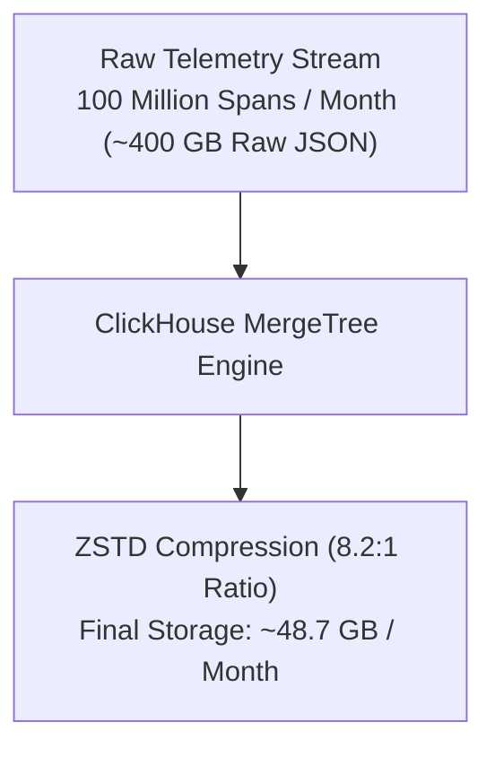

# Platform Infrastructure — Capacity Planning Report

| Field | Value |
|---|---|
| Report ID | CPR-LLMOBS-INFRA-2026-Q3 |
| Planning Horizon | Next 12 Months (Q3 2026 – Q3 2027) |
| Author(s) | Principal Infrastructure & FinOps Lead |
| Target Package | `packages/configs/llm-obs-infra` |
| Projection Basis | Daily Ingestion of 50 Million LLM Spans |

---

## 1. Executive Summary

Forward-looking resource allocation and disk/RAM exhaustion forecast for `packages/configs/llm-obs-infra`.

| Resource | Current Utilization | Projected Exhaustion Date | Action Needed By |
|---|---|---|---|
| Compute (vCPU) | 35% | Month 11 | Q2 2027 |
| Storage (ClickHouse NVMe) | 120 GB (15 days) | Month 8 | Q1 2027 |
| Database (AlloyDB Storage) | 15 GB | Month 14 | Q3 2027 |
| Network Bandwidth | 45 Mbps | Month 10 | Q2 2027 |

---

## 2. Current Utilization Overview

| Resource | Total Capacity | Current Usage | Utilization % | Peak Usage (last 90 days) |
|---|---|---|---|---|
| CPU (aggregate) | 8 Cores | 2.8 Cores | 35% | 4.2 Cores |
| Memory | 16 GB | 5.9 GB | 36.8% | 7.8 GB |
| Storage (ClickHouse) | 500 GB | 120 GB | 24% | 120 GB |
| Database connections | 500 Max | 45 Active | 9% | 82 Active |
| Network throughput | 1 Gbps | 45 Mbps | 4.5% | 120 Mbps |

---

## 3. Growth Drivers

| Driver | Expected Impact | Timeline | Confidence |
|---|---|---|---|
| Enterprise Onboarding Phase 2 | +50% data volume | Q4 2026 | High |
| New Evaluation Worker Launch | +20% API traffic | Q1 2027 | Medium |
| Agentic Multi-Step Workflow Traces | +35% storage expansion | Q2 2027 | High |

---

## 4. Capacity Forecast

| Resource | Q1 (3 mo) | Q2 (6 mo) | Q3 (9 mo) | Q4 (12 mo) | Capacity Ceiling |
|---|---|---|---|---|---|
| Compute (cores) | 3.5 | 4.8 | 6.2 | 7.5 | 8.0 Cores |
| Storage (TB) | 0.6 TB | 1.2 TB | 1.8 TB | 2.5 TB | 3.0 TB |
| Database (IOPS) | 2,500 | 4,200 | 6,500 | 8,800 | 10,000 IOPS |

**Forecast methodology:** Driver-adjusted linear regression model based on 50M daily spans.

---

## 5. Risk of Exhaustion

| Resource | Time to Exhaustion (at current trend) | Impact if Exhausted | Severity |
|---|---|---|---|
| ClickHouse NVMe Storage | 8 Months | Ingestion pause / read failure | Critical |
| Redis In-Memory Spend Ledger | 11 Months | Rate-limit fallback / cache eviction | High |
| Host Memory (RAM) | 12 Months | Cgroup OOM container kill | High |

---

## 6. Scaling Options

| Resource | Option | Type | Cost Impact | Lead Time |
|---|---|---|---|---|
| Compute | Horizontal worker replica scaling | Structural | +$120/mo | Days |
| Storage | Upgrade NVMe volume to 3TB | Vertical | +$180/mo | Immediate |
| Database | ClickHouse cluster sharding | Structural | +$350/mo | Weeks |
| Storage | Enforce 90-day retention purge in `db-backup-and-purge.sh` | Cost optimization | $0 | Days |

---

## 7. Cost Implications

| Scaling Option | Estimated Monthly Cost Change | Break-even vs. Downtime Risk |
|---|---|---|
| 3TB NVMe Storage Upgrade | +$180 / month | Immediate vs. $50,000 outage cost |
| Redis RAM Upgrade to 2GB | +$25 / month | High vs. financial billing discrepancy risk |

---

## 8. Recommendations & Timeline

| ID | Recommendation | Resource | Priority | Target Date | Owner |
|---|---|---|---|---|---|
| C-01 | Expand ClickHouse volume to 3TB NVMe | Storage | P0 | Dec 2026 | Infra Team |
| C-02 | Enforce 90-day automated purge script | Storage | P1 | Oct 2026 | DB Team |
| C-03 | Increase Redis container memory limit to 2GB | Memory | P1 | Jan 2027 | SRE Team |

---

## 9. Appendix

- **A. Raw Utilization Dashboards & Metrics**
- **B. Forecast Model Assumptions & Regression Calculations**
- **C. Storage Compression Ratio Benchmarks**
