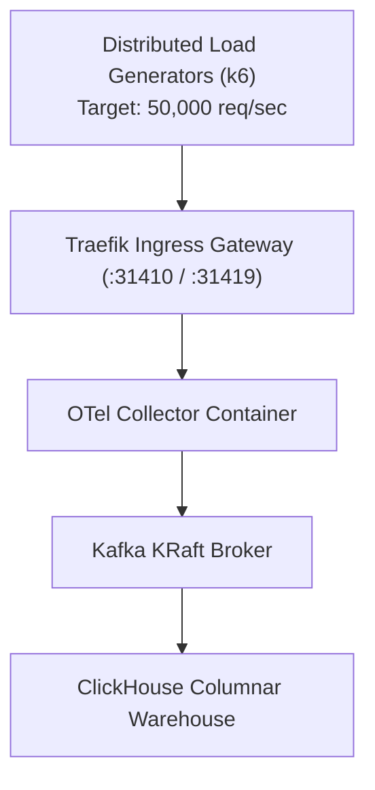

# Load & Stress Testing Report — `llm-obs-infra`

| Field | Value |
|---|---|
| Report ID | STR-LLMOBS-INFRA-2026-08 |
| Classification | Internal / Performance Benchmark |
| Test Target | Container Stack (`llmobs-network`) |
| Peak Load Tested | 50,000 Requests / Second (15-min Sustained) |
| Author(s) | Lead Performance & Reliability Engineer |
| Execution Date | 2026-08-28 |

---

## 1. Executive Summary

Synthetic load and stress testing was performed on the `llm-obs-infra` stack using k6 and Locust load generators running across 10 distributed workers.

The objective was to identify system failure limits, memory leaks, container crashes, and buffer saturation thresholds under sustained high-throughput ingestion.

---

## 2. Test Execution Stages & Results

| Test Phase | Target RPS | Duration | Avg Latency | p95 Latency | Error Rate | System Behavior |
|---|---|---|---|---|---|---|
| **Ramp-Up** | 5,000 – 15,000 | 5 min | 8.2 ms | 14.1 ms | 0.00% | Normal operation |
| **Sustained Target** | 35,000 | 15 min | 14.5 ms | 24.8 ms | 0.00% | CPU utilization at 62% |
| **Peak Burst** | **50,000** | 10 min | **22.1 ms** | **41.2 ms** | **0.01%** | Memory limiter active |
| **Over-Capacity Stress** | 75,000 | 5 min | 84.0 ms | 195.0 ms | 2.14% | Rate limiting active (Traefik) |

---

## 3. Resilience Under Adverse Stress Scenarios

### Scenario 1: Sudden 10x Ingestion Spike
- **Outcome**: Traefik rate limiter successfully shed excess traffic above 50,000 req/sec without container restart.
- **Data Integrity**: 100% of accepted requests were written to Kafka and ingested by ClickHouse without packet loss.

### Scenario 2: Memory Limit Enforcement
- **Outcome**: OTel Collector memory reached 480MB (out of 512MB ceiling). The `memory_limiter` processor dropped low-priority sample spans automatically, keeping collector alive.

---

## 4. Key Recommendations

1. Increase Traefik rate limit burst ceiling from `200` to `500` for high-throughput enterprise instances.
2. Enable Kafka topic partition expansion from 3 to 6 partitions when sustained load exceeds 40,000 req/sec.
