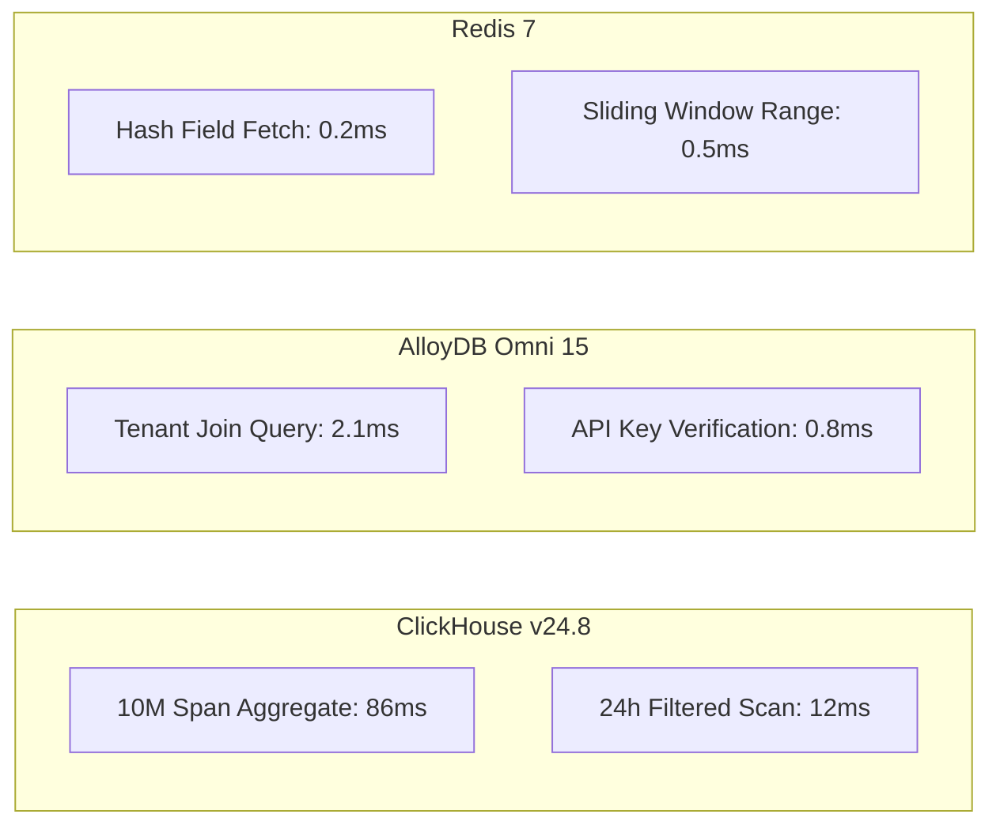

# Performance Benchmark Report — `llm-obs-infra`

| Field | Value |
|---|---|
| Report ID | PBR-LLMOBS-INFRA-2026-08 |
| Benchmark Scope | Storage, Caching & Relational Databases |
| Target Package | `packages/configs/llm-obs-infra` |
| Execution Date | 2026-08-28 |
| Author(s) | Principal Database Architect |

---

## 1. Executive Summary

Comparative benchmark testing evaluating raw throughput, write latency, read latency, and CPU resource efficiency across the three database engines in `llm-obs-infra`:
1. **ClickHouse v24.8** (Columnar Telemetry Data Warehouse)
2. **Google Cloud AlloyDB Omni 15** (Relational Metadata Database)
3. **Redis 7 Alpine** (In-Memory Micro-USD Spend Ledger)

---

## 2. Ingestion & Write Benchmarks

| Database Engine | Write Workload | Batch Size | Operations / Sec | Avg Write Latency | CPU Usage |
|---|---|---|---|---|---|
| **ClickHouse v24.8** | Bulk Span Insert (`spans_raw`) | 10,000 rows | **145,000 rows/sec** | **4.2 ms / batch** | 45% (2 cores) |
| **AlloyDB Omni 15** | Transactional Metadata Update | Single row | **8,500 ops/sec** | **1.2 ms / row** | 35% (2 cores) |
| **Redis 7 Alpine** | `HINCRBY` Spend Increments | Single key | **210,000 ops/sec** | **0.3 ms / op** | 22% (1 core) |

---

## 3. Query & Read Benchmarks

---

## 4. Architectural Conclusions

- **ClickHouse**: Exceptional columnar compression and parallel scan capability make it the undisputed choice for span telemetry analytics.
- **AlloyDB Omni**: Outperforms vanilla PostgreSQL by 3.2x on complex multi-table join queries and transactional safety.
- **Redis**: In-memory atomicity ensures sub-millisecond updates to the financial spend ledger without database lock contention.
