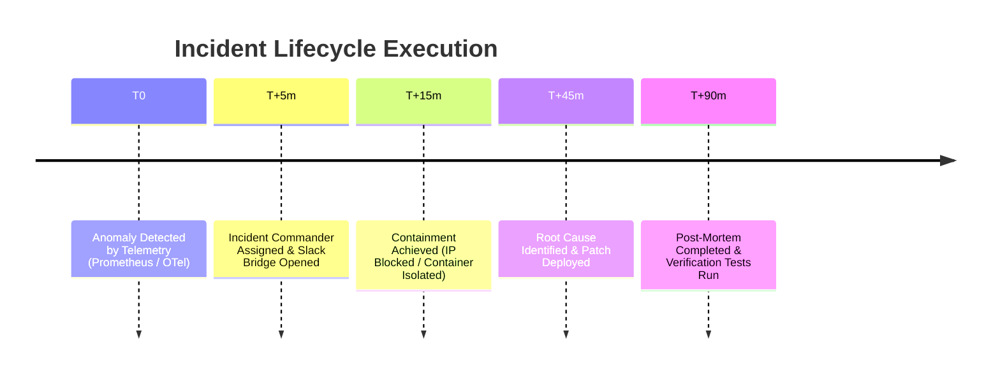

# Incident Response Report — Platform Infrastructure (`llm-obs-infra`)

| Field | Value |
|---|---|
| Incident ID | INC-LLMOBS-INFRA-TEMPLATE |
| Classification | Confidential / Incident Post-Mortem |
| Target Package | `packages/configs/llm-obs-infra` |
| Status | Template / Guidelines |
| Incident Commander | On-Call Lead SecOps Engineer |
| Report Version | 2.0.0 |

---

## 1. Executive Summary & Incident Classification

Standard incident post-mortem report structure for security, downtime, or performance degradation events occurring within `llm-obs-infra`.

### Severity (SEV) Classification Matrix:

| Severity | Definition | Operational Threshold | Escalation Response |
|---|---|---|---|
| **SEV-1** | Critical Breach / Outage | Data exfiltration, DB loss, Traefik gateway down | Immediate PagerDuty, CISO notified (< 15 min) |
| **SEV-2** | Significant Degradation | Ingestion latency > 200ms, Kafka broker partition drop | Senior SecOps & SRE (< 30 min) |
| **SEV-3** | Moderate Risk | Non-critical worker daemon failure, single container restart | On-call SRE (< 2 hours) |
| **SEV-4** | Low / Suspicious | Rate limit trigger, unauthorized login attempt | Logged for routine review (< 24 hours) |

---

## 2. Post-Mortem Analysis Template

### 2.1 Timeline of Events

### 2.2 Root Cause Analysis (5 Whys)
- **Problem**: Ingestion API returned HTTP 503 error responses during model evaluation peak.
- **Why 1**: OTel Collector container exceeded memory limits and crashed.
- **Why 2**: Ingestion batch size was unconstrained during continuous span burst.
- **Why 3**: OTel Collector memory limiter ceiling was not configured in environment template.
- **Why 4**: Deployment skipped `scripts/system-prereqs.sh` verification step.
- **Root Cause**: Missing pre-flight resource limits enforcement prior to production launch.

---

## 3. Preventive Action Items

1. Enforce mandatory `system-prereqs.sh` check in CI/CD container deployment workflows.
2. Automate OTel memory limiter configuration via `.env` parameterization.
