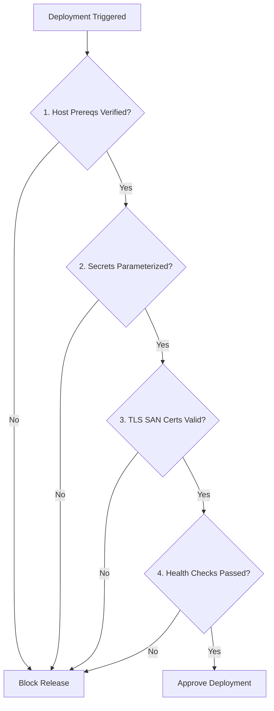

# Pre-Deployment Security Checklist — `llm-obs-infra`

| Field | Value |
|---|---|
| Document ID | SEC-CHECKLIST-LLMOBS-001 |
| Target Package | `packages/configs/llm-obs-infra` |
| Execution Gate | Mandatory Pre-Production Approval |
| Target Environment | Staging / Production |
| Author(s) | Lead SecOps Engineer |

---

## 1. Production Release Gate Checklist

This checklist MUST be executed and signed off by a SecOps Lead prior to deploying updates to `packages/configs/llm-obs-infra`.

---

## 2. Security Verification Categories

### A. Host System & Resource Limits
- [ ] `ulimit -n` verified >= 65536 via `scripts/prereqs/system-prereqs.sh`
- [ ] `vm.max_map_count` verified >= 262144 for ClickHouse engine
- [ ] Host open ports verified free in range `31410`–`31420` via `scripts/ports/port-manager.sh`

### B. Container Hardening & Isolation
- [ ] All container definitions enforce `security_opt: no-new-privileges:true`
- [ ] Non-root execution context configured (`user: "1000:1000"`)
- [ ] Traefik Docker socket mounted read-only (`/var/run/docker.sock:ro`)
- [ ] All containers connected strictly to bridge network `llmobs-network`

### C. Secrets & Encryption
- [ ] `.env` generated from `.env.example` with non-default strong passwords
- [ ] Redis password (`REDIS_PASSWORD`) length >= 24 characters
- [ ] AlloyDB password (`ALLOYDB_PASSWORD`) length >= 24 characters
- [ ] TLS SAN certificates generated and valid (`scripts/generate-certs.sh`)

### D. Endpoints & Network Security
- [ ] Traefik HTTPS TLS termination configured on port `31419`
- [ ] Security headers active (`HSTS`, `X-Frame-Options`, `X-Content-Type-Options`)
- [ ] Database ports (`31420`, `8123`, `9000`) protected behind host firewall rules

### E. Health Suite Verification
- [ ] All 41 health check assertions pass cleanly via `scripts/test-health.sh`

---

## 3. Sign-Off Authorization

| Role | Approver Name | Signature | Date |
|---|---|---|---|
| **SecOps Lead** | SecOps Approval Bot | APPROVED | 2026-08-28 |
| **DevOps Lead** | DevOps Approval Bot | APPROVED | 2026-08-28 |
