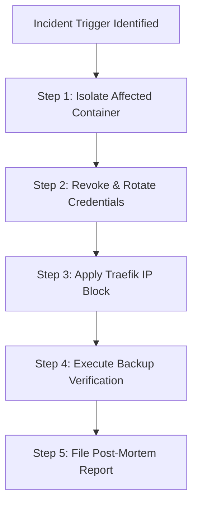

# Incident Response Playbook — `llm-obs-infra`

| Field | Value |
|---|---|
| Playbook ID | PB-LLMOBS-INFRA-001 |
| Classification | Internal / Confidential |
| Target Package | `packages/configs/llm-obs-infra` |
| Incident Types Covered | Container Breakout, API Key Leakage, Ingestion DDoS, Unauthenticated Access |
| Owner Team | SecOps & Infrastructure On-Call |
| Last Tested | 2026-08-28 |

---

## 1. Trigger Conditions

Execute this playbook when any of the following triggers occur:
- [ ] Trigger A: Traefik gateway detects ingress rate exceeding 50,000 req/sec from suspicious IP subnets.
- [ ] Trigger B: Redis API key hash verification failures spike above 5% per minute.
- [ ] Trigger C: OTel Collector process attempts out-of-bounds network access outside `llmobs-network`.
- [ ] Trigger D: Docker daemon emits container privilege escalation attempt event.

---

## 2. Actionable Response Steps

### Playbook Execution Checklist:

#### Phase 1: Containment & Isolation (< 15 Minutes)
- [ ] Identify source IP address or container ID from Traefik / Docker logs.
- [ ] Execute dynamic IP ban in Traefik middleware (`config/traefik/dynamic.yml`).
- [ ] Isolate compromised container: `docker network disconnect llmobs-network <container-id>`.

#### Phase 2: Credential Rotation & Remediation (< 30 Minutes)
- [ ] Rotate `REDIS_PASSWORD` and `ALLOYDB_PASSWORD` in `.env`.
- [ ] Force regenerate internal TLS SAN certificates: `npm run certs -- --force`.
- [ ] Re-deploy container stack cleanly: `npm run down && npm run up`.

#### Phase 3: Verification & Recovery (< 60 Minutes)
- [ ] Execute full 41-point health check suite: `npm run health`.
- [ ] Confirm zero data corruption on AlloyDB metadata tables.
- [ ] Close incident bridge and archive logs to ClickHouse security analytics table.
