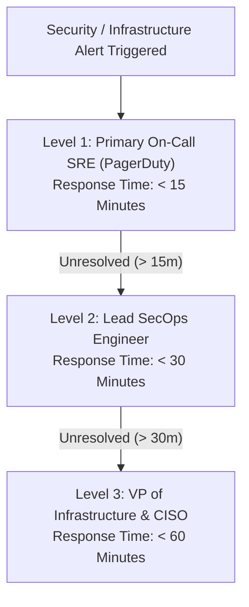

# Security & Engineering RACI / Escalation Matrix — `llm-obs-infra`

| Field | Value |
|---|---|
| Document ID | RACI-LLMOBS-INFRA-001 |
| Target Package | `packages/configs/llm-obs-infra` |
| Owner | VP of Infrastructure & CISO |
| Last Updated | 2026-08-28 |
| Review Cycle | Quarterly |

---

## 1. RACI Legend

- **R (Responsible)**: Executes the work.
- **A (Accountable)**: Sole owner of the final outcome and sign-off.
- **C (Consulted)**: Provides mandatory technical or security input before action.
- **I (Informed)**: Kept updated on progress and outcomes.

---

## 2. Infrastructure RACI Matrix

| Operational Task / Domain | DevOps Lead | SecOps Lead | DB Administrator | Platform Eng | CISO / VP |
|---|---|---|---|---|---|
| **Container Stack Deployment** | R | A | C | C | I |
| **TLS Cert Generation & Renewal** | R | A | I | C | I |
| **AlloyDB / ClickHouse Backups** | C | I | R / A | I | I |
| **Security Incident Response (SEV-1)**| R | A | C | C | I |
| **Pre-Deployment Security Gate** | C | R / A | C | I | I |
| **GDPR Data Erasure Compliance** | C | A | R | C | I |

---

## 3. 24/7 On-Call Escalation Matrix

### Escalation Contacts Breakdown:

| Level | Role | Notification Channel | SLA Target |
|---|---|---|---|
| **Level 1** | Primary On-Call Engineer | PagerDuty / Slack `#infra-oncall` | < 15 minutes |
| **Level 2** | Lead SecOps Engineer | PagerDuty High-Prio / Phone Call | < 30 minutes |
| **Level 3** | VP Infrastructure & CISO | Direct Phone / Executive Escalation | < 60 minutes |
