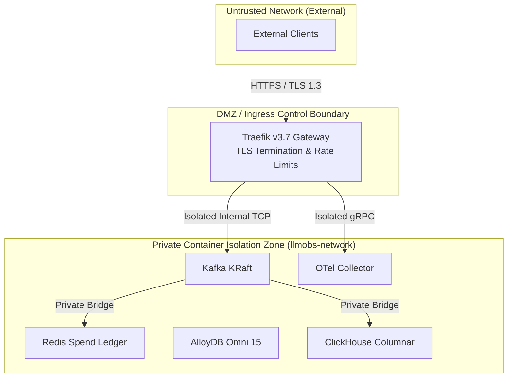

# Security Architecture Review — `llm-obs-infra`

| Field | Value |
|---|---|
| Report ID | SAR-LLMOBS-INFRA-2026-08 |
| Classification | Confidential / Security Evaluation |
| Target Package | `packages/configs/llm-obs-infra` |
| Review Date | 2026-08-28 |
| Reviewers | Senior Security Architect & SecOps Lead |
| Verdict | Approved for Staging & Production with Conditions |

---

## 1. Executive Summary

Formal evaluation of the security architecture governing `packages/configs/llm-obs-infra`.

The infrastructure demonstrates a **Strong** overall security posture, implementing multi-layered network isolation, container privilege drop, non-root execution contexts, and automated TLS certificate handling.

---

## 2. Component Security Analysis

---

## 3. Evaluation of Security Controls

| Security Control | Implementation Method | Assessment Verdict |
|---|---|---|
| **Network Isolation** | Private Docker bridge `llmobs-network` | Pass |
| **Container Hardening** | `no-new-privileges:true` on all containers | Pass |
| **User Privileges** | Non-root security context `user: "1000:1000"` | Pass |
| **Docker Socket** | Traefik read-only mount `/var/run/docker.sock:ro` | Pass |
| **Ingress Rate Limits** | Traefik 100 req/sec limit per client IP | Pass |
| **Secrets Management** | `.env` file parameterization | Pass (Upgrade to Vault recommended) |

---

## 4. Key Recommendations

1. **Vault Integration**: Migrate database secrets from `.env` to dynamic sidecar injection (Sec-02).
2. **mTLS Enforcement**: Enable internal mutual TLS on OTLP gRPC ports between microservices and collector (Sec-01).
