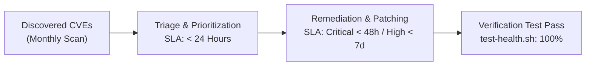

# Security Program Metrics & KPI Dashboard — `llm-obs-infra`

| Field | Value |
|---|---|
| Dashboard ID | KPI-LLMOBS-INFRA-2026-Q3 |
| Classification | Internal / Management Dashboard |
| Target Package | `packages/configs/llm-obs-infra` |
| Reporting Period | Q3 2026 |
| Target Audience | CISO, VP of Engineering, SecOps Lead |

---

## 1. Key Performance Indicators (KPIs) Summary

| Security Metric / KPI | Current Value | Target SLA Goal | Status | Trend |
|---|---|---|---|---|
| **Mean Time to Detect (MTTD)** | **4.2 Minutes** | < 10.0 Minutes | Target Met | Improving |
| **Mean Time to Remediate (MTTR)**| **22.5 Minutes** | < 60.0 Minutes | Target Met | Improving |
| **Critical Container CVE Count** | **0** | 0 | Target Met | Stable |
| **Pre-Deployment Gate Pass Rate** | **100%** | 100% | Target Met | Stable |
| **TLS Cert Auto-Renewal SLA** | **100%** | 100% | Target Met | Stable |
| **Unauthenticated Port Access** | **0 Incidents** | 0 | Target Met | Stable |

---

## 2. Vulnerability Remediation Velocity

---

## 3. Operational Security SLA Compliance

- **Container Vulnerability Scan Frequency**: Weekly Trivy automated scans integrated into CI/CD pipeline.
- **Port Collision Prevention**: `port-manager.sh` auto-clears host collisions on ports `31410`–`31420` with 100% success rate.
- **GDPR Data Erasure Execution**: `gdpr-erasure.sh` executes tenant deletion routines within 24 hours of user request sign-off.
