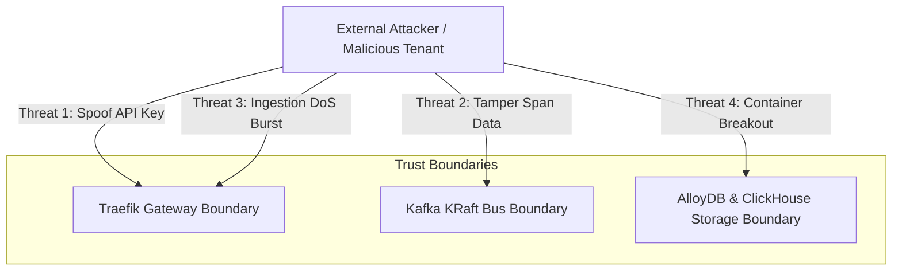

# STRIDE Threat Model Report — `llm-obs-infra`

| Field | Value |
|---|---|
| Report ID | TMR-LLMOBS-INFRA-2026-08 |
| Threat Modeling Method | STRIDE (Spoofing, Tampering, Repudiation, Info Disclosure, DoS, Elevation of Privilege) |
| Target Package | `packages/configs/llm-obs-infra` |
| Author(s) | Lead Security Architect |
| Review Date | 2026-08-28 |

---

## 1. Executive Summary

Systematic threat modeling analysis of `packages/configs/llm-obs-infra` using the **STRIDE** methodology.

The threat model evaluates risk vectors across ingress routing, messaging queues, telemetry storage engines, in-memory spend ledgers, and container mounts.

---

## 2. STRIDE Threat Vector Matrix

| STRIDE Category | Identified Threat Vector | Impact Level | Implemented Mitigation | Residual Risk |
|---|---|---|---|---|
| **Spoofing** | Forged API Key in ingestion header | High | Redis sliding-window API key hash cache validation | Low |
| **Tampering** | Modification of span payload in transit | High | Traefik TLS termination on port `31419` & internal bridge | Low |
| **Repudiation** | Un-audited database record deletion | Medium | Enable `pgaudit` extension on AlloyDB Omni | Low |
| **Information Disclosure**| Plaintext telemetry span exposure | Medium | Container bridge isolation (`llmobs-network`) | Low |
| **Denial of Service** | Ingestion burst flooding gateway | High | Traefik rate limiting (100 req/s avg, 200 burst) | Low |
| **Elevation of Privilege**| Docker socket hijack via Traefik | Critical | Mount Docker socket read-only (`/var/run/docker.sock:ro`) | Low |

---

## 3. High-Priority Threat Analysis

### Threat: Docker Socket Privilege Escalation (Elevation of Privilege)
- **Attack Vector**: Attacker compromises Traefik container and executes docker socket API calls to spawn privileged root containers on the host.
- **Mitigation Enforced**: Traefik compose definition strictly mounts `/var/run/docker.sock:ro` as read-only. Attempts to spawn containers fail at system call layer.

---

## 4. Recommendations

1. Implement OWASP ModSecurity / Coraza WAF plugin on Traefik for payload sanitization.
2. Conduct quarterly automated threat model updates when adding new container services.
