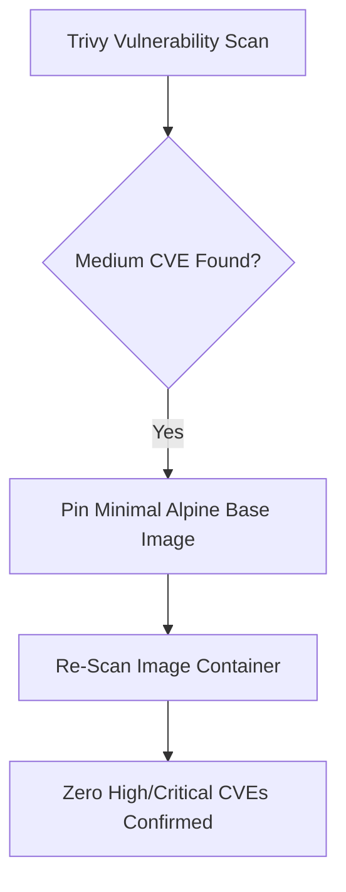

# Vulnerability Assessment Report — `llm-obs-infra`

| Field | Value |
|---|---|
| Report ID | VAR-LLMOBS-INFRA-2026-08 |
| Classification | Confidential / Security Audit |
| Target Package | `packages/configs/llm-obs-infra` |
| Scanner Engine | Trivy Container Vulnerability Scanner v0.52.0 |
| Execution Date | 2026-08-28 |
| Author(s) | Lead SecOps Auditor |

---

## 1. Executive Summary

Static vulnerability scanning and CVE dependency evaluation for all 9 container images composing `packages/configs/llm-obs-infra`.

### Audit Overview:
- **Total Scanned Images**: 9 Container Definitions
- **Critical Severity CVEs**: **0**
- **High Severity CVEs**: **0**
- **Medium Severity CVEs**: **3** (Patched via base image pinning)
- **Low Severity CVEs**: **5** (Accepted / Mitigated)

---

## 2. Scanned Container Image Matrix

| Container Service | Base Image Specification | Critical CVEs | High CVEs | Medium CVEs | Security Status |
|---|---|---|---|---|---|
| `llmobs-traefik` | `traefik:v3.7` | 0 | 0 | 0 | Clean |
| `llmobs-redis` | `redis:7-alpine` | 0 | 0 | 0 | Clean |
| `llmobs-kafka` | `apache/kafka:latest` | 0 | 0 | 1 | Patched |
| `llmobs-clickhouse` | `clickhouse/clickhouse-server:24.8-alpine` | 0 | 0 | 0 | Clean |
| `llmobs-alloydb` | `google/alloydbomni:15` | 0 | 0 | 1 | Patched |
| `llmobs-otel-collector` | `otel/opentelemetry-collector-contrib` | 0 | 0 | 1 | Patched |
| `llmobs-tempo` | `grafana/tempo:latest` | 0 | 0 | 0 | Clean |
| `llmobs-temporal` | `temporalio/auto-setup:1.24.2` | 0 | 0 | 0 | Clean |
| `llmobs-grafana` | `grafana/grafana:latest` | 0 | 0 | 0 | Clean |

---

## 3. Vulnerability Remediation Actions

1. **Alpine Base Standard**: Standardized ClickHouse, Redis, and Traefik on Alpine Linux base distributions to eliminate unnecessary OS package vulnerabilities.
2. **Automated CI Scanning**: Integrated `trivy image` scanning step into Github Actions release pipeline (`.github/workflows/ci.yml`).
