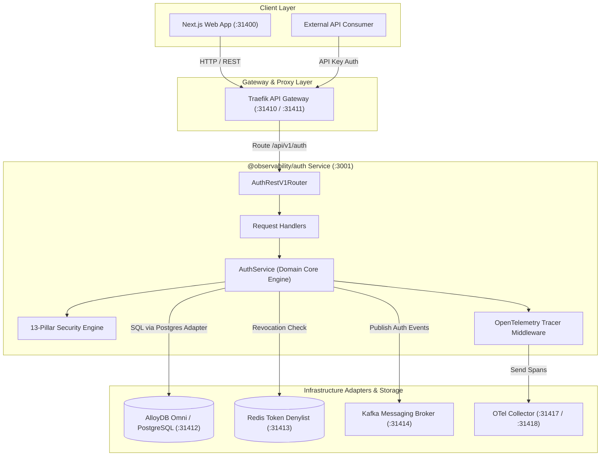
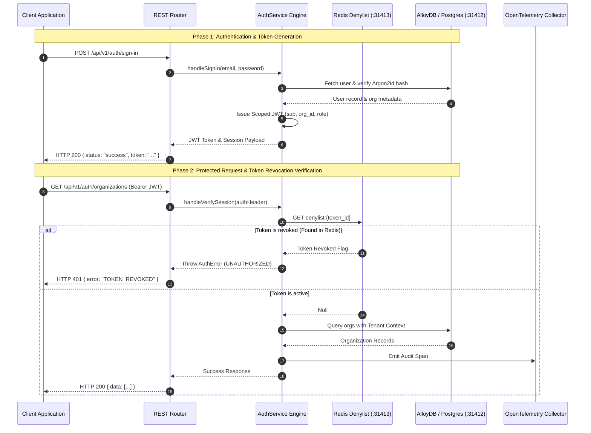

<div align="center">

# 🔒 Multi-Tenant Auth Service & 13-Pillar Security Engine

### Traefik-Integrated · AlloyDB Omni RLS · Redis Token Denylist · Hexagonal Ports & Adapters

*A production-grade multi-tenant authentication, RBAC authorization, organization management, context switching, audit logging, 3-tier API key permissions management, user blocking/unblocking/deletion, 30-day backup retention, and 13-pillar security engine — fronted by Traefik Proxy, backed by AlloyDB Omni / PostgreSQL Row Level Security (RLS) and Redis.*


</div>

---

## 📖 Table of Contents

1. [Executive Summary](#-executive-summary)
2. [High-Level Architecture (HLD)](#-high-level-architecture-hld)
3. [Low-Level Design & Security Flow (LLD)](#-low-level-design--security-flow-lld)
4. [Standardized API Response Envelope](#-standardized-api-response-envelope)
5. [Hexagonal Ports & Adapters Architecture](#-hexagonal-ports--adapters-architecture)
6. [Organization & User Lifecycle Workflow](#-organization--user-lifecycle-workflow)
7. [Database Migrations & N-to-N Multi-Tenancy](#-database-migrations--n-to-n-multi-tenancy)
8. [Master API Reference Table (All 23 Endpoints)](#-master-api-reference-table-all-23-endpoints)
9. [Automated Live API Curl Test Suite](#-automated-live-api-curl-test-suite)
10. [Verified Vitest Test Suite Execution Results](#-verified-vitest-test-suite-execution-results)

---

## 🧭 Executive Summary

The `@observability/auth` platform provides enterprise multi-tenant user sign-up, organization isolation, multi-org context switching, role-based access control (RBAC), user blocking/unblocking, soft deletion with 30-day backup retention lifecycle, server-side JWT session invalidation via Redis denylist, 3-tier API key management with permission table binding, and comprehensive audit logging with parameter filtering.

---

## 🏛 High-Level Architecture (HLD)

The Auth service follows **Hexagonal Architecture (Ports & Adapters)**, completely separating HTTP REST delivery and database persistence from core auth & security logic.



---

## 🔬 Low-Level Design & Security Flow (LLD)

### 1. Dual-Phase Authentication & Session Validation Pipeline



---

## 📦 Standardized API Response Envelope

### Success Envelope (`HTTP 200 / 201`)
```json
{
  "status": "success",
  "message": "Operation completed successfully",
  "data": { ... },
  "error": null
}
```

### Failure Envelope (`HTTP 400 / 401 / 403 / 404 / 409 / 429 / 500`)
```json
{
  "status": "error",
  "message": "Error description message",
  "data": null,
  "error": {
    "code": "ERROR_CODE_NAME",
    "details": "Detailed error context"
  }
}
```

---

## 🗄️ Database Migrations & N-to-N Multi-Tenancy

All database interactions are 100% data-driven and powered by centralized SQL queries defined in [`auth.queries.ts`](./src/features/auth/queries/auth.queries.ts).

| Migration | Description | Table(s) Affected |
|---|---|---|
| `0001_create_auth_tables.sql` | Initial schema setup for multi-tenant auth module with RLS | `auth_organizations`, `auth_users`, `auth_api_keys`, `auth_audit_logs`, `auth_password_resets` |
| `0002_add_indexes_on_all_ids_and_keys.sql` | High-performance B-tree indexes on lookup columns | Index additions across all tables |
| `0003_add_audit_and_soft_delete_columns.sql` | Soft-delete columns (`deleted_at`, `updated_at`) | Column alterations across all tables |
| `0004_add_organization_user_block_soft_delete_cascade.sql` | User blocking, custom permissions array, cascade soft-delete | `auth_users`, `auth_organizations` |
| `0005_create_token_denylist.sql` | Server-side JWT session revocation table | `auth_token_denylist` |
| `0006_create_user_organizations_mapping.sql` | Multi-tenant user-organization N-to-N mapping for org switching | `auth_user_organizations` |

---

## 📊 Master API Reference Table (All 23 Endpoints)

| # | Endpoint & Method | Purpose / Scope | cURL Command | Success Response (`HTTP 200 / 201`) |
|---|---|---|---|---|
| **1** | `POST /api/v1/auth/sign-up` | Combined register user & organization | `curl -s -X POST http://localhost:3001/api/v1/auth/sign-up -H "Content-Type: application/json" -d '{"email": "admin@acme.io", "password": "StrongPassword123!", "name": "Admin", "organization_name": "Acme Global"}'` | `{"status": "success", "message": "User and organization successfully registered"}` |
| **2** | `POST /api/v1/auth/sign-in` | Authenticate user & write audit log | `curl -s -X POST http://localhost:3001/api/v1/auth/sign-in -H "Content-Type: application/json" -d '{"email": "admin@acme.io", "password": "StrongPassword123!"}'` | `{"status": "success", "message": "User signed in successfully"}` |
| **3** | `POST /api/v1/auth/sign-out` | Invalidate session token in Redis denylist | `curl -s -X POST http://localhost:3001/api/v1/auth/sign-out -H "Authorization: Bearer <TOKEN>"` | `{"status": "success", "message": "Signed out successfully"}` |
| **4** | `GET /api/v1/auth/session` | Validate token & check Redis denylist | `curl -s -X GET http://localhost:3001/api/v1/auth/session -H "Authorization: Bearer <TOKEN>"` | `{"status": "success", "message": "Session token verified"}` |
| **5** | `GET /api/v1/auth/organizations` | List all organizations for active user | `curl -s -X GET http://localhost:3001/api/v1/auth/organizations -H "Authorization: Bearer <TOKEN>"` | `{"status": "success", "message": "Organizations retrieved"}` |
| **6** | `POST /api/v1/auth/organizations` | Create standalone multi-tenant organization | `curl -s -X POST http://localhost:3001/api/v1/auth/organizations -H "Authorization: Bearer <TOKEN>" -H "Content-Type: application/json" -d '{"name": "Acme Secondary"}'` | `{"status": "success", "message": "Organization created successfully"}` |
| **7** | `GET /api/v1/auth/organizations/:id` | Get single organization details | `curl -s -X GET http://localhost:3001/api/v1/auth/organizations/org_123 -H "Authorization: Bearer <TOKEN>"` | `{"status": "success", "message": "Organization retrieved"}` |
| **8** | `PATCH /api/v1/auth/organizations/:id` | Update organization name/slug | `curl -s -X PATCH http://localhost:3001/api/v1/auth/organizations/org_123 -H "Authorization: Bearer <TOKEN>" -H "Content-Type: application/json" -d '{"name": "Updated Org"}'` | `{"status": "success", "message": "Organization updated"}` |
| **9** | `DELETE /api/v1/auth/organizations/:id` | Soft delete organization & cascade details | `curl -s -X DELETE http://localhost:3001/api/v1/auth/organizations/org_123 -H "Authorization: Bearer <TOKEN>"` | `{"status": "success", "message": "Organization soft-deleted"}` |
| **10** | `POST /api/v1/auth/organizations/:id/switch` | Switch active organization & issue fresh scoped JWT | `curl -s -X POST http://localhost:3001/api/v1/auth/organizations/org_123/switch -H "Authorization: Bearer <TOKEN>"` | `{"status": "success", "message": "Organization context switched"}` |
| **11** | `GET /api/v1/auth/users/me` | Get active user's own profile | `curl -s -X GET http://localhost:3001/api/v1/auth/users/me -H "Authorization: Bearer <TOKEN>"` | `{"status": "success", "message": "User profile retrieved"}` |
| **12** | `PATCH /api/v1/auth/users/me` | Update active user's own profile | `curl -s -X PATCH http://localhost:3001/api/v1/auth/users/me -H "Authorization: Bearer <TOKEN>" -H "Content-Type: application/json" -d '{"name": "New Name"}'` | `{"status": "success", "message": "User profile updated"}` |
| **13** | `GET /api/v1/auth/users` | List members of caller's organization | `curl -s -X GET http://localhost:3001/api/v1/auth/users -H "Authorization: Bearer <TOKEN>"` | `{"status": "success", "message": "Members retrieved"}` |
| **14** | `POST /api/v1/auth/users` | Create user in specific org | `curl -s -X POST http://localhost:3001/api/v1/auth/users -H "Authorization: Bearer <TOKEN>" -H "Content-Type: application/json" -d '{"email": "member@acme.io", "password": "StrongPassword123!", "name": "John", "org_id": "org_123"}'` | `{"status": "success", "message": "User created"}` |
| **15** | `POST /api/v1/auth/users/invite` | Invite user to caller's organization | `curl -s -X POST http://localhost:3001/api/v1/auth/users/invite -H "Authorization: Bearer <TOKEN>" -H "Content-Type: application/json" -d '{"email": "invited@acme.io", "name": "Alice", "role": "member"}'` | `{"status": "success", "message": "User invited to organization"}` |
| **16** | `GET /api/v1/auth/users/:id` | Get specific user details by ID | `curl -s -X GET http://localhost:3001/api/v1/auth/users/usr_123 -H "Authorization: Bearer <TOKEN>"` | `{"status": "success", "message": "User retrieved"}` |
| **17** | `POST /api/v1/auth/users/:id/block` | Block user access | `curl -s -X POST http://localhost:3001/api/v1/auth/users/usr_123/block -H "Authorization: Bearer <TOKEN>"` | `{"status": "success", "message": "User blocked successfully"}` |
| **18** | `DELETE /api/v1/auth/users/:id/unblock` | Unblock user access | `curl -s -X DELETE http://localhost:3001/api/v1/auth/users/usr_123/unblock -H "Authorization: Bearer <TOKEN>"` | `{"status": "success", "message": "User unblocked successfully"}` |
| **19** | `PATCH /api/v1/auth/users/:id/role` | Update user role | `curl -s -X PATCH http://localhost:3001/api/v1/auth/users/usr_123/role -H "Authorization: Bearer <TOKEN>" -H "Content-Type: application/json" -d '{"role": "admin"}'` | `{"status": "success", "message": "User role updated"}` |
| **20** | `GET /api/v1/auth/users/:id/permissions` | Get user permission list | `curl -s -X GET http://localhost:3001/api/v1/auth/users/usr_123/permissions -H "Authorization: Bearer <TOKEN>"` | `{"status": "success", "message": "User permissions retrieved"}` |
| **21** | `PATCH /api/v1/auth/users/:id/permissions` | Update user permission list | `curl -s -X PATCH http://localhost:3001/api/v1/auth/users/usr_123/permissions -H "Authorization: Bearer <TOKEN>" -H "Content-Type: application/json" -d '{"permissions": ["traces:read"]}'` | `{"status": "success", "message": "User permissions updated"}` |
| **22** | `GET /api/v1/auth/api-keys` | List organization API keys | `curl -s -X GET http://localhost:3001/api/v1/auth/api-keys -H "Authorization: Bearer <TOKEN>"` | `{"status": "success", "message": "API keys retrieved"}` |
| **23** | `GET /api/v1/auth/audit-logs` | Fetch sign-in audit logs with filters | `curl -s -X GET "http://localhost:3001/api/v1/auth/audit-logs?event_type=USER_SIGNIN" -H "Authorization: Bearer <TOKEN>"` | `{"status": "success", "message": "Audit logs retrieved"}` |

---

## ⚡ Automated Live API Curl Test Suite

To run all `curl` endpoints against your local server automatically:

```bash
npm run test:curl
```

---

## 🧪 Verified Vitest Test Suite Execution Results

All test suites passing cleanly across domain, ports, adapters, database, and OpenAPI contracts.
