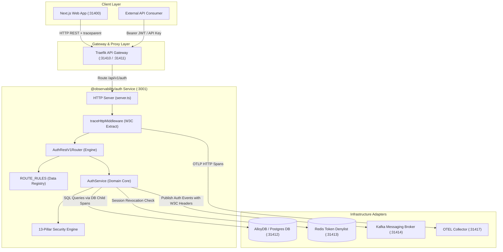
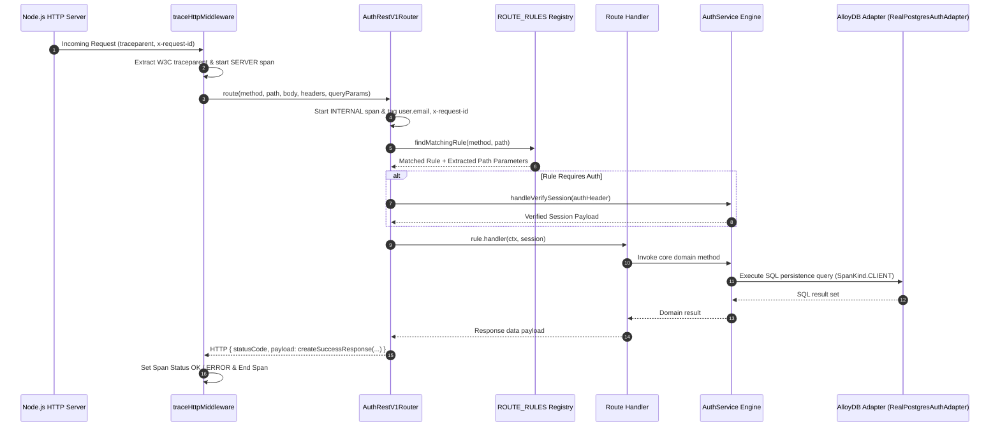

# ADR 0001: Hexagonal Architecture & Declarative Rule Engine Router

- **Status**: Accepted
- **Date**: 2026-08-23
- **Context**: The `@observability/auth` service requires strict separation of concerns between HTTP delivery, core domain rules, security mechanisms, OpenTelemetry W3C distributed tracing, and database persistence, as well as an extensible route matcher that eliminates repetitive conditional statements.

---

## 🏛 High-Level Design (HLD)



---

## 🔬 Low-Level Design (LLD)



---

## 🌳 End-to-End Function Call Stack (ASCII Tree)

```tree
HTTP Request Received (Any Endpoint)
└── http.createServer [server.ts]
    └── traceHttpMiddleware(req, res) [infra/tracing/middleware.ts]
        ├── Extract W3C traceparent via propagation.extract(ROOT_CONTEXT, headers)
        └── Start Root SERVER Span ("HTTP {method} {path}")
            │
            └── AuthRestV1Router.route(method, path, body, headers, queryParams) [router.ts]
                │
                ├── 1. OpenTelemetry Span Start ("REST {method} {path}") [tracer.ts]
                │   ├── Tag Attribute: user.email (if present in payload)
                │   ├── Tag Attribute: x-request-id / x-correlation-id
                │   └── Set SpanStatus.ERROR on validation/auth failure
                │
                ├── 2. Match ROUTE_RULES Table [route.rules.ts]
                │   ├── Match HTTP Method ("GET" / "POST" / "DELETE")
                │   └── Match Pre-compiled Regex Path Pattern
                │
                ├── 3. Session Verification (If authRequired === true)
                │   ├── extractBearerToken(headers.authorization)
                │   └── UserAuthDomainService.validateSession(token) [services/user-auth.service.ts]
                │
                └── 4. Execute Rule Handler
                    └── AuthService Engine [service.ts]
                        └── RealPostgresAuthAdapter [infra/adapters/postgres/real-postgres-auth.adapter.ts]
                            └── withSpan("DB SELECT ...", kind: CLIENT)
```

---

## 🔐 CORS & Security Configuration

The server enforces wildcard CORS preflight handling (`Access-Control-Allow-Headers: *`) to ensure custom OpenTelemetry headers (`traceparent`, `tracestate`, `x-request-id`, `x-correlation-id`) are accepted seamlessly without preflight blocks.
