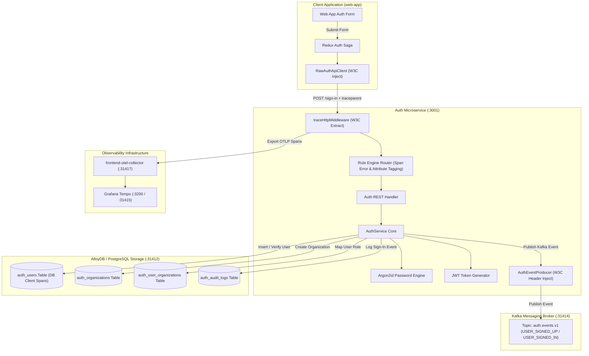
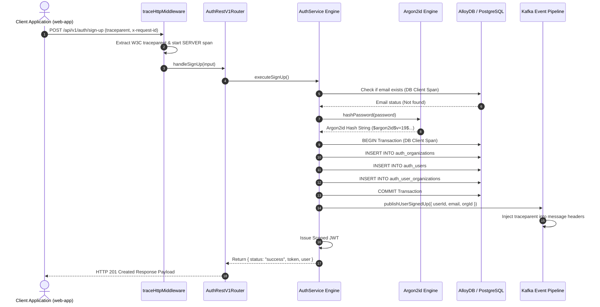
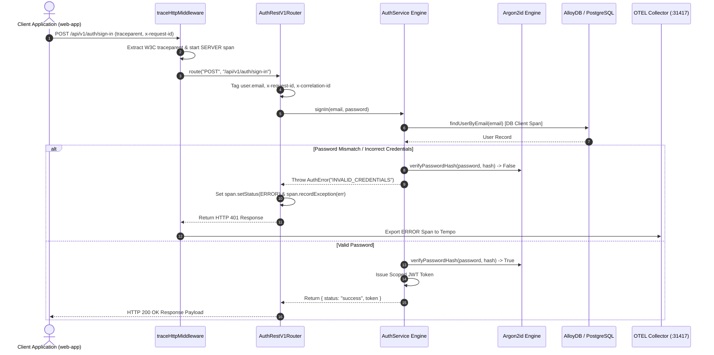

# ADR 0002: Sign-Up, Sign-In, Argon2id Hashing, OpenTelemetry Tracing & Audit Logging

- **Status**: Accepted
- **Date**: 2026-08-23
- **Context**: User registration (Sign-Up) and authentication (Sign-In) must provide secure password hashing using Argon2id, atomic user & organization creation, structured audit logging, JWT session token generation, end-to-end W3C trace context propagation, and asynchronous Kafka event publishing.

---

## 🏛 High-Level Design (HLD)



---

## 🔬 Low-Level Design (LLD)

### 1. Sign-Up Sequence Flow



---

### 2. Sign-In Sequence Flow (With Error Span Handling)



---

## 🌳 Complete End-to-End Functional Call Stack (ASCII Tree)

```tree
User clicks "Sign In" button (Frontend User Action)
└── SignUpForm / SignInForm.tsx [src/features/auth/ui/SignInForm.tsx]
    └── handleSubmit(e) [Form Event Handler]
        └── onSubmit({ email, password }) [Prop Callback]
            └── SignInPage.handleSubmit() [src/app/auth/sign-in/page.tsx]
                └── dispatch(authActions.signInSubmitted({ email, password })) [Redux Action Dispatch]
                    │
                    ├── 1. authSlice.reducers.signInSubmitted() [src/features/auth/auth.slice.ts]
                    │   └── Updates Redux State -> state.auth.status = 'loading'
                    │
                    └── 2. rootSaga -> authSaga Watcher [src/features/auth/auth.saga.ts]
                        └── takeEvery(authActions.signInSubmitted.type, handleSignIn)
                            └── handleSignIn(action) [Redux-Saga Generator]
                                └── authApiClient.signIn(payload) [src/lib/auth-client.ts]
                                    │
                                    ├── 3. Resilient Adapter Decorator Chain [src/core/data-driven/adapter-decorators.ts]
                                    │   └── withTracing -> withCircuitBreaker -> withCache -> withRetry
                                    │
                                    └── 4. RawAuthApiClient.execute('signIn', { body }) [src/lib/auth-client.ts]
                                        ├── Inject W3C Header: traceparent: 00-4bf92f3577b34da6a3ce929d0e0e4736-00f067aa0ba902b7-01
                                        ├── Inject Header: x-request-id: req-1787491177230-g4lb89
                                        ├── Inject Header: x-correlation-id: req-1787491177230-g4lb89
                                        │
                                        └── fetch('http://localhost:3001/api/v1/auth/sign-in', { method: 'POST', body })
                                            │
                                            ├── [HTTP Network Request Wire] ──> [Backend Auth Service :3001]
                                            │   └── http.createServer [server.ts]
                                            │       └── traceHttpMiddleware [middleware.ts] (Extract W3C traceparent)
                                            │           └── AuthRestV1Router.route() [router.ts]
                                            │               ├── Tag Attribute: user.email = devuser@example.com
                                            │               ├── Tag Attribute: x-request-id = req-1787491177230-g4lb89
                                            │               │
                                            │               └── AuthService.signIn() [service.ts] (Facade)
                                            │                   └── UserAuthDomainService.signIn() [services/user-auth.service.ts] (SRP Engine)
                                            │                       │
                                            │                       ├── a. SignInInputSchema.parse(input) [schema/auth.schema.ts]
                                            │                       ├── b. RealPostgresAuthAdapter.findUserByEmail() [real-postgres-auth.adapter.ts]
                                            │                       │   ├── withSpan('DB SELECT findUserByEmail', kind: CLIENT)
                                            │                       │   ├── pool.connect() [pg Pool]
                                            │                       │   ├── client.query(AUTH_QUERIES.FLOW_SIGN_IN.FIND_USER_BY_EMAIL) [auth.queries.ts]
                                            │                       │   └── client.release() [pg Pool]
                                            │                       ├── c. verifyPassword(password, user.password_hash) [shared/utils/argon2.util.ts]
                                            │                       │   └── [Failure Mode] If mismatch: Set SpanStatus.ERROR & recordException
                                            │                       ├── d. RealPostgresAuthAdapter.recordAuditLog() [real-postgres-auth.adapter.ts]
                                            │                       │   ├── pool.connect() [pg Pool]
                                            │                       │   ├── client.query(AUTH_QUERIES.TENANT_RLS.SET_LOCAL_TENANT_CONTEXT) [RLS Context]
                                            │                       │   ├── client.query(AUTH_QUERIES.FLOW_SIGN_IN.RECORD_AUDIT_LOG) [Insert Log]
                                            │                       │   └── client.release() [pg Pool]
                                            │                       ├── e. createToken(userId, email, orgDetails) [shared/utils/jwt.util.ts]
                                            │                       ├── f. verifyToken(token) [shared/utils/jwt.util.ts]
                                            │                       └── g. AuthEventProducer.publishUserSignedIn() [auth-event.producer.ts]
                                            │                           └── ProducerMiddlewarePipeline.execute() [messaging-middleware.ts]
                                            │                               ├── loggingProducerMiddleware() [Logger]
                                            │                               ├── tracingProducerMiddleware() [OpenTelemetry Spans]
                                            │                               └── CentralizedKafkaClient.publishToTopic('auth.events.v1') [Kafka :31414]
                                            │
                                            └── ON RESPONSE SUCCESS (200 OK):
                                                ├── setAuthCookies(token, role) [document.cookie: authjs.session-token]
                                                ├── put(authActions.authSuccess({ user, organization })) [Redux State -> status: 'success']
                                                ├── eventBus.emit('auth.signInSuccess', response) [Cross-Feature Event Bus]
                                                └── useEffect() Status Watcher [src/app/auth/sign-in/page.tsx]
                                                    ├── router.push('/dashboard') [Next.js Router Navigation]
                                                    └── router.refresh() [Next.js Page Cache Refresh]
```
