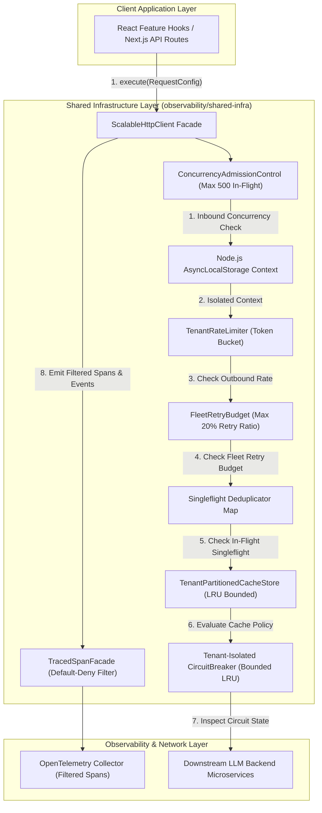
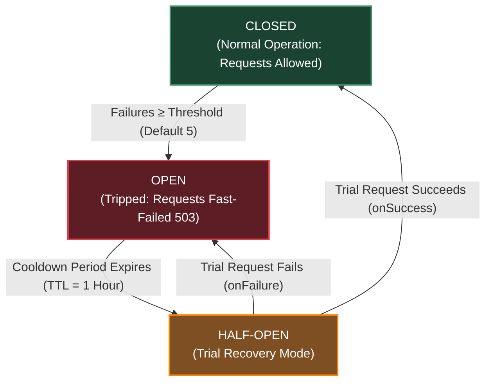
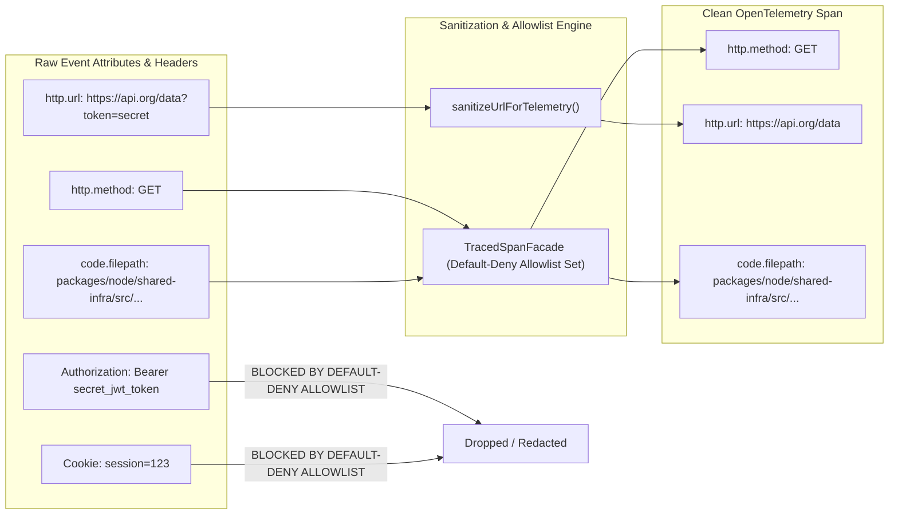
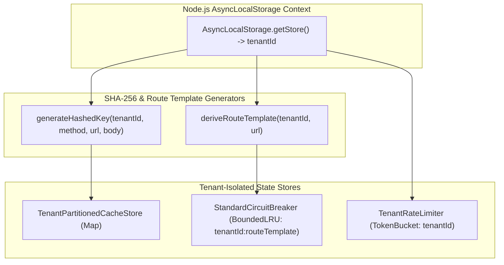

# ADR 0001: Comprehensive Architecture Decision Record & Master Specification for Shared Infrastructure

* **Status**: Accepted
* **Deciders**: Architecture Team, Core Infrastructure Working Group
* **Date**: 2026-08-31
* **Scope**: `@observability/shared-infra` (`packages/node/shared-infra`)

---

## 1. Context and Problem Statement

The LLM Observability Platform processes high volumes of distributed RPCs, telemetry query feeds, and real-time LLM cost/quality data across microservices. The legacy network and rules infrastructure suffered from:
1. **Thundering Herd Effects**: Concurrent duplicate read requests sent identical queries to downstream servers.
2. **Caller UI Crashes**: Traditional `AbortController` cancellation rejected pending promises with `AbortError`, causing UI component crashes.
3. **Black-box Observability**: Developers could not trace which component line number initiated an HTTP request or why a specific cache/circuit breaker decision was made.
4. **Imperative Loop Spaghetti**: Unstructured mutable state loops made retry jitter, rules evaluation, and header propagation difficult to maintain and audit.

We need a standardized, resilient, readable shared infrastructure combining an HTTP client pipeline, business rules engine, and full OpenTelemetry decision and code-location telemetry.

---

## 2. Decision Drivers & Core Engineering Principles

### 2.1 ASCII Decision Tree for Engineering Principles Evaluation

```text
========================================================================================
             DECISION DRIVERS & CORE ENGINEERING PRINCIPLES (DECISION TREE)
========================================================================================

+-- [IF: Implementing Code Style & Control Flow?]
|   +-- [YES] --> Is logic written with complex `.reduce()` chains or nested ternaries?
|   |             +-- [YES] --> REJECT: Refactor to explicit `if`, guard clauses & `for...of`
|   |             +-- [NO]  --> ADOPT: Pragmatic Readable Engineering over Dogmatic Purity
|   |
|   +-- [NO]  --> Continue evaluation below...
|
+-- [IF: Handling Literal Strings & Tokens?]
|   +-- [YES] --> Are HTTP verbs, headers, status codes or tracer keys hardcoded as strings?
|   |             +-- [YES] --> REJECT: Extract into `as const` constant dictionaries
|   |             +-- [NO]  --> ADOPT: Zero Hardcoded Strings (`HTTP_CONSTANTS`, etc.)
|   |
|   +-- [NO]  --> Continue evaluation below...
|
+-- [IF: Processing Incoming Read Requests?]
|   +-- [YES] --> Is an identical read request already active in-flight?
|   |             +-- [YES] --> EXECUTE: Collapse callers to 1 shared Promise via SHA-256 key
|   |             +-- [NO]  --> ADOPT: Singleflight Request Collapsing ($N \to 1$ RPCs)
|   |
|   +-- [NO]  --> Continue evaluation below...
|
+-- [IF: Retrying Write / Mutation Operations?]
|   +-- [YES] --> Is a retry attempt initiated after a network drop/failure?
|   |             +-- [YES] --> EXECUTE: Preserve original `x-idempotency-key` (crypto.randomUUID)
|   |             +-- [NO]  --> ADOPT: Idempotency Key Preservation
|   |
|   +-- [NO]  --> Continue evaluation below...
|
+-- [IF: Evaluating Response Caching?]
|   +-- [YES] --> Is `noCache: true` or `Cache-Control: no-cache, no-store` present?
|   |             +-- [YES] --> EXECUTE: Dynamically bypass tenant LRU cache lookup
|   |             +-- [NO]  --> ADOPT: Header & Endpoint Driven Caching
|   |
|   +-- [NO]  --> Continue evaluation below...
|
+-- [IF: Instrumentation & Observability?]
|   +-- [YES] --> Are telemetry spans created for pipeline steps?
|   |             +-- [YES] --> EXECUTE: Wrap span in `TracedSpanFacade`, capture `code.filepath`
|   |             +-- [NO]  --> ADOPT: Comprehensive OpenTelemetry Telemetry
|   |
|   +-- [NO]  --> Continue evaluation below...
|
+-- [IF: Adding New Rules, Errors, or Retries?]
    +-- [YES] --> Are rules or errors evaluated via hardcoded `switch` statements?
                  +-- [YES] --> REJECT: Register dynamic handlers in registry maps
                  +-- [NO]  --> ADOPT: Pluggable Data-Driven Registries
```

---

### 2.2 Detailed Principle Definitions & Operational Rationale

#### 1. Pragmatic Readable Engineering over Dogmatic Purity
* **Definition**: Standardizes clear, straightforward system design and code structure that prioritizes long-term maintainability, team readability, and rapid troubleshooting over overly complex or abstract programming patterns.
* **Operational Rationale**: Overly complex code or hidden abstractions increase developer onboarding time, obscure system behavior during live incidents, and slow down emergency fixes. Keeping control flow clear and direct ensures any engineer on call can instantly understand system state and resolve production issues quickly.

#### 2. Zero Hardcoded Strings
* **Definition**: Eliminates manual text entry for configuration values, system keys, status labels, and protocol metadata by enforcing centralized, strictly managed data dictionaries.
* **Operational Rationale**: Manually typing text values throughout an application leads to subtle data corruption, mismatched analytics, and broken integration points. Centralizing all configuration names ensures total consistency, prevents human entry errors, and makes updates effortless across all services.

#### 3. Singleflight Request Collapsing
* **Definition**: An operational efficiency control that automatically merges identical concurrent user requests for the same data into a single backend fetch, sharing the result across all requesting users simultaneously.
* **Operational Rationale**: When multiple users or interface components request identical information at the same moment (such as loading a shared dashboard), sending multiple backend queries wastes network bandwidth and overloads database services. Singleflight ensures the system performs work only once and fulfills all pending requests concurrently.

#### 4. Idempotency Key Preservation
* **Definition**: Assigns a unique transaction tracking identifier to every business operation and reuses that exact identifier across all retry attempts until completion.
* **Operational Rationale**: If a network connection drops while submitting a transaction or data update, the client cannot confirm if the request succeeded. Re-transmitting the request with the identical tracking identifier allows downstream services to safely recognize and prevent duplicate processing, such as double-billing or redundant record creation.

#### 5. Header & Endpoint Driven Caching
* **Definition**: Dynamically governs data retention and retrieval using standard communication policies, allowing real-time requests to bypass stored data when fresh information is explicitly required.
* **Operational Rationale**: Fixed caching policies risk serving outdated information or inadvertently exposing tenant-sensitive data. Allowing endpoint rules and caller requirements to dynamically dictate caching ensures critical operations receive live data while routine queries benefit from fast, low-cost cached responses.

#### 6. Comprehensive OpenTelemetry Telemetry
* **Definition**: Automatically records detailed operational audit logs, execution decisions, and exact origin context for every transaction across system boundaries.
* **Operational Rationale**: Without comprehensive context, diagnosing system slowdowns or unexpected failures requires guesswork. Enriching transaction traces with decision outcomes and precise execution origin points gives engineering teams end-to-end visibility to trace issues back to their exact source instantly.

#### 7. Pluggable Data-Driven Registries
* **Definition**: Establishes a modular architecture where system rules, error handlers, and business policies are registered dynamically as configurable data components rather than hardcoded logic.
* **Operational Rationale**: Hardcoding business rules directly into core execution paths makes adding new features risky and expensive. Data-driven registries allow teams to introduce new business logic, retry policies, or integration rules seamlessly without altering core system infrastructure.

---

## 3. Detailed 10-Step Fleet-Resilient Pipeline Specification

### 3.1 Unified Master Pipeline Pseudocode Specification

```typescript
/**
 * Master Pipeline Specification: Unified 10-Step Fleet-Resilient HTTP Execution Pipeline
 */
ASYNC FUNCTION executeResilientHttpPipeline(requestConfig):

  // STEP 1: Inbound Concurrency Admission Control & Load Shedding
  IF activeInFlightRequests >= MAX_IN_FLIGHT_REQUESTS THEN  // Default capacity: 500
    emitSpanEvent("admission_control.shed", { activeCount: activeInFlightRequests })
    THROW HttpError(429, "Too Many Requests - Fleet Load Shedding")
  END IF
  INCREMENT activeInFlightRequests

  TRY:
    // STEP 2: AsyncLocalStorage Request Context Isolation
    context = AsyncLocalStorage.getStore() ?? { tenantId: "tenant-default", traceId: generateUUID() }
    tenantId = context.tenantId

    // STEP 3: DNS IP-Level Resolution SSRF & TOCTOU Protection
    targetIP = AWAIT dns.lookup(parseUrl(requestConfig.url).hostname)
    IF isIpInBlockedSubnets(targetIP) THEN
      // Restricted: 127.0.0.0/8, 169.254.0.0/16, 10.0.0.0/8, 172.16.0.0/12, 192.168.0.0/16, ::1
      emitSpanEvent("ssrf_violation_detected", { targetIP })
      THROW SecurityError(403, "SSRF Violation: Resolved IP belongs to restricted subnet")
    END IF

    // STEP 4: Per-Tenant Outbound Rate Limiting (Token Bucket)
    rateBucket = rateLimiterStore.getBucket(tenantId)  // Capacity: 100, Refill: 50 tokens/sec
    IF rateBucket.consumeToken() == FALSE THEN
      emitSpanEvent("rate_limit.exceeded", { tenantId })
      THROW HttpError(429, "Rate Limit Exceeded for Tenant")
    END IF

    // STEP 5: Fleet-Wide Retry Budgeting (Retry Storm Prevention)
    IF (globalFleetRetries / globalFleetRequests) > 0.20 THEN
      emitSpanEvent("retry_budget.exhausted")
      allowRetries = FALSE  // Suppress retries globally to protect downstreams
    ELSE
      allowRetries = TRUE
    END IF

    // STEP 6: Total Operation Wall-Clock Timeout Budget
    abortController = NEW AbortController()
    globalTimer = setTimeout(() => abortController.abort(), 15000)  // 15s Wall-Clock Timeout Budget

    // STEP 7: SHA-256 Tenant-Isolated Key Hashing & Singleflight Collapsing
    rawKey = tenantId + ":" + requestConfig.method + ":" + requestConfig.url + ":" + JSON.stringify(requestConfig.body)
    hashedKey = SHA256(rawKey).toHex()

    IF requestConfig.method == "GET" AND inFlightSingleflights.has(hashedKey) THEN
      emitSpanEvent("singleflight.deduplicated_hit", { hashedKey })
      RETURN AWAIT inFlightSingleflights.get(hashedKey)  // Attach to existing in-flight Promise ($N -> 1 RPCs)
    END IF

    // Define core pipeline execution task
    pipelineTask = ASYNC () => {

      // STEP 8: Sealed TracedSpanFacade & Default-Deny Allowlist Filter
      sanitizedAttributes = filterAllowedAttributes(requestConfig.headers, ALLOWED_TELEMETRY_ATTRIBUTES)
      callerLocation = extractV8CallerStackFrame()  // Captures code.filepath, code.function, code.lineno

      RETURN AWAIT tracer.startActiveSpan("HTTP " + requestConfig.method, sanitizedAttributes, ASYNC (span) => {

        // STEP 9: Tenant-Partitioned LRU Cache & Write Invalidation
        tenantCache = lruCacheStore.getPartition(tenantId)

        IF requestConfig.method IN ["POST", "PUT", "PATCH", "DELETE"] THEN
          tenantCache.clear()  // Invalidate tenant cache partition on mutating write operations
        ELSE IF requestConfig.noCache != TRUE AND tenantCache.has(hashedKey) THEN
          span.setStatus("OK")
          emitSpanEvent("cache.hit", { hashedKey })
          RETURN tenantCache.get(hashedKey)  // Cache Hit
        END IF

        // STEP 10: Bounded LRU Circuit Breaker & Per-Attempt Re-Check
        circuitKey = tenantId + ":" + deriveRouteTemplate(requestConfig.url)
        circuit = circuitBreakerLRU.get(circuitKey)

        IF circuit.state == "OPEN" THEN
          IF Date.now() < circuit.nextAttemptTimestamp THEN
            span.setStatus("ERROR")
            THROW CircuitError(503, "Circuit Breaker OPEN - Fast Failure")
          ELSE
            circuit.state = "HALF_OPEN"  // Cooldown expired: Enter trial probe mode
          END IF
        END IF

        // Execute Network Call with AWS Full Jitter Retry Loop
        attempt = 1
        maxAttempts = allowRetries ? 3 : 1

        WHILE attempt <= maxAttempts:
          TRY:
            response = AWAIT fetchNetwork(requestConfig.url, requestConfig, abortController.signal)
            circuit.onSuccess()  // Reset circuit to CLOSED

            IF requestConfig.method == "GET" THEN
              tenantCache.set(hashedKey, response)
            END IF

            span.setStatus("OK")
            RETURN response

          CATCH error:
            circuit.onFailure()
            IF attempt == maxAttempts OR abortController.signal.aborted THEN
              span.setStatus("ERROR")
              RETHROW error
            END IF

            // AWS Full Jitter Exponential Backoff Jitter calculation
            backoffMs = random(0, min(MAX_BACKOFF_MS, BASE_BACKOFF_MS * (2 ^ (attempt - 1))))
            AWAIT sleep(backoffMs)
            attempt = attempt + 1
          END TRY
        END WHILE
      })
    }

    // Register singleflight promise for read operations
    IF requestConfig.method == "GET" THEN
      executionPromise = pipelineTask()
      inFlightSingleflights.set(hashedKey, executionPromise)
      TRY:
        RETURN AWAIT executionPromise
      FINALLY:
        inFlightSingleflights.delete(hashedKey)
      END TRY
    ELSE:
      RETURN AWAIT pipelineTask()
    END IF

  FINALLY:
    DECREMENT activeInFlightRequests
    clearTimeout(globalTimer)
  END TRY
END FUNCTION
```

---

## 4. High-Level Architecture (HLA)



### Component Definitions & Architecture Role:
* **Client Application Layer (`FE`)**: React hooks, server components, or Next.js API handlers initiating data fetching operations.
* **`ScalableHttpClient` Facade (`HTTP`)**: The central entry point coordinating the 10-step resilient pipeline.
* **`AsyncLocalStorage` Context (`ALS`)**: Manages tenant identity and request boundaries across async steps.
* **Pipeline Resilience Modules (`ADM`, `LIMIT`, `BUDGET`, `SF`, `CACHE`, `CB`)**: Modular guardrails enforcing load shedding, rate limiting, deduplication, caching, and circuit breaking.
* **`TracedSpanFacade` (`SPAN`)**: Sanitizes and records telemetry spans before exporting to OpenTelemetry (`OTEL`).

---

## 5. Low-Level Architecture & Comprehensive Diagrams

### 5.1 End-to-End Pipeline Execution Sequence Diagram

```mermaid
sequenceDiagram
  autonumber
  participant Caller as Feature Component / Service
  participant ADM as ConcurrencyAdmissionControl
  participant ALS as AsyncLocalStorage Context
  participant Client as ScalableHttpClient Pipeline
  participant DNS as "DNSResolver (dns.promises.lookup)"
  participant SF as Singleflight Map (SHA-256)
  participant Cache as TenantPartitionedCacheStore
  participant CB as "StandardCircuitBreaker (Bounded LRU)"
  participant Net as Fetch API / Network
  participant Span as "TracedSpanFacade (Default-Deny Filter)"

  Caller->>ADM: execute({ method: 'GET', url: 'https://api.org/data' })
  alt In-Flight Concurrency &gt; 500
    ADM-->>Caller: Reject 429 (Load Shedding)
  else In-Flight Capacity Available
    ADM->>ALS: Get isolated RequestContext (tenantId)
    ALS-->>Client: tenantId ("tenant-acme")
    Client->>DNS: lookup(hostname)
    alt Resolved IP in Private Subnets (127.0.0.1 / 169.254.169.254)
      DNS-->>Client: Private IP
      Client-->>Caller: Reject SSRF Violation Error
    else Valid Public IP
      Client->>SF: Check SHA256(tenantId:method:url:body)
      alt Singleflight Hit
        SF-->>Caller: Return shared in-flight Promise
      else Singleflight Miss
        Client->>Span: startActiveSpan('HTTP GET https://api.org/data')
        Span->>Span: Filter attributes via ALLOWED_TELEMETRY_ATTRIBUTES
        Client->>Cache: get(tenantId, requestKey)
        alt Cache Hit
          Cache-->>Client: Return cached data
          Client->>Span: setStatus(OK), emit decision.cache_evaluated
          Span-->>Caller: Return cached payload
        else Cache Miss
          Client->>CB: canExecute(tenantId:routeTemplate)
          alt Circuit State OPEN
            CB-->>Client: false
            Client->>Span: setStatus(ERROR), recordException
            Client-->>Caller: Throw CircuitBreaker Error
          else Circuit CLOSED / HALF_OPEN
            loop Retry Attempt Loop (Max 3, Total Timeout &le; 15s)
              Client->>CB: Re-check canExecute(circuitKey)
              Client->>Net: fetch(url, { redirect: 'manual' })
              alt Network Response 200 OK
                Net-->>Client: Response Stream (Streaming Byte Limit &le; 10MB)
                Client->>Cache: set(tenantId, requestKey, data)
                Client->>CB: onSuccess(circuitKey)
                Client->>Span: setStatus(OK), emit execution.success
                Client-->>Caller: Return response data
              else Network 500 / Error
                Net-->>Client: HttpError 500
                Client->>CB: onFailure(circuitKey)
                Client->>Client: Check FleetRetryBudget & method idempotency
              end
            end
          end
        end
      end
    end
  end
```

---

### 5.2 Circuit Breaker State Machine Transition Diagram



#### Complete State Definitions & Operational Rules:

1. **`CLOSED` State (Normal Operation)**:
   - **Definition**: The circuit breaker is healthy. All incoming requests pass through directly to the downstream network.
   - **Behavior**: Consecutive failure counters are reset upon successful network execution.
   - **Transition Trigger**: If consecutive network errors reach the failure threshold (default: 5 failures), the circuit transitions immediately to `OPEN`.

2. **`OPEN` State (Fast-Failure Mode)**:
   - **Definition**: Downstream microservice is failing or unreachable. The circuit is open to protect downstream systems from crash overload.
   - **Behavior**: All incoming requests for the `tenantId:routeTemplate` key are rejected immediately with a `503 Service Unavailable / CircuitBreakerOpenException` without initiating network sockets.
   - **Transition Trigger**: Remains `OPEN` until the cooldown timer (`TTL = 1 hour`) expires. Upon expiration, transitions to `HALF_OPEN`.

3. **`HALF-OPEN` State (Trial Recovery Mode)**:
   - **Definition**: A temporary probe state to test downstream recovery.
   - **Behavior**: Allows exactly one trial request to pass through to the downstream service.
   - **Transition Triggers**:
     - **Success**: If the trial request succeeds (`onSuccess`), the circuit resets to `CLOSED`.
     - **Failure**: If the trial request fails (`onFailure`), the circuit reverts immediately back to `OPEN` and resets the cooldown timer.

---

### 5.3 Telemetry Data Scrubbing & Default-Deny Allowlist Filter Diagram



#### Scrubbing Rules & Security Guarantees:
- **Default-Deny Policy**: Only telemetry keys explicitly enumerated in `ALLOWED_TELEMETRY_ATTRIBUTES` are exported. Unmatched keys (e.g. `Authorization`, `Cookie`, `x-api-key`) are dropped by default.
- **URL Credential Sanitization**: `sanitizeUrlForTelemetry()` strips query parameters (`?token=secret`) and inline user credentials (`user:pass@`) before span creation.

---

### 5.4 Multi-Tenant Isolation & AsyncLocalStorage Architecture Diagram



#### Multi-Tenant Isolation Guarantees:
- **Partitioned Storage**: LRU Caches, Circuit Breaker states, and Rate Limit token buckets are keyed by `tenantId`.
- **Zero Cross-Tenant Leakage**: Cache operations and mutation invalidations strictly target the partition matching the active `AsyncLocalStorage` store context.

---

## 6. Verification & Test Coverage Matrix

### 6.1 Automated Unit & Integration Tests (100% Passing)
* **Concurrency Admission Control**: Verified process load shedding when in-flight capacity (500) is exceeded.
* **Fleet-Wide Retry Budgeting**: Verified retries are suppressed when fleet retry ratio exceeds 20%.
* **AsyncLocalStorage Context Isolation**: Verified thread-safe isolated tenant context across concurrent async executions.
* **Dynamic V8 Stack Frame Telemetry**: Verified self-verifying stack frame resolution outside infrastructure packages.
* **DNS IP-Level SSRF Protection**: Verified resolved IP address subnets (`127.0.0.1`, `169.254.169.254`) are blocked.
* **Streaming Byte-Counting Body Limit**: Verified real-time chunk byte counting aborts oversized streams (>10MB).
* **Bounded LRU Circuit Breaker**: Verified circuit breaker states map is bounded to `1000` entries.
* **Mutating Write Cache Invalidation**: Verified `POST`, `PUT`, `PATCH`, `DELETE` operations clear tenant cache partitions.
* **Per-Tenant Outbound Rate Limiter**: Verified Token Bucket rate limiting enforces per-tenant request limits.
